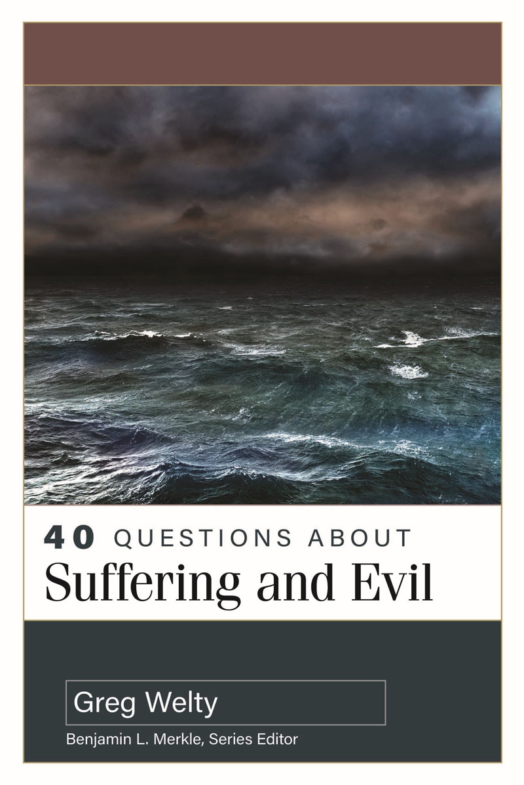

[]{#000_Cover.xhtml}

[]{#001_Praise.xhtml}

[]{#001_Praise.xhtml#page_1}"Welty takes up the sensitive matter of
suffering and evil, and it is one of the best treatments I have read.
The book is characterized by biblical fidelity, careful reasoning,
humility, fairness, and an irenic spirit toward those who espouse
different points of view. At the same time, I found Welty's own
solutions to be remarkably persuasive since they are so well supported
by the Scriptures and by rigorous reasoning. I should also add that the
book is wonderfully clear and accessible to general readers. Interested
laypersons, students, and pastors will all be helped by this insightful
work."

---Thomas Schreiner,\
Professor of New Testament Interpretation and Professor of Biblical
Theology,\
The Southern Baptist Theological Seminary

"If God is good, why is there so much evil and suffering in the world?
It's a question that every Christian must face at some point. In *40
Questions About Suffering and Evil*, Greg Welty deals fairly with a
multiplicity of perspectives and possibilities, refusing to resort to
simple or reductive responses. The result is a serious yet practical
work that will be useful to anyone who trusts in the unerring truth of
God's Word."

---Timothy Paul Jones,\
Chair of the Department of Apologetics, Ethics, and Philosophy,\
The Southern Baptist Theological Seminary

"This book is an extraordinary resource, and I am thrilled to see it
published. The problem of evil is as important a topic as it has ever
been, but it is often very difficult to know where to begin. As such,
the subject matter is well served by the 40 Questions approach, and Greg
Welty is the perfect person to write it. His exhaustive work, attention
to detail, wisdom, and theological depth are once again on full display
as he treats the various facets of the problem of evil. Without
hesitation, this will be the very first volume I point people to as they
explore the theological and philosophical questions surrounding evil and
suffering."

---Jamie Dew,\
President and Professor of Christian Philosophy,\
New Orleans Baptist Theological Seminary

"You will not find a more biblically based, thoroughly researched, and
carefully reasoned treatment of the philosophical questions of suffering
and evil. It is well organized with many helpful summaries. Some of the
best things about this book are what the author doesn't do: He doesn't
duck any of the hardest questions about suffering and evil. He doesn't
go beyond what can be deduced from Scripture in answering these
questions. He doesn't merely use the Bible for proof texts, but
carefully expounds the Scriptures. He doesn't claim to have all the
answers. He doesn't go over the heads of ordinary readers, even though
he is a brilliant philosopher. He doesn't merely present abstract
philosophical concepts but offers many helpful illustrative examples. He
doesn't merely deal with theory but provides practical, gospel-focused
counsel to those who suffer."

---Jim Newheiser,\
Professor of Christian Counseling and Pastoral Theology,\
Director of the Christian Counseling Program, Reformed Theological
Seminary

"Greg Welty writes with insight and clarity on what is, and always has
been, the primary objection to Christian faith: *Why doesn't God do more
to stop suffering?* The book *40 Questions About Suffering and Evil* is
helpfully arranged with clear questions matched to easily accessible
answers. Whether considering how best to respond to a questioning
friend, preparing to preach or teach, guiding your kids, or finding
encouragement for your own faith, Dr. Welty's book is one you'll want
close at hand."

---J. D. Greear, PhD,\
Pastor, The Summit Church

"Biblically saturated, historically attuned, philosophically and
theologically astute, and pastorally sensitive, this is an excellent
entryway into one of the most difficult topics in Christian doctrine.
While readers may not agree with every conclusion, this is well worth
your attention and consideration. I highly recommend it!"

---Matthew Y. Emerson,\
Co-Provost, Dean of Theology, Arts, and Humanities, Professor of
Religion, Oklahoma Baptist University

[]{#001_Praise.xhtml#page_2}"Dr. Welty tackles a substantial problem in
the Christian faith with substantial arguments. The problem of suffering
and evil remains difficult for all who trust and believe in the true and
triune God. The apologetic dimensions of this discussion are
considerable, as are the pastoral implications. Dr. Welty has addressed
these and other aspects of this problem in an accessible and encouraging
way, for believer and unbeliever alike. His discussion of inscrutability
is a promising, even if often ignored, addition to this entire debate.
This volume should be added to the library of any Christian who desires
to think deeply about suffering and evil."

---K. Scott Oliphint,\
Professor of Apologetics and Systematic Theology,\
Westminster Theological Seminary

"When I first learned that Greg Welty would be writing this book, I knew
it would be good. But having read the finished work, I find myself
struggling to find words that adequately convey how truly exceptional it
is. Saturated with Scripture, theologically robust, philosophically
incisive, lucidly written, comprehensive in scope, brimming with
compassionate realism and pastoral wisdom, *40 Questions About Suffering
and Evil* is nothing short of a masterclass in how to reason responsibly
about what God has (and has not) revealed in his Word. For more than
three decades, Dr. Welty has been reflecting on the challenges of evil
and suffering, drinking deeply from the whole counsel of God and the
accumulated stock of Christian wisdom through the centuries, and we are
blessed to be the beneficiaries of his labors. I do not exaggerate when
I say that every pastor, teacher, elder, and counselor should add this
extraordinarily rich, insightful, and rewarding book to their library.
Indeed, if every Christian were to read and meditate on just one chapter
a week, it would do the church a power of good. Without hesitation, this
will be my first recommendation for believers looking for solid biblical
answers and practical counsel on the topics of suffering and evil."

---James N. Anderson,\
Carl W. McMurray Professor of Theology and Philosophy,\
Academic Dean, Reformed Theological Seminary

"This is an outstanding addition to Kregel's 40 Questions series. Greg
Welty is a superb guide through the labyrinth of issues that emerge from
the experience of suffering and evil. Grounded in up-to-date
scholarship, this volume is a gold mine of wisdom from Scripture,
theology, and philosophy, yet is marked throughout by accessibility,
pastoral sensitivity, and a bold willingness to face the hard questions
with humility and honesty. This book is an excellent resource for
pastors, counselors, teachers, small groups, Sunday school classes,
discipleship ministries, and anyone seeking answers to the tough,
perennial questions about God and evil. My own faith in Christ has been
bolstered by reading it. I highly recommend it to all!"

---John C. Wingard,\
Professor of Philosophy and Dean of Humanities,\
Covenant College

"There are a lot of books on the so-called 'problem of evil.' There are
none quite like this one by Greg Welty. Many books on this subject
approach it from a purely philosophical perspective and leave out,
almost entirely, any biblical perspective. The books that include a
biblical perspective are often bereft of relevant philosophical
approaches. *40 Questions About Suffering and Evil* hits the sweet spot!
It presents a clear and persuasive account of the Bible's relevance,
power, and beauty in responding to sin and suffering while
simultaneously weaving in philosophical material that can help
illuminate the biblical account. I rarely read a book that I think needs
to be read by all my friends, family, and academic colleagues. At least
one of the groups would be very frustrated if I convinced them to
purchase every book I read. Not so with this book. I will recommend it
to everyone I know and you will too."

---David E. Alexander,\
Vice President for Academic Affairs, Associate Professor of Philosophy,\
Providence Christian College

[]{#002_Titlepage.xhtml}

[]{#003_Copyright.xhtml}

*[]{#003_Copyright.xhtml#page_4}40 Questions About Suffering and Evil*

© 2024 Greg Welty

Published by Kregel Academic, an imprint of Kregel Publications, 2450
Oak Industrial Dr. NE, Grand Rapids, MI 49505-6020.

This book is a title in the 40 Questions Series edited by Benjamin L.
Merkle.

**For a complete list of titles in the 40 Questions series, go to
[40questions.net](http://40questions.net).**

All rights reserved. No part of this book may be reproduced, stored in a
retrieval system, or transmitted in any form or by any
means---electronic, mechanical, photocopy, recording, or
otherwise---without written permission of the publisher, except for
brief quotations in printed reviews.

Italics in Scripture quotations indicate author's added emphasis.

All Scripture quotations, unless otherwise indicated, are from The
ESV*®* Bible (The Holy Bible, English Standard Version*®*), © 2001 by
Crossway, a publishing ministry of Good News Publishers. Used by
permission. All rights reserved.

Scripture quotations marked CEV are from the Contemporary English
Version Copyright © 1991, 1992, 1995 by American Bible Society. Used by
Permission.

Scripture quotations marked NASB 1995 are from the (NASB®) New American
Standard Bible®, Copyright © 1960, 1971, 1977, 1995 by The Lockman
Foundation. Used by permission. All rights reserved.
[www.Lockman.org](http://www.Lockman.org)

Scripture quotations marked NIV are taken from the Holy Bible, New
International Version®, NIV®. Copyright © 1973, 1978, 1984, 2011 by
Biblica, Inc.™ Used by permission of Zondervan. All rights reserved
worldwide. [www.zondervan.com](http://www.zondervan.com). The "NIV" and
"New International Version" are trademarks registered in the United
States Patent and Trademark Office by Biblica, Inc.^TM^

ISBN 978-0-8254-4799-0

Cataloging-in-Publication Data is available from the Library of Congress

*Printed in the United States of America*

24 25 26 27 28 / 5 4 3 2 1

[]{#004_Ded.xhtml}

*[]{#004_Ded.xhtml#page_5}To my parents,\
Richard and Virginia Welty*

[]{#005_Contents.xhtml}

# []{#005_Contents.xhtml#page_6}[]{#005_Contents.xhtml#page_7}Contents {.toc-title}

[Introduction: What This Book Is Trying to Do](#006_Intro.xhtml#fm-1)

[Part 1:[]{.pad1}General Questions About Suffering and
Evil](#007_Part01.xhtml#pt-1)

[1.[]{.pad}What Is at Stake in How We Respond to Suffering and
Evil?](#007_Part01.xhtml#sec-1)

[2.[]{.pad}What Is the Difference Between Moral Evil and Natural
Evil?](#007_Part01.xhtml#sec-2)

[3.[]{.pad}Does the Bible Distinguish Moral Evil and Natural
Evil?](#007_Part01.xhtml#sec-3)

[4.[]{.pad}What Is the Bible's Role in Helping Us Understand Suffering
and Evil?](#007_Part01.xhtml#sec-4)

[5.[]{.pad}Does the Bible or Reason Help Us Better Understand Suffering
and Evil?](#007_Part01.xhtml#sec-5)

[Part 2: Biblical and Theological Questions About Suffering and
Evil](#008_Part02.xhtml#pt-2)

[A:[]{.pad1}Questions Related to the Bible](#009_Chapter01.xhtml#ch-1)

[6.[]{.pad}What Kinds of Suffering and Evil Occur in the
Bible?](#009_Chapter01.xhtml#sec-6)

[7.[]{.pad}How Does God Bring About Good Through Suffering and
Evil?](#009_Chapter01.xhtml#sec-7)

[8.[]{.pad}Does God Hide His Reasons for Why He Permits Suffering and
Evil?](#009_Chapter01.xhtml#sec-8)

[9.[]{.pad}Is Natural Evil Ever "of the
Lord"?](#009_Chapter01.xhtml#sec-9)

[10.[]{.pad}Is Moral Evil Ever "of the
Lord"?](#009_Chapter01.xhtml#sec-10)

[11.[]{.pad}Does God Will *All* Suffering and
Evil?](#009_Chapter01.xhtml#sec-11)

[12.[]{.pad}Does God Command Suffering and Evil in the
Bible?](#009_Chapter01.xhtml#sec-12)

[B:[]{.pad1}Questions Related to Theology](#010_Chapter02.xhtml#ch-2)

[13.[]{.pad}Does God Cause Evil?](#010_Chapter02.xhtml#sec-13)

[14.[]{.pad}Does God Relate to Moral Evil Through
"Dual-Agency?"](#010_Chapter02.xhtml#sec-14)

[15.[]{.pad}What Do Calvinism and Molinism Say About God's Providence
over Evil?](#010_Chapter02.xhtml#sec-15)

[16.[]{.pad}Does God Suffer?](#010_Chapter02.xhtml#sec-16)

[Part 3: Apologetic Questions About Suffering and
Evil](#011_Part03.xhtml#pt-3)

[A:[]{.pad1}Questions Related to General Apologetic Strategies on the
Problem of Evil](#012_Chapter03.xhtml#ch-3)

[17.[]{.pad}What Is the Intellectual Problem of Evil Against God's
Existence?](#012_Chapter03.xhtml#sec-17)

[18.[]{.pad}What Are Some Bad Answers to the Intellectual Problem of
Evil?](#012_Chapter03.xhtml#sec-18)

[19.[]{.pad}Is Theodicy a Good Answer to the Intellectual Problem of
Evil?](#012_Chapter03.xhtml#sec-19)

[20.[]{.pad}Is Divine Inscrutability a Good Answer to the Intellectual
Problem of Evil?](#012_Chapter03.xhtml#sec-20)

[]{#005_Contents.xhtml#page_8}[B:[]{.pad1}Questions Related to Specific
Apologetic Answers to the Problem of Evil](#013_Chapter04.xhtml#ch-4)

[21.[]{.pad}Could Suffering and Evil Be God's Way of Punishing
Us?](#013_Chapter04.xhtml#sec-21)

[22.[]{.pad}Could Suffering and Evil Be God's Way of Shaping Our
Character?](#013_Chapter04.xhtml#sec-22)

[23.[]{.pad}Could Suffering and Evil Be God's Way of Getting Our
Attention?](#013_Chapter04.xhtml#sec-23)

[24.[]{.pad}Could Moral Evil Be Due to Our Abuse of Free
Will?](#013_Chapter04.xhtml#sec-24)

[25.[]{.pad}Could Natural Evil Be Due to the Laws of
Nature?](#013_Chapter04.xhtml#sec-25)

[26.[]{.pad}Could All Suffering and Evil Be a Means to a Greater
Good?](#013_Chapter04.xhtml#sec-26)

[27.[]{.pad}Can We Defend Christianity Without Offering God's Reasons
for Suffering and Evil?](#013_Chapter04.xhtml#sec-27)

[28.[]{.pad}Is the Problem of Evil a Reason to Believe in God's
Existence?](#013_Chapter04.xhtml#sec-28)

[Part 4: Practical Questions About Suffering and
Evil](#014_Part04.xhtml#pt-4)

[A:[]{.pad1}Questions Related to How Suffering and Evil Impact Our
Lives](#015_Chapter05.xhtml#ch-5)

[29.[]{.pad}What Kinds of Suffering and Evil Occur in the World
Today?](#015_Chapter05.xhtml#sec-29)

[30.[]{.pad}How Do Suffering and Evil Challenge Our Living the Christian
Life?](#015_Chapter05.xhtml#sec-30)

[31.[]{.pad}Should Christians Attempt to Figure Out Why They Face
Suffering and Evil?](#015_Chapter05.xhtml#sec-31)

[32.[]{.pad}Does Divine Providence Turn Us into Pawns on God's
Chessboard?](#015_Chapter05.xhtml#sec-32)

[33.[]{.pad}Does Divine Providence Undermine Our Resolve to Eliminate
Suffering?](#015_Chapter05.xhtml#sec-33)

[34.[]{.pad}Can We Make Any Moral Evaluation If God Is Beyond Moral
Evaluation?](#015_Chapter05.xhtml#sec-34)

[35.[]{.pad}Is God Distant and Hidden If His Ways Are Inscrutable to
Us?](#015_Chapter05.xhtml#sec-35)

[B:[]{.pad1}Questions Related to Counseling Those Who
Suffer](#016_Chapter06.xhtml#ch-6)

[36.[]{.pad}What Is the Best Response to Those Asking Why They Are
Suffering?](#016_Chapter06.xhtml#sec-36)

[37.[]{.pad}How Are the Attributes of God Relevant to Counseling Those
Who Suffer?](#016_Chapter06.xhtml#sec-37)

[38.[]{.pad}How Is God's Work of Creation Relevant to Counseling Those
Who Suffer?](#016_Chapter06.xhtml#sec-38)

[39.[]{.pad}How Are God's Works of Providence Relevant to Counseling
Those Who Suffer?](#016_Chapter06.xhtml#sec-39)

[40.[]{.pad}How Is the Gospel Relevant to Counseling Those Who
Suffer?](#016_Chapter06.xhtml#sec-40)

[About the Author](#017_About_Author.xhtml)

[]{#006_Intro.xhtml}

# []{#006_Intro.xhtml#page_9}Introduction {#006_Intro.xhtml#fm-1 .fm-title}

# What This Book Is Trying to Do {.fm-subtitle}

[T]{.dropcap}his book provides a biblically informed intellectual
toolkit for answering significant questions about suffering and evil. We
will think through what our definitions will be and to which authorities
we will listen ([part 1](#007_Part01.xhtml#pt-1)), what the Bible and
mature theological reflection have to say about suffering and evil
([part 2](#008_Part02.xhtml#pt-2)), how we can defend the Christian
faith from those who would use suffering and evil as an argument against
our faith ([part 3](#011_Part03.xhtml#pt-3)), and how we can respond to
suffering and evil in our own lives, and counsel others and ourselves in
the midst of it ([part 4](#014_Part04.xhtml#pt-4)).

Any reader who peruses these chapters will discover that I argue for a
specific set of views when it comes to thinking about and responding to
suffering and evil. I think my answers are the most biblically faithful
and theologically orthodox ones, but of course everyone says that about
their own views. Along with making my own case, an equally important aim
of the book is to expose readers to a wide range of important and
influential views that have been articulated by many different
Christians over the past two millennia. Though we all read the same
Bible, no consensus has emerged in the Christian community about how to
precisely answer each of these forty questions. Rather, quite a few
different sets of answers have been influential in church history, for
better or for worse, and those who wish to work out for themselves the
answers worth having should be willing to enter this historical
conversation among their Christian peers, if only to avoid naivete,
narrowness, and intellectual isolation.

So, while I seek to guide you through the contours of the debate,
referring to good theology whenever and wherever it speaks to the issue
at hand, I try to recognize throughout that Christians more thoughtful,
learned, and godly than me may take a different view. Their valuable
perspectives will therefore []{#006_Intro.xhtml#page_10}gain a hearing.
Yes, all truth is God's truth, and the truth is what it is, quite
independently of me or anyone else. We either get it right or we do not.
But the Christian tradition of making sense of and responding to
suffering and evil reveals there is at least some flexibility among the
theologically orthodox about which themes to emphasize and which themes
to leave less prominent. I have chosen to make the goodness of God's
purpose, the sovereignty of his providence, and the hiddenness of his
ways front and center, because I believe the Bible repeatedly makes them
front and center. Other Bible-believing Christians may place their
accents elsewhere, but I have no doubt we will still end up having much
more in common than not.

This book draws upon my experience of regularly teaching a class on
suffering and evil at two different Southern Baptist seminaries for the
past twenty years. I am grateful for the influence of my own philosophy
and theology teachers who carefully addressed this subject in the
classroom, exposing me to a variety of thoughtful alternatives on many
difficult questions. These teachers include Robert and Marilyn Adams
(UCLA), John Frame (Westminster Seminary), and Richard Swinburne
(University of Oxford). I am also grateful for writers---in addition to
those just named---who have taken the time to write especially
penetrating analyses of the subject, from either a biblical or
philosophical point of view: William Alston, Michael Bergmann, Jerry
Bridges, D. A. Carson, Paul Helm, Daniel Howard-Snyder, C. S. Lewis,
Alvin Plantinga, Eleonore Stump, Nicholas Wolterstorff, and Stephen
Wykstra. Over the years my perspectives on various individual matters
have been influenced, developed, strengthened, challenged, and sometimes
changed by interacting with what they have to say. Deserving special
mention is Michael Peterson's production of an excellent anthology on
"the problem of evil," which I continue to assign to students today
because of the historical relevance and intellectual depth of his
selections.^[1](#006_Intro.xhtml#fn-1){#006_Intro.xhtml#fn1}^

I appreciate the trustees and administration of Southeastern Seminary,
who granted me sabbatical leave for 2022, during which I wrote much of
this book. Thanks also to my wife, Rose, who read the chapters as I
wrote them and gave discerning feedback, and to my good friend James
Anderson (at Reformed Theological Seminary, Charlotte), who provided
feedback on some chapters.

I dedicate this book to my parents. Richard Welty (d. 2009) served on an
aircraft carrier in the Pacific in WWII, and Virginia Welty (d. 2021)
served with the Red Cross in Tokyo, Japan, during the Korean War. In
their own ways, their lives were aimed at meaningfully confronting and
overcoming the suffering and evil they found in the world.

[1](#006_Intro.xhtml#fn1){#006_Intro.xhtml#fn-1}.[]{.num}Michael
Peterson, ed., *The Problem of Evil: Selected Readings*, 2nd ed. (Notre
Dame, IN: University of Notre Dame Press, 2016).

[]{#007_Part01.xhtml}

# []{#007_Part01.xhtml#page_11}[PART 1]{.part} {#007_Part01.xhtml#pt-1 .part-no}

# General Questions About Suffering and Evil {.part-title}

# []{#007_Part01.xhtml#page_12}[]{#007_Part01.xhtml#page_13}[QUESTION 1]{.qun} {#007_Part01.xhtml#sec-1 .sec1}

# What Is at Stake in How We Respond to Suffering and Evil? {.sec1a}

[W]{.dropcap}hy spend time considering and answering the forty questions
which compose this book? Suffering and evil are undoubtedly something to
be endured, but why must they be seriously considered? Some people
answer the questions in this book one way, and others answer
differently, but why seek to offer answers at all? What difference does
it make? *What is at stake* in responding to suffering and evil? Simply
put, providing answers to these questions promotes Christian apologetics
(defending the faith to a watching world), fosters Christian
discipleship (equips Christians to persevere when tempted to apostasy),
and reinforces the Great Commission (confirms the fundamental message of
the gospel). Let us consider these points in turn.

# Suffering and Evil Are a Challenge to Christian Apologetics {#007_Part01.xhtml#sec2-1 .sec2}

First, Christians must offer answers to the questions in this book
because by doing so we fulfill the basic Christian duty to offer a
reasoned defense for distinctive Christian claims. The Greek word for
"reasoned defense" is *apologia*, and it is chiefly found throughout the
New Testament in two contexts: in Paul's defense against the accusations
of his enemies, and in Peter's command for believers to give a defense
for their hope.

As seen in the use of *apologia* in the book of Acts (22:1; 24:10
\[*apologoumai*\]; 25:8 \[*apologoumenou*\]; 16 \[*apologias*\]; 26:1
\[*apelogeito*\]; 2 \[*apologesthai*\]; 24 \[*apologoumenou*\]) and in
the epistles (1 Cor. 9:3; Phil. 1:7, 16; 2 Tim. 4:16), Paul not only
defended himself from the false accusations of unbelieving Jews and
Gentiles, but he defended the claims of the gospel itself. Because
Paul's example was to be imitated as a norm for basic Christian life
(Phil. 4:9), his pervasive commitment to "reasoned defense" (*apologia*)
should convince Christians to have and make their own reasoned defense.
Paul reasons, persuades, and disputes with Jews in the synagogue and
with Greeks in []{#007_Part01.xhtml#page_14}the marketplace day by day
(Acts 17:1--4, 17). He is particularly anxious to answer their questions
(Acts 17:18--19), and it is obvious to all that his ultimate goal is not
only to defend himself from the charges made against him, but more
importantly to persuade them of the gospel itself (Acts 26:27--29).

Given the first-century context of outright hostility to and persecution
of those who named the name of Christ (2 Cor. 6:4--10; 11:22--33), the
willingness of these early Christians to continually endure the
suffering and evil inflicted by others against them must have provoked
many questions from skeptical onlookers about *why* they were willing to
do so. "Why voluntarily suffer the loss of social privileges,
possessions, and even life itself, just to maintain loyalty to Jesus?
Why not restore comfort and ease by simply abandoning your strange, new
creed?" "Why worship a Jewish man who suffered and died at the hands of
the Romans? Could such a man be worthy of worship? How could such a
sufferer be God himself?" "How could God be for you when you face such
painful consequences for remaining in his service?" Surely from the very
beginning, Christian *apologia* was forced to reckon with multiple
questions about suffering and evil, and such questions remain today. For
this reason, about a third of the questions in this book occur in [part
3, "Apologetic Questions About Suffering and
Evil."](#011_Part03.xhtml#pt-3)

In addition to the extended example of the apostle Paul, there is also
the apostle Peter, whose first epistle is largely devoted to developing
a theology of suffering and trial for Christians dispersed among hostile
regions (1 Peter 1:6--7; 2:18--25; 3:8--22; 4:1--2, 12--19; 5:1, 9--11).
It is while Peter is equipping them against the world's evil that he
gives his well-known command for Christians to "make a defense":

Now who is there to harm you if you are zealous for what is good? But
even if you should suffer for righteousness' sake, you will be blessed.
Have no fear of them, nor be troubled, but in your hearts honor Christ
the Lord as holy, *always being prepared to make a defense to anyone who
asks you for a reason for the hope that is in you*; yet do it with
gentleness and respect, having a good conscience, so that, when you are
slandered, those who revile your good behavior in Christ may be put to
shame. For it is better to suffer for doing good, if that should be
God's will, than for doing evil. (1 Peter 3:13--17)

In this brief passage, which contains the *locus classicus* for
Christian apologetics in verse 15 (italicized above), the reality of
suffering and evil is mentioned no less than eight times: "harm you,"
"suffer for righteousness' sake," "fear," "troubled," "slandered,"
"revile your good behavior in Christ," "suffer for doing good," and
"suffer ... for doing evil." It therefore makes sense that the problem
of evil ranks so high on the apologetic agenda, for Peter makes
[]{#007_Part01.xhtml#page_15}clear that suffering and evil are *the*
principal context in which Christian faith is challenged, whether
intellectually or practically. So, if we are to obey Peter's command and
follow Paul's example, we must equip ourselves and others with
God-informed answers to questions about suffering and evil.

In fact, the so-called problem of evil is probably the number-one reason
unbelievers give for rejecting the God of the Bible, or a good God of
any sort (see [Question 17](#012_Chapter03.xhtml#sec-17)). It is thus no
surprise that Jesus anticipates and addresses his own disciples'
questions about the evils inflicted by other people and the suffering
produced by natural disasters (Luke 13:1--5). Nor is it a surprise that
Paul's imaginary objector to the gospel raises a version of the problem
of evil: How can God blame us for our evil if we cannot resist his
sovereign plan (Rom. 9:19)? Given Paul's example and Peter's command, if
the critic of God's existence has made an argument, then it is incumbent
on the Christian to say *something* in response (rather than avoid
unbelievers or merely pray for them).

This also follows from more general commands which God gives. For
example: "Walk in wisdom toward outsiders, making the best use of the
time. Let your speech always be gracious, seasoned with salt, so that
you may know how you ought to answer each person" (Col. 4:5--6). We need
divine "wisdom" to equip us for the wide range of questions "each
person" can ask, for they "ought" to receive an "answer." Indeed, Jesus
often took the time to listen to and then relevantly respond to the
arguments of those who were opposed to his beliefs, and we see an
extended account of this in Luke 20:27--40.

# Suffering and Evil Are a Challenge to Living the Christian Life {#007_Part01.xhtml#sec2-2 .sec2}

Second, Christians must offer answers to the questions in this book
because this will equip Christians to persevere when they are tempted to
abandon the faith. This point is related to the previous one, since
unbelievers are not the only people who ask questions which need
answering. Atheists widely claim that the suffering and evil in the
world gives them good reason to reject God's existence, but that same
suffering and evil gives many *Christians* great temptation to doubt
God's existence (or at least his love, his power, or his wisdom). So
"the problem of evil" is a question which has "intra-faith" application,
which means that Christian answers must not only be directed to the
world but to the church. The Scriptures are full of faithful believers
who are genuinely perplexed by the evils that they or their community
suffer. The psalmist cries out, "How long, O L[ORD]{.smallcaps}?" (Ps.
13:1), the prophet is bewildered that God sets iniquity before him and
fails to judge the wicked (Hab. 1), and the righteous man faces
unexpected counsel to "curse God and die" because of the evil he has
suffered (Job 2:9). What answers did they seek, and which did they find?

This issue is important because, as we will see in answer to [Question
30](#015_Chapter05.xhtml#sec-30), experiencing suffering and evil can
unsettle our faith in God's promises, distort
[]{#007_Part01.xhtml#page_16}our perception of God's character, weaken
our loyalty to God's purposes, and harden our hearts so that we are
bitter toward God and others. The repeated apostolic counsel that we
should forgive each other (2 Cor. 2:7; Eph. 4:32; Col. 3:13) presupposes
that Christians can be the source of suffering and evil for other
Christians, threatening to cause a "root of bitterness" to spring up,
cause trouble, and defile many (Heb. 12:15). For the sake of
perseverance in Christian discipleship, what should be our perspective
on these evils which come our way? Our own hearts can whisper to us:
"Does God care more about the free will of others than about my own
well-being?" "Is he oblivious to my pain?" "Is he aware but apathetic?"
"Is he a cosmic sadist?" "Does he have a moral code utterly alien to my
own?" It is no secret that these questions genuinely torment Christians
and tempt them to apostasy, and so suffering and evil forms an insidious
internal threat to Christian existence. How shall Christians answer the
forty questions in this book, not for the world but *for themselves*?

Biblically informed intellectual resources are needed here, as we remind
one another of the character of God ([Question
37](#016_Chapter06.xhtml#sec-37)), his works in history ([Questions
38--39](#016_Chapter06.xhtml#sec-38)), and the relevance of the gospel
([Question 40](#016_Chapter06.xhtml#sec-40)). The world would conform us
to its unbelief, but we are to be transformed by the renewal of our
minds (Rom. 12:2), avoiding the darkened understanding and futile
mindset that is caused by hardness of heart (Eph. 4:17--18), which if
left unchallenged will further harden our own hearts. We are to "have
mercy on those who doubt" (Jude 22) by helping them with the answers
they need, rather than harshly dismissing them as unspiritual. And
Christians are to think through these challenges ahead of time, putting
on the whole armor of God before "the evil day" arrives (Eph. 6:13),
storing up God's word in their heart so that they do not sin against him
(Ps. 119:11). New Testament scholar D. A. Carson offers his excellent
book on the problem of evil as "a book of preventative medicine" for
Christians, and his advice here on *when* we should work out answers for
ourselves is worth quoting in full:

One of the major causes of devastating grief and confusion among
Christians is that our expectations are false. We do not give the
subject of evil and suffering the thought it deserves until we ourselves
are confronted with tragedy. If by that point our beliefs---not well
thought out but deeply in-grained---are largely out of step with the God
who has disclosed himself in the Bible and supremely in Jesus, then the
pain from the personal tragedy may be multiplied many times over as we
begin to question the very foundations of our
faith.^[1](#007_Part01.xhtml#q1fn-1){#007_Part01.xhtml#q1fn1}^

# []{#007_Part01.xhtml#page_17}Responding to Suffering and Evil Is at the Heart of the Christian Gospel {#007_Part01.xhtml#sec2-3 .sec2}

Finally, seeking answers to the questions in this book not only promotes
Christian apologetics and fosters Christian discipleship, but also
reinforces our most important mission in life: bearing witness to the
gospel message (Matt. 28:18--20). The *message* of the cross reveals to
us the marvelous, unexpected way in which God confronts and overcomes
the evil of our hearts: by sending Jesus, the one who lived the life we
ought to have lived, and who died the death we ought to have died (Rom.
3:24--25; 5:6--11, 18--19; 1 Peter 2:24). But the *method* of the cross
reveals to us that God's overcoming the evil of our hearts rests upon
God's using the evils of the world to bring about the cross (because he
uses the evil decisions of Satan, Judas, the Jewish leaders, Pilate, and
the Roman soldiers, all of which resulted in the suffering of the cross;
see Acts 2:23; 4:27--28). The message and method of the cross is in
effect God's double victory over evil, a double revelation of the
powerful love of God in the midst of evil. Evil gets put in its place
twice over, as God uses the evil of the world (the cross) to overcome
the evil of our hearts (our sin).

This gospel perspective on how God relates to suffering and evil is
central and not peripheral to the message of the Bible. The way God
achieves victory over evil in the gospel affords us a fundamental
insight into the *modus operandi* of divine providence, God's "way of
working," since God's plan to redeem the world through Jesus has deep
roots in the Bible's entire storyline, rather than being a side note in
history. In the cross, God is a God who aims at great goods (as we shall
see in later chapters, goods for us and for himself; see [Question
7](#009_Chapter01.xhtml#sec-7)). In the cross, God aims at these great
goods by way of suffering and evil. And in the cross, God works in ways
that would be completely unknowable by us, if he had not specifically
told us what he was doing (see [Question
8](#009_Chapter01.xhtml#sec-8)). Future chapters will return to these
gospel themes of divine goodness, sovereignty, and inscrutability again
and again, as they provide a kind of model for what God is up to with
respect to the rest of the suffering and evil in the world. (For
instance, these same three themes come to the fore in the Job and Joseph
narratives in the Old Testament, anticipating how God deals decisively
with evil in the Jesus narrative; see [Questions
7](#009_Chapter01.xhtml#sec-7) and [8](#009_Chapter01.xhtml#sec-8).)

Of course, it is also important not to overread gospel implications for
matters of suffering and evil, as if John 3:16 gave us sufficient and
precise answers to the full range of questions in this book. God gave us
a whole Bible, and not simply John 3:16, and so the testimony of that
whole Bible must be consulted. But as we seek to apply the fundamental
wisdom of the Book to each of the questions in this book, we ought to be
inspired, motivated, encouraged, and guided in our answers by the good
news of God's decisive victory over suffering and evil. The Christian
gospel means that we cannot stand mute before the suffering in the
world, offering no God-informed commentary and perspective on it, for we
not only proclaim this message of how God
[]{#007_Part01.xhtml#page_18}has responded (and will respond) to the
world's suffering and evil, but we base our lives on that message.

# Summary {#007_Part01.xhtml#sec2-4 .sec2}

Providing answers to questions about suffering and evil promotes
Christian apologetics (defending the faith to a watching world), fosters
Christian discipleship (equips Christians to persevere when tempted to
apostatize), and reinforces the Great Commission (confirms the
fundamental message of the gospel). To meet these ends, this book
provides biblically informed intellectual resources for answering
significant questions about suffering and evil, while exposing readers
to a wide range of important and influential views which have been
articulated by many different Christians over the past two millennia.

# REFLECTION QUESTIONS {.sec1b}

1.[]{.num}Do you agree that Christians of equal piety can reasonably
disagree over precisely how to answer the full range of questions about
suffering and evil (see [Introduction](#006_Intro.xhtml#fm-1))? If so,
why might God allow this to take place?

2.[]{.num}How important is it to be aware of "the historical
conversation among our Christian peers" about suffering and evil (see
[Introduction](#006_Intro.xhtml#fm-1))? Can you list any benefits to
such awareness?

3.[]{.num}Are there other examples of "apologetics" in the Bible,
broadly speaking, beyond the example of the apostle Paul? Does Scripture
ever speak to our own character qualifications as we engage in this
activity?

4.[]{.num}Is Carson correct about the need for Christians to have
"preventative medicine" on this subject? Have you personally seen, in
your life or in the lives of others, what happens in the absence of such
medicine?

5.[]{.num}Where do you believe the contemporary church is weakest in
addressing questions about suffering and evil: apologetics,
discipleship, or gospel witness?

[1](#007_Part01.xhtml#q1fn1){#007_Part01.xhtml#q1fn-1}.[]{.fn}D. A.
Carson, *How Long O Lord? Reflections on Suffering and Evil*, 2nd ed.
(Grand Rapids: Baker Academic, 2016), 12.

# []{#007_Part01.xhtml#page_19}[QUESTION 2]{.qun} {#007_Part01.xhtml#sec-2 .sec1}

# What Is the Difference Between Moral Evil and Natural Evil? {.sec1a}

[I]{.dropcap}n [Question 1](#007_Part01.xhtml#sec-1) we connected the
topic of this book---suffering and evil---to Christian apologetics,
Christian discipleship, and the gospel message. But how should
"suffering" and "evil" be defined, and what is the relationship, if any,
between them? These are surprisingly deep waters. Whatever definitional
choices we make at the outset should be informed by Scripture,
illuminate our everyday experience, and equip us to meaningfully address
the full range of questions posed by the world and the church about all
the "bad things" in life. With respect to these criteria, not all
definitions are created equal. How shall we proceed?

It turns out that a simple, initial characterization of "evil" as "any
significant case of pain and suffering" is enriched by a further
distinction between "moral evil" and "natural evil." This goes a long
way toward providing the definitions we need. The "moral evil" /
"natural evil" distinction has a long history in church tradition and
shows up in just about any textbook treatment of "the problem of
evil."^[1](#007_Part01.xhtml#q2fn-1){#007_Part01.xhtml#q2fn1}^ My
thinking about the topic for the past thirty-five years leads me to the
definitions below as the most helpful starting point. In
[]{#007_Part01.xhtml#page_20}this chapter we will define "evil," "moral
evil," and "natural evil" and begin to consider whether Old Testament
word usage supports this distinction. In [Question
3](#007_Part01.xhtml#sec-3) we'll continue this biblical grounding of
the distinction by considering New Testament usage as well, and then
examine several reasons why the distinction is of immense practical
importance.

# What Is "Evil"? {#007_Part01.xhtml#sec2-5 .sec2}

Christian apologist C. S. Lewis's influential book on the problem of
evil is entitled *The Problem of Pain* rather than *The Problem of
Evil*, precisely because he regards the terms "evil" and "pain" as
interchangeable for his
purposes.^[2](#007_Part01.xhtml#q2fn-2){#007_Part01.xhtml#q2fn2}^ I
follow him in this decision, defining "evil" as *any significant case of
pain and suffering.* Of course, this invites the further question of
what "pain and suffering" are, but we don't seem to have any difficulty
in identifying those! Whenever we experience the loss of something of
value, we experience pain and suffering. This valuable thing might be
physical or psychological well-being, or one or more of the many things
which contribute to that well-being (friendship, family, job, health).
But the loss of any of that *just is* "pain and suffering." For the
purposes of this book, our grip on what counts as "pain and suffering"
is so intuitive that we do not need to go any deeper
here.^[3](#007_Part01.xhtml#q2fn-3){#007_Part01.xhtml#q2fn3}^

What is interesting is that when we survey the biblical usage of *ra'ah*
(Hebrew), and *ponēros* and *kakia* or *kakos* (Greek)---the Hebrew and
Greek words most commonly translated as "evil" in our English
Bibles---we find that these terms typically refer either to the presence
of pain and suffering (harm, injury, distress, misery), or to that which
causes such pain and suffering (adversity, calamity; wicked choices,
actions, or words). Amid the overwhelming diversity among cases of evil
in the Bible (due to bad weather, poisonous herbs, wild beasts, defeat
in battle, murder, adultery, theft; see [Question
6](#009_Chapter01.xhtml#sec-6)), this is what most uses of the terms
seem to have in common: evil deprives us of physical or spiritual
well-being. (We will see several specific examples in the next two
sections.)

If we were to survey all the "bad things" talked about in Scripture (and
which we regularly experience in life), we would see that evils can be
additionally described in terms of *their immediate cause*. Why this is
something worth noting will be discussed at the end of this chapter, but
the distinction []{#007_Part01.xhtml#page_21}itself seems obvious once
you think about it. As we will now see, the terms "moral evil" and
"natural evil" distinguish evils in terms of their immediate cause.

# What Is "Moral Evil"? {#007_Part01.xhtml#sec2-6 .sec2}

For the purposes of this book and in accordance with much traditional
thinking on the topic, "moral evil" will be defined as *any evil*---that
is, any significant case of pain and suffering---*which is caused by
free persons through defect of will, either intentionally or through
culpable neglect of their responsibilities*. Christians sometimes call
these "sins of commission" and "sins of omission." It is doing what
ought not to be done, and leaving undone what ought to be done, such
that the consequence is lots of pain and suffering.

So, moral evils are things like adultery (Deut. 22:22; Prov. 6:24),
lying (Deut. 19:18--20; Ps. 34:13), murder (Judg. 9:56--57; 2 Sam.
12:9), slavery (Gen. 50:15, 17, 20; Deut. 24:7), rape (Judg. 20:12--13),
rebellion against parents (Deut. 21:18--21), theft (Gen. 44:4--5), and
so on. (Each of these texts uses the Hebrew word *ra'ah*.) In these
cases, and in many more, people are abusing their free will,
intentionally and deliberately inflicting pain and suffering on each
other, in a way that is contrary to or neglectful of their moral
responsibilities. And the suffering does not have to be restricted to
that endured by humans. Many advocates of the problem of evil emphasize
the problem of animals suffering needlessly at the hands of humans. That
is moral evil
too.^[4](#007_Part01.xhtml#q2fn-4){#007_Part01.xhtml#q2fn4}^

Many more cases of moral evil occur through culpable neglect. If I am
sitting by a swimming pool reading the news on my phone and I see a
toddler go by and topple into the pool, then see her flail her arms
around helplessly, then hear her gurgling as she drowns---and I do
absolutely nothing when it is in my power to act---I have neglected my
responsibilities in this situation, and I am guilty of adding to the
moral evil in the world. It was up to me whether I prevented this pain
and suffering, and I did not prevent it. One might even go so far as to
say I partially caused it, since causes are what "make a difference" in
the course of events from what they would otherwise be, and my depraved
indifference *made* a difference as to the pain and suffering in the
world.^[5](#007_Part01.xhtml#q2fn-5){#007_Part01.xhtml#q2fn5}^ A large
proportion of moral evil is of this type, that is, sins of omission.

[]{#007_Part01.xhtml#page_22}So, what is essential to "moral evil" is
that it is a type of pain and suffering which occurs through a defect of
will, an abuse of free will. Sin is "missing the mark" of what you
*ought* to have aimed at (Rom. 3:23).

# What Is "Natural Evil"? {#007_Part01.xhtml#sec2-7 .sec2}

The second kind of evil is "natural evil." Simply put, natural evil is
any evil caused by impersonal objects and forces, rather than by
people's defect of will. It involves significant pain and suffering in
the world that are not caused by free persons either intentionally or
through culpable neglect of their responsibilities. Where does it come
from, then? For lack of a better phrase, natural evil comes from "how
nature goes on," which is quite independent of human choices. So natural
evils are the pain and suffering produced by bad water (2 Kings 2:19),
birth defects in animals (Deut. 15:21; 17:1), disease (Deut. 7:15;
28:59; 2 Chron. 21:19), hunger (Num. 20:5), injurious boils on the skin
(Deut. 28:35), poisonous herbs (2 Kings 4:39--40), rotten food (Jer.
24:2--3, 8), stormy weather (Jonah 1:7--8), wild or harmful beasts (Gen.
37:20, 33; Lev. 26:6), and so on. (As before, each of these texts uses
the Hebrew word *ra'ah* or *ra*, but here the focus is different: it is
on pain and suffering not immediately caused by human choice.)

Similar types of events can include tornados, hurricanes, earthquakes,
tsunamis, (naturally occurring) plague, (most) genetic defects, (most)
forest fires, falling trees and rolling boulders that crush all in their
path, and so on. (The qualifications of "naturally occurring" and "most"
are needed because at least some plagues, genetic defects, and forest
fires can arise through scheming or neglectful humans, in which case
they are moral evil, not natural evil.) And again, many natural evils
involve the pain and suffering of animals, such as those which are
grievously burned in naturally occurring forest fires. This widens the
scope for natural evil considerably.

Thus, in the remainder of this book, "evil" will be referring to these
two kinds of pain and suffering: one kind brought about by human beings
choosing to inflict pain and suffering on each other (or culpably
failing to prevent it) through defect of will, and the other kind
brought about in virtue of "how nature goes on," regardless of human
choices. Interestingly, Job 2:10--11 uses the term *ra'ah* quite broadly
to refer to *all* the evil which Job suffered, which turns out to be a
combination of moral evil (the Sabeans and Chaldeans stealing and
murdering, and Satan inflicting ill health) and natural evil (the fire
and wind destroying buildings, animals, and people). Likewise, Jeremiah
5:12 uses *ra'ah* for a kind of "disaster" that seems to cover both
"sword" (moral evil) and "famine" (natural evil).

# []{#007_Part01.xhtml#page_23}Summary {#007_Part01.xhtml#sec2-8 .sec2}

"Evil" is defined in this book as "any significant case of pain and
suffering." "Moral evil" is suffering which is caused by free persons
through defect of will, either intentionally or through culpable neglect
of their responsibilities. (Typical cases include murder, adultery,
rape, theft, slavery, and lying.) "Natural evil" is suffering not caused
by persons abusing their free will, and instead comes from "how nature
goes on." (Typical cases include hunger, disease, bad weather, poisonous
food, rampaging wild animals, birth defects, plague, earthquakes, and
forest fires.) The Hebrew word for "evil" (*ra'ah*) has a semantic range
which includes both meanings, and which meaning is intended by the
author on any occasion will be largely determined by context.

# REFLECTION QUESTIONS {.sec1b}

1.[]{.num}Is your definition of "evil" different from the one provided
in this chapter? Does it contain any advantages over the definition
presented here? Does it have any drawbacks? (You might want to revisit
this question at the end of the book.)

2.[]{.num}Aquinas's thoughts on defining "evil" were relegated to
footnotes, whereas the scriptural material was central to the text. What
are some of the dangers in reversing this emphasis? And what are some of
the benefits in being familiar with church tradition, nevertheless?

3.[]{.num}Much moral evil occurs when we fail to do something. How can
that rightly be understood as a *cause* of suffering for ourselves and
others?

4.[]{.num}Some authors have contended that animal suffering---whether
caused by humans or nature---is not much of an "evil," since (on their
view) we have little reason to think that animals experience pain as we
do. Is this a position a Christian should take? How would you argue
against it?

5.[]{.num}Many of my students do not like the phrase "natural evil,"
contending that only "moral evil" is *truly* evil. Does the biblical
usage of *ra'ah* indicate a broader understanding of "evil"?

[1](#007_Part01.xhtml#q2fn1){#007_Part01.xhtml#q2fn-1}.[]{.num}The
tradition is one of *concept*, not necessarily one of terminology. For
example, the medieval theologian Thomas Aquinas divides "evil" into the
evil of pain (or penalty) and the evil of fault (or defect of will). As
we will see, this distinction maps rather well onto what I will say
under the "natural evil" / "moral evil" terminology. See Thomas Aquinas,
*Summa Theologica* 1.48.5--6, and 1.49.2 (reply 1). For the "moral evil"
/ "natural evil" distinction in contemporary treatments of the problem
of evil, see Alvin Plantinga, *God, Freedom, and Evil* (Grand Rapids:
Eerdmans, 1977), 30; John Feinberg, *The Many Faces of Evil: Theological
Systems and the Problems of Evil*, rev. and exp. ed. (Wheaton, IL:
Crossway, 2004), 22; and Michael Peterson, *God and Evil: An
Introduction to the Issues* (New York: Routledge, 2018), 10--13.
Peterson argues that "the distinction between natural and moral evil
runs through most great literature" (p. 12), citing William Blake and
Fyodor Dostoyevsky as examples.

[2](#007_Part01.xhtml#q2fn2){#007_Part01.xhtml#q2fn-2}.[]{.num}See C. S.
Lewis, *The Problem of Pain* (San Francisco: HarperOne, 2015).

[3](#007_Part01.xhtml#q2fn3){#007_Part01.xhtml#q2fn-3}.[]{.num}If one
wanted to "go deeper," a first step would be to consider Aquinas's
*privation* definition of "evil": evil is the privation of good. This is
not the mere negation or absence of good, but the depriving of a good
that something ought to have by nature. So, on the privation theory, it
is not evil that a rock cannot see, but it *is* evil if a human being
cannot see. That is, blindness is an evil for humans but not for rocks,
since it is in the nature of humans to see. Whether or not an "evil" in
this sense should be further categorized as a "moral evil" or a "natural
evil" depends on its *cause*, as we are about to see in the next two
sections of this chapter. See Thomas Aquinas, *Summa Theologica* 1.48.3
(*respondeo*).

[4](#007_Part01.xhtml#q2fn4){#007_Part01.xhtml#q2fn-4}.[]{.num}Many uses
of the term "evil" in Scripture are broader than those cited above,
referring to habits, attitudes, or thoughts that *dispose* someone to
engage in the kinds of deeds named in this paragraph. Consider Jesus's
characterization of "evil thoughts": "For out of the heart come evil
\[*ponēros*\] thoughts, murder, adultery, sexual immorality, theft,
false witness, slander" (Matt. 15:19).

[5](#007_Part01.xhtml#q2fn5){#007_Part01.xhtml#q2fn-5}.[]{.num}"We think
of a cause as something that makes a difference, and the difference it
makes must be a difference from what would have happened without it. Had
it been absent, its effects---some of them, at least, and usually
all---would have been absent as well" (David Lewis, "Causation," in
David Lewis, *Philosophical Papers: Volume II* \[Oxford: Oxford
University Press, 1986\], 161). See also the discussion of "absence
causation" in Carolina Sartorio, *Causation & Free Will* (Oxford: Oxford
University Press, 2016), 46--50.

# []{#007_Part01.xhtml#page_24}[]{#007_Part01.xhtml#page_25}[QUESTION 3]{.qun} {#007_Part01.xhtml#sec-3 .sec1}

# Does the Bible Distinguish Moral Evil and Natural Evil? {.sec1a}

[Q]{.dropcap}uestion 2 began to look at the difference between moral
evil and natural evil, offering brief definitions of three terms:

-   *Evil:* any significant case of pain and suffering
-   *Moral evil:* evil caused by free persons through defect of will,
    either intentionally or through culpable neglect of their
    responsibilities
-   *Natural evil:* any evil that is not moral evil; this is evil caused
    by "how nature goes on," quite independently of human choices

Our discussion subsequently focused on the Hebrew word *ra'ah* in the
Old Testament, finding through a multitude of examples that it covered
both moral and natural senses of "evil." [Question
3](#007_Part01.xhtml#sec-3) extends the discussion to the New Testament
usage of key terms for "evil," thus completing the biblical grounding
for the distinction. In addition, we will find that distinguishing moral
evil and natural evil has practical significance for our effectiveness
in apologetics, counseling, and gospel witness.

# Does the New Testament Distinguish These Two Meanings of "Evil"? {#007_Part01.xhtml#sec2-9 .sec2}

In the entries for the two Greek words most frequently translated as
"evil" (*ponēros*, and *kakia* or *kakos*), New Testament Greek lexicons
repeatedly acknowledge the distinction between the "moral evil" and
"natural evil" senses of the same Greek word in different contexts, with
the former meaning focusing on defect of will, and the latter meaning
focusing on the harm or pain suffered quite independently of any human
source.

  ------------------------------------------------------------------------------------------------------------------------------------------------------- ----------------------------------------------------------------------------------------------------------------------------------------- ----------------------------------------------------------------------------------------------------------------------------------------------------------------------------------
  **[]{#007_Part01.xhtml#page_26}The "Moral Evil" Sense of Key New Testament Terms for "Evil"^[1](#007_Part01.xhtml#q3fn-1){#007_Part01.xhtml#q3fn1}^**                                                                                                                                             
  **Lexicon**                                                                                                                                             ***ponēros* as "moral evil"**                                                                                                             ***kakia* or *kakos* as "moral evil"**
  Thayer                                                                                                                                                  "in an ethical sense, *evil, wicked, bad*, etc."                                                                                          "morally, i.e., of a mode of thinking, feeling, acting; *base, wrong, wicked*: of persons, *evil*, i.e. what is contrary to law, either divine or human, *wrong, crime*"
  Danker                                                                                                                                                  "deviation from an acceptable moral or social standard"                                                                                   "morally/socially reprehensible ... moral offensiveness"
  Friberg                                                                                                                                                 "in a moral sense of persons and things characterized by ill will *evil, wicked, malicious*"                                              "morally, of persons characterized by godlessness, *evil, bad* ... as moral conduct, attitudes, plans of godless people, *evil, base, wicked* ... *depravity, vice, wickedness*"
  Louw-Nida                                                                                                                                               "pertaining to being morally corrupt and evil---'immoral, evil, wicked' ... pertaining to guilt resulting from an evil deed---'guilty'"   "bad (moral): pertaining to being bad, with the implication of harmful and damaging ... the quality of wickedness, with the implication of that which is harmful and damaging"
  Gingrich                                                                                                                                                "in the ethical sense *wicked, evil, bad, vicious, degenerate*"                                                                           "*badness, faultiness* in the sense *depravity, wickedness, vice* ... *Malice, ill will, malignity*"
  ------------------------------------------------------------------------------------------------------------------------------------------------------- ----------------------------------------------------------------------------------------------------------------------------------------- ----------------------------------------------------------------------------------------------------------------------------------------------------------------------------------

  ------------------------------------------------------------------------------------------------- ------------------------------------------------------------------------------------------------------------------------------- -----------------------------------------------------------------------------------------------------------------------------------------------------------------------------------------------------------------------------
  **[]{#007_Part01.xhtml#page_27}The "Natural Evil" Sense of Key New Testament Terms for "Evil"**                                                                                                                                   
  **Lexicon**                                                                                       ***ponēros* as "natural evil"**                                                                                                 ***kakia* or *kakos* as "natural evil"**
  Thayer                                                                                            "in a physical sense, diseased or blind"                                                                                        "*troublesome, injurious, pernicious, destructive, baneful*, an *evil*, that which injures; substantially equivalent to *bad*, i.e. distressing, whether to mind or body ... evil things, the discomforts which plague one"
  Danker                                                                                            "*bad, poor*, 'in deteriorated or undesirable state or condition,' of physical circumstance, *bad* eyesight, *virulent* sore"   "causing harm, with focus on personal/physical injury, *harmful* ... of misfortune, *bad* ... troublesome circumstance"
  Friberg                                                                                           "what is physically disadvantageous *bad, harmful, evil, painful* ... as adverse circumstances *evil, trouble, misfortune*"     "of circumstances and conditions that come on a person, *harmful, evil, injurious* ... *ruin, harm, misfortunes, evils*"
  Louw-Nida                                                                                         "a state of being sickly or diseased"                                                                                           "pertaining to having experienced harm ... a state involving difficult and distressing circumstances---'difficulties, evil'"
  Gingrich                                                                                          "in the physical sense *in poor condition, sick*"                                                                               "*trouble, misfortune*"
  ------------------------------------------------------------------------------------------------- ------------------------------------------------------------------------------------------------------------------------------- -----------------------------------------------------------------------------------------------------------------------------------------------------------------------------------------------------------------------------

Notice how the first chart brings out the relevance of human defect of
will as the cause of pain and suffering, whereas the second chart
focuses on suffering which may occur "naturally" (such as blindness,
disease, sickness, or overall misfortune). Which meaning is intended by
the scriptural author will depend on various contextual factors, but the
basic distinction is unmistakable. As in the Old Testament, so in the
New Testament: moral evils are things like adultery (Luke 3:19),
blasphemy (Matt. 9:4), boasting (James 4:16), crime (Matt. 27:23; Mark
15:14; Rom. 13:3--4), false accusations (3 John 10), greed for money
(Acts 8:22), insults (Matt. 5:39), malice (Rom. 1:29; Eph. 4:31; Col.
3:8; Titus 3:3; 1 Peter 2:1), mercilessness (Matt. 18:32), rash oaths
(Matt. 5:37), sinful unbelief (Heb. 3:12), slander (Matt. 5:11), suicide
(Acts 16:28), unjust persecution (Acts 9:13), and so on. (Each of these
texts uses the Greek word *ponēros*, *kakos*, or *kakia*.) Natural evils
are the pain and suffering produced by bad eyesight (Matt. 6:23; Luke
11:34), bad health (Mark 5:26), impoverishment (Luke 16:25), malignant
sores on the body (Rev. 16:2), poisonous
[]{#007_Part01.xhtml#page_28}snakebites (Acts 28:5), unfruitful trees
(Matt. 7:17--18), and so on. (As before, each of these texts uses the
Greek word *ponēros*, *kakos*, or *kakia*, but here the focus is
different: it is on pain and suffering not immediately caused by human
choice.^[2](#007_Part01.xhtml#q3fn-2){#007_Part01.xhtml#q3fn2}^)

# Why Is It Important to Distinguish Between These Two Kinds of Suffering and Evil? {#007_Part01.xhtml#sec2-10 .sec2}

There are at least four reasons why the definitions in these last two
chapters are important. First, the definition of "evil" as "significant
case of pain and suffering" generates perhaps the most discussed version
of "the problem of evil" within Christian apologetics today (see [part
3](#011_Part03.xhtml#pt-3), and [Question
17](#012_Chapter03.xhtml#sec-17) in particular). It is the basic
definition used in the most widely anthologized atheist piece of writing
on the topic in the second half of the twentieth
century.^[3](#007_Part01.xhtml#q3fn-3){#007_Part01.xhtml#q3fn3}^ William
Rowe's argument directly connects the presence of "intense suffering" to
two of God's attributes: his power and his goodness. A powerful God
would be *able* to prevent such suffering, and a good God would *want*
to prevent such suffering. Atheists claim that if we deny that God's
attributes have these two implications, then we hardly know what the
terms "power" and "goodness" mean. (Could I claim that I was "good" if
my goodness gave me *no* motivation to prevent the suffering of the
drowning toddler mentioned earlier in [Question
2](#007_Part01.xhtml#sec-2)?) Given that God's attributes seem to have
these implications, Rowe argues that the widespread existence of intense
suffering is considerable evidence against there being a God with such
attributes. Rowe's article has generated a veritable cottage industry of
imitations and replies over the past forty years.

Second, distinguishing "moral evil" from "natural evil" will affect the
ways the problem of evil can be both raised and answered. The central
case of evil discussed by Rowe is of a fawn that burns to death in a
forest fire, suffering terrible agony for several days before
expiring.^[4](#007_Part01.xhtml#q3fn-4){#007_Part01.xhtml#q3fn4}^ As an
atheist, Rowe chooses to highlight this case of natural evil precisely
because he knows that many of the traditional ways of defending God in
the face of evil only work for moral evil, not natural evil, or only
work for human suffering, not animal suffering. It seems unlikely that
God allows the fawn's suffering because the fawn is being punished for
its sins, or is abusing its free will, or is getting its character
shaped through trial, or is getting its attention alerted to the need
for the gospel. (As we will see in [Questions
21--25](#013_Chapter04.xhtml#sec-21), these are all answers Christians
have posed for why human beings suffer.) None of this applies to animal
[]{#007_Part01.xhtml#page_29}suffering, and Rowe knows this. Christians
will have to be alert to these kinds of distinctions if we are to offer
reasoned defenses of the faith that are *relevant* to the questions
being asked. Not just any reason God could have for permitting evil will
apply to every evil, it seems. God could have different reasons for
allowing different kinds of evil, and Christians should search the
Scriptures and develop replies with this in mind.

Third, familiarizing ourselves with the wide range of "moral evils" and
"natural evils" will broaden our understanding of the kinds of evil
people can suffer, therefore deepening our sympathy for such people and
provoking wisdom in our response. Sometimes we suffer because human
beings are against us, and sometimes we suffer because "nature" is
against us, as it were. What is characteristic of each kind of
suffering? What are the kinds of answers we console ourselves with? What
intellectual dead-ends can we fall into when thinking about these two
categories of suffering? Are humans and nature the *ultimate* cause of
our suffering, or are they instead means in the hands of an all-wise,
provident, and good God? And could some natural evil like hurricanes and
disease be like moral evil, in that it is caused by *nonhuman* persons
abusing their free will (that is, fallen angels)? Does this ever happen,
and if so, to what degree? Distinguishing moral evil from natural evil
leads us to consider these differences and possible similarities. Good
biblical counseling often depends on recognizing the importance and
limitations of various distinctions we make (see [part 4, "Practical
Questions About Suffering and Evil"](#014_Part04.xhtml#pt-4)).

Fourth, the "moral evil" / "natural evil" distinction conveys a fuller
picture of just how fallen the world is, and just how far God's
salvation extends. Traditionally, Christians have traced natural evils
like disease and natural disasters to the effects of the fall of man
(though some Christians have other views; see [Question
25](#013_Chapter04.xhtml#sec-25)). Humanity seems to have suffered a
disharmonious relationship with nature ever since God "subjected" the
world to "futility" and "bondage to corruption," so that we look forward
to the very "redemption of our bodies" (Rom. 8:20--23). How awful must
human rebellion have been if the world includes pervasive natural evils
as well as moral evils. And how great must be the promise of full,
cosmic redemption (Col. 1:15--20), this setting free of "creation
itself" (Rom. 8:21), when God puts "all things in subjection" under
Christ's rule (1 Cor. 15:27). Clear thinking on the full range of evils
in the world will help us sing with more feeling and understanding, both
now and especially in the life to come: "No more let sins and sorrows
grow, nor thorns infest the ground. He comes to make his blessings flow,
far as the curse is found, far as the curse is
found."^[5](#007_Part01.xhtml#q3fn-5){#007_Part01.xhtml#q3fn5}^

# []{#007_Part01.xhtml#page_30}Summary {#007_Part01.xhtml#sec2-11 .sec2}

Like the Hebrew word *ra'ah*, the common Greek words for "evil"
(*ponēros*, *kakia*, *kakos*) have a semantic range which include "moral
evil" and "natural evil," and which meaning is intended by the author on
any occasion will be largely determined by context. The moral
evil/natural evil distinction thus seems biblically grounded in both Old
Testament and New Testament word usage. In addition, the distinction is
important for contemporary Christian apologetics, for counseling those
who suffer, and for conveying a fuller picture of both the fallenness of
the world and the extent of God's salvation.

# REFLECTION QUESTIONS {.sec1b}

1.[]{.num}The same biblical word can refer to "pain and suffering caused
by human defect of will" in one context but refer to "pain and suffering
caused by nature" in another context. Have you ever had a fruitless
conversation about "the problem of evil" because key words were being
taken out of context? What are some practical ways we can overcome this
(all-too-common) feature of human conversation and dialogue?

2.[]{.num}Has someone ever given you a version of William Rowe's
"problem of evil" before, which tries to set pain and suffering in
opposition to God's attributes? If so, how did you respond? Has your
thinking changed in any way since then?

3.[]{.num}Could God "have different reasons for allowing different kinds
of evil"? Some Christians think God has just *one* reason for
everything: his own glory. Do these answers conflict? How could they
both be true?

4.[]{.num}The second full paragraph on [page
29](#007_Part01.xhtml#page_29) above asked six different questions. Pick
one and give your best answer to it. (You might want to revisit your
answer at the end of the book to see if it has changed.)

5.[]{.num}The chapter ended by reminding us that thinking about the
"bad" things can help us appreciate the "good" things even more. Can you
think of any scriptural concepts or passages that would encourage this
line of application?

[1](#007_Part01.xhtml#q3fn1){#007_Part01.xhtml#q3fn-1}.[]{.num}Lexicons
referenced in this chart: Joseph Henry Thayer, *A Greek-English Lexicon
of the New Testament,* abridged and rev. (Ontario: Online Bible
Foundation, 1997); Frederick William Danker with Kathryn Krug, *The
Concise Greek-English Lexicon of the New Testament* (Chicago: University
of Chicago Press, 2009); Barbara Friberg and Timothy Friberg, eds.,
*Analytical Greek New Testament*, 2nd ed. (Grand Rapids: Baker, 1994);
Johannes E. Louw and Eugene A. Nida, eds., *Greek-English Lexicon of the
New Testament Based on Semantic Domains*, 2nd ed. (New York: United
Bible Societies, 1989); F. Wilbur Gingrich, *Shorter Lexicon of the
Greek New Testament*, 2nd ed., rev. Frederick W. Danker (Chicago:
University of Chicago Press, 1983).

[2](#007_Part01.xhtml#q3fn2){#007_Part01.xhtml#q3fn-2}.[]{.num}Readers
are encouraged to look up each entry to see the specific biblical texts
cited by the lexicons for each kind of word usage and make up their own
minds. Providing that wealth of material is beyond the scope of this
brief chapter.

[3](#007_Part01.xhtml#q3fn3){#007_Part01.xhtml#q3fn-3}.[]{.num}William
Rowe, "The Problem of Evil and Some Varieties of Atheism," *American
Philosophical Quarterly* 16, no. 4 (1979): 335--41.

[4](#007_Part01.xhtml#q3fn4){#007_Part01.xhtml#q3fn-4}.[]{.num}Rowe,
"The Problem of Evil and Some Varieties of Atheism," 337.

[5](#007_Part01.xhtml#q3fn5){#007_Part01.xhtml#q3fn-5}.[]{.num}Isaac
Watts, "Joy to the World," verse three. (Notice the reference to both
moral and natural evil.)

# []{#007_Part01.xhtml#page_31}[QUESTION 4]{.qun} {#007_Part01.xhtml#sec-4 .sec1}

# What Is the Bible's Role in Helping Us Understand Suffering and Evil? {.sec1a}

[S]{.dropcap}o far, we have seen that several important things are at
stake in how we respond to suffering and evil ([Question
1](#007_Part01.xhtml#sec-1)) and that we can give simple,
straightforward definitions of "evil," "moral evil," and "natural evil"
that are grounded in the scriptural usage of key terms. These
definitions enhance our ability to intellectually respond to suffering
and evil ([Questions 2](#007_Part01.xhtml#sec-2) and
[3](#007_Part01.xhtml#sec-3)).

These humble beginnings lead us to a very large question: Which
authorities will we listen to as we reflect upon this difficult topic?
Where will we get our *answers* to our "40 Questions"? As Christians
navigate this terrain, the impression is often given that the choice is
clear, fundamental, and exclusive: either we can listen to God or we can
listen to ourselves. Put a bit more sharply, we can rely solely on
statements of Scripture in figuring out what to believe, or we can go
*beyond* God's wisdom and seek to supplement it with some wisdom of our
own. Put even more sharply, we can be those who consult God's Word and
are satisfied with what God expressly declares---about suffering, evil,
or any other topic---or we can be the people about whom God laments: "My
people have committed two evils: they have forsaken me, the fountain of
living waters, and hewed out cisterns for themselves, broken cisterns
that can hold no water" (Jer. 2:13).

If God's Word is the exclusive repository of inspired, inerrant, and
infallible truth from God, why mingle that with uninspired, errant, and
fallible speculations of our own, especially when considering matters of
great significance? Good question! As I seek to show in this chapter and
the next, *the answer is not either/or but both/and*. The Bible does
indeed tell us many things which we cannot figure out on our own and
does so with the highest authority possible. That is the focus of this
Question. However, the possession and use of human reason is a gift from
God that is needed to interpret and apply the Bible, to identify and
ward off inappropriate inferences from the Bible, and to
[]{#007_Part01.xhtml#page_32}helpfully confirm what we already know by
way of the Bible. Reason can be of *service* in these ways, subordinate
to Scripture while magnifying its voice. That is the focus of the next
Question. So these next two chapters will provide a foundation for the
use of Scripture and reason that will guide us in the rest of this book.

# General Revelation Is Not Enough {#007_Part01.xhtml#sec2-12 .sec2}

Christians believe the world was created by God and is providentially
sustained by him for his glory and our good. Nevertheless, the suffering
associated with both moral evil and natural evil is pervasive throughout
creation, and things have been like this from (almost) the very
beginning, right up to the present day. Why does it occur? Why is there
so much of it? Did God plan this evil? Or is he merely allowing it while
wishing it were not here? Or, even more disturbingly, does divine
"allowing" have nothing to do with it at all? Does evil creep up on God
and his creative project in a way that is unanticipated and out of his
control?

These are good questions, but creation stands mute before them. While
the sciences are an extraordinarily successful cooperative enterprise
that has made plain many truths about the physical universe, no rock,
test tube, or telescope will divulge the answers to *these* questions,
or even tell us if there are any answers to be had. For that we need
divine testimony, both about what God has been up to in human history
and what he intends to do in the future. Since God is a personal being,
like any person he has plans, purposes, and goals, and whether these are
revealed to anyone else is up to God, as it is always up to the person
possessing them. "For who knows a person's thoughts except the spirit of
that person, which is in him? So also no one comprehends the thoughts of
God except the Spirit of God" (1 Cor. 2:11).

So, in the very nature of the case, because of the *kinds* of questions
we are wondering about in this book, we are wholly dependent upon divine
testimony if we are to get reliable answers. The familiar distinction
made by systematic theologians between general revelation and special
revelation seems biblically grounded and especially relevant here.
General revelation is what we can know about God from nature, is
nonverbal, is available to all, and has a very general content: God
exists, and we are under his moral law (Ps. 19:1--6; Rom. 1:18--20, 32;
2:14--15). So even people who have never seen a Bible or heard a
preacher nevertheless live in an environment of "speech" from God, that
is, testimony from nature about God and his moral law. By way of
contrast, special revelation is what we can know about God from his Word
(whether spoken or written), is verbal, is only available to some, and
has a very specific content (all that we find in the sixty-six books of
the canon; see Pss. 19:7--11; 119:1--176). The Bible is God's laws,
testimonies, precepts, statutes, commandments, rules, words, ways,
promises, decrees, and judgments, given initially to Israel and then
increasingly made available to the rest []{#007_Part01.xhtml#page_33}of
the world through the efforts of God's people via replication,
translation, and
distribution.^[1](#007_Part01.xhtml#q4fn-1){#007_Part01.xhtml#q4fn1}^

# We Need Scripture as Divine Testimony {#007_Part01.xhtml#sec2-13 .sec2}

It is precisely because the contents of general revelation are so
limited that we are dependent on further, much more detailed revelation
from God about his specific plans and purposes in his world. General
revelation speaks to God's nature (including its moral aspects), while
special revelation speaks to God's will (including the purposes he aims
at, and why). We are especially dependent on special revelation when it
comes to God's relation to the various evils in the world. We can take
Paul's point at the end of Romans chapter 11 as an example.

Faced with the apostasy of his Jewish kinsmen who rejected Jesus, Paul
was confident in chapters 9 through 11 of Romans that God had a plan,
even for these evils, and he explains that divine plan in those
chapters. But he only *knew* that plan by God's special revelation to
him. When he learned that "God has consigned all to disobedience, that
he may have mercy on all" (Rom. 11:32), it led Paul to cry out:

Oh, the depth of the riches and wisdom and knowledge of God! How
unsearchable are his judgments and how inscrutable his ways! "For who
has known the mind of the Lord, or who has been his counselor?" "Or who
has given a gift to him that he might be repaid?" For from him and
through him and to him are all things. To him be glory forever. Amen.
(Rom. 11:33--36)

We will return to this passage in [Question
8](#009_Chapter01.xhtml#sec-8) when we reflect upon its twin themes of
divine sovereignty over evil and divine inscrutability in the midst of
evil. But Paul's exclamation can also be seen as his confession that
unless God had revealed to him the contents of chapters 9 through 11, he
also would stand mute before the evils of the world, unable to say much
of anything about God's providential plan concerning them. This makes it
even more extraordinary that God *has* given us such a rich and detailed
repository of divine testimony about "what he is up to" in creation,
providence, redemption, and []{#007_Part01.xhtml#page_34}future glory,
and so the rest of this book will be heavily dependent upon this divine
wisdom in formulating answers to the "40
Questions."^[2](#007_Part01.xhtml#q4fn-2){#007_Part01.xhtml#q4fn2}^

# The Danger of a Radically Limited Viewpoint {#007_Part01.xhtml#sec2-14 .sec2}

It is easy to miss how fundamental this point is when it comes to the
topic of suffering and evil. Whether or not God has spoken, and if so,
*what* he has said, is of supreme relevance in interpreting the
significance of the world and its suffering. In her insightful and
rewarding volume on the problem of suffering, philosopher of religion
Eleonore Stump likens atheists who insist that no sense whatsoever can
be made of the evils in the world to

Martians whose sole knowledge of human life on earth comes just from
videotape footage of medical treatments taking place within a large city
hospital. Imagine how the doctors who run the hospital must look to such
a Martian. The Martian sees patients being given drugs that make them
sick and wretched. He sees patients having their limbs amputated or
their internal organs cut out, and he hears the groans of those
recovering from surgery. He sees patients dying in the hospital,
including those dying as medical teams are doing things to them, and he
observes the grief of their families and friends. This litany of
miseries could continue ad nauseam. The Martian seeing all this will be
filled with horror and with moral indignation at the doctors who plainly
allow the suffering when they are not in fact actively causing it.

Any suggestion that the doctors are actually benevolent toward their
patients will be met by the Martian with scorn and with incredulity that
we would have the face to try advancing such a claim. The Martian knows
what he has
seen.^[3](#007_Part01.xhtml#q4fn-3){#007_Part01.xhtml#q4fn3}^

By likening our world to a hospital that continually administers
antidotes (to remove deadly disease) and therapeutic procedures (to
restore flourishing), Stump is taking a stand on how best to interpret
the suffering in the world: it has a kind of medicinal value that is
aimed at human good, despite the pain. But by only looking at the
videotape footage and refusing to countenance a
[]{#007_Part01.xhtml#page_35}larger context in which hospitals make
sense (such as the motivations of the doctors, the existence of life
beyond the hospital, and why there are hospitals at all), the Martians
deprive themselves of the only available means of making sense of the
suffering they observe. Indeed, they would be *expected* to
misunderstand, given their radically limited viewpoint. Likewise for
those who ignore the light that is shed on our circumstances by the
Bible, which is divine testimony. Suffering and evil are best understood
from the perspective of the only being who sustains and governs the
universe (to the extent that he chooses to make his will on these
matters known to us).

As we will see, the Bible does not answer every question we might have.
But it says a lot: about the goods that God aims at, about the means
that God uses to accomplish his good ends, and about how he often leaves
us in the dark about what he is up to. These themes of divine goodness,
sovereignty, and inscrutability can shed much light on our situation,
even if it is not all the light we might like to have. We would be
foolish to ignore these revealed truths, even as we would be foolish to
make firm conclusions about how *anyone* relates to a difficult
situation if we do not even consider what that person has expressly
declared about his intentions, goals, methods, and so on.

# Summary {#007_Part01.xhtml#sec2-15 .sec2}

General revelation from nature about God's existence and moral law is
not nearly enough to provide illuminating insight on the suffering and
evil that concerns and perplexes us. For that we need the testimony of
the only being who sustains and governs the universe, God himself. In
particular, the Bible is divine testimony that gives us specific
information about the goodness of God's purposes, the sovereignty of his
providence, and the inscrutability of his ways. However, although the
Bible plays an essential role in helping us understand suffering and
evil, the next Question continues this discussion by considering how
reason is a threefold tool that serves to magnify the voice of Scripture
in these areas.

# REFLECTION QUESTIONS {.sec1b}

1.[]{.num}The terms "inspired" (breathed out by God), "inerrant"
(asserting no falsehood), and "infallible" (being incapable of error)
were used to describe the Scriptures. Although defending this
characterization of Scripture is not the main focus of this book, what
do you think is at stake in addressing suffering and evil if we do not
regard Scripture as having these three characteristics?

2.[]{.num}"General revelation" was distinguished from "special
revelation." Are the natural sciences---as a source of knowledge---at
fault or somehow defective []{#007_Part01.xhtml#page_36}if they cannot
answer our deepest questions about suffering and evil? If someone said
these questions simply did not *have* an answer, because science cannot
answer them, how would you respond?

3.[]{.num}As was mentioned, in Romans 9--11 Paul defended the
faithfulness of God in the face of Jewish unbelief by appealing to a
divine purpose he could only know through revelation. Are there other
topics Christians comment on that we should similarly regard as
"unsearchable" and "inscrutable" (Paul's terms) unless God has spoken
about them?

4.[]{.num}Eleonore Stump's illustration of the "world as a hospital" is
evocative of her particular strategy on the problem of suffering. Are
there other metaphors for the world (e.g., temple, stadium, barracks)
that are similarly useful in this context? What point are they trying to
convey?

5.[]{.num}Are there other topics, besides that of suffering and evil,
that seem hopeless for anyone to understand unless we consider God's
testimony about them? Why does God's testimony seem *especially*
relevant to the topic of this book?

[1](#007_Part01.xhtml#q4fn1){#007_Part01.xhtml#q4fn-1}.[]{.num}For
further investigation of this view of the Bible, see Robert L. Plummer,
*40 Questions About Interpreting the Bible*, 2nd ed. (Grand Rapids:
Kregel Academic, 2021). Plummer's book also contains quite a bit of
helpful material about the "interpretive" use of reason that I consider
in the next Question. On the canon of Scripture, see L. Scott Kellum and
Charles Quarles, *40 Questions About the Text and Canon of the New
Testament* (Grand Rapids: Kregel Academic, 2023).

[2](#007_Part01.xhtml#q4fn2){#007_Part01.xhtml#q4fn-2}.[]{.num}This is
not to say that the Bible answers every question we would like to get
answers about. Which questions are answered are up to the one
testifying, after all, and God's declining to address a topic of
interest to us may itself be a kind of indirect testimony of his
priorities, as to what is most important for us to know. This also
should be treasured information. For more on that topic, see [Question
27](#013_Chapter04.xhtml#sec-27).

[3](#007_Part01.xhtml#q4fn3){#007_Part01.xhtml#q4fn-3}.[]{.num}Eleonore
Stump, *Wandering in Darkness: Narrative and the Problem of Suffering*
(Oxford: Oxford University Press, 2010), 17.

# []{#007_Part01.xhtml#page_37}[QUESTION 5]{.qun} {#007_Part01.xhtml#sec-5 .sec1}

# Does the Bible or Reason Help Us Better Understand Suffering and Evil? {.sec1a}

# The Need for Reason {#007_Part01.xhtml#sec2-16 .sec2}

As we learned in the previous Question, the Bible tells us things we
cannot figure out on our own. But does the Bible answer *every* question
we might have? Consider that consulting the teaching of the Bible could
possibly make the problem of suffering and evil *worse*. After all, the
Bible presents God as having an extraordinary, unrivaled degree of
goodness, knowledge, and power. Indeed, he is perfect in all three of
those attributes, and in every other aspect of his character. So, it
certainly seems he would want to get rid of evil (given his goodness),
he would know how to do it (given his knowledge), and he would be able
to do it (given his power). And yet there is evil, including all the
pain and suffering recorded for us in the Bible itself. So, by being
very clear about the perfection of God's character, the Bible presents
us materials for a case *against* God, as it were. Rather than shedding
light for us, it seems to increase our darkness.

One of the burdens of this book is to make a sustained case that this
initial appearance, while seductive, is deceiving. We would be
unwarranted to conclude from God's attributes that the evil in the world
poses an intellectual obstacle to believing in him. But I will have to
use *reason* to make that case. Reason puts the *logos* into
*theologos*, or theology. It is a God-given tool that equips us to apply
the Scriptures to human need, including our need to have our questions
answered.^[1](#007_Part01.xhtml#q5fn-1){#007_Part01.xhtml#q5fn1}^

[]{#007_Part01.xhtml#page_38}The fact of the matter is that it is
entirely natural, and trivially easy, to pose serious, thoughtful
questions that the Bible does not explicitly answer, questions that need
answers if we are to make use of the Bible in even the most ordinary of
contexts. How is the Hebrew and Greek text to be translated and
interpreted? For any text, which other texts in the canon (if any) are
to be given more weight when interpreting that text, and why? How is
apparent conflict between the teaching of two or more texts to be
resolved, among the many ways available to do this? Can we summarize the
Bible's teaching using terms and general claims that are not themselves
found in the Bible? What licenses us to do this if the Bible itself does
not do this or tell us to do it? And, to come back to the topic of this
book, if someone gives a bad or weak argument against the Bible's
teaching, *where* is the argument weak, and why should we think this?

It turns out that the Bible does not directly answer any of these
questions. We are therefore faced with a choice: give up on getting
answers to these and any similar questions, restricting ourselves to
merely reading the text of the Bible to each other, or use plausible,
defensible principles of reason to apply the Bible to these questions.
When it comes to matters of suffering and evil, the rest of this book
will assume that reason has at least three fundamental roles to play in
helping apply the Bible to matters of human concern: *interpretive*,
*evaluative*, and *confirmative*.

# The Interpretive Use of Reason {#007_Part01.xhtml#sec2-17 .sec2}

The Bible implies that the Holy Spirit is a personal being. The Bible
does not say this in so many words. But it is quite reasonable for us to
believe this based on what the Bible does say. The Holy Spirit is
referred to by way of personal pronouns (John 14--16), he can be lied to
(Acts 5:3), he can be grieved (Eph. 4:30), and he intercedes for us
(Rom. 8:26--27). Given these and many other passages, it is reasonable
to believe that the Holy Spirit is a person, a claim that is quite
crucial to formulating and defending the doctrine of the Trinity. Here,
reason helps us interpret the Bible.

Similarly, the Bible does not say any of the following things
explicitly. But we can use reason to construct good arguments that the
following are implications of biblical teaching:

-   "God aims at good things by way of evil things, while often leaving
    us in the dark that he is doing this." (implied by the Job, Joseph,
    and Jesus narratives; see [Questions 7](#009_Chapter01.xhtml#sec-7)
    and [8](#009_Chapter01.xhtml#sec-8))
-   "Quite possibly, suffering can be due to God's goals in punishment,
    or chastisement, or character shaping, or getting our attention, or
    producing various other 'greater goods.'" (implied by reflection on
    various biblical texts; see [Questions
    21--26](#013_Chapter04.xhtml#sec-21))
-   []{#007_Part01.xhtml#page_39}"It is to be expected that some of the
    reasons God has for doing the things he does cannot be reliably
    guessed by us." (implied by reflection on various biblical texts;
    see [Questions 8](#009_Chapter01.xhtml#sec-8),
    [20](#012_Chapter03.xhtml#sec-20), and
    [31](#015_Chapter05.xhtml#sec-31))

The idea is that the Scriptures are best interpreted as implying these
claims and many more besides, though we must use reason---the
interpretive use of reason---to show this.

# The Evaluative Use of Reason {#007_Part01.xhtml#sec2-18 .sec2}

Arguments are tools to persuade ourselves and others that we have good
reason to accept a claim. They bring us intellectually from point A to
point B, from the premises (the claims that we already accept) to the
conclusion (the claim we wish to support by appealing to the premises).
But not all arguments are created equal. Bad arguments either have
premises that are false or unsupported, or they use inference forms that
are suspect, or they suffer both these flaws. It is often the task of
reason to *evaluate* arguments by pointing out these flaws, something
that will be on display throughout this
book.^[2](#007_Part01.xhtml#q5fn-2){#007_Part01.xhtml#q5fn2}^

For example, reason can show us that some premises are false:

-   "God would never permit pain and suffering he could easily prevent."
-   "God does not know ahead of time how we would use our free will."
-   "No event can be intended by humans for evil and intended by God for
    good."
-   "No event can be brought about by both humans and God."
-   "God would never include an evil event in his plan for the
    universe."

Again, you will not find the Bible expressly *saying* that these claims
are false, but as many Questions in this book will contend, reason can
help us see that the Bible *implies* that these claims are false.

Reason can also show us that some premises, whether they are true or
false, are *unsupported*. That is, the following claims might be true,
but we have no good reason to think they are true:

-   "My sufferings are likely because I am being punished for some
    reason." ([Question 21](#013_Chapter04.xhtml#sec-21))
-   "Christians should always attempt to figure out the reason why they
    are suffering or have suffered." ([Question
    31](#015_Chapter05.xhtml#sec-31))
-   []{#007_Part01.xhtml#page_40}"God could have created a world with
    the same amount of good as our world has, but with less evil."
    ([Question 20](#012_Chapter03.xhtml#sec-20))
-   "Free will and the laws of nature explain all moral evil and natural
    evil, respectively." ([Questions 24](#013_Chapter04.xhtml#sec-24)
    and [25](#013_Chapter04.xhtml#sec-25))

The fact that we have no good reason to think that any of the previous
claims are true can be *highly* significant when it comes to how we
should relate to the suffering and evil in the world.

Finally, reason can show us that even if someone's premises or
assumptions are good ones (they are both true and supported), the
inference one makes from those premises might be *invalid* or *very
weak*. That is, there is no reason to think that, in the following pairs
of claims, the first claim gives us a good reason to accept the second
claim:

-   "God intends the whole. *Therefore*, he must intend every part of
    that whole." ([Question 15](#010_Chapter02.xhtml#sec-15))
-   "God is sovereign 'in the details.' *Therefore*, I cannot have free
    will." ([Questions 14](#010_Chapter02.xhtml#sec-14) and
    [32](#015_Chapter05.xhtml#sec-32))
-   "I know some of the ways that goods can depend on evils.
    *Therefore*, I must know all the ways that goods can depend on
    evils." ([Question 20](#012_Chapter03.xhtml#sec-20))
-   "I know some of the things that are valuable for God and for human
    beings. *Therefore*, I must know all the things that are valuable
    for God and for human beings." ([Question
    20](#012_Chapter03.xhtml#sec-20))
-   "I cannot come up with a good reason why God would do something.
    *Therefore*, God does not have a good reason." ([Questions
    8](#009_Chapter01.xhtml#sec-8) and
    [20](#012_Chapter03.xhtml#sec-20))
-   "God includes suffering and evil in his providential plan for the
    world. *Therefore*, God is 'doing evil that good may come.'"
    ([Question 14](#010_Chapter02.xhtml#sec-14))
-   "God uses evil for a greater good. *Therefore*, I should never seek
    to eliminate evil." ([Question 33](#015_Chapter05.xhtml#sec-33))

In each case, biblical teaching implies that the above inferences are
bad ones, but it may take reason to see this.

Like the interpretive use of reason, the threefold evaluative use of
reason magnifies the voice of Scripture, in this case by steering us
away from inappropriate assumptions or inferences people make *about*
God's Word (or about God's world, for that matter).

# The Confirmative Use of Reason {#007_Part01.xhtml#sec2-19 .sec2}

Human reason can also confirm for us what we already know by way of the
Bible. It can be quite intellectually healthy, not to mention
emotionally satisfying, to find further support for views we already
accept. Strictly speaking, we may not *need* this support, but obtaining
it is a kind of indirect []{#007_Part01.xhtml#page_41}testimony that we
have been on the right track all along. Reason performs this function
quite well. It is one of the many reasons why a firm grasp of philosophy
can be salutary rather than destructive of Christian faith.

For example, based on the Bible, I can know that the same God who is
all-powerful is also all-knowing. God speaks clearly to each of these
aspects of his character. (Of course, I might need reason in its
interpretive and evaluative functions to come to a full conviction that
this is indeed the biblical teaching. See above.) But I can also know,
based on reason quite apart from the Bible, that if God is all-powerful
then he must also be all-knowing. If God is all-powerful, he has the
maximum degree of power we can conceive. But then he would have maximal
*cognitive* power, and that implies that he is all-knowing. Put
intuitively, a being who has power but who does not know all the *ways*
he could use his power and does not know all the *circumstances* in
which he could use his power is not nearly as powerful as we thought. So
maximal power implies maximal knowledge. It "comes along for the ride,"
as it were.^[3](#007_Part01.xhtml#q5fn-3){#007_Part01.xhtml#q5fn3}^

Of course, my faith in God's omniscience does not *depend* on the
ability of reason to argue this, or even on my awareness that someone,
somewhere has argued this in a clever philosophy book. I can simply
trust God's own testimony that he is both all-powerful and all-knowing,
and that is that. Still, there is something immensely satisfying about
the fact that what we can know from one source (divine testimony)
entirely agrees with and finds corroboration from what we can know from
another source (reasoned argument independent of Scripture). This
confirmative use of reason will be on display several times in this
book.

For example, over the past twenty-five years one of the most discussed
and potentially powerful philosophical responses to the intellectual
problem of evil is "skeptical theism," which stresses our finitude in
discerning justifications God might have for allowing or bringing about
suffering. This philosophical position makes no special reference to the
Bible. But it seems wholly anticipated by what we already know about
divine inscrutability by way of the Bible, especially in the book of Job
and in the epistles of Paul (see [Question
20](#012_Chapter03.xhtml#sec-20)). It is as if philosophers have been
scaling a mountain and when they arrive at the summit, they are greeted
by a band of biblical exegetes and theologians who have been there all
along.^[4](#007_Part01.xhtml#q5fn-4){#007_Part01.xhtml#q5fn4}^

# []{#007_Part01.xhtml#page_42}These Three Uses of Reason Are in Scripture {#007_Part01.xhtml#sec2-20 .sec2}

Those who accept the Bible as the Book of books, the only literature in
the world which speaks with divine authority, should be reassured to
learn that nothing in the Bible says that reason cannot or ought not be
used in any of the ways just described. On the contrary, much in the
Bible implies that this is how God intended reason to be used. Consider
the following:

-   New Testament authors often use reason to bring out the implications
    of the Old Testament for the question they are addressing. The
    apostle Paul makes an inductive argument from a catena of Old
    Testament texts for the general conclusion that all mankind is
    completely depraved, from head to toe (Rom. 3:9--20). He follows
    this up by arguing, from the lives of Abraham and David, that
    justification by faith alone has always been God's method of
    salvation (Rom. 4:1--12).
-   On the day of Pentecost, the apostle Peter used reason to ward off
    incorrect interpretations of recent historical events: those
    speaking in tongues cannot be drunk because it is only nine in the
    morning. The better explanation is that the phenomena fulfill Joel's
    prophecy (Acts 2:14--21). And Psalm 16 cannot be speaking of David,
    because he is still in his tomb; the better interpretation is that
    it speaks of the risen Christ (Acts 2:22--32).
-   Jesus uses reasoned argument to expose the lack of cogency in the
    Sadducees' own argument against the resurrection, first refuting
    their argument as a straw-man argument (Luke 20:34--36) and then
    composing an argument for the resurrection from a biblical text the
    Sadducees accepted (Luke 20:37--38).
-   Through the prophet Isaiah, God invites his people to "reason
    together" with him by asking them to consider the obvious evidence
    for two things: their own guilt (Isa. 1:2--15) and his own
    disposition to show mercy to repentant sinners (Isa. 1:16--20).
-   Paul reasons with imaginary objectors to show that certain
    objections to his views are not credible, given other things Paul
    says (Rom. 3:5--8; 9:14--24).
-   Reason is also a tool with profoundly pastoral implications: the
    psalmist often reasons with himself as a way of overcoming bouts of
    depression, anger, and fear (see Pss. 42:5; 43:5; 77:10--11, and
    countless other psalms). [Part 4](#014_Part04.xhtml#pt-4) of this
    book, [Questions 29--40](#015_Chapter05.xhtml#sec-29), puts this use
    on display.

Careful examination of these and other biblical examples will reveal the
use of reason in its interpretive, evaluative, and confirmative modes.
Since these three uses of reason are themselves confirmed by the
testimony of Scripture, we have now come full circle in our
investigation---begun in [Question 4](#007_Part01.xhtml#sec-4)---of
which authorities we will listen to as we consider the matter of
suffering and evil. Yes, the scriptural narrative and its theology
"makes sense" []{#007_Part01.xhtml#page_43}in light of the resources of
reason, as this book will seek to show. But this use of reason also
"makes sense" in light of that scriptural narrative and theology,
because Scripture commends these uses of reason.

# Summary {#007_Part01.xhtml#sec2-21 .sec2}

God's voice in Scripture is magnified rather than muted when we use
reason to interpret it, evaluate arguments against it, and confirm its
teaching. This threefold use of reason is confirmed by how the
scriptural writers themselves use reason and will therefore be on
display in the rest of this book. Evidently, one must presuppose reason
to argue (by way of reason!) that we can do without it. So rather than
opt out of the reasoning game altogether, commit yourself to play the
*good* reasoning game, rather than the *bad* reasoning game.

# REFLECTION QUESTIONS {.sec1b}

1.[]{.num}The claim was made that "reason puts the *logos* into
*theologos*, or theology." Do you agree with how the author unpacked
this claim? Is there a better way to understand the difference between
simply reading Scripture and doing theology?

2.[]{.num}The formula "theology is application" seems rife for
postmodern misunderstanding. But then again, what else does theology
*do*, strictly speaking, except to answer our questions?

3.[]{.num}Do you agree that we need the interpretive use of reason,
applied to the Bible, if we are to accept claims such as "the Holy
Spirit is a person"? Another route to accepting this claim is to simply
accept what Christian creeds say. What are the advantages of the former
approach?

4.[]{.num}Could there be another way an argument could be defective,
apart from its premises and its inferences?

5.[]{.num}How significant is it for us today that multiple biblical
authors seem to rely on various uses of reason?

[1](#007_Part01.xhtml#q5fn1){#007_Part01.xhtml#q5fn-1}.[]{.fn}For a
defense of this idea of "theology as application" to human need, with
special attention to the use of reason in generating that application,
see John Frame, *The Doctrine of the Knowledge of God* (Phillipsburg:
P&R, 1987), especially chapters 3 and 8.

[2](#007_Part01.xhtml#q5fn2){#007_Part01.xhtml#q5fn-2}.[]{.fn}For a
clear, accessible, and affordable introduction to how reason can be used
to do all three of the things below, and many more things besides, see
Lee Hardy, Del Ratzsch, Rebecca K. DeYoung, and Gregory Mellema, *The
Little Logic Book* (Grand Rapids: Calvin College Press, 2013).

[3](#007_Part01.xhtml#q5fn3){#007_Part01.xhtml#q5fn-3}.[]{.fn}For two
philosophers of religion (among many) who argue along similar lines, see
Joshua Rasmussen, "For a Personal Foundation," in ch. 8 of Joshua
Rasmussen and Felipe Leon, *Is God the Best Explanation of Things? A
Dialogue* (Cham, Switzerland: Palgrave Macmillan, 2019), esp. 112--13;
and Richard Swinburne, *The Coherence of Theism*, 2nd ed. (Oxford:
Oxford University Press, 2016), 152, 196, 226, 244, 253 n. 5.

[4](#007_Part01.xhtml#q5fn4){#007_Part01.xhtml#q5fn-4}.[]{.fn}Apologies
to Robert Jastrow, the astronomer and physicist from whom this (now
proverbial) illustration is swiped and adapted. See Robert Jastrow, *God
and the Astronomers*, 2nd ed. (New York: W. W. Norton, 1992), 107.

[]{#008_Part02.xhtml}

# []{#008_Part02.xhtml#page_44}[]{#008_Part02.xhtml#page_45}[PART 2]{.part} {#008_Part02.xhtml#pt-2 .part-no}

# Biblical and Theological Questions About Suffering and Evil {.part-title}

[]{#009_Chapter01.xhtml}

# []{#009_Chapter01.xhtml#page_46}[SECTION A]{.secn} {#009_Chapter01.xhtml#ch-1 .chapter-no}

# **Questions Related to the Bible** {.chapter-title}

# []{#009_Chapter01.xhtml#page_47}[QUESTION 6]{.qun} {#009_Chapter01.xhtml#sec-6 .sec1}

# What Kinds of Suffering and Evil Occur in the Bible? {.sec1a}

[S]{.dropcap}o "evil" is significant cases of pain and suffering, and
this is either "moral evil" (if brought about by free persons through
defect of will) or "natural evil" (if caused by impersonal forces and
objects and not by free persons). As this chapter will show, the
Scriptures are filled with examples of moral evil (e.g., idolatry,
blasphemy, murder, immorality, theft, and deception) and natural evil
(e.g., famine, drought, rampaging wild animals, disease, illness, birth
defects, plague, bad weather, and death). *Whether* these evils occur is
not controversial, but Christians often disagree as to *why* they occur,
and much of this book is devoted to considering this last question.

It might seem needless to describe in detail the range of evils that
specifically occur in the Old and New Testaments. Why not simply start
with the suffering of the modern world? But as we will see, coming to
grips with the diversity of evil on display throughout the
Bible---including the nature, sources, victims, and consequences of
these evils---will give us a biblical realism about evil, a biblical
context for understanding evil, and a biblical preparation for
responding to evil. These lessons will fundamentally affect how we
approach the remaining Questions in this book.

# There Are Diverse Kinds of Evil in the Bible {#009_Chapter01.xhtml#sec2-22 .sec2}

# *Moral Evils Range Across All Ten Commandments* {#009_Chapter01.xhtml#sec3-1 .sec3}

The Ten Commandments (Exod. 20:1--17; Deut. 5:1--21) are ordinarily seen
as a kind of summary of God's moral standards for human life and are
themselves summarized in a twofold law of love for God and neighbor
(Matt. 22:34--40; Mark 12:28--34). Since sin is either transgression of
God's law (1 John 3:4) or failure to obey God's law (James 4:17), it is
no wonder that such defects of human will---and therefore the diversity
of moral evil---can be []{#009_Chapter01.xhtml#page_48}illustrated with
respect to each of these commandments. Moral evils ranging across all
Ten Commandments include:

*Worshiping other gods:* Israelites worshiping false Moabite gods at
Peor (Num. 25:2--3), Philistines worshiping Dagon their god (Judg.
16:23--24), Manasseh king of Judah worshiping Baal and all the host of
heaven (2 Kings 21:1--5; 2 Chron. 33:3--5), and Gentiles worshiping
images rather than God (Rom. 1:22--23; Acts 17:29; 19:26--27).

*Idolatry, or worshiping the true God in an unauthorized way:*
Israelites worshiping the golden calf (Exod. 32:1--6), Nadab and Abihu
offering up unauthorized fire before the Lord (Lev. 10:1), and Jeroboam
king of Israel building golden calves, inventing a religious feast,
ordaining his own priests, and devising his own offerings (1 Kings
12:25--33; 13:33--34; 2 Chron. 11:14--15).

*Blasphemy, or taking God's name in vain:* the son of an Israelite woman
and Egyptian father blaspheming God (Lev. 24:10--11), Eli's sons
blaspheming God (1 Sam. 3:13), and Goliath blaspheming the name of God
(1 Sam. 17:43).

*Sabbath-breaking---that is, doing work on the Sabbath day or otherwise
not keeping it holy:* a man gathering sticks on the Sabbath (Num.
15:32), Israelites treading winepresses and selling food on the Sabbath
(Neh. 13:15--18), and Israelites worshiping God in an unholy manner on
the Sabbath (Isa. 1:12--14).

*Disobedience to parents:* Samson refusing to listen to his parents
(Judg. 14:1--3), and Eli's sons refusing to listen to their father (1
Sam. 2:25).

*Murder:* Cain murdering his brother Abel (Gen. 4:8), Joab murdering
Abner (2 Sam. 3:26--30), and David murdering Uriah the Hittite by
arranging his defeat in battle (2 Sam. 11:14--17).

*Adultery, and other sexual sin:* Shechem son of Hamor raping Dinah
daughter of Leah (Gen. 34:1--2), Judah sleeping with his
daughter-in-law, Tamar, thinking she is a prostitute (Gen. 38:15--18),
and David committing adultery with Bathsheba (2 Sam. 11:2--4).

*Theft:* Micah stealing 1,100 pieces of silver from his mother (Judg.
17:1--2), Benjaminites stealing the daughters of Shiloh at the yearly
feast (Judg. 21:20--23), and Ahab king of Israel stealing Naboth's
vineyard (1 Kings 21:15--16).

*Lying, and other forms of deception:* Rebekah and Jacob deceiving Isaac
about Jacob's identity (Gen. 27:5--25), Aaron lying to Moses about where
[]{#009_Chapter01.xhtml#page_49}the golden calf came from (Exod. 32:24),
and Ziba deceiving David about Mephibosheth's loyalty (2 Sam. 19:27).

*Coveting---that is, desiring what is not rightfully yours:* Joseph's
brothers being jealous of Joseph and hating him (Gen. 37:4, 8, 11),
Achan coveting for himself some of the silver and gold devoted to
destruction (Josh. 7:1, 20--21; 1 Chron. 2:7), and Saul coveting David's
fame in battle (1 Sam. 18:8--9).

# *Natural Evils Range Across the Entirety of Nature* {#009_Chapter01.xhtml#sec3-2 .sec3}

Just as moral evil is as broad as the ways that humans will it, natural
evil is as broad as nature itself, since just about any aspect of nature
can cause pain and suffering for any sentient creature. For example:

*Bad food and water:* the undrinkable, bitter water of Marah (Exod.
15:23), the manna filled with worms (Exod. 16:20), and poisonous stew (2
Kings 4:38--40).

*Bad weather:* fire burning up animals and servants (Job 1:16), a great
wind collapsing a house on a family (Job 1:18--19), and a storm causing
shipwreck (Acts 27:13--41).

*Birth defects:* the man born blind (John 9:1), the man lame from birth
(Acts 3:2), and the man crippled from birth (Acts 14:8).

*Disease:* Naaman, commander of Syria's army, suffering leprosy (2 Kings
5:1), Asa king of Judah being diseased in his feet (2 Chron. 16:12), and
Jehoram king of Judah suffering from a bowel disease (2 Chron.
21:18--19).

*Earthquakes:* an earthquake during the reign of Uzziah king of Judah
(Amos 1:1; Zech. 14:5), an earthquake at the crucifixion of Jesus (Matt.
27:51, 54), and an earthquake during Paul and Silas's imprisonment in
Philippi (Acts 16:26).

*Famine:* the seven-year famine in Joseph's day (Gen. 41:53--57; 42:5;
43:1; 47:13), the famine in the days of the judges (Ruth 1:1), and the
seven-year famine in Elisha's day (2 Kings 8:1--3).

*Wild or harmful animals:* plagues of frogs, gnats, flies, and locusts
(Exod. 8:1--32; 10:1--20), bears mauling children (2 Kings 2:23--24),
and lions killing the inhabitants of Samaria (2 Kings 17:24--26).

# There Are Diverse Sources and Victims of Evil in the Bible {#009_Chapter01.xhtml#sec2-23 .sec2}

A broader survey of the biblical record reveals diverse sources of moral
and natural evil, ranging across genders, age groups, religious
communities, nations, and multiple aspects of nature.

*[]{#009_Chapter01.xhtml#page_50}Both genders commit moral evil:* the
men of Sodom seek to gang-rape Lot's visitors (Gen. 19:1--11), Jacob's
sons revenge-kill all the men in the city of Shechem (Gen. 34:25--29),
and the men of Gibeah abuse and murder the Levite's concubine (Judg.
19:25--26). But Potiphar's wife falsely accuses Joseph of attempted rape
(Gen. 39:13--18), Jezebel threatens the prophet Elijah's life (1 Kings
19:2), and Athaliah murders the entire royal family (2 Kings 11:1--2; 2
Chron. 22:10).

*Every age group commits moral evil:* youths mock the prophet Elisha (2
Kings 2:23), younger men give foolish advice to Rehoboam king of Judah
(1 Kings 12:6--14), adults sell Joseph into slavery (Gen. 37:25--28),
and the old prophet in Bethel lies to another prophet to occasion his
death (1 Kings 13:11--18).

*Multiple religious communities commit moral evil:* among ancient
pagans, Baal-worshiping Canaanites and Adrammelech-worshiping
Sepharvites burn their children in the fire (Deut. 12:31; 2 Kings
17:31). Among Jews, Ahaz king of Judah burns his son as an offering (2
Kings 16:1--4; 2 Chron. 28:1--3), as does Manasseh king of Judah (2
Chron. 33:6). Some Jews in the Gospels seek to kill an innocent Jesus
(Matt. 26:3--4), and some Jews in Acts seek to kill Jesus's followers
(Acts 6:8--15; 7:57--60; 14:19; 21:27--31; 23:12--15). Among Christians,
members of the church at Corinth engage in jealousy and strife (1 Cor.
3:3), commit incest (1 Cor. 5:1--2), and defraud each other (1 Cor.
6:8).

*Multiple nations commit moral evil:* the Egyptians oppress the
Israelites with slave labor (Exod. 1:13--14; 2:23; 5:4--18), and Pharaoh
commands infanticide for Israelite males (Exod. 1:15--16). Ancient
Persia decrees all Jews be put to death (Esther 3:8--15). Assyria
arrogantly seeks to destroy and plunder Israel (Isa. 10:5--19, 27--34).
The sinful violence of Damascus, Gaza, Tyre, Edom, Ammon, and Moab is
judged by God (Amos 1:1--2:3), and Judah and Israel also come under
God's judgment (Amos
2:4--9:10).^[1](#009_Chapter01.xhtml#q6fn-1){#009_Chapter01.xhtml#q6fn1}^
Among Roman rulers, Herod Antipas beheads an innocent John the Baptist
(Matt. 14:1--11), Pontius Pilate delivers an innocent Jesus to be
crucified (Matt. 27:26), and Herod Agrippa I executes the apostle James
(Acts 12:1--5).

*Multiple aspects of nature generate natural evil:* this includes
suffering produced by diverse weather phenomena across geographical
regions and seasons (storms, drought, famine, earthquakes), by multiple
species of insect (hornets, locusts, gnats, flies) and animals (frogs,
bears, lions), and by []{#009_Chapter01.xhtml#page_51}weaknesses in
human nature (susceptibility to disease, frail age, and genetic defects
such as blindness and deafness).

*The victims of evil match the diversity of the sources of evil:* both
men and women are on the receiving end of moral evil: Cain kills his
brother (Gen. 4:8) and Amnon rapes his sister (2 Sam. 13:29). Youth,
adults, and the elderly can all be preyed upon by malevolent actors: the
sons of Judah burn their sons and daughters in the fire (Jer. 7:30--31),
Joab murders Abner (Saul's military general) (2 Sam. 3:26--30), and
Joseph's brothers deceive their elderly father Jacob (Gen. 37:31--33).
Diverse religious communities and nations all experience similar kinds
of suffering. Famine afflicts Egypt (Gen. 41:53--57; 42:5; 43:1; 47:13),
Israel (Ruth 1:1), and Syria (2 Kings 6:25). Pagan sailors face mighty
tempests (Jonah 1:4--6) and Roman sailors suffer shipwreck (Acts
27:13--41). Victims of murder include Jewish priests (1 Sam. 22:16--19),
Jewish prophets (2 Chron. 24:20--22), a Syrian king (2 Kings 8:15), a
Hittite warrior (2 Sam. 11:14--17), and an Assyrian king (2 Chron.
32:21; Isa. 37:37). None of these communities are exempt from the
ravages of moral and natural evil.

# There Are Diverse Consequences of Evil in the Bible {#009_Chapter01.xhtml#sec2-24 .sec2}

Defining "evil" as "significant cases of pain and suffering," as was
done in [Questions 2](#007_Part01.xhtml#sec-2) and
[3](#007_Part01.xhtml#sec-3), was not meant to be a reductive but an
*expansive* characterization of the evilness of evil. While "pain" might
indicate highly unpleasant physical sensations, "suffering" indicates
the deprivation of anything that would have intrinsic value for the
victim. For individuals, this includes not merely physical pain, but
also psychological scarring and social isolation. As an example of
psychological scarring, Jacob's sons reflect on how their betrayal of
Joseph caused "the distress of his soul, when he begged us and we did
not listen" (Gen. 42:21). Or consider the anguish brought on by
Peninnah's treatment of Hannah: "And her rival used to provoke her
grievously to irritate her, because the L[ORD]{.smallcaps} had closed
her womb. So it went on year by year" (1 Sam. 1:6--7). As an example of
social isolation, moral and natural evil combine to isolate Job from his
wife, from his (now nonexistent) family, and from his broader
community.^[2](#009_Chapter01.xhtml#q6fn-2){#009_Chapter01.xhtml#q6fn2}^

While Joseph, Hannah, and Job suffer as individuals, the Bible does not
support an exclusively individualistic picture of the consequences of
evil, though no doubt individuals as individuals do bear the brunt of
the suffering. Beyond this, evil brings consequences for every sector of
society.

*For families:* think of the grief endured by Aaron's family at the loss
of Nadab and Abihu (Lev. 10:1--7), and the chaos into which David's
family is plunged because of David's adultery (2 Sam. 12:10).

*[]{#009_Chapter01.xhtml#page_52}For the business sector:* when the
wages of laborers and harvesters are fraudulently held back, their cries
as a group reach the ears of the Lord of hosts (James 5:4; Mal. 3:5).

*For the courts*: when Jezebel uses false witnesses to help Ahab steal
Naboth's vineyard, a system of justice is converted into an oppressor of
the poor (1 Kings 21:8--14).

*For the marketplace:* the greed and deception behind unequal weights,
unequal measures, and false balances corrupt the very environment of
buying and selling (Prov. 20:10, 20:23, 11:1; Deut. 25:13--15; Lev.
19:35--36).

*For religious communities:* the idolatry of the son of Eliashib the
high priest and others "desecrated the priesthood and the covenant of
the priesthood and the Levites" (Neh. 13:28--29).

*For the military:* the moral cowardice of political leaders can lead
whole groups of Roman soldiers to mock and crucify an innocent man while
letting the guilty go free (Luke 23:11, 25, 33, 36--37).

*For the economically marginalized:* nobles and officials in the land
can oppress the poor, exacting interest and enslaving debtors (Neh.
5:1--13).

*For the environment:* though details are not given, it seems clear that
the wickedness of humans can result in the land being "polluted" and
"defiled" (Num. 35:33--34), so that "the earth mourns and withers" and
"the earth lies defiled under its inhabitants" (Isa. 24:4--5). God is
committed to "destroying the destroyers of the earth" on the final day
of judgment (Rev. 11:18).

It seems obvious, then, that while the consequences of evil start with
individuals, they easily spread to every available social structure
named above, and even to the physical environment if left unchecked.

# Lessons for Us from the Diversity of Evil in the Bible {#009_Chapter01.xhtml#sec2-25 .sec2}

# *Biblical Realism: Do Not Be Surprised!* {#009_Chapter01.xhtml#sec3-3 .sec3}

Ancient Israel was surrounded by nations which worshiped other gods, so
the contemporary phenomenon of "religious plurality" would be no
surprise to them. Likewise, the biblical characters experienced the
pervasiveness of evil in all its kinds, sources, victims, and
consequences, fashioning the very environment in which they lived and
breathed. A thoughtful reader of the Bible would not be *surprised* to
learn of the diversity of evil today, even as she would not be surprised
to learn of the diversity of religions that
[]{#009_Chapter01.xhtml#page_53}exist today. The biblical history, as it
pertains to evil, is a kind of microcosm of the world ever since. If
faith must endure a shock when grappling with contemporary evil, it will
not be because the Book of faith has kept this hidden from us. Indeed,
there is a kind of biblical realism when it comes to the kinds of evil
that exist in the world. The depth of depravity on display is shocking:
torture, dismemberment, child sacrifice, cannibalism, incest, rape,
brutal executions, and so on, each of which finds a counterpart in the
modern world.

John Calvin called the Psalms "An Anatomy of All the Parts of the
Soul."^[3](#009_Chapter01.xhtml#q6fn-3){#009_Chapter01.xhtml#q6fn3}^
This was in reference to the full range of human emotion on display in
that biblical book, for it is hard to find an important feeling in life
that is *not* represented in the passionate prayers of the ancient
psalmists. Likewise, we now see that biblical history presents a kind of
"anatomy of evil," and it is only with difficulty that we find an evil
in the modern world which is not *in principle* represented in the Old
or New Testaments. While modern readers are sometimes shocked by the
"Good Book's" graphic depiction of pain and suffering, the biblical
characters would not be similarly surprised by the modern world. Knowing
that the biblical portrait of evil "rings true" in all these diverse
respects can be an aid to faith, in an age that increasingly regards the
Bible as too culturally distant from us, and too alien to our
experience, to serve as a wise counselor amid suffering.

# *Biblical Context: Do Not Be Cynical or Despairing!* {#009_Chapter01.xhtml#sec3-4 .sec3}

Though this chapter has not explicitly shown it, the specific passages
referenced all bear witness to a single truth: none of the moral evil in
the Bible is presented in a positive context. Not a single perpetrator
is praised for his bloodlust, or immorality, or thieving, or deception,
or exploitation of the poor. There is not a shred of amorality in the
Bible, no divine approval of Nietzschean supermen trampling the weak
with impunity.

As this book will go on to emphasize, God of course *uses* various evils
to bring about great goods, and this is a mystery that future Questions
will investigate. But not a single time are human beings encouraged to
"go and do likewise." Apparently, we are *not* to imitate God in his
sovereign use of evils. Even in those cases in which God commands humans
to bring about pain and suffering on a limited scale, this is completely
at God's discretion and by his explicit instruction, not something we
are ever permitted or encouraged to do on our own initiative, much less
with wicked and selfish intention. The Bible is completely one-sided in
its portrayal of those who commit moral evil: they are blameworthy and
without excuse. The pervasiveness of the biblical
[]{#009_Chapter01.xhtml#page_54}portrait of evil should not be confused
with the normalization of evil. If anything, what is normalized is
divine condemnation of moral
evil.^[4](#009_Chapter01.xhtml#q6fn-4){#009_Chapter01.xhtml#q6fn4}^

# *Biblical Preparation: Do Be Sensitive to the Stories of Others!* {#009_Chapter01.xhtml#sec3-5 .sec3}

Christians can tend to become isolated in their local church
communities, or in gender-segregated social groups, or in the level of
economic and social comfort provided by their job and community. But the
Scriptures sensitize us to the range of possible evil beyond our own
lives, to forms of suffering that are likely alien to us, exposing us to
the full range of how the *rest* of the world regularly suffers. The
apostle Paul recognized that his own affliction equipped him to comfort
others who were similarly afflicted (2 Cor. 1:3--7). There is a kind of
solidarity in grief that is pastorally useful. But simple *awareness*
that the totality of suffering in the world does not begin and end with
us can give us a much-needed perspective on our own circumstances, while
leading us to discern the cries of others that we would otherwise miss.

# Summary {#009_Chapter01.xhtml#sec2-26 .sec2}

Diversity characterizes the biblical portrait of evil in the world at
every point. Moral evil ranges over disobedience to all Ten
Commandments, while natural evil is as broad as nature itself. Those who
perpetrate evil, and those who are the victims of evil, include both
genders, every age group, and multiple religious communities and
nations. And the consequences of evil regularly include physical pain,
psychological scarring, and social isolation, not just for individuals
but for families, businesses, the courts, the marketplace, religious
communities, the military, the economically marginalized, and even the
environment. But the diversity of this portrait fuels a kind of biblical
realism about evil (so that we are not surprised by the depravity of the
world), a biblical context for evil (so that we, like God, are one-sided
in our condemnation of evil), and a biblical preparation for evil (so
that we are better equipped to discern the limitations of our own
experience of suffering and are more sensitive to the suffering of
others).

# REFLECTION QUESTIONS {.sec1b}

1.[]{.num}At first glance, some moral evil does not seem categorizable
as violation of, or failure to obey, one of the Ten Commandments---for
instance, Noah's drunkenness (Gen. 9:21--22), Israel's repeated
grumblings against God (Exod. 16:2--3; 17:2--3; Num. 11:1--6), or Saul
consulting the medium of []{#009_Chapter01.xhtml#page_55}Endor (1 Sam.
28:7--14; 1 Chron. 10:13). How could these, nevertheless, be violations
of the Ten Commandments?

2.[]{.num}Think of the three cases of moral evil mentioned in the
previous question. If "pain" is "highly unpleasant physical sensations,"
and "suffering" is "the deprivation of anything that would have
intrinsic value for the victim," then how are these cases of moral evil
cases of "significant pain and suffering"? Does that give you a better
perspective on why they are so bad?

3.[]{.num}Some might argue that there are moral or natural evils today
that are not represented, even in principle, by what occurs in biblical
history. Are they right?

4.[]{.num}Imagine they *are* right (see [previous
question](#007_Part01.xhtml#sec-5)). To what degree would that undermine
the applications presented at the end of this chapter?

5.[]{.num}The diversity of evil in the Bible was analyzed via four
aspects: kind (moral vs. natural), source, victims, and consequences.
Are there any further ways we can categorize the diversity of evils in
the Bible?

[1](#009_Chapter01.xhtml#q6fn1){#009_Chapter01.xhtml#q6fn-1}.[]{.num}At
least twenty-four different nations come under the explicit judgment of
God in the Old Testament, in addition to Israel and Judah. See the
references in the one-page chart "Oracles against Nations in the
Prophets," *ESV Study Bible* (Wheaton, IL: Crossway: 2012), 1264.

[2](#009_Chapter01.xhtml#q6fn2){#009_Chapter01.xhtml#q6fn-2}.[]{.num}On
Job's social isolation, see Eleonore Stump, *Wandering in Darkness:
Narrative and the Problem of Suffering* (Oxford: Oxford University
Press, 2010), 181--83.

[3](#009_Chapter01.xhtml#q6fn3){#009_Chapter01.xhtml#q6fn-3}.[]{.num}John
Calvin, "Preface to the *Commentary on the Psalms* (1557)," in *A
Reformation Reader*, 2nd eds., eds. Denis Janz and Sherry E. Jordon
(Minneapolis: Fortress Press, 2008), 247.

[4](#009_Chapter01.xhtml#q6fn4){#009_Chapter01.xhtml#q6fn-4}.[]{.num}Natural
evil by definition has impersonal nature---not human will---as its
cause, so there is no question as to whether humans should "bring it
about."

# []{#009_Chapter01.xhtml#page_56}[]{#009_Chapter01.xhtml#page_57}[QUESTION 7]{.qun} {#009_Chapter01.xhtml#sec-7 .sec1}

# How Does God Bring About Good Through Suffering and Evil? {.sec1a}

[H]{.dropcap}aving familiarized ourselves with the diverse range of
evils in the Bible ([Question 6](#009_Chapter01.xhtml#sec-6)), it is now
time to reflect on how God relates to the suffering and evil in the
world, including the kinds of evils we have just surveyed. Does God
bring about good through suffering and evil? Is that what God is aiming
to do? If so, how does he do that? This chapter and the next argue that
multiple biblical narratives repeatedly weave together three themes that
together reveal the goodness of God amid the world's evils:

-   The goodness of God's purpose---God aims at great goods.
-   The sovereignty of God's providence---God often intends these great
    goods to come about by way of various evils.
-   The inscrutability of God's ways---God typically leaves created
    persons in the dark (either about *which* goods he is aiming at, or
    about *how* these goods depend on the evils which occur, or both).

By examining how these three themes come together in the Job, Joseph,
and Jesus narratives, we will see a kind of divine *modus operandi* when
it comes to diverse kinds of evil in the world. The three themes above
do not lie hidden in obscurity; they are right there on the surface of
the biblical text. And they can help Christians develop an overall
perspective on evil that is biblically faithful and that forms a
foundation for answering the apologetic and practical questions in
[parts 3](#011_Part03.xhtml#pt-3) and [4](#014_Part04.xhtml#pt-4) of
this book.

In this chapter ([Question 7](#009_Chapter01.xhtml#sec-7)) we will look
at God's purposes and methods: the goodness of his purpose and the
sovereignty of his providence. In the next
[]{#009_Chapter01.xhtml#page_58}chapter ([Question
8](#009_Chapter01.xhtml#sec-8)) we will consider our lack of access to
God's purposes and methods: the inscrutability of his
ways.^[1](#009_Chapter01.xhtml#q7fn-1){#009_Chapter01.xhtml#q7fn1}^

# Good Purposes and Sovereign Providence: The Job Narrative {#009_Chapter01.xhtml#sec2-27 .sec2}

# *The Goodness of God's Purpose* {#009_Chapter01.xhtml#sec3-6 .sec3}

In the opening chapters of Job, the "prologue" before the main events,
Satan accuses Job of serving God out of mercenary motives:

-   "But stretch out your hand and *touch all that he has*, and he will
    curse you to your face" (Job 1:11). (Accusation: Job serves God for
    *possessions*.)
-   "But stretch out your hand and *touch his bone and his flesh*, and
    he will curse you to your face" (Job 2:5). (Accusation: Job serves
    God for *health*.)

In response, God seeks to refute Satan's charges and frustrate Satan's
predictions, and thereby vindicate God's own worthiness to be served for
who he is, rather than for the earthly goods which he supplies. He does
this by giving Job an opportunity to display great perseverance amid
great suffering. Although the text does not explicitly reveal why the
vindication of God's name is such a great good, and thereby *worth* the
evil which Job suffers, other chapters of Scripture are quite clear as
to its value (Ps. 99:1--3; Isa. 48:10--11; Ezek. 20:9, 14, 22;
36:21--23; Matt. 6:9).

# *The Sovereignty of God's Providence* {#009_Chapter01.xhtml#sec3-7 .sec3}

In the subsequent narrative, Job's great suffering is a *means* for him
to display great faithfulness, and that suffering is a combination of
moral evils and natural evils:

# *Moral evils:* {.sec3aa}

-   The Sabeans attacked, stealing Job's oxen and donkeys, and striking
    down his servants (Job 1:15). The Chaldeans attacked, stealing Job's
    camels, and striking down more of his servants (Job 1:17).
-   Satan himself "struck Job with loathsome sores from the sole of his
    foot to the crown of his head" (Job 2:7).

# *Natural evils:* {.sec3aa}

-   "The fire of God fell from heaven and burned up the sheep and the
    servants and consumed them" (Job 1:16).
-   []{#009_Chapter01.xhtml#page_59}"A great wind came across the
    wilderness" and destroyed Job's house and family (Job 1:19).

Job's display of faithfulness while suffering these evils fulfills God's
good purpose of vindicating God's worthiness to be served for who he is
rather than for what he gives. But just as extraordinary, there are at
least four indications in the text that *God* is the one who was behind
the suffering and who ultimately brought it to pass in Job's life.

First, while not denying that the Sabeans, Chaldeans, fire, and wind
were the means of his suffering, Job says, "The L[ORD]{.smallcaps} gave,
and the L[ORD]{.smallcaps} has taken away" (Job 1:21). In thus
attributing his suffering to God, "Job did not sin or charge God with
wrong" (Job 1:22).

Second, in responding to his wife's faithless admonition to "curse God
and die," Job says, "Shall we receive good from God, and shall we not
receive evil \[*rā*\]?" (Job 2:10). On Job's view, it would be foolishly
inconsistent to think that only goods come from God and not evils as
well. Again, by attributing his suffering to God, "Job did not sin with
his lips" (Job 2:10).

Third, when God passes judgment on the various speeches made about him,
whereas Job's friends fare badly, Job's theology fares well: "My anger
burns against you and against your two friends, for you have not spoken
of me what is right, as my servant Job has" (Job 42:7).

Fourth, at the end of the book, Job's siblings and friends seem to share
Job's view of the matter: "And they showed him sympathy and comforted
him for all the evil (*ra'ah*) that the L[ORD]{.smallcaps} had brought
upon him" (Job 42:11). They confirm Job's interpretation of his own
suffering and its ultimate cause.

# Good Purposes and Sovereign Providence: The Joseph Narrative {#009_Chapter01.xhtml#sec2-28 .sec2}

# *The Goodness of God's Purpose* {#009_Chapter01.xhtml#sec3-8 .sec3}

In the Joseph narrative (Gen. 37--50), God aims at the great good of
preserving his people in a time of famine, so that they can survive to
be a great nation in the land of Canaan, and ultimately bring Jesus into
the world as the Savior of the world (Jesus himself was a descendent of
the Israelites who existed in Joseph's day \[Matt. 1:1--17; Luke
3:23--38\]). The good at which God is aiming is nothing less than
redemption for all who would place their faith in this Savior who would
come from the future Israelites.

Because of the famine in Egypt and Canaan that threatens Abraham's
descendants (Gen. 47:13), God's redemptive purposes are *hanging by a
thread*. To spare his people starvation, God raises up Joseph to be
Pharaoh king of Egypt's "right-hand man" (Gen. 41:37--45), administering
a wise plan to stockpile and then distribute sufficient food in time of
need (Gen. 41:46--49; 53--57; 47:13--26).

# *[]{#009_Chapter01.xhtml#page_60}The Sovereignty of God's Providence* {#009_Chapter01.xhtml#sec3-9 .sec3}

But the narrative also reveals that God intends the great good of the
preservation of his people to come *by way of* the various evils that
propel Joseph to his official status:

-   His brothers betray him, conspire to kill him (Gen. 37:18--20),
    leave him for dead (Gen. 37:21--24), and finally sell him into
    slavery (Gen. 37:25--28).
-   Slavers sell him to Potiphar, an officer of Pharaoh in Egypt (Gen.
    39:1).
-   Potiphar's wife falsely accuses him of attempted rape (Gen.
    39:7--18).
-   Potiphar imprisons him based on this false charge (Gen. 39:19--20).
-   Pharaoh's cupbearer, Joseph's fellow prisoner, fails to remember
    Joseph's request to bring Joseph's case before Pharaoh (Gen.
    40:14--15, 23).

After God brings great good out of these evils, exalting Joseph and
delivering Jacob's sons from famine, Joseph's brothers are terrified
that he will take revenge for the "evil" (*ra'ah*) they inflicted on him
earlier (Gen. 50:15--18). But Joseph comforts and instructs his brothers
with the sovereign providence of God amid their evil:

But Joseph said to them, "Do not fear, for am I in the place of God? As
for you, *you meant evil \[*ra'ah*\] against me, but God meant it for
good \[*tov*\],* to bring it about that many people should be kept
alive, as they are today. So do not fear; I will provide for you and
your little ones." Thus he comforted them and spoke kindly to them.
(Gen. 50:19--21)

So we have *one set of events*: the betrayal of Joseph by his brothers,
his being left for dead, and his being sold into slavery. But we have
*two sets of intentions* with respect to these events: human and divine.
The brothers "meant evil" *(ra'ah)*---that was their intent, their goal.
But God meant these same events with another intention or purpose in
mind: great "good" (*tov*), "to bring it about that many people should
be kept alive, as they are today." Similarly, there are two sets of
intentions behind the moral evil in the Job narrative: the (bad)
intentions of Satan, the Sabeans, and the Chaldeans to either demean
God's name or pillage Job's possessions, and the (good) intentions of
God to vindicate his name.

Further confirmation of the (good) divine intentionality behind the
(bad) events suffered by Joseph is found in two additional passages.
First, there are Joseph's earlier words to his brothers:

Do not be distressed or angry with yourselves because you sold me here,
for *God sent me* before you to preserve life.... And

[]{#009_Chapter01.xhtml#page_61}*God sent me* before you to preserve for
you a remnant on earth, and to keep alive for you many survivors. (Gen.
45:5, 7)

Joseph's view is that *God* ultimately sent him to Egypt, though this
sending was by way of the bad events listed above. Second, there is the
psalmist's retelling of God's "wondrous works":

When he summoned a famine on the land and broke all supply of bread, *he
had sent a man ahead of them, Joseph*, who was sold as a slave. (Ps.
105:16--17)

Again, *God* ultimately sent Joseph into Egypt for his good purposes,
though the earthly means of that divine sending was the brothers and the
Midianite traders. God is not a passive bystander who merely allows
Joseph to be sent by others. Rather, he sends
him.^[2](#009_Chapter01.xhtml#q7fn-2){#009_Chapter01.xhtml#q7fn2}^

# Good Purposes and Sovereign Providence: The Jesus Narrative {#009_Chapter01.xhtml#sec2-29 .sec2}

# *The Goodness of God's Purpose* {#009_Chapter01.xhtml#sec3-10 .sec3}

In the passion narratives of the Gospels, God aims at the great good of
redeeming the world by the atonement of Christ. The sacrificial death of
the God-man who lived a righteous life turns aside the wrath of God for
all who trust in him. Because Jesus's cross perfectly solves the worst
problem we could possibly have---being liable to God's just judgment
against our sin---God's aiming at the cross is his aiming at the best
good we could possibly receive.

But the cross also exalts God in all his attributes: his justice (for
judging our sin in Jesus), love, grace, and mercy (for providing an
atonement for undeserving sinners), wisdom (for devising this perfect
plan of redemption), and power (for orchestrating historical events over
millennia to fulfill this plan). Insofar as his glory is his highest
good, God's aiming at the cross is his aiming at the best good *he*
could possibly have.

# *The Sovereignty of God's Providence* {#009_Chapter01.xhtml#sec3-11 .sec3}

These same passion narratives also reveal that God intends these great
goods to come *by way of* various evils:

-   Jewish leaders plot against Jesus (Matt. 26:3--4, 14--15).
-   Satan prompts Judas to betray Jesus (John 13:21--30).
-   []{#009_Chapter01.xhtml#page_62}Judas betrays Jesus (Matt.
    26:47--56; 27:3--10).
-   Unjust "show trials" wrongly convict Jesus of blasphemy (Matt.
    26:57--68).
-   Pilate cowardly condemns a clearly innocent man to death (Matt.
    27:15--26).
-   Roman soldiers carry out this unjust sentence (Matt. 27:27--44).

This is a perplexing chain of perverse moral evil, and the removal of
any link would have robbed the world of the highest good for both man
and God.

When Peter and John were imprisoned for testifying to the cross, their
friends' prayer for them gives crucial insight into how early Christians
viewed Jesus's sufferings:

"Why did the Gentiles rage, and the peoples plot in vain? The kings of
the earth set themselves, and the rulers were gathered together, against
the Lord and against his Anointed"---for truly in this city there were
gathered together against your holy servant Jesus, whom you anointed,
both Herod and Pontius Pilate, along with the Gentiles and the peoples
of Israel, *to do whatever your hand and your plan had predestined to
take place*. And now, Lord, look upon their threats and grant to your
servants to continue to speak your word with all boldness. (Acts
4:25--29)

So the early Christians believed God planned that the responsible human
beings who perpetrated these moral evils would in fact do so. *They*
intend it for evil, but *God* intends it for good, to the (spiritual)
saving of many lives. The early Christian believers' view of the
sufferings of Jesus was therefore like Job's view of his sufferings and
Joseph's view of his sufferings. *God* is the one who fulfills his
promise and his plan in these events, even though the Jewish leaders,
Satan, Judas, the Sanhedrin, Pilate, and the Roman soldiers are the
historical actors on the scene (Acts 2:23; 3:18). God's "handing over"
Jesus to death was by way of many others "handing over" Jesus to death,
though the motives or intentions differ between the creaturely and the
divine. Steven C. Roy helpfully summarizes this point:

This dual responsibility for the handing over of Jesus to death can also
be seen in biblical texts that use the verb "hand over"
*\[paradid*ō*mi\]*. The gospels point to three individuals or groups
that have special responsibility for handing Jesus over to be crucified:
Pilate (Mt 27:26), the Jewish religious leaders (Mt 27:18) and Judas
Iscariot (Mt 26:14--16). John Stott summarizes: "First, Judas 'handed
him over' to the priests (out []{#009_Chapter01.xhtml#page_63}of greed).
Next, the priests 'handed him over' to Pilate (out of envy). Then Pilate
'handed him over' to the soldiers (out of cowardice), and they crucified
him" (*The Cross of Christ* \[Downers Grove: InterVarsity Press, 1986\],
p. 58). Yet God was not passive and uninvolved in the handing over of
his Son to death. Rom. 8:32 says that God the Father "did not spare his
own Son but gave him up *\[paradid*ō*mi\]* for us all." Thus it was the
will of the Father to surrender him over to death "for us all." And this
was as well the voluntary self--surrender of God the Son. In Gal 2:20,
Paul speaks of Jesus Christ as "the Son of God who loved me and gave
*\[paradid*ō*mi\]* himself for
me."^[3](#009_Chapter01.xhtml#q7fn-3){#009_Chapter01.xhtml#q7fn3}^

# Summary {#009_Chapter01.xhtml#sec2-30 .sec2}

In each of the Job, Joseph, and Jesus narratives there is *one set of
events*, but *two sets of intentions* behind the events: creaturely and
divine. The creaturely intentions were evil (involving greed, envy,
cowardice, hatred, covetousness, etc.), whereas the divine intentions
were good (aiming at goods for both man and God).

Of course, it is one thing to discover that God *has* aimed at great
goods by way of significant evils. It is quite another to hold that we
can always *discern* the goods he is aiming at by way of evils, that he
wills *all* the evils there are (and not just some), that God *commands*
that we inflict suffering and evil, that God *causes* the evils he uses
as means to goods, or that God *intends* that evils occur. The remaining
Questions in this part of the book will address these topics.

# REFLECTION QUESTIONS {.sec1b}

1.[]{.num}This chapter considered both "the goodness of God's purpose"
and "the sovereignty of God's providence." It seems important to defend
both claims at the same time. How would your view of each claim change,
if you came to believe that the other claim was not true?

2.[]{.num}Is it possible for Job (or anyone else) to "display great
perseverance amid great suffering" without there being great suffering?
If not, then at least *some* goods cannot be the goods they are, unless
they incorporate evils (because they are a response to the evils). Is
this a problematic view to take?

3.[]{.num}Consider the social and psychological suffering that attended
Joseph's involuntary separation from his own family (including
separation from his []{#009_Chapter01.xhtml#page_64}own parents), as
well as the physical suffering endured during his "lost years" in
Pharaoh's dungeons. Does Joseph ever indicate that God's sovereign
providence made that suffering "disappear" or become "unreal"? Does he
deny the "evil" of his brothers' intentions, or does he instead affirm
that those intentions were in fact evil?

4.[]{.num}The passion narratives repeatedly appeal to prophecy as being
fulfilled by these historical events. What if God repeatedly *predicted*
the evils suffered by Jesus, but he did not *plan* them? Is that a
plausible view to take?

5.[]{.num}"Planned evil" has struck many people as a simply awful view
to take of God, inevitably turning him into a "moral monster." We will
return to this question later. But even at this early stage in the book,
what are some helpful guidelines that would lead us to resist the "moral
monster" conclusion?

[1](#009_Chapter01.xhtml#q7fn1){#009_Chapter01.xhtml#q7fn-1}.[]{.num}Should
these lessons gleaned from the Job, Joseph, and Jesus narratives be
*generalized* to all evil whatsoever? Or would that be a hasty
generalization lacking credibility? This important question will be
considered in [Question 11](#009_Chapter01.xhtml#sec-11).

[2](#009_Chapter01.xhtml#q7fn2){#009_Chapter01.xhtml#q7fn-2}.[]{.num}Curiously,
this text from Psalms also reveals that God was the one who "summoned a
famine on the land and broke all supply of bread," which is exactly what
Genesis 41:32 says. This certainly seems to extend God's sovereign
providence to natural evil as well, and we saw a similar extension in
the Job narrative with respect to the wind and fire.

[3](#009_Chapter01.xhtml#q7fn3){#009_Chapter01.xhtml#q7fn-3}.[]{.num}Steven
C. Roy, *How Much Does God Foreknow? A Comprehensive Biblical Study*
(Downers Grove, IL: IVP Academic, 2006), 74 n. 3.

# []{#009_Chapter01.xhtml#page_65}[QUESTION 8]{.qun} {#009_Chapter01.xhtml#sec-8 .sec1}

# Does God Hide His Reasons for Why He Permits Suffering and Evil? {.sec1a}

[T]{.dropcap}he previous chapter ([Question
7](#009_Chapter01.xhtml#sec-7)) claimed that two themes come together in
the Job, Joseph, and Jesus narratives: the goodness of God's purpose and
the sovereignty of God's providence. This chapter finds a third and
final theme in the narratives just mentioned: the inscrutability of
God's ways. Left to our own powers of discernment, we simply lack access
to God's purposes and methods in any case of suffering. This perspective
is confirmed when we consider Paul's doxology in Romans 11, and the
dismal record in Scripture of humans attempting to divine God's
purposes. As will be seen in future Questions, recognizing this third
and final theme of divine inscrutability has extraordinary relevance for
how we relate to God, how we counsel others, and how we answer "the
problem of evil."

# Divine Inscrutability: The Job Narrative {#009_Chapter01.xhtml#sec2-31 .sec2}

# *The Prologue and Epilogue of Job* {#009_Chapter01.xhtml#sec3-12 .sec3}

We who read the book of Job have access to the story's prologue in Job
chapters 1--2. We witness Satan's charges against God and God's
intention to refute those charges. But Job himself is privy to none of
this illuminating material. Job does not know *which* goods God aims at
by Job's sufferings. And Job does not know *how* the goods depend on the
evils he's suffered. Indeed, even at the end of the book---the
"epilogue"---God never reveals to Job *why* he suffered. He is left
completely in the dark on these matters.

This fact has immediate pastoral relevance for our lives. Though we are
unlike Job in that we have access to the prologue of his story whereas
he does not, when we put down the book of Job and reflect on our own
suffering, we may wish for a similar prologue to our life's story,
something that will inform and illuminate our experiences of suffering.
But, like Job, we are typically left
[]{#009_Chapter01.xhtml#page_66}wholly in the dark as to the
particulars. Job is an everyman. In being privileged to see his prologue
we are not like him, but in remaining ignorant of our own prologue we
are just like him.

# *God's Speeches to Job and His Friends* {#009_Chapter01.xhtml#sec3-13 .sec3}

God's speeches in Job chapters 38--41 reinforce this theme of divine
inscrutability. The repeated focus is on Job's ignorance of the physical
world. According to God, Job "darkens counsel by words without
knowledge" (38:2). He is woefully ignorant of how God brought about and
governs any aspect of created reality: the foundation and expanse of the
earth, the doors of the sea, the dawn of the morning, the storehouses of
snow and hail, the rain, stars, lightning, lion, raven, goat, donkey,
ox, ostrich, horse, hawk, eagle, Behemoth, and Leviathan (38:4--39:30;
40:6--41:34).

The import seems to be that if Job is so ignorant about how God created
and sustains his world in all its impressive diversity and complexity,
how can he possibly guess rightly the reasons for why God does what he
does? As theologian John Frame puts it: "The point is that if Job is so
ignorant concerning God's works in the natural world, how can he expect
to understand the workings of God's mind in distributing good and
evil?"^[1](#009_Chapter01.xhtml#q8fn-1){#009_Chapter01.xhtml#q8fn1}^

Job's friends do not escape God's assessment either. They are condemned
for their ignorance, for making mistaken claims about divine providence:
"My anger burns against you and against your two friends, for you have
not spoken of me what is right, as my servant Job has" (42:7). As we saw
in [Question 7](#009_Chapter01.xhtml#sec-7), their mistaken assumption
was not that the Lord ultimately brought the suffering to pass. The
prologue and epilogue both seem to make clear that the *ra'ah* was
ultimately from God (1:21--22; 2:10; 42:7). Rather, the mistake of Job's
friends was in thinking that the Lord did it *to punish Job for his
sins*. This speculation about the divine motivation, repeated by each of
Job's friends, is sheer ignorance on their part, a contradiction to the
facts of Job chapters 1--2, and an example of hurtful
counseling.^[2](#009_Chapter01.xhtml#q8fn-2){#009_Chapter01.xhtml#q8fn2}^

# *Job's Response to God* {#009_Chapter01.xhtml#sec3-14 .sec3}

Finally, divine inscrutability is precisely what Job acknowledges at the
end of the book. In response to God's speaking to him out of the
whirlwind, Job confesses his utter ignorance of God's ways. Job
acknowledges that God is right to focus on Job's lack of knowledge.
First, Job says:

[]{#009_Chapter01.xhtml#page_67}Behold, I am of small account; *what
shall I answer you? I lay my hand on my mouth.* I have spoken once, and
*I will not answer*; twice, but I will proceed no further. (40:4--5)

Job puts his hand on that part of his body by which he would express
knowledge, if he had any: his mouth. He simply has no answer to give, in
response to God's display of knowledge. There is no competition here,
only silence. Here finally is something Job knows---that he does not
know. Second, Job says:

*I know that you can do all things, and that no purpose of yours can be
thwarted.* "Who is this that hides counsel without knowledge?" Therefore
*I have uttered what I did not understand, things too wonderful for me,
which I did not know.* "Hear, and I will speak; I will question you, and
you make it known to me." I had heard of you by the hearing of the ear,
but now my eye sees you; therefore I despise myself, and repent in dust
and ashes. (42:2--6)

Job's response combines the second and third themes we have been
examining in [Questions 7--8](#009_Chapter01.xhtml#sec-7): the
sovereignty of God's providence ("no purpose of yours can be thwarted")
and the inscrutability of God's ways ("I have uttered what I did not
understand"). The first theme---the goodness of God's purpose---is not
something Job can comment on, given that he lacks access to the prologue
and therefore to God's dispute with Satan. Its absence only reinforces
this theme of divine inscrutability.

# Divine Inscrutability: The Joseph Narrative {#009_Chapter01.xhtml#sec2-32 .sec2}

In the Joseph narrative, God aims at great goods: preserving his people
from famine so that they can flourish in Canaan and ultimately bring the
Savior into the world. But God leaves various human beings in the dark
that these great goods are his reason for the evils suffered by Joseph,
or even that there is any reason for the evils. To be sure, in some way
that is not explained to us, *Joseph* ultimately gains knowledge that
God intended these events for good. Otherwise, he would not say, "you
meant evil against me, but God meant it for good" (Gen. 50:20). Perhaps
Joseph has this knowledge by special divine revelation to him. Or
perhaps this is just part of his overall view of God, his theology of
God's character, as it were, a lens through which he interprets the
world.

But it is quite plausible to think that when various evils were
committed against Joseph, neither Joseph's brothers, nor the Midianite
traders, nor Potiphar's wife, nor the cupbearer knew the role that their
blameworthy actions would play in preserving God's people in a time of
danger. Jacob, []{#009_Chapter01.xhtml#page_68}Potiphar, and Pharaoh
would be similarly in the dark, both with respect to the goods God aimed
at and the dependence of the goods on the evils. Consider the timing of
Joseph's release from prison. If the cupbearer, upon being released from
prison, had promptly remembered Joseph's plight, and fulfilled Joseph's
request to bring that plight before Pharaoh (Gen. 40:14--15), rather
than forget him (Gen. 40:23), then Joseph would have been released
earlier in the narrative, prior to the arrival of Pharaoh's dreams and
their need for interpretation (Gen. 41:1--8). For all anyone knew, an
unneeded and earlier-released Joseph would have been "lost in the
crowd," seeking to make his way home to Canaan. How could anyone on the
scene know that it was the cupbearer's *failure* to remember Joseph
which enabled his remembering of Joseph two years later, precisely when
Pharaoh needed an interpretation of his dreams, and thus an event
well-timed for Joseph's elevation to a position of authority?

Or again, consider Joseph's own dreams as a child, the sharing of which
provoked resentment and jealousy in his brothers (Gen. 37:5--11), which
in turn provided them with evil motivation to betray him and sell him
abroad (Gen. 37:18--28). No one at the time would have had a clue as to
what momentous outcomes turned on childhood dreams. If the analysis in
[Question 7](#009_Chapter01.xhtml#sec-7) was correct---that there can be
two sets of intentions behind painful, unsettling, and even morally
questionable events---then apart from divine revelation the only
intentions available to humans are the human ones. God's method of
providence, then, virtually guarantees that the third theme follows
closely in the wake of the first two themes. God is not inscrutable
despite being good and sovereign. He is inscrutable because of these
things.

# Divine Inscrutability: The Jesus Narrative {#009_Chapter01.xhtml#sec2-33 .sec2}

In the Jesus narrative, God aims at great goods: redeeming the world by
the atonement of Christ, and displaying his own justice, love, grace,
mercy, wisdom, and power. But God leaves various human beings in the
dark that these great goods are his reason for the perplexing chain of
perverse moral evil suffered by Jesus in the passion narratives, or even
that there is any reason for the evils. To be sure, *Jesus* seems to
have a firm grasp of the divine providential plan for his suffering and
crucifixion:

-   "From that time Jesus began to show his disciples that he *must* go
    to Jerusalem and suffer many things from the elders and chief
    priests and scribes, and be killed, and on the third day be raised"
    (Matt. 16:21; cf. Mark 8:31; Luke 9:22; 17:25; 24:6--7).
-   "The Son of Man will *certainly* suffer at their hands" (Matt.
    17:12).
-   "Do you think that I cannot appeal to my Father, and he will at once
    send me more than twelve legions of angels? But how then should the
    Scriptures be fulfilled, that it *must* be so?" (Matt. 26:53--54).
-   []{#009_Chapter01.xhtml#page_69}"For I tell you that this Scripture
    *must* be fulfilled in me: 'And he was numbered with the
    transgressors.' For what is written about me has its fulfillment"
    (Luke 22:37).
-   "Was it not *necessary* that the Christ should suffer these things
    and enter into his glory?" (Luke 24:26).
-   "Then he said to them, 'These are my words that I spoke to you while
    I was still with you, that everything written about me in the Law of
    Moses and the Prophets and the Psalms *must* be fulfilled'" (Luke
    24:44).
-   "And as Moses lifted up the serpent in the wilderness, so *must* the
    Son of Man be lifted up" (John 3:14).

But the Jewish leaders, Satan, Judas, Pilate, and the soldiers are all
ignorant of the role they play in fulfilling God's redemptive purpose by
the cross of Christ. Rather, they have other purposes in mind: the
Jewish leaders intend to end Jesus's alleged blasphemy of claiming to be
equal to God; Satan intends that Jesus's ministry be an utter failure;
Judas intends to earn his silver; Pilate intends to quell growing Jewish
discontent before it reaches unmanageable proportions; the soldiers
intend to earn their pay. As in the Job and Joseph narratives, so here
in the Jesus narrative: considerable access to blameworthy creaturely
intentions offers no access at all to divine intentions.

In the Jewish synagogue at Pisidian Antioch, the apostle Paul preached
on this theme of creaturely ignorance about the significance of the
cross:

Those who live in Jerusalem and their rulers, because *they did not
recognize him nor understand* the utterances of the prophets, which are
read every Sabbath, *fulfilled them by condemning him*. And though they
found in him no guilt worthy of death, they asked Pilate to have him
executed. And when *they had carried out all that was written of him*,
they took him down from the tree and laid him in a tomb. (Acts
13:27--29)

By God's good purpose, atonement was provided. By God's sovereign
providence, the prophets were fulfilled. But these were accomplished
without the *recognition* or *understanding* of the (non-divine)
participants. Indeed, without the Gospels, Acts, and New Testament
letters, we would be just as ignorant of God's purposes and methods as
were the people in Jesus's day.

# Paul's Doxology in Romans 11 {#009_Chapter01.xhtml#sec2-34 .sec2}

According to what the apostle Paul teaches in Romans chapter 11, the
evil of unbelief---in this case the widespread failure of many
first-century Jews to place their faith in Jesus, God's "anointed one"
or promised Messiah---is something God intends to work for good. And
this good would be unknown even by Paul except for God's revealing it to
him. When he learned that "God []{#009_Chapter01.xhtml#page_70}has
consigned all to disobedience, that he may have mercy on all" (Rom.
11:32; see also Gal 3:22), it led Paul to cry out:

Oh, the depth of the riches and wisdom and knowledge of God! How
unsearchable are his judgments and *how inscrutable his ways!* "For who
has known the mind of the Lord, or who has been his counselor?" "Or who
has given a gift to him that he might be repaid?" *For from him and
through him and to him are all things. To him be glory forever.* Amen.
(Rom. 11:33--36)

Here the themes of God's good purpose ("To him be the glory forever"),
sovereign providence ("from him and through him ... are all things"),
and inscrutable ways ("how inscrutable his ways!") blend together, just
as they do in the Job, Joseph, and Jesus narratives. And by stressing
the divine inscrutability in this context, Paul is implying that he
would know nothing of this divine plan (explained at length in Romans
chapters 9--11) unless it had been revealed to him by God. Certainly the
unbelieving Jews, in their refusal to accept Jesus as the Messiah, had
no inkling of how God would turn these circumstances to good.

# The Dismal Record of Human Guesswork {#009_Chapter01.xhtml#sec2-35 .sec2}

Imagine you were one of Job's friends or Joseph's brothers or Jesus's
tormentors. Would you have guessed correctly as to God's purposes in
each of these circumstances? Indeed, we *know* that Job's friends were
on the wrong track, as their repeated attempt to trace Job's suffering
to his sins is rebuked by God as not speaking rightly of him (Job 42:7).

In fact, on multiple occasions in the Bible, people on the historical
scene try to guess as to why a particular evil---whether moral evil or
natural evil---has occurred, and they invariably *get it wrong*. Here
are three examples. First, Jesus's disciples were mistaken when they
speculated that the man born blind was that way because God was
punishing either the man or his parents for their sin. Jesus flatly
denies their explanation and affirms a higher divine purpose in that
case (John 9:1--3). Second, Jesus sharply corrected first-century
guessers who suspected, in specific cases, that some people suffered
because they "were worse sinners" than others (Luke 13:1--5). Third,
when the pagan Maltese natives saw a poisonous viper slither out from a
campfire and fasten itself to the apostle Paul's hand, they immediately
concluded Paul was being punished by the gods for his sin. In this they
were mistaken (Acts 28:3--6).

# Summary {#009_Chapter01.xhtml#sec2-36 .sec2}

God often hides his reasons for why there is suffering and evil. Job,
and Job's counselors, were in the dark. Joseph's brothers, Jacob,
Potiphar, and []{#009_Chapter01.xhtml#page_71}Pharaoh were in the dark.
Jesus's tormentors, and even his disciples, were in the dark. But their
inability to discern God's reasons was no reason to think he did not
have reasons. It is clear to readers of these narratives that God knew
what he was doing, even if the participants did not know what that was.
Paul's doxology at the end of Romans 11 reinforces these themes of
divine goodness, sovereignty, and inscrutability. Finally, when human
observers try to guess at God's reasons, they typically get the facts
wrong.

# REFLECTION QUESTIONS {.sec1b}

1.[]{.num}The Job narrative is one of the most extended treatments of
God's relation to evil in the entire Bible. Do you agree with the
argument given above that Job is intended to be an "everyman," whose
circumstances of ignorance are meant to mirror our own?

2.[]{.num}Human scientific knowledge has expanded considerably since
God's exposure of Job's ignorance of the natural realm in Job 38--41.
Imagine that Job had a PhD in biology, chemistry, physics, geology,
zoology, or the like. Would God's speeches still apply to him?

3.[]{.num}Genesis 50:20 indicates that Joseph had *some* sense that God
was purposing the evils in his life for good. On the one hand, this is
surely a significant piece of knowledge. On the other hand, it is still
a limited kind of knowledge. Can you come up with a list of things that
Joseph would not know, even granting his faith in the goodness of God's
character and the sovereignty of his ways?

4.[]{.num}Bible students regularly claim, rightly, that the message of
the cross spans the entire Bible, rather than being restricted to the
texts of the Gospels themselves. In that sense, the "Jesus narrative" is
the Bible's narrative. How might this affect our understanding of God's
*modus operandi* (his "way of working") when it comes to pursuing great
goods for his creation? Is the Jesus narrative peripheral or central to
how God relates to the world?

5.[]{.num}Is it really true that God can aim at goods for himself? If he
is perfect in every way, then what goods can be "added" to him? Is this
a misguided way of thinking?

[1](#009_Chapter01.xhtml#q8fn1){#009_Chapter01.xhtml#q8fn-1}.[]{.num}John
Frame, *Apologetics: A Justification of Christian Belief* (Phillipsburg:
P&R, 2015), 175. Frame adds an instructive reference to John 3:12: "If I
have told you earthly things and you do not believe, how can you believe
if I tell you heavenly things?"

[2](#009_Chapter01.xhtml#q8fn2){#009_Chapter01.xhtml#q8fn-2}.[]{.num}In
[Question 21](#013_Chapter04.xhtml#sec-21) we will return to the many
ways this "punishment theodicy" gets sadly misapplied.

# []{#009_Chapter01.xhtml#page_72}[]{#009_Chapter01.xhtml#page_73}[QUESTION 9]{.qun} {#009_Chapter01.xhtml#sec-9 .sec1}

# Is Natural Evil Ever "of the Lord"? {.sec1a}

# Where Are We Going in This Question and the Next? {#009_Chapter01.xhtml#sec2-37 .sec2}

We are halfway through [part 2A](#009_Chapter01.xhtml#ch-1) of this
book, "Questions Related to the Bible." The main goal has been to get
the biblical "data" about several topics out there on the table, in full
view, so that we have something to work with when we proceed to theology
([part 2B](#010_Chapter02.xhtml#ch-2)), apologetics ([part
3](#011_Part03.xhtml#pt-3)), and pastoral practice ([part
4](#014_Part04.xhtml#pt-4)). The biblical data so far have been in three
categories: the kinds of suffering and evil that occur in the Bible
([Question 6](#009_Chapter01.xhtml#sec-6)), God's aiming at great goods
by way of suffering and evil ([Question 7](#009_Chapter01.xhtml#sec-7)),
and our lack of access to God's purposes and methods in any particular
case of suffering and evil ([Question 8](#009_Chapter01.xhtml#sec-8)).

Some extraordinarily delicate questions remain for us on the horizon. As
a means of comforting Christians that "God is in control," texts like
Genesis 50:20 from the Joseph narrative may seem to be overused: "You
meant evil against me, but God meant it for good." Who said such texts
apply to all evil? Perhaps the Job, Joseph, and Jesus narratives,
examined at length in the preceding two Questions, are a kind of
biblical anomaly. Perhaps we are not meant to develop a biblical
theology of suffering and evil from such meager data points. Are there
any other cases where natural evil and moral evil can be traced back to
God, even in some hazy, yet to be defined sense? That is, does the Bible
ever say that numerous cases of suffering and evil are "of the Lord"?

This Question and the next argue that the occurrence of natural evil and
moral evil not only *can* come within the providential purpose of God
but seem to do so repeatedly. This is simply how the Bible often speaks
when relating God to the suffering and evil in the world. What we
learned in the Job, Joseph, and Jesus narratives is not an exception to
but several instances of a broader teaching about God spread liberally
through the Bible. This chapter will focus on natural evil, while the
next will focus on moral evil.

# []{#009_Chapter01.xhtml#page_74}Can Various Natural Evils Be Traced Back to Divine Purposes? {#009_Chapter01.xhtml#sec2-38 .sec2}

[Questions 2](#007_Part01.xhtml#sec-2) and [3](#007_Part01.xhtml#sec-3)
distinguished "natural evil" and "moral evil" by their *causes*, where
these causes are "how nature goes on" (quite independently of human
willing) and "human defect of will" (quite independently of how nature
goes on). It is important to point out that we are speaking here of
*immediate* causes. Various pains and sufferings having immediate causes
seems compatible with having God as their "ultimate" cause. It appears
that many biblical passages suggest that God is "behind" various natural
evils (and moral evils) in a way that is "above" their merely earthly
causes.

Paradigm examples of natural evil include famine, drought, rampaging
wild animals, disease, birth defects like blindness or deafness, plague,
stormy weather, and even death itself. But in many cases, it seems that
these effects are not *merely* due to "how nature goes on" but---as with
the fire, wind, and disease visited upon Job, his family, and his
livestock---can be traced back to God himself.

# *Famine* {.sec3a}

And *I will heap disasters upon them*; I will spend my arrows on them;
*they shall be wasted with hunger*, and devoured by plague and poisonous
pestilence; I will send the teeth of beasts against them, with the venom
of things that crawl in the dust. (Deut. 32:23--24)

# Additionally: {.sec3a}

-   The famine "is fixed by God, and God will shortly bring it about"
    (Gen. 41:32).
-   God "has called for a famine" (2 Kings 8:1).
-   God "summoned a famine" (Ps. 105:16).
-   God "is taking away ... all support of bread" (Isa. 3:1).
-   God "will break the supply of bread" (Ezek. 4:16; 14:13).
-   God will send "deadly arrows of famine" (Ezek. 5:16).
-   God "will send famine" (Ezek. 5:17; 14:21).
-   God "will take back my grain" (Hos. 2:9).
-   God "gave you ... lack of bread" (Amos 4:6).
-   God "struck you with blight and with mildew" (Amos 4:9; Hag. 2:17).

# *Drought* {.sec3a}

And *I have called for a drought on the land and the hills*, on the
grain, the new wine, the oil, on what the ground brings forth, on man
and beast, and on all their labors. (Hag. 1:11)

# Additionally: {.sec3a}

-   God "will strike ... you with drought" (Deut. 28:22).
-   God will "shut up" heaven so "there is no rain" (1 Kings 8:35).
-   []{#009_Chapter01.xhtml#page_75}God "shut up the heavens so that
    there is no rain" (2 Chron. 7:13).
-   God "turns rivers into a desert, springs of water into thirsty
    ground" (Ps. 107:33).
-   God "is taking away ... all support of water" (Isa. 3:1).
-   God commands "the clouds that they rain no rain" (Isa. 5:6).
-   God can "make her like a parched land, and kill her with thirst"
    (Hos. 2:3).
-   God "withheld the rain from you" and sent "no rain on another city"
    (Amos 4:7).

# *Rampaging Wild Animals* {.sec3a}

And *I will let loose the wild beasts against you*, which shall bereave
you of your children and destroy your livestock and make you few in
number, so that your roads shall be deserted. (Lev. 26:22)

# Additionally: {.sec3a}

-   God "will send hornets before you" (Exod. 23:28; Deut. 7:20; Josh.
    24:12).
-   God "sent fiery serpents among the people" (Num. 21:6).
-   God "will send the teeth of beasts against them" (Deut. 32:24).
-   God "has given him to the lion, which has torn him and killed him,
    according to the word that the L[ORD]{.smallcaps} spoke to him" (1
    Kings 13:26).
-   God "sent lions among them, which killed some of them" (2 Kings
    17:25).
-   God sends "among you serpents, adders that cannot be charmed, and
    they shall bite you" (Jer. 8:17).
-   God sends "wild beasts against you" (Ezek. 5:17).
-   God causes "wild beasts to pass through the land, and they ravage
    it" (Ezek. 14:15).
-   God sends "upon Jerusalem ... wild beasts" (Ezek. 14:21).
-   God will give "whoever is in the open field ... to the beasts to be
    devoured" (Ezek. 33:27).

# *Disease and Sickness* {.sec3a}

Behold, *the L[ORD]{.smallcaps} will bring a great plague* on your
people, your children, your wives, and all your possessions. (2 Chron.
21:14)

# Additionally: {.sec3a}

-   God "afflicted Pharaoh and his house with great plagues" (Gen.
    12:17).
-   God "sent a plague on the people" (Exod. 32:35).
-   God "will visit you ... with wasting disease and fever" (Lev.
    26:16).
-   God "will send pestilence among you" (Lev. 26:25).
-   God "struck down the people with a very great plague" (Num. 11:33).
-   []{#009_Chapter01.xhtml#page_76}God "will strike them with the
    pestilence" (Num. 14:12).
-   God "will make the pestilence stick to you" (Deut. 28:21).
-   God "will strike you with wasting disease and with fever" (Deut.
    28:22).
-   God "will strike you with the boils of Egypt, and with tumors and
    scabs and itch" (Deut. 28:27).
-   God "will bring upon you again all the diseases of Egypt" (Deut.
    28:60).
-   God "afflicted the child ... and he became sick" (2 Sam. 12:15).
-   God "sent a pestilence on Israel" (2 Sam. 24:15; 1 Chron. 21:14).
-   God "touched the king, so that he was a leper to the day of his
    death" (2 Kings 15:5; see 2 Chron. 26:19--20).
-   God will "send pestilence among my people" (2 Chron. 7:13).
-   God "struck him ... with an incurable disease" (2 Chron. 21:18).
-   God "sent a wasting disease among them" (Ps. 106:15).
-   Lazarus's illness "is for the glory of God, so that the Son of God
    may be glorified through it" (John 11:4).

# *Birth Defects (such as blindness and deafness)* {.sec3a}

Then the L[ORD]{.smallcaps} said to him, "Who has made man's mouth? Who
makes him mute, or deaf, or seeing, or blind? *Is it not I, the
L[ORD]{.smallcaps}?*" (Exod. 4:11)

As he passed by, he saw a man blind from birth. And his disciples asked
him, "Rabbi, who sinned, this man or his parents, that he was born
blind?" Jesus answered, "It was not that this man sinned, or his
parents, *but that the works of God might be displayed in him*." (John
9:1--3)

# *Ten Egyptian Plagues* These include: {.sec3a}

-   turning the Nile river to blood (Exod. 7:14--24)
-   swarms of frogs from the Nile river (8:1--15)
-   swarms of gnats (8:16--19)
-   swarms of flies (8:20--32)
-   death of Egyptian livestock (9:1--7)
-   boils on the skin of men and animals (9:8--12)
-   hailstones (9:13--35)
-   swarms of locusts (10:1--20)
-   total darkness (10:21--29)
-   the death of firstborn Egyptians (11:4--10; 12:12--13, 27--30)

# *Stormy Weather* {.sec3a}

Whatever the L[ORD]{.smallcaps} pleases, he does, in heaven and on
earth, in the *seas* and all deeps. He it is who makes the *clouds* rise
[]{#009_Chapter01.xhtml#page_77}at the end of the earth, who makes
*lightnings* for the rain and brings forth the *wind* from his
storehouses. (Ps. 135:6--7)

# Additionally: {.sec3a}

-   God "will send rain on the earth forty days and forty nights, and
    every living thing that I have made I will blot out from the face of
    the ground" (Gen. 7:4).
-   God "threw the Egyptians into the midst of the sea" (Exod. 14:27;
    Ps. 136:15).
-   "The crash of your thunder was in the whirlwind" and "your
    lightnings lighted up the world" (Ps. 77:18).
-   "Pursue them with your tempest and terrify them with your hurricane"
    (Ps. 83:15).
-   God's "lightnings light up the world" (Ps. 97:4).
-   God "makes his messengers winds, his ministers a flaming fire" (Ps.
    104:4).
-   God "raised the stormy wind, which lifted up the waves of the sea"
    (Ps. 107:25).
-   God "prepares rain for the earth" (Ps. 147:8).
-   God "gives snow ... frost ... ice ... cold ... wind ... waters" (Ps.
    147:16--18).
-   "Praise the L[ORD]{.smallcaps} ... fire and hail, snow and mist,
    stormy wind fulfilling his word" (Ps. 148:7--8).
-   God "hurled a great wind upon the sea" (Jonah 1:4).
-   God's "way is in whirlwind and storm ... he rebukes the sea and
    makes it dry; he dries up all the rivers" (Nah. 1:3--4).
-   God "scattered them with a whirlwind" (Zech. 7:14).

# *Death Itself* {.sec3a}

*The L[ORD]{.smallcaps} kills and brings to life*; he brings down to
Sheol and raises up. The L[ORD]{.smallcaps} makes poor and makes rich;
he brings low and he exalts. (1 Sam. 2:6--7)

# Additionally: {.sec3a}

-   "I kill and I make alive; I wound and I heal" (Deut. 32:39).
-   "It was the will of the L[ORD]{.smallcaps} to put them to death" (1
    Sam. 2:25).
-   "The L[ORD]{.smallcaps} struck Nabal, and he died" (1 Sam. 25:38).
-   "God struck him down there because of his error" (2 Sam. 6:7).
-   God "will make him fall by the sword in his own land" (2 Kings
    19:7).
-   "The L[ORD]{.smallcaps} put him to death" (1 Chron. 10:14).
-   "The L[ORD]{.smallcaps} struck him down, and he died" (2 Chron.
    13:20).
-   God "killed the strongest of them" (Ps. 78:31).
-   God "struck down every firstborn in Egypt" (Pss. 78:51; 105:36;
    135:8; 136:10).
-   God "killed mighty kings" (Pss. 135:10; 136:18).

# []{#009_Chapter01.xhtml#page_78}What Are Three Cautions in Interpreting These Passages? {#009_Chapter01.xhtml#sec2-39 .sec2}

# *These Passages Don't Teach That Every Natural Evil Is a Punishment for Sin* {#009_Chapter01.xhtml#sec3-15 .sec3}

Clearly, a broad swath of natural evils can be traced back to the will
of God. But we must be careful here. On the one hand, most of the cases
above are clearly instances of divine punishment or chastisement for sin
(once one consults the surrounding context). God seems to use natural
disasters and painful effects of nature as a way of rebuking or
punishing humans for their sin. There is no way around this, and if God
is judge of all, it seems fitting that he is in control of how he brings
about his judgment.

But it is equally clear that these texts, by themselves, do not support
the idea that every or even most instances of "natural evils" in the
world are an individual punishment of some sort from God. As we saw at
the end of the last Question, the Bible repeatedly warns against the
temptation to make that inference in any individual case. We are simply
too ignorant of the divine intentions, of the range of divine
providential purposes, to make a reliable guess. The blind man was not
born blind because of his sin (John 9:1--3), Jesus did not let Lazarus
die because of his sin (John 11:1--6), and Paul was not attacked by the
snake because of God's judgment (Acts 28:3--5). Yes, the above lists of
verses covering multiple categories of natural evil do seem to establish
that no one would go wrong in tracing natural evils back to "the will of
God." But whether "the will of God" behind natural evils is one of
punishment is something we simply cannot read off from the events
themselves. Where God has not spoken, we must remain silent.

# *These Passages Do Not Explicitly Answer All the Questions We May Have* {#009_Chapter01.xhtml#sec3-16 .sec3}

These texts do not answer every question. The sooner we recognize this,
the better. How exactly does God relate to natural evils? Yes, many
natural evils are being traced back to God, but the details are rather
vague. Are these passages best interpreted as teaching:

-   God *wills* suffering and evil to exist, or
-   God *causes* suffering and evil to exist, or
-   God *intends* suffering and evil to exist, or
-   God is *responsible* for the suffering and evil that exists?

Many quite reasonable and pious Bible students would find it difficult
to accept all the claims on this list. At the very least, all should
agree that it is not entirely clear what these passages are specifically
teaching. In subsequent Questions, all these possible interpretations
will be further considered. The point of this chapter and the next is
simply to get these puzzling passages out in the open so that we can
subsequently reflect on them. According to the apostle Paul, "Whatever
was written in former days was written for our instruction, that through
endurance and through the encouragement of the
[]{#009_Chapter01.xhtml#page_79}Scriptures we might have hope" (Rom.
15:4). Surely these passages fall into the category of being "written in
former days" and "written for our instruction," and therefore deserve
our attention, though the "encouragement" and "hope" they offer might
not be clear until later discussion. This is why we must proceed to
theology (in [part 2B](#010_Chapter02.xhtml#ch-2)), which is a form of
rational reflection that must always *start with* the biblical data.
Further theological reflection is needed to answer some of our
questions.

# *These Passages Can Have Pastoral Value for Us If Properly Interpreted* {#009_Chapter01.xhtml#sec3-17 .sec3}

Knowing that painful circumstances produced by nature are merely
instruments in the hands of a good God, who knows what he is doing, may
make all the difference in the world to whether we can bear up against
such evils. The events are not random events, unanticipated by God,
pockets of his creation not subject to his providential purpose. Rather,
the highest and most ultimate explanation of why the event occurred is
in terms of God's wise and good intentions. This is not a perspective
foisted on the text via *a priori* philosophical maneuvering. Rather, it
arises naturally from a consideration of the very details of the text,
again and again. It is an evident and repeated fact that even the worst
of natural disasters can be included in the broader purposes of a good
God.

The context of divine judgment, so prevalent in the passages summarized
above, provides a striking and perhaps unexpected illustration of
pastoral value. Christians are rightly accustomed to thinking about the
final day of judgment, and about the gospel as God's means to avoid that
judgment (since the gospel brings the gracious message of one who was
judged in our place). But that day is a unique and final day, and no
judgment that precedes it should be equated with it. So, what is God up
to when he "judges sin" *prior* to that great and terrible day? The fact
of the matter is that any divine judgment that falls short of final
judgment can be taken as a warning to repent while the day of gospel
mercy is still here. Local and limited judgments, terrible as they are,
indicate that God is not done with us yet. It is a large part of the
message of the Old Testament prophets to present earthly judgments in
that way. So not only would we be unwise to assume that all or most
natural evils are God's judgment. We would also be unwise to assume that
the natural evils which *may* be God's judgment are therefore evidence
that God has abandoned us. The opposite is the case: God draws near in
judgment *because* he cares about salvation. Harbingers of the final day
are a kind of mercy meant to lead us to repentance before that final day
(Rom. 2:4).

# Summary {#009_Chapter01.xhtml#sec2-40 .sec2}

Theology, apologetics, and pastoral practice should always begin by
examining the biblical data, even if they do not end there. The
Scriptures seem to teach that many cases of natural evil---famine,
drought, rampaging wild []{#009_Chapter01.xhtml#page_80}animals, disease
and sickness, birth defects like blindness and deafness, plague, stormy
weather, and even death itself---can be traced back to God. Though many
of these cases constitute God's punishment for sin, these texts do not
teach that every or even most natural evils are in this category. Nor do
these texts, by themselves, answer every question we might have about
how precisely God relates to these evils. Finally, these passages can
have pastoral value for us if they are rightly interpreted.

# REFLECTION QUESTIONS {.sec1b}

1.[]{.num}Should theology, apologetics, and pastoral practice always
begin by consulting Scripture? Why is it so bad if we begin elsewhere,
as long as we consult the Scriptures somewhere in this process?

2.[]{.num}Some might think that natural disasters are either caused by
nature *or* caused by God, but not both. How might the passages in this
chapter imply otherwise?

3.[]{.num}Can you think of any other areas where it is important to
accept that "where God has not spoken, we must remain silent"? And is
this *always* the case, for any topic whatsoever?

4.[]{.num}Why might someone think it is *better* to believe that some
events are "random events, unanticipated by God, pockets of his creation
not subject to his providential purpose"? What important concerns drive
their belief here? Even if nothing is ultimately random, could it still
be true that such people are *right* to have the concerns they do?

5.[]{.num}The passages about the blind man (John 9:1--3) and Lazarus
(John 11:1--6) seem to give us a glimpse of other purposes for natural
evil, beyond punishment. What might those purposes be? (We will return
to this topic in [Questions 22--26](#013_Chapter04.xhtml#sec-22).)

# []{#009_Chapter01.xhtml#page_81}[QUESTION 10]{.qun} {#009_Chapter01.xhtml#sec-10 .sec1}

# Is Moral Evil Ever "of the Lord"? {.sec1a}

# Reviewing Our Two-Part Definitions of "Natural Evil" and "Moral Evil" {#009_Chapter01.xhtml#sec2-41 .sec2}

As we saw in [Question 2](#007_Part01.xhtml#sec-2) and again in
[Question 9](#009_Chapter01.xhtml#sec-9), the phrases "natural evil" and
"moral evil" each have two-part definitions, corresponding to the two
words in each phrase. In each phrase, "evil" refers to *the suffering
itself*---e.g., physical pain, psychological scarring, social isolation,
and so on. And in each phrase, "natural" or "moral" refers to *the
immediate cause* of the suffering: nature or defect of will. We can say
something about each part of these definitions.

First, with respect to pain and suffering, presumably God is *opposed*
to it. There is nothing good about suffering, in and of itself. All
things being equal, no one would prefer to suffer. But as we saw in
[Questions 7](#009_Chapter01.xhtml#sec-7) and
[9](#009_Chapter01.xhtml#sec-9), that does not preclude God including
the pain and suffering of natural evil within his providential purposes.
Whether God has good reason for doing so---for instance, because of what
suffering leads to---is something we will investigate when we get to
"apologetics" in [part 3](#011_Part03.xhtml#pt-3) of this book.

Second, with respect to the immediate cause of suffering, God is well
able to use *nature* to bring about pain and suffering. This was the
import of the passages considered in the previous Question. But is God
also able to use *defective human will* to bring about pain and
suffering? To ask this is to ask whether moral evil can in some
significant sense be traced back to the providential purpose of God.
That is the "biblical data" to be investigated in the current Question.

Paradigm cases of moral evil include disobeying God's law, disobeying
parents, committing adultery, rejecting wise counsel, murdering kings
and their families, deceiving others as a false prophet, and tempting
innocent people to sin. Could the occurrence of any of these events ever
be "of the Lord"? If the earlier question of natural evil was delicate,
this is more so, since bringing God into too close a relation to moral
evil would seem to generate a []{#009_Chapter01.xhtml#page_82}double
challenge: God's character might be impugned, and human freedom might be
denied. The main burden of [Questions
13--15](#010_Chapter02.xhtml#sec-13) will be to address these very
important concerns. Still, as surprising as it may seem, the Bible
presents God as having such meticulous control over the course of human
history that moral evils in the categories just named can be regarded as
"of the Lord." Even as God does not *merely* permit nature to "do its
thing," so he does not *merely* permit humans to "do their thing."
Without erasing or suppressing the intentionality of creatures---and
this includes their deliberations, their reasoning, their choosing
between alternatives they consider and reflect upon---God's own
intentionality stands above and behind the responsible choices of his
creatures.

Though moral evil was already represented in the Job narrative (the
Sabeans' murder and theft), the Joseph narrative (Joseph's brothers
betraying and selling their brother into slavery), and the Jesus
narrative (the morally evil role of some Jewish leaders, Judas, and
Pilate in the crucifixion of an innocent man), Scripture reveals several
further examples of the occurrence of moral evil being due to divine
providence. In each case, the sinful intentions of humans are to be
distinguished from the righteous intentions of God.

# Can Any Moral Evils Be Traced Back to Divine Purposes? {#009_Chapter01.xhtml#sec2-42 .sec2}

# *Samson's Request for a Foreign Wife (Judg. 14:1--4)* {#009_Chapter01.xhtml#sec3-18 .sec3}

Samson was one of the last deliverers that God raised up in the period
of the "judges," temporary leaders in the transitional period between
Joshua's generalship and Saul's kingship. At this time, Israelites were
clearly forbidden from marrying non-Israelites, not for racial reasons
but religious ones: pagan outsiders would corrupt and undermine the
religious devotion of their Israelite spouses (Exod. 34:16; Deut.
7:3--4; cf. 1 Kings 11:1--8). But Samson sinfully desired a foreign wife
for himself, contrary to God's command:

Samson went down to Timnah, and at Timnah he saw one of the daughters of
the Philistines. Then he came up and told his father and mother, "I saw
one of the daughters of the Philistines at Timnah. Now get her for me as
my wife." But his father and mother said to him, "Is there not a woman
among the daughters of your relatives, or among all our people, that you
must go to take a wife from the uncircumcised Philistines?" *But Samson
said to his father, "Get her for me, for she is right in my eyes." His
father and mother did not know that it was from the L[ORD]{.smallcaps}*,
for he was seeking an opportunity against the Philistines. At that time
the Philistines ruled over Israel. (Judg. 14:1--4)

[]{#009_Chapter01.xhtml#page_83}The narrative never portrays Samson's
request here as anything but sinful---besides being contrary to God's
law, it led to quite a few tragic events, involving much bloodshed and
destruction. But while this was a sinful request on the part of Samson,
the Bible reveals something that Samson's parents could not possibly
have discerned in their situation: Samson's request "was from the Lord,"
to carry out God's larger purposes at that stage in Israel's history.

# *Eli's Sons' Disobedience to Their Father (1 Sam. 2:23--25)* {#009_Chapter01.xhtml#sec3-19 .sec3}

Eli the priest rightly rebuked his sons Hophni and Phinehas (also
priests) for they "treated the offering of the L[ORD]{.smallcaps} with
contempt" (1 Sam. 2:17). Eli's parental concern was too little, too
late: "But they would not listen to the voice of their father, for it
was the will of the L[ORD]{.smallcaps} to put them to death" (1 Sam.
2:25). The "for" clause indicates an explanation for what precedes.
Rather than saying that God put the sons to death because of this sin,
the passage says the reverse: their sinful rejection of their father's
pleading happened because of "the will of the L[ORD]{.smallcaps}" to put
them to death. Obviously, the choice of Hophni and Phinehas to reject
their father was grounded in the human will of Hophni and Phinehas. That
was the choice *they* made. But their actions themselves are explained
in light of a higher purpose of God: God planned to put them to death (1
Sam. 2:34), and he eventually did so by way of battle with the
Philistines (1 Sam. 4:11).

# *Absalom's Adultery (2 Sam. 12:11--12; 16:22)* {#009_Chapter01.xhtml#sec3-20 .sec3}

David commits adultery with Bathsheba and kills her husband Uriah the
Hittite, and God sends the prophet Nathan to rebuke David for his sin
and pronounce his chastisement against David:

Thus says the L[ORD]{.smallcaps}, "Behold, *I will raise up evil against
you out of your own house*. And I will take your wives before your eyes
and give them to your neighbor, and he shall lie with your wives in the
sight of this sun. For you did it secretly, but I will do this thing
before all Israel and before the sun." (2 Sam. 12:11--12)

The "evil" (*ra'ah*) God promises to raise up against King David is the
evil of David's concubines being given to his son Absalom to lie with,
which is indeed what happened (2 Sam. 16:22). Concubinage is a form of
marriage (see Judg. 19:9), which is why this episode was so odious to
the Israelites (2 Sam. 16:21). Standing behind the sinful human
intentions ("Absalom went in to his father's concubines in the sight of
all Israel") are the righteous divine intentions ("I will raise up evil
against you out of your own house").

# *[]{#009_Chapter01.xhtml#page_84}Absalom, Rehoboam, and Amaziah Rejecting Wise Counsel (2 Sam. 17:14; 1 Kings 12:15; 2 Chron. 25:20)* {#009_Chapter01.xhtml#sec3-21 .sec3}

Presumably it is a sin not to listen to wise counsel, as the book of
Proverbs indicates multiple times (Prov. 11:14; 12:15; 13:10; 19:20).
But three kings (Absalom, Rehoboam, and Amaziah) each reject wise
counsel because such rejection was "ordained" by the Lord, "brought
about by the Lord," or "was of God":

Absalom and all the men of Israel said, "The counsel of Hushai the
Archite is better than the counsel of Ahithophel." *For the
L[ORD]{.smallcaps} had ordained* to defeat the good counsel of
Ahithophel, so that the L[ORD]{.smallcaps} might bring harm upon
Absalom. (2 Sam. 17:14)

So the king \[Rehoboam\] did not listen to the people, *for it was a
turn of affairs brought about by the L[ORD]{.smallcaps}* that he might
fulfill his word, which the L[ORD]{.smallcaps} spoke by Ahijah the
Shilonite to Jeroboam the son of Nebat. (1 Kings 12:15)

But Amaziah would not listen \[to Joash\], *for it was of God*, in order
that he might give them into the hand of their enemies, because they had
sought the gods of Edom. (2 Chron. 25:20)

# *Assassination of Jeroboam's House (1 Kings 14:10), and of Sennacherib King of Assyria (2 Kings 19:7)* {#009_Chapter01.xhtml#sec3-22 .sec3}

Because of Jeroboam's sin in making the golden calves (1 Kings
12:26--33), God says that *he* "will cut off from Jeroboam every male"
(1 Kings 14:10). Four verses later, we learn *how* God will do this:
"The L[ORD]{.smallcaps} will raise up for himself a king over Israel
\[Baasha\] who shall cut off the house of Jeroboam today" (1 Kings
14:14). And this is exactly what Baasha does: "And as soon as he was
king, he killed all the house of Jeroboam" (1 Kings 15:29). So God cuts
off the descendants by way of Baasha cutting off the descendants. *God*
does not commit murder, but he does cut off the descendants *by way of*
Baasha's murders. Baasha's actions were not righteous; indeed, Baasha's
own descendants are destroyed precisely because Baasha murdered
Jeroboam's descendants (1 Kings 16:7, 11). God purposes that these means
shall be used, but the one who murders is Baasha, not God.

Likewise, God says regarding Sennacherib king of Assyria: "Behold, I
will put a spirit in him, so that he shall hear a rumor and return to
his own land, and I will make him fall by the sword in his own land" (2
Kings 19:7). How does God "make him fall by the sword"? Sennacherib's
sons assassinate him: "And as he was worshiping in the house of Nisroch
his god, Adrammelech and Sharezer, his sons, struck him down with the
sword and []{#009_Chapter01.xhtml#page_85}escaped into the land of
Ararat. And Esarhaddon his son reigned in his place" (2 Kings 19:37). As
surprising as it might seem, the moral evil of the sons is how "the
L[ORD]{.smallcaps} saved Hezekiah and the inhabitants of Jerusalem from
the hand of Sennacherib king of Assyria" (2 Chron. 32:22). There is
divine intentionality ("I will make him fall by the sword in his own
land") *and* human intentionality ("his sons struck him down with the
sword"), and neither erases the other.

# *The Lying Spirit in the Mouths of the Prophets (1 Kings 22:20--23)* {#009_Chapter01.xhtml#sec3-23 .sec3}

In the presence of Ahab king of Israel, the prophet Micaiah recounts
God's purpose to "entice Ahab, that he may go up and fall at
Ramoth-gilead" (1 Kings 22:20). The Lord considers "by what means" that
enticement shall take place, and a spirit answers to God, "I will entice
him" (1 Kings 22:21--22). As Micaiah tells it, divine intentionality and
creaturely agency combine for a righteous purpose: "Now therefore
behold, the L[ORD]{.smallcaps} has put a lying spirit in the mouth of
all these your prophets; the L[ORD]{.smallcaps} has declared disaster
for you" (1 Kings 22:23). That is, God assures disaster for this wicked
king *by way of* false prophets deceiving Ahab about Ahab's prospects
for battle victory. God's purpose is that Ahab fails, while the lying
spirit's purpose is to deceive.

# *The Death of Saul (1 Chron. 10:4--6, 13--14)* {#009_Chapter01.xhtml#sec3-24 .sec3}

Saul was rejected by God as king of Israel because of his sin, and he
was eventually wounded in battle by the Philistines. Saul then commits
suicide when his armor-bearer won't finish the job:

Then Saul said to his armor-bearer, "Draw your sword and thrust me
through with it, lest these uncircumcised come and mistreat me." But his
armor-bearer would not, for he feared greatly. *Therefore Saul took his
own sword and fell upon it.* And when his armor-bearer saw that Saul was
dead, he also fell upon his sword and died. Thus Saul died; he and his
three sons and all his house died together. (1 Chron. 10:4--6)

Who killed Saul? The answer is perfectly straightforward: Saul killed
Saul, by deliberately falling on his own sword. But to leave the answer
there would be telling only one side of the story, for the narrative
goes on to say:

So Saul died for his breach of faith. He broke faith with the
L[ORD]{.smallcaps} in that he did not keep the command of the
L[ORD]{.smallcaps}, and also consulted a medium, seeking guidance. He
did not seek guidance from the L[ORD]{.smallcaps}. *Therefore the
L[ORD]{.smallcaps} put him to death* and turned the kingdom over to
David the son of Jesse. (1 Chron. 10:13--14)

[]{#009_Chapter01.xhtml#page_86}Who killed Saul? Again, the answer is
perfectly straightforward: "Therefore the L[ORD]{.smallcaps} put him to
death." God killed Saul. Of course, we can combine the teaching of both
passages by saying that God killed Saul *by means of* Saul killing Saul.
The moral evil of Saul's suicide---that is, Saul's responsible human
agency---was how God put him to death. The account would be incomplete
if we left out either of these claims.

# *Satan Tempting Jesus (Matt. 4:1--11)* {#009_Chapter01.xhtml#sec3-25 .sec3}

When Matthew recounts the circumstances of Jesus being tempted by Satan,
his description is perhaps more precise than many interpreters realize:

Then Jesus was led up by the Spirit into the wilderness to be tempted by
the devil. (Matt. 4:1)

Who led Jesus into the wilderness? The Spirit, that is, God himself. And
for what purpose was he led there by the Spirit? "To be tempted by the
devil." Of course, *Satan* is the tempter here (Matt. 4:1, 3, 5--6,
8--9), not God. God tempts no one (James 1:13)! Nevertheless, *that*
Jesus should be tempted by Satan comes within the purpose of God (it is
*why* the Spirit led Jesus into the wilderness). God's purpose is a good
purpose: Jesus's temptations were a crucial ingredient in his living a
perfectly righteous life, thus fitting him to be our perfect substitute
upon the cross (Heb. 2:10; 5:7--10), and a perfect help in time of need
(Heb. 2:18; 4:15--16). The three themes of [Questions
7--8](#009_Chapter01.xhtml#sec-7) emerge again. God *aims at a great
good*: Jesus's perseverance amid temptation. God intends that great good
to come about *by way of various evils* (here, Satan's evil
solicitations to Jesus that he sin). And God *leaves humans in the dark*
regarding his reason for the evils. (We only know of God's intention
here by way of special divine revelation in Matthew 4:1.)

Again, to be clear: God does not tempt Jesus, but he does test Jesus by
way of Satan's temptations. God purposes that these means shall be used
(Satan's temptations), but the one who uses them is Satan, not God.
There could not be a clearer case of two sets of intentions entirely
opposed to each other: God's (righteous) intention that Jesus succeed,
and Satan's (wicked) intention that Jesus fail.

# Three Observations About These Passages {#009_Chapter01.xhtml#sec2-43 .sec2}

# *The Goodness of God Is Highlighted in Each of These Passages* {#009_Chapter01.xhtml#sec3-26 .sec3}

The defeat of God's enemies, God's judgment on sin, God's chastisement
for sin, the defeat of foolish or idolatrous kings, the equipping of
Jesus to be our Savior---these are all *good* things which God intends
by way of the occurrence of the moral evils considered in this chapter.
The goodness of God's intentions is to be contrasted with the wickedness
of the creaturely intentions that (unwittingly) bring about the good
things God intends. There is a depth to divine
[]{#009_Chapter01.xhtml#page_87}providence that is fitting for how a
transcendent being governs the universe. But that providence is always
on behalf of good purposes through and through.

# *Most of the Cases Considered Are from the Old Testament* {#009_Chapter01.xhtml#sec3-27 .sec3}

The Old Testament is often caricatured as a dry collection of
genealogies and obsolete law codes. Nothing could be further from the
truth. The Old Testament narratives present a God who is worthy to be
trusted even in the worst of times, especially by those who do not have
"the whole story" about what God is up to. A large part of the literary
power of the Bible's narrative, and the spiritual encouragement it
offers, rest upon this interplay between the ignorance of the human
actors and the wisdom of divine providence, and nowhere is this seen
more clearly than in the historical portions of the Old Testament.

# *We Ultimately Have Nothing to Fear from the Most Fearsome People in the World and in Our Lives* {#009_Chapter01.xhtml#sec3-28 .sec3}

Proverbs 21:1 says, "The king's heart is a stream of water in the hand
of the L[ORD]{.smallcaps}; he turns it wherever he will." Especially in
ancient times, a king's decree could adversely affect the welfare of
thousands. If God has control over these unrivaled potentates, how much
more over the less powerful people with whom we interact every day?
Their intentions for evil cannot compete with God's ability to
accomplish his good ends. There is nothing shameful about our very real
and understandable emotions of fear and dismay in the face of evil
people. But we should find encouragement in the fact that their
machinations cannot ultimately thwart God's care for us.

# Summary {#009_Chapter01.xhtml#sec2-44 .sec2}

Even as God can use nature to bring about pain and suffering for his
good purposes, God can use defective human will to accomplish the same.
Creaturely intentions, no matter how wicked, are not able to thwart
(and, indeed, they often carry out) more ultimate divine intentions,
which are always good. Scripture seems to indicate that paradigm cases
of moral evil---including disobeying God's law, disobeying parents,
committing adultery, rejecting wise counsel, murdering kings and their
families, deceiving others as a false prophet, and tempting innocent
people to sin---can be traced back to the providential purpose of God.
The goodness of God, revealed especially in Old Testament narratives,
can be the means of quelling our fear and encouraging us in our
circumstances today.

# REFLECTION QUESTIONS {.sec1b}

1.[]{.num}Have any of the passages in this chapter explained *how* God
"ordains" or "brings about" these events that are said to be "the will
of the Lord"? Or are they silent on that point?

2.[]{.num}[]{#009_Chapter01.xhtml#page_88}Of the two dangers explicitly
noted in this chapter---"impugning God's character" and "denying human
freedom"---which do you think would have the worse consequences for our
faith, and why? (If you think the dangers are roughly equal, make a case
for that view instead.)

3.[]{.num}One main goal of this Question and the previous one was to
show that the Job, Joseph, and Jesus narratives are not anomalies but
part of a broader teaching of Scripture about how divine providence
relates to evil. Did these chapters make their case? What doubts remain?

4.[]{.num}The case of Sennacherib king of Assyria seems to indicate that
God's providence extends beyond Israelites, to pagan rulers and the rest
of the world. Why might that be an important thing for contemporary
Christians to consider?

5.[]{.num}The Bible can sometimes give two or more answers to a single
question (e.g., "Who killed Saul?"). Must this mean that truth is
contradictory, or can it instead mean that reality is more complicated
than it first appears? What is the difference?

# []{#009_Chapter01.xhtml#page_89}[QUESTION 11]{.qun} {#009_Chapter01.xhtml#sec-11 .sec1}

# Does God Will All Suffering and Evil? {.sec1a}

# Should We Universalize These Particulars? {#009_Chapter01.xhtml#sec2-45 .sec2}

Our survey of biblical data in the last four Questions has given us a
lot of particulars: about the various evils in the Job, Joseph, and
Jesus narratives ([Questions 7--8](#009_Chapter01.xhtml#sec-7)), and
about many natural evils and moral evils which occur in the scriptural
history beyond those narratives ([Questions
9--10](#009_Chapter01.xhtml#sec-9)). This biblical data seems to
indicate that the cases of pain and suffering so far discussed can be
traced back to the will of a good God whose good intentions are to be
distinguished from the bad intentions of creaturely perpetrators. That
conclusion would be surprising to many in our increasingly secular
culture. But an even more surprising (and perhaps unwelcome) conclusion
is on the horizon: it might be that all evils whatsoever can be traced
back to and explained by the providential purpose of God.

But is that idea not an unwise and irresponsible hasty generalization
from specific, discrete particulars? That is an important
concern---surely we do not want to go *beyond* the scriptural testimony,
especially on so sensitive a topic, and one fraught with many
implications for our view of God and human beings. But it might be that
this universal conclusion about all suffering and evil is properly
supported by many genuinely "universal" Scripture texts that address the
topic. If so, then perhaps the particular texts we have seen so far are
best understood as a kind of illustration of what these more general
texts are teaching. The three kinds of "universal" Scripture text
considered in this chapter pertain to how God relates to all calamity,
to all human decision-making, and to all events whatsoever. After
considering these categories in turn, we will close with some
appropriate cautions and application.

# God's Relation to All Calamity (Eccl. 7:13--14; Isa. 45:7; Lam. 3:37--38; Amos 3:6) {#009_Chapter01.xhtml#sec2-46 .sec2}

The "plain vanilla," common, straightforward Hebrew terms for "good" and
"evil" in the Old Testament are *tov* and *ra'ah*, respectively. And the
Bible []{#009_Chapter01.xhtml#page_90}is not silent about whether *tov*
(as a category) and *ra'ah* (as a category) can be traced back to the
work of God's providence:

*Consider the work of God*: who can make straight *what he has made
crooked?* In the day of prosperity \[*tov*\] be joyful, and in the day
of adversity \[*ra'ah*\] consider: *God has made the one as well as the
other,* so that man may not find out anything that will be after him.
(Eccl. 7:13--14)

"The day of adversity" covers the full range of natural evils and moral
evils that occur in God's world. (A search on *ra'ah* will reveal this.)
And this is said to be "the work of God" and that which "God has
made"---where "work" and "made" are the Hebrew *asah*, often used to
speak of God's work of creation (Gen. 1:7, 16, 25--26, 31; 2:2--4, 18;
3:1). With respect to "the day of prosperity \[*tov*\]" and "the day of
adversity \[*ra'ah*\]," "God has made the one as well as the other."
Thus, Job was right to rebuke his faithless wife: "Shall we receive good
\[*tov*\] from God, and shall we not receive evil \[*ra'ah\]*?" (Job
2:10).

Does the use of such "creation" language imply that God *directly* and
*immediately* brings about both *tov* and *ra'ah*? Not necessarily.
God's work of creation may involve, to a greater or lesser degree, God's
use of *means*. The fruit is "made" (*asah*) by the fruit trees, even as
vegetation is "sprouted" by the earth and seed is "yielded" by the
plants (Gen. 1:11--12). God "gives light" on the earth by way of the sun
and moon (Gen. 1:14--18), and the earth "brings forth" living creatures
according to their kinds (Gen. 1:24--25). Even as God's work of creation
may in these ways involve him using means, rather than bringing about
everything directly or immediately, so God's work of providence (with
respect to *tov* and *ra'ah*) may also involve him using means. The use
of "creation" language does not require *or* rule out the use of means.
But it does trace these elements of the world ultimately back to
God.^[1](#009_Chapter01.xhtml#q11fn-1){#009_Chapter01.xhtml#q11fn1}^

The wording in Ecclesiastes is not an anomaly. We find similar
"creation" language in Isaiah, applied again to *ra'ah*:

I form light and create darkness;

I make well-being \[*shalom*\] and create calamity \[*ra*\];

I am the L[ORD]{.smallcaps}, who does all these things. (Isa. 45:7)

[]{#009_Chapter01.xhtml#page_91}Here, the Hebrew words "form" (*yatsar*,
Gen. 2:7--8, 19), "create" (*bara*, Gen. 1:1, 21, 27; 2:3--4; 5:1--2;
6:7), and "make"/"does" (*asah*, see prev. references) are all
creation-words used in the Genesis narrative, and Isaiah connects *bara*
to *ra.* There are no qualifications here; the references are to light
as such, darkness as such, well-being and calamity as such. God speaks
similarly through Jeremiah:

Who has spoken and it came to pass, unless the L[ORD]{.smallcaps} has
commanded it? *Is it not from the mouth of the Most High that good*
\[*tov*\] *and bad* \[*ra'ah*\] *come*? (Lam. 3:37--38)

God's "command" as a King comes from his "mouth"---it is his declaration
that such-and-such *shall be*. This is God's command as "decree," as
when he commands "Let there be light" (Gen. 1:3). Again, what
Ecclesiastes, Isaiah, and Lamentations are saying via their creation
language is that *tov* and *ra'ah* are willed by God; they are not
commenting on *how* God brings his will about.

Notice that the implied answers to these two rhetorical questions in
Lamentations 3 are: "no one" and "yes." Nothing happens except if God
has decreed it. Calamities (in general) and good things (in general)
come from the Lord. There are no contextual qualifiers here, and we
should be reluctant to arbitrarily impose them. Finally, Amos:

Is a trumpet blown in a city, and the people are not afraid? *Does
disaster* \[*ra'ah*\] *come to a city, unless the L[ORD]{.smallcaps} has
done it?* (Amos 3:6)

Again, "done" in "the L[ORD]{.smallcaps} has done it" is *asah*, a
creation-word. There is no doubt that the four texts just cited are
mysterious, particularly in their refusal to divulge *how* God brings
his will to pass. But they are not *completely* mysterious: God has made
the day of *ra'ah*, God creates *ra'ah*, it is from his mouth that
*ra'ah* comes, and it is the Lord's doing that *ra'ah* comes to a city.
Each text seems to be tracing calamities as such back to the will of
God.

# God's Relation to All Human Decision-Making (Prov. 16:9; 19:21; 20:24; 21:1; Jer. 10:23) {#009_Chapter01.xhtml#sec2-47 .sec2}

The second category of "universal" Scripture text pertains to how God
relates to all human decision-making---whether these creaturely
decisions aim at good, evil, or are relatively neutral. In some way,
even these decisions are "established" by God or "from the Lord" or
subject to God's "purpose" or "turned" by his will:

The heart of man plans his way, but the L[ORD]{.smallcaps} establishes
his steps. (Prov. 16:9)

[]{#009_Chapter01.xhtml#page_92}Many are the plans in the mind of a man,
but it is the purpose of the L[ORD]{.smallcaps} that will stand. (Prov.
19:21)

A man's steps are from the L[ORD]{.smallcaps}; how then can man
understand his way? (Prov. 20:24)

The king's heart is a stream of water in the hand of the
L[ORD]{.smallcaps}; he turns it wherever he will. (Prov. 21:1)

I know, O L[ORD]{.smallcaps}, that the way of man is not in himself,
that it is not in man who walks to direct his steps. (Jer. 10:23)

Again, there is mystery here, and it is important not to treat these
texts like a wet dishrag that we twist to squeeze out what may not be
there. *How* does the Lord establish the steps of a man who plans his
way? *How* does God's purpose still "stand" when a man's actual plans
are for evil? *How* are the steps "from" the Lord? *How* does he "turn"
the heart "wherever he will"? These scriptures are completely silent on
these points. Presumably God's method of providence preserves our
identity as creatures distinct from him, and is more sophisticated than
a divine hand coming down out of heaven that pushes Saul down on his
sword (1 Chron. 10:13--14), or slaps the Egyptians silly until they burn
with hatred toward the Israelites (Ps. 105:23--25). Secret voices were
not whispering in the ears of Joseph's brothers, "Do it! Do it!" (Gen.
50:20). The Roman soldiers were not dragged along by a Death Star--like
tractor beam and forced to drive in the nails (Acts 4:27--28).

The Anglican theologian Austin Farrer was therefore on to something
when, in his book *Faith and Speculation*, he expressed skepticism about
the means of the divine causation, saying that it is essentially hidden
from us: "Both the divine and the human actions remain real and
therefore free in the union between them; not knowing the modality of
the divine action we cannot pose the problem of their mutual
relation."^[2](#009_Chapter01.xhtml#q11fn-2){#009_Chapter01.xhtml#q11fn2}^
But not *everything* is hidden. The all-embracing character of divine
providence is not hidden.

# God's Relation to All Events Whatsoever (Ps. 115:3; Prov. 16:33; Isa. 46:9--10; Rom. 8:28; 11:36; Eph. 1:11) {#009_Chapter01.xhtml#sec2-48 .sec2}

The third category of "universal" Scripture text pertains to how God
relates to all events whatsoever, whether or not these involve evil or
even creaturely decision-making:

Our God is in the heavens; he does all that he pleases. (Ps. 115:3)

[]{#009_Chapter01.xhtml#page_93}The lot is cast into the lap, but its
every decision is from the L[ORD]{.smallcaps}. (Prov. 16:33)

For I am God, and there is no other; I am God, and there is none like
me, declaring the end from the beginning and from ancient times things
not yet done, saying, "My counsel shall stand, and I will accomplish all
my purpose." (Isa. 46:9--10)

And we know that for those who love God all things work together for
good, for those who are called according to his purpose. (Rom. 8:28)

For from him and through him and to him are all things. To him be glory
forever. Amen. (Rom. 11:36)

In him we have obtained an inheritance, having been predestined
according to the purpose of him who works all things according to the
counsel of his will. (Eph. 1:11)

This last passage is particularly instructive. God works or accomplishes
"all things" (not just some things), effecting them according to the
purpose, intention, or plan of his will. So, the "all things" are not an
afterthought, God's making the best of a bad situation after the fact.
In fact, Paul understands and accounts for the particular, spiritual
"predestination" of individuals in light of this broader, more general
truth: God's providential plan for all things ("the counsel of his
will").

# How the Particular and General Passages Illuminate Each Other {#009_Chapter01.xhtml#sec2-49 .sec2}

While the evils considered in [Questions
7--10](#009_Chapter01.xhtml#sec-7) were a limited set of particular
evils, the three main points above (taken together) seem to indicate
that it is not a "hasty generalization" to trace all evils back to the
will of God. These more general texts---extending divine providence to
all calamities, all human decision-making, and all events---give us a
broader vision that we can integrate with the particulars of [Questions
7--10](#009_Chapter01.xhtml#sec-7). God speaks about the specifics in
individual cases so that we can repeatedly *see* that God's providence
*does* work out in individual cases. He is the God who aims at goods
through particular evils. At the same time, God assures us of a more
general perspective in the texts now before us, in light of which the
otherwise surprising, particular texts make more sense. When you put
these two perspectives together---the particular providences examined in
[Questions 7--10](#009_Chapter01.xhtml#sec-7) and the general
providential perspective given here in [Question
11](#009_Chapter01.xhtml#sec-11)---it is a very strong case that we are
to take the particulars as instances of the more general view taught
elsewhere.

[]{#009_Chapter01.xhtml#page_94}In short, if God *cannot* aim at goods
through evils---if doing so is beyond his power or contrary to his
character---then what is going on in the earlier texts in [Questions
7--10](#009_Chapter01.xhtml#sec-7)? But if God *can* do this in the
particular cases we have considered, why can he not do so in all,
exactly as the more general texts suggest here in [Question
11](#009_Chapter01.xhtml#sec-11)? So the particular and general
perspectives illuminate and mutually support each other.

# Some Cautions and Applications {#009_Chapter01.xhtml#sec2-50 .sec2}

# *What About Contrasting Texts, or Different Christian Interpretations?* {#009_Chapter01.xhtml#sec3-29 .sec3}

This is a good question. I have tried to avoid triumphalism in making my
case. It is possible I have misinterpreted some of the particular texts,
and/or have overread the general texts. There are other positions argued
by Christians that differ from where I have landed here, particularly
those that focus on texts I have not considered (such as texts seemingly
indicating divine failure, divine change of plans, and so on). This book
focuses on suffering and evil, so while I have made the best case I can
in the space provided to explain where I have landed, this book does not
try to adjudicate long-standing debates among Christians about the
nature of divine
providence.^[3](#009_Chapter01.xhtml#q11fn-3){#009_Chapter01.xhtml#q11fn3}^

Still, I can offer a suggestion. Consider a contrary view, one that says
that all evils cannot be traced back to the will of God. Then try to
come up with an overall interpretation of the particular *and* the
universal texts, such that they are best understood in this alternative
way. What would that alternative look like? I have tried to do that many
times and have not been successful, which is why I commend my view as a
natural characterization of the biblical data. But I could be wrong.
This chapter is not laid down as a gauntlet to intimidate detractors; it
is more of an invitation for all of us to wrestle with the Scriptures.
Coming up with a convincing way to relate texts about particular events
to texts teaching general principles, as I have sought to do, helps
avoid simplistic, isolated "proof texting" for one's pet doctrines.

# *What About the Goodness of God?* {#009_Chapter01.xhtml#sec3-30 .sec3}

It would be fundamentally depressing for a reader's takeaway from these
past several Questions to be: "I did not know that God was connected to
so many *evils* in the world! What about the *goodness* of God?" But
reading these passages in their context enables us to see them in their
proper perspective. []{#009_Chapter01.xhtml#page_95}God both declares
and exercises his control over these evils *to bring to pass his good
purposes*. In quite a few of the "particular" passages, God is:

-   *fulfilling his promise* to those who love and trust him, that he
    will protect them from their enemies.
-   *displaying his unrivaled power* over the natural and human realms,
    to provide a firm basis for trusting him and to indicate that he
    knows what he is doing and can bring it to pass.
-   *displaying his justice* in the face of many human sins so that we
    can more easily believe that he will justly and with finality visit
    the rest of human sin.
-   *encouraging us to be thankful* for the life we have received, by
    reminding us that life is a precious gift and privilege from him
    that can be removed at any moment.

For these and many more reasons, the passages that relate God to various
evils should lead us to marvel at the *goodness* of God. Additionally,
as the Puritan Thomas Watson points out, God works all *good* things for
good, as well as all bad
things.^[4](#009_Chapter01.xhtml#q11fn-4){#009_Chapter01.xhtml#q11fn4}^
That is further testimony to the goodness of God. As the preacher might
put it, "the day of prosperity" is just as much "the work of God" as
"the day of adversity" (Eccl. 7:13--14). This includes the goods of
family, friendship, cooperation in social endeavor, food, drink, and
health. All those good things are worked for good by God as well.

# *Why Does This Matter?* {#009_Chapter01.xhtml#sec3-31 .sec3}

Does it matter whether all, or just some, evils fall within the
providential purpose of God? I would say "yes," because of what we
considered at the end of the last Question: "We ultimately have nothing
to fear from the most fearsome people in the world and in our lives."
Subordinating *all* natural and moral evils to the providential purposes
of a good God potentially makes a difference in how we bear up in dark
times. Do we have reason to *always* trust God in these circumstances?
The current argument supports the answer: yes! Or are there pockets of
God's universe with significant cases of pain and suffering, due either
to nature or other people, that are not subject to the good purpose of
God's will? Again, the current argument seems to indicate "no."

# Summary {#009_Chapter01.xhtml#sec2-51 .sec2}

The idea that all evils whatsoever can be traced back to and explained
by the providential purpose of God seems to be the best way to make
sense of two kinds of Scripture text: the "particular" cases of evil
considered in previous Questions, and the "universal" Scripture texts
considered in this Question. []{#009_Chapter01.xhtml#page_96}The latter
relate God to all calamity, all human decision-making, and all events,
while the former illustrate these relations in specific cases. Although
the particular and general passages seem to illuminate and mutually
support each other in this way, this is not the only interpretation
offered by Christians. But this perspective can be seen to display
rather than obscure the goodness of God, and it might matter for the
comfort we can find in our own painful circumstances. Finally, the
difference between "willing evils," "causing evils," and "intending
evils" has not been broached here, and awaits theological discussion in
[part 2B](#010_Chapter02.xhtml#ch-2).

# REFLECTION QUESTIONS {.sec1b}

1.[]{.num}Were you surprised by the texts in Genesis 1 that seemed to
indicate that God might have used *means* to bring about various aspects
of the creation? Would the latter be any *less* God's work because of
that?

2.[]{.num}Reread the Scripture texts given in this chapter, but now
imagine that they were written to *you* (as one of the original hearers
or readers of Ecclesiastes, Lamentations, Amos, etc.). What practical
purpose could God have in telling you these things?

3.[]{.num}This chapter repeatedly notes that the Scriptures are silent
about *how* God accomplishes his will through calamity, human decisions,
and so on. This might strike many readers as a "cop-out," a failure to
tell us the most important things, the things we ought to know. But is
it a cop-out?

4.[]{.num}The doxology of Romans 11:36 comes at the end of (and
therefore seems to summarize) a three-chapter discussion. What is the
topic, and how is it relevant to the topic of this book?

5.[]{.num}Since we are justified by faith alone, and not by our theology
of divine providence, Christians can indeed disagree about the case made
in this chapter. What can Christians *not* disagree about and still be
Christians, in your view?

[1](#009_Chapter01.xhtml#q11fn1){#009_Chapter01.xhtml#q11fn-1}.[]{.num}Whether
God's work of creation in the Genesis narrative involved, to a greater
or lesser degree, God's use of means is profitably considered in
[Questions 6](#009_Chapter01.xhtml#sec-6),
[12--13](#009_Chapter01.xhtml#sec-12), and
[38](#016_Chapter06.xhtml#sec-38) of Kenneth D. Keathley and Mark F.
Rooker, *40 Questions About Creation and Evolution* (Grand Rapids:
Kregel Academic, 2014). In addition, God is the Creator of every human
being since Adam and Eve, including us. But he used the means of our
parents to create us.

[2](#009_Chapter01.xhtml#q11fn2){#009_Chapter01.xhtml#q11fn-2}.[]{.num}Austin
Farrer, *Faith and Speculation* (London: A&C Black, 1967), 66.

[3](#009_Chapter01.xhtml#q11fn3){#009_Chapter01.xhtml#q11fn-3}.[]{.num}For
some very helpful resources on this broader topic, consider Shawn
Wright, *40 Questions About Calvinism* (Grand Rapids: Kregel Academic,
2019); J. Matthew Pinson, *40 Questions About Arminianism* (Grand
Rapids: Kregel Academic, 2022); Paul Helm, *The Providence of God*
(Downers Grove, IL: InterVarsity Press, 1993); Roger Olson, *Arminian
Theology: Myths and Realities* (Downers Grove, IL: InterVarsity Press,
2006).

[4](#009_Chapter01.xhtml#q11fn4){#009_Chapter01.xhtml#q11fn-4}.[]{.num}Thomas
Watson, *All Things for Good*, 2nd ed. (Carlisle: Banner of Truth,
2021), 7--20.

# []{#009_Chapter01.xhtml#page_97}[QUESTION 12]{.qun} {#009_Chapter01.xhtml#sec-12 .sec1}

# Does God Command Suffering and Evil in the Bible? {.sec1a}

[I]{.dropcap}n the Bible, God repeatedly commands that some people end
the earthly lives of other people. Three representative examples are
God's commanding Israel to enforce capital punishment (Gen. 9:5--6;
Exod. 21:12--14), God's commanding Israel to engage in holy war against
the Canaanites (Deut. 20:16--18; Josh. 6:16--17, 21), and God's
commanding Abraham to sacrifice his son Isaac (Gen. 22:2). Is God
commanding *murder*, and therefore commanding moral evil, when he gives
these commands? This chapter articulates and applies three plausible
ethical principles that help us see that, far from compromising God's
goodness, these commands might *display* God's goodness.

# Three Principles for Interpreting These Commands {#009_Chapter01.xhtml#sec2-52 .sec2}

# *The Reality of the Divine Right to Take Life* {#009_Chapter01.xhtml#sec3-32 .sec3}

According to this principle, as the creator and author of life (Gen.
1:1, 26--27; 2:7, 21--23; Ps. 100:3), only God has the intrinsic right
to take back the life he has given if he so chooses. Every creature is
God's possession, first existing by God's creative power, and then
sustained moment by moment by God's providential power. This applies to
all human beings: "He himself gives to all mankind life and breath and
everything.... In him we live and move and have our being" (Acts 17:25,
28). It also applies to all nonhuman animals: "For every beast of the
forest is mine, the cattle on a thousand hills. I know all the birds of
the hills, and all that moves in the field is mine" (Ps. 50:10--11).

It is important to stress that this divine right is unique. No creature
has this intrinsic right to take the life of another creature. No mere
creature *could* have this authority because no creature sustains this
unique, divine relationship of creation and providence to any other
creature. While there is an analogy between God's work of creation and
providence, and the work of parents in
[]{#009_Chapter01.xhtml#page_98}bringing about and raising children, the
disanalogies must be equally recognized. Parents only do these things
with divine permission and enablement and are entirely dependent on
preexisting materials. By way of contrast, God needs no permission or
enablement from anyone for anything he does, and he creates "from
nothing" (*ex nihilo*). Indeed, the very power and opportunity of
parents to do anything at all comes from God. If "from him and through
him and to him are all things" (Rom. 11:36), then God will have
prerogatives that no one else has. The unlawful taking of human life,
ordinarily called "murder," is the taking of life in the absence of this
divine authority. But it is not murder for God to take a life.

One reason why God might end a human life is to exercise his justice in
response to those who disobey him. God does not *owe* further earthly
life to those who disobey him, since life is a privilege granted by a
good Creator. But God might have reasons to shorten a human life that
have little if anything to do with that person being a sinner. In ways
we are not likely to discern, God's complex and long-term providential
purposes might be best furthered if that particular person has a life
that is shorter than that of others. God does not wrong people if he
distributes his gifts unequally, including the gift of length of life.

# *The Permissibility of Divine Delegation* {#009_Chapter01.xhtml#sec3-33 .sec3}

According to this principle, if God has the right to do something, he
also has the right to delegate that task to someone else. For God to
take life is not murder, and for someone to take life *if expressly
commanded by God to do so* is also not murder. I can have a delegated
right to do what I have no intrinsic right to do.

This ethical principle is easily illustrated because it is a principle
we already accept. If I have the right to take my younger children out
of school for a day (perhaps to visit grandparents), then I have the
right to delegate that task to my older son, sending him to get my
children. If I have the right to restrict television watching when my
children misbehave, then I can give the babysitter the right to impose
that punishment. If the state has the right to imprison a violent
offender, then the state has the right to send the sheriff to see that
it happens. Nothing in these delegations is generalizable. It would not
follow from the permissibility of delegation that *just anyone* has the
right to remove my children from school, or to discipline them, or to
imprison anyone. Rather, the relevant circumstances must be satisfied.
Someone must have the right to do the task *and* a right to delegate the
task, and then the task must be delegated *by* the one who has the right
to do the task.

# *The Irrelevance of Human Fallibility* {#009_Chapter01.xhtml#sec3-34 .sec3}

According to this principle, doubts over whether God *has* delegated a
task to someone else do not undermine the ethical principle that God
*has* the right to delegate the task. At a popular level, some argue
that if "all it takes" to []{#009_Chapter01.xhtml#page_99}have the right
to kill someone is that "God told me," then anyone could claim this, and
who are we to doubt the person? Since we cannot be sure, in any
particular case, that God has not delegated to someone his right to
kill, then we will have to allow everyone to exercise this right if they
claim it. Since that leads to societal chaos, we must hold that God
cannot delegate that right, and so he has never done so. All those in
history claiming to have this right would be deluded at best, immoral
evildoers at worst.

But this reasoning is deeply flawed, and in relevantly similar contexts
we reject it. For it confuses epistemology (theory of knowledge) with
ethics (theory of value). It is one thing to doubt whether we know
enough to responsibly apply an ethical principle. It is another thing to
doubt the ethical principle itself. Our fallibility in arresting,
trying, convicting, and sentencing violent offenders does nothing to
undermine the ethical principle that violent offenders should be
identified and removed from society. If anything, the importance of this
ethical principle should lead us to be *more* vigilant about reforming
the process so that it targets the guilty and not the innocent. The
state does have the right to imprison violent offenders, even if it is
possible the state is mistaken in identifying these offenders.

So if God has delegated to a person his right to kill, then it would not
be immoral for that person to exercise it (as a delegated right). To
show otherwise, one must do more than raise abstract doubts; one must
make a case. After all, it is always *possible* that the person
arresting me is not really a policeman duly authorized by the state. But
that mere possibility, all by itself, does not prove he is not a
policeman. Likewise, what reason do we have to think that God did not
give the commands discussed in this chapter? In our practical moral
reasoning as in all else, we do not treat mere possibilities as
probabilities.^[1](#009_Chapter01.xhtml#q12fn-1){#009_Chapter01.xhtml#q12fn1}^

These three principles of "reality of divine right," "permissibility of
delegation," and "irrelevance of fallibility" can be applied to the
three divine commands earlier mentioned, to defend the character of God
in giving these commands.

# Applying the Principles: Capital Punishment (Gen. 9:5--6; Exod. 21:12--14) {#009_Chapter01.xhtml#sec2-53 .sec2}

God first commanded capital punishment in the days of Noah:

And for your lifeblood I will require a reckoning: from every beast I
will require it and from man. From his fellow man I will require a
reckoning for the life of man. Whoever sheds
[]{#009_Chapter01.xhtml#page_100}the blood of man, *by man shall his
blood be shed*, for God made man in his own image. (Gen. 9:5--6)

These words to Noah are only implicitly in the form of a command. But
God later gives an explicit and unambiguous command for capital
punishment in the Mosaic Law:

Whoever strikes a man so that he dies *shall be put to death*. But if he
did not lie in wait for him, but God let him fall into his hand, then I
will appoint for you a place to which he may flee. But if a man
willfully attacks another to kill him by cunning, *you shall take him
from my altar, that he may die*. (Exod. 21:12--14)

Likewise, for the rest of the capital crimes listed, "*shall be put to
death*" (or its equivalent) is repeated nine more times (Exod. 21:15,
16, 17, 20, 23, 29; 22:18, 19, 20).

Here the principles of divine right, delegation, and fallibility come
together to vindicate the moral permissibility of capital punishment. It
could not be intrinsically immoral for God to end the life of evildoers
because he has the right to end life. And it could not be immoral for
someone to carry out this task if God asks him to. Beyond that, it is
arguably a *good* thing for divine justice to be displayed against
serious moral evil, for evildoers to be prevented from further serious
moral evil, and for future evildoers to be deterred from contemplating
serious moral evil.

Should there be a thorough investigation prior to carrying out this
task? Certainly, and the need for testimony from multiple witnesses is
not merely suggested but commanded in capital cases (Deut. 17:6; 19:15).
Should we be vigilant in guarding such a practice against racial and
economic bias, and be open to radically reforming current practices for
that reason? Again, yes. "You shall not pervert the justice due to your
poor in his lawsuit. Keep far from a false charge, and do not kill the
innocent and righteous, for I will not acquit the wicked" (Exod.
23:6--7; see Deut.
25:1).^[2](#009_Chapter01.xhtml#q12fn-2){#009_Chapter01.xhtml#q12fn2}^

Perhaps capital punishment is immoral simply because it is irreversible?
This line of reasoning, however, proves too much, for *any* punishment
of any sort---whether death or incarceration or restriction of societal
privileges to any degree---is always irreversible. One can never get
back time spent []{#009_Chapter01.xhtml#page_101}in prison, or years
spent impoverished due to excessive fines, or time lived without various
privileges. But the irreversibility of punishment is no argument that
punishment as such is intrinsically immoral. It is instead a call for
carefulness, thoroughness, and impartiality in the application of
punishment.

Does God's command "You shall not murder" (Exod. 20:13) conflict with
his command for capital punishment in Exodus 21:12? But the "murder" in
Exodus 20:13 is the *unlawful* taking of human life, unlike the
*delegated and therefore lawful* taking of life in the next chapter,
which is limited to very specific and divinely prescribed circumstances.
Why posit a contradiction between these two chapters when a much more
natural and charitable solution is on offer?

# Applying the Principles: Holy War in Canaan (Deut. 20:16--18; Josh. 6:16--17, 21) {#009_Chapter01.xhtml#sec2-54 .sec2}

God's command for the destruction of the Canaanites first came to Moses:

But in the cities of these peoples that the L[ORD]{.smallcaps} your God
is giving you for an inheritance, *you shall save alive nothing that
breathes, but you shall devote them to complete destruction*, the
Hittites and the Amorites, the Canaanites and the Perizzites, the
Hivites and the Jebusites, as the L[ORD]{.smallcaps} your God has
commanded, that they may not teach you to do according to all their
abominable practices that they have done for their gods, and so you sin
against the L[ORD]{.smallcaps} your God. (Deut. 20:16--18)

Moses's successor Joshua, the general who was to conduct the holy war,
later repeats this command:

And at the seventh time, when the priests had blown the trumpets, Joshua
said to the people, "Shout, for the L[ORD]{.smallcaps} has given you the
city. *And the city and all that is within it shall be devoted to the
L[ORD]{.smallcaps} for destruction*. Only Rahab the prostitute and all
who are with her in her house shall live, because she hid the messengers
whom we sent.... Then they devoted all in the city to destruction, both
men and women, young and old, oxen, sheep, and donkeys, with the edge of
the sword. (Josh. 6:16--17, 21)

We can take these passages as representative of the other passages where
God commands Israel to "devote to destruction" a group of people. The
fundamental moral issue is no different in these other passages. But
what, exactly, *is* the moral issue? It is tempting to simply assimilate
this command to the previous one: it is capital punishment "writ large,"
God's taking back the gift of life []{#009_Chapter01.xhtml#page_102}from
multiple wicked peoples all at once, and a kind of preview of the
judgment day when the entire world will face God's just judgment. If so,
the principles of divine right, divine delegation, and the irrelevance
of human fallibility apply. Holy war *is* capital punishment, and the
ethical defense is the
same.^[3](#009_Chapter01.xhtml#q12fn-3){#009_Chapter01.xhtml#q12fn3}^

No doubt the wickedness of the Canaanites was a reason for God's ending
their lives. The passage above speaks of "their abominable practices
that they have done for their gods" (Deut. 20:18), and an earlier
passage expands on this: "For every abominable thing that the
L[ORD]{.smallcaps} hates they have done for their gods, for they even
burn their sons and their daughters in the fire to their gods" (Deut.
12:31). God cuts off the Canaanites so that the Israelites will not be
ensnared in their idolatrous religious practices, which apparently
include child sacrifice. So judgment day came *early* for these peoples,
but such a day was inevitable one way or another, as long as a just God
rules the universe.

But what about the Canaanite children, who fall under the same
destruction? Even if the Canaanites were corrupt and worthy of divine
judgment, why should the Canaanite conquest involve the destruction of
children who presumably were *not* guilty of sacrificing children, or of
anything else, for that matter? So another reason must be given for why
it is permissible that they die. Why did God's holy war have to include
the death of children when (as we have just seen) God himself is on
record as opposing the death of children? If this is "capital
punishment," it is not very discriminating. This is a very good reason
to avoid a reductive approach. Unlike capital punishment, holy war
involves large groups of people, not all of whom seem guilty of capital
crimes, and many (the children) seem incapable of capital crimes.

The principle of divine right can help here because it is very broad.
God can end life early, for anyone, and his reason does not have to be
grounded in just punishment. Other complex and long-term providential
purposes come to the fore. Perhaps an early death spares these children
from growing up and likely repeating the crimes of their parents on an
ever-larger scale. Perhaps their continuing their parents' idolatrous
practices would prove to be a snare to Israel, just as God warned.
Perhaps leaving the children alive makes likely their later revenge on
the Israelites for waging the holy war, and God wants to avoid this
(because it is important that Israel have relative peace in the land if
they are to fulfill God's redemptive purposes for the world). If so,
then due to these good providential purposes on the part of God, the
lives of these children end up being shorter than the lives of most
other children in the world. But again, God has no *obligation* to make
their gift of life the same length as
[]{#009_Chapter01.xhtml#page_103}others. In the end, God simply sustains
a different relationship to human life than we do: he is its ultimate
author and sustainer, not us. So he does have authority to take life
according to his purposes, even if we do not.

The principle of delegation provides a further ethical safeguard by
establishing the *uniqueness* of holy war in biblical history. God is
simply not in the business today of continuing such delegations and
repeating Israelite history for no reason, since that history found its
fulfillment and culmination in the coming of Jesus into the world.
Through the Israelite conquest, there was now a people, a land, and a
law, so that Jesus could come "to his own" (John 1:11) and fulfill
covenant promises. Now that the Savior has come, there is no need to
dislodge a region's inhabitants to make room for yet another physical
theocracy.

Make no mistake: it would be horrible for human beings to do this on
their own initiative without revelation from God. It would be *right*
and *obvious* to label that a moral monstrosity, for human presumption
rather than divine prerogative would be on display. But that is not the
situation here. And assuming that this was a divine task delegated by
divine prerogative, nothing about the Canaanite judgment in the history
of redemption seems repeatable or imitable for any reason at
all---establishing Israel as a theocracy in the land is simply no longer
needed,
ever.^[4](#009_Chapter01.xhtml#q12fn-4){#009_Chapter01.xhtml#q12fn4}^

# Applying the Principles: The Sacrifice of Isaac (Gen. 22:2) {#009_Chapter01.xhtml#sec2-55 .sec2}

Long before the Mosaic Law or holy war, God commanded Abraham to
sacrifice his son:

He said, "Take your son, your only son Isaac, whom you love, and go to
the land of Moriah, and offer him there as a burnt offering on one of
the mountains of which I shall tell you." (Gen. 22:2)

The story is familiar to most readers of the Bible, and space does not
permit an extended examination of the
narrative.^[5](#009_Chapter01.xhtml#q12fn-5){#009_Chapter01.xhtml#q12fn5}^
But reflection on the principles already discussed affords us some
guidance in distinguishing this case
[]{#009_Chapter01.xhtml#page_104}from one of "attempted murder." There
is the divine right principle: God has the right to end Isaac's life
early. No one has the right for more life from God since life of any
extent is a gift from him. There is the delegation principle: Abraham
does not act, or even intend to act, on his own authority; his is a
divinely mandated task. In some respects, this episode is easier to
defend: unlike capital punishment or holy war, no one actually died in
this scenario. God had authority to command the sacrifice *and*
authority to command that Abraham stay his hand (Gen. 22:11--12), and
God does both.

But in one respect this episode is harder to defend. Is there not
something ethically perverse about a God who hates child sacrifice
*commanding* child sacrifice ("as a burnt offering") as a test of faith?
Abraham was supposed to come out of the nations (Gen. 12:1), not
ethically conform to the nations! If Abrahamic faith is the model for
saving faith (Rom. 4:1--25; Gal. 3:6--9), how can its highest expression
be indistinguishable from the faith of bloodthirsty pagans? Some
perplexity may be alleviated if we distinguish between the strength of
faith (how one believes) and the content of faith (what one believes).
The Genesis 22 episode illustrates that Israelite faith---that is, the
faith of all the redeemed---was to be as *strong* as the faith of
zealous idolaters willing to sacrifice their children. As God tells him,
"You have done this and have not withheld your son, your only son" (Gen.
22:16). God demands a loyalty that exceeds that given to any god. But
what was the content of Abraham's faith? Did he really believe that God
was asking him to end the earthly life of his son? No, his faith was not
akin to pagan confidence in the power of death to manipulate or bind the
gods. Rather, his faith was in *resurrection*, and in God's power to
bring it about:

By faith Abraham, when he was tested, offered up Isaac, and he who had
received the promises was in the act of offering up his only son, of
whom it was said, "Through Isaac shall your offspring be named." *He
considered that God was able even to raise him from the dead*, from
which, figuratively speaking, he did receive him back. (Heb. 11:17--19)

Or as Paul puts it, Abraham's faith regarded God as one "who gives life
to the dead" (Rom. 4:16--17). God's earlier promises to Abraham---that
the whole world would be blessed through Abraham's offspring (Gen.
12:3), and that "through Isaac shall your offspring be named" (Heb.
11:18; see Gen. 17:19, 21)---meant that Isaac's life would not---*could
not*---ultimately be ended through Abraham's obedience to God's command.
And Abraham understood this. One way or another, God would ensure that
Isaac's life continue, and Abraham's faith and obedience were directed
to that end, to the display of the
[]{#009_Chapter01.xhtml#page_105}power of God over death. If Isaac were
to be a "burnt offering," it would be unlike any other, including those
made in pagan lands. God's command, far from being immoral, gave Abraham
an opportunity to exercise a faith that was as *strong* as the faith of
idolaters willing to sacrifice their children, but a faith with a
radically different *content* and therefore outcome. It was good of God
to offer Abraham that opportunity to place his faith in God's power of
resurrection, and so become "the father of the faithful."

# Summary {#009_Chapter01.xhtml#sec2-56 .sec2}

Though God has on occasion commanded suffering to occur, including the
suffering of death, these have not been commands for people to commit
moral evil. Rather, in these instances God has temporarily delegated to
others his right to end life, a right they do not intrinsically have, in
order to fulfill specific and good providential purposes (including,
though certainly not limited to, the display of his justice). As flawed
and limited human beings, it is possible we can make mistakes in this
gravest of actions. But we already knew that: human attempts to
administer justice or decide much of anything else are rarely attended
with absolute certainty. Such fallibility, by itself, does not forbid
human decision-making. Thus, there seems little reason to think that the
divine commands considered in this chapter are immoral or contrary to
the goodness of God.

# REFLECTION QUESTIONS {.sec1b}

1.[]{.num}Could the main argument of this chapter be extended to cover
the case of God commanding animal sacrifice (e.g., Lev. 1)? Would Psalm
50:10--11 shed some light here? What additional points would you make
about the permissibility of that command?

2.[]{.num}What are some reasons the following two questions can get
confused? "Did God command someone to do something?" "Was the command
evil?"

3.[]{.num}Are there circumstances in which capital punishment *would* be
immoral? If so, how is that consistent with the argument of this
chapter?

4.[]{.num}"It is *because* the biblical record can be trusted that there
is no rationale for holy war today." Can you give a good argument for
this inference?

5.[]{.num}According to a face-value reading of the text, Abraham told
his servants that he would come back from Mount Moriah *with Isaac*
(Gen. 22:5), and he told Isaac that *a lamb* would be sacrificed (Gen.
22:8). So, did Abraham think that Isaac would die at all?

[1](#009_Chapter01.xhtml#q12fn1){#009_Chapter01.xhtml#q12fn-1}.[]{.num}In
other words, the question of this chapter is not a historical one ("Did
God give this command?") but an ethical one ("Would the command be
murderous, immoral, or otherwise against the goodness of God?")

[2](#009_Chapter01.xhtml#q12fn2){#009_Chapter01.xhtml#q12fn-2}.[]{.num}For
an argument that mass incarceration and capital punishment in the United
States might be particularly susceptible to such bias, see Michelle
Alexander, *The New Jim Crow: Mass Incarceration in the Age of
Colorblindness*, 10th anniversary ed. (New York: The New Press, 2020);
and R. J. Maratea, *Killing with Prejudice: Institutionalized Racism in
American Capital Punishment* (New York: NYU Press, 2019).

[3](#009_Chapter01.xhtml#q12fn3){#009_Chapter01.xhtml#q12fn-3}.[]{.num}In
considering whether to take the Old Testament holy war passages as
historical or allegorical, Christian philosopher Richard Swinburne says,
"I myself believe that a God who gives life has the right to take it
away; and in that case he has the right to command someone else to take
it away for him. So a historical interpretation of such passages seems
in order" (*Revelation: From Metaphor to Analogy* \[Oxford: Oxford
University Press, 1992\], 190 n. 43).

[4](#009_Chapter01.xhtml#q12fn4){#009_Chapter01.xhtml#q12fn-4}.[]{.num}Among
other points, Paul Copan argues that the destruction language is
"clearly exaggerated," and that the focus is on Canaanite religion, not
the Canaanites *per se*, in Paul Copan, *Is God a Moral Monster?* (Grand
Rapids: Baker, 2011), chs. 15--17. Copan's analysis is extremely
helpful, and finds further development in Paul Copan and Matthew
Flanagan, *Did God Really Command Genocide?* (Grand Rapids: Baker,
2014). Another useful resource is Heath Thomas, Jeremy Evans, and Paul
Copan, eds., *Holy War in the Bible: Christian Morality and an Old
Testament Problem* (Downers Grove, IL: IVP Academic, 2013). However, in
the text, I have decided to make an argument that does not depend on
Copan's claims about exaggerated language.

[5](#009_Chapter01.xhtml#q12fn5){#009_Chapter01.xhtml#q12fn-5}.[]{.num}For
an excellent exposition of Genesis 22 and the surrounding narratives,
and argument that God's command was a means of God aiming at Abraham's
good, of God drawing Abraham closer to himself, and even of God giving
Abraham "the desires of his heart," see Eleonore Stump, *Wandering in
Darkness: Narrative and the Problem of Suffering* (Oxford: Oxford
University Press, 2010), ch. 11.

[]{#010_Chapter02.xhtml}

# []{#010_Chapter02.xhtml#page_106}[SECTION B]{.secn} {#010_Chapter02.xhtml#ch-2 .chapter-no}

# **Questions Related to Theology** {.chapter-title}

# []{#010_Chapter02.xhtml#page_107}[QUESTION 13]{.qun} {#010_Chapter02.xhtml#sec-13 .sec1}

# Does God Cause Evil? {.sec1a}

[W]{.dropcap}hat would be the problem with saying that God causes evil,
moral evil as well as natural evil? Was that not the import of
[Questions 9--11](#009_Chapter01.xhtml#sec-9) anyway, that both natural
evil and moral evil are "of the Lord"? But here we must be careful.
While the biblical data we looked at seems to indicate that in *some*
sense, suffering and evil are "of the Lord," it does not *specify* that
sense in any detail. Further theological reflection---articulating
arguments that make rational inferences from the biblical data---is
needed to answer these questions. (And there is no guarantee at the
outset that these theological questions even *have* an answer that is
worthy of our acceptance!)

Whether "God causes evil" depends on how we define "evil," and
thankfully we have already done this in [Questions
2](#007_Part01.xhtml#sec-2) and [3](#007_Part01.xhtml#sec-3) and applied
these definitions further in [Questions 9](#009_Chapter01.xhtml#sec-9)
and [10](#009_Chapter01.xhtml#sec-10). Briefly, "evil" is any
significant case of pain and suffering, and then "natural evil" and
"moral evil" are distinguished by the immediate cause of that suffering:
"how nature goes on" or "defect of will" (respectively). So each kind of
evil involves *two* parts: the pain and suffering itself, and the
immediate cause of that pain and suffering. This means the question
"Does God cause evil?" subdivides into three further questions:

-   Does God cause suffering?
-   Does God cause suffering by causing nature to cause suffering?
-   Does God cause suffering by causing the defect of will that causes
    suffering?

Any of these questions can count as "what we really mean" when we ask,
"Does God cause evil?"

# Does God Cause Suffering? {#010_Chapter02.xhtml#sec2-57 .sec2}

Of the three main questions, this is the easiest one to answer.
Certainly God both can and does cause pain and suffering, and he can do
so immediately, []{#010_Chapter02.xhtml#page_108}bypassing natural
causes and creaturely agency altogether. He can do this because he is
all-powerful, and we know he does do it because of the biblical record.
He can immediately strike someone down in judgment and bring earthly
life to an end, as he did with Nadab and Abihu (Lev. 10:1--2), Nabal (1
Sam. 25:38), and Uzzah before the ark (1 Chron. 13:10). He can cause
leprosy to spontaneously break forth on the forehead of the wayward and
presumptuous King Uzziah (2 Chron. 26:19--20).

Would God be *justified* in causing such suffering? That depends on two
things: his right and his reasons. Does God have the right to cause
suffering? Well, he is the creator of all, the providential sustainer of
all, the giver of every good and perfect gift, and the judge of all. He
would certainly seem to have the right. Does God have a good reason for
doing it, one that morally justifies him in doing it and that is
compatible with his good character? This question of moral justification
is the question of *theodicy*: does God have a good reason for causing
or permitting significant cases of pain and suffering? This question is
so important that [Questions 21--26](#013_Chapter04.xhtml#sec-21) are
devoted to
it.^[1](#010_Chapter02.xhtml#q13fn-1){#010_Chapter02.xhtml#q13fn1}^

# Does God Cause Nature to Cause Suffering? {#010_Chapter02.xhtml#sec2-58 .sec2}

Here we are not asking whether God causes suffering directly, but
whether he causes it *indirectly*, by causing nature to be the source of
suffering. We are asking whether God causes "natural evil." This main
question is slightly harder to answer than the previous one---but not
*much* harder. And that is because we have already covered this
territory in [Question 9](#009_Chapter01.xhtml#sec-9) ("Is Natural Evil
Ever 'of the Lord'?"). The broad range of passages considered there
seems to indicate that, as a matter of biblical record, God *does* (on
many occasions) cause nature to cause suffering. Examples include
famine, drought, rampaging wild animals, disease, birth defects like
blindness or deafness, plague, and stormy weather. Here we can make a
point not made in that earlier chapter: ordinary Hebrew verbs of
*causation* are used to describe God's relation to these natural
phenomena: God "brings about," "takes away," "breaks," "sends," "takes
back," "gives," "strikes," "shuts up," "makes," "withheld," "causes,"
"afflicts," "touches," "throws," "raises," "hurls," and "scatters." If
this kind of language does not indicate causation, probably no language
will. But this is exactly the kind of language that we take to indicate
*humans* causing things, so it is unclear why it would have a completely
different meaning when applied to God.

There is a slight worry here that if God causes nature to cause things,
then "nature" loses some of its integrity and inner coherence. But
surely it is fundamental to a biblical worldview that God is causally
involved in the workings of nature. In ordinary providence, he sustains
our lives moment []{#010_Chapter02.xhtml#page_109}by moment (Acts 17:25,
28), and in extraordinary providence, he works a broad range of
spectacular miracles when and how he chooses (Acts 17:31; Heb. 2:4).
"Nature" is not autonomous, somehow insulated or protected from the
causal power of God. Deism, the view that God created nature but
subsequently never intervenes in it, hardly seems reconcilable with the
specifics of Scripture. So this concern seems
unwarranted.^[2](#010_Chapter02.xhtml#q13fn-2){#010_Chapter02.xhtml#q13fn2}^

As before, we are left with the moral question. Would God be *justified*
in causing nature to cause suffering? But why should our answer here be
any different from what it was before? In effect, natural evil would
just be an *indirect* way to cause suffering (by nature). If God has the
right to cause suffering directly, why would he not have the right to
cause it indirectly? God owns nature. He created it and sustains it. He
is not violating the "rights" of nature when he directs its often
painful processes to his wise and good ends. So if God is justified in
causing suffering directly, why wouldn't he be justified in causing it
indirectly? Whether God *is* justified takes us to the question of
theodicy, reasons God might have to use nature in this way. It takes us,
again, to [Questions
21--26](#013_Chapter04.xhtml#sec-21).^[3](#010_Chapter02.xhtml#q13fn-3){#010_Chapter02.xhtml#q13fn3}^

# Does God Cause the Defect of Will That Causes Suffering? {#010_Chapter02.xhtml#sec2-59 .sec2}

Whereas the topic in the previous section was "natural evil," the topic
here is "moral evil." And the questions of most concern are whether God
can cause the defect of will that causes suffering, whether he does
cause such defect of will, and whether he would be justified in causing
such defect of will. For many people, this is *the* question; the others
do not really matter (or matter as much). Our definitions have enabled
us to focus on this question rather precisely, without irrelevant,
distracting details getting in the way. *Does God relate to human free
will in this way?*

Let us temporarily put aside the metaphysical question "Can God cause
defect of will?" (we will return to it), and focus on the moral
question. Let us say, for the sake of argument, that God *can* somehow
cause defect of will (in a way that does not compromise our freedom or
responsibility), a defect of will which then produces suffering. How
could God be justified in doing this? The answer, surprisingly, is
similar to the answers given for the last two main questions: God would
be justified if he has the right to do this, and if he has a good reason
for doing this, directing his efforts to a just and good end. After
[]{#010_Chapter02.xhtml#page_110}all, if God has the right to use
impersonal nature to bring about suffering, why would not he have the
right to use human nature to bring about suffering? They are *both*
instruments in his hands, and subject to his wise, good, and just
providence.

At this point, such an answer may strike many readers as crazy. Surely
there is a relevant moral difference between God using an earthquake to
bring about suffering (perhaps as a judgment of some sort; see Num.
16:31--33) and God using a bloodthirsty, pagan soldier to bring about
suffering (perhaps, again, as a judgment of some sort; see Isa.
5:26--30; 7:17--20; 8:5--9; 9:11; 10:5--12; 13:1--22). But as a matter
of fact, the Scriptures present these as on a par, morally speaking. God
has the right to use nature *or* human free will to bring about
suffering, and I just gave examples of both. Further examples are not
hard to find. In response to the sins of Manasseh, the wicked king of
Judah, God says:

I will appoint over them four kinds of destroyers, declares the
L[ORD]{.smallcaps}: the sword to kill, the dogs to tear, and the birds
of the air and the beasts of the earth to devour and destroy. (Jer.
15:3)

Here, "sword" indicates human free will as the immediate cause of
suffering, whereas "dogs," "birds," and "beasts" indicate nonhuman
nature as the immediate cause of
suffering.^[4](#010_Chapter02.xhtml#q13fn-4){#010_Chapter02.xhtml#q13fn4}^
God has the right to bring the suffering in any of these ways, by human
persons *or* by nonhuman beasts. Indeed, when speaking of Manasseh's own
capture, God's use of the instrumentality of human free will to bring
about this suffering seems clear:

Therefore *the L[ORD]{.smallcaps} brought upon them* the commanders of
the army of the king of Assyria, who captured Manasseh with hooks and
bound him with chains of bronze and brought him to Babylon. (2 Chron.
33:11)

No doubt the commanders exercised their agency in bringing about this
suffering for Manasseh. But just as clearly, God exercised *his* agency
in bringing the commanders upon Manasseh in the first place. Or consider
the threefold repetition of "God gave them up" in the wide-ranging list
of freely willed sins noted in Romans 1:24--32. Here, the sins are both
the *reason* for God's punishment and the *form* that God's punishment
takes. Apparently, God is justified in using human wickedness toward his
just ends, not as a []{#010_Chapter02.xhtml#page_111}merely passive
observer but as the one who "gave them up" to sins because of earlier
sins.^[5](#010_Chapter02.xhtml#q13fn-5){#010_Chapter02.xhtml#q13fn5}^

Mystery abounds here, but it is important to locate that mystery in the
right place. Is there not a relevant difference, some may ask, between
soldiers and an earthquake, between human beings and a block of wood? I
can cause wood to move or become wet without changing its nature as
wood, but *no one* can cause a human to choose something without
stripping him of his humanity. For God to get involved like *that* would
change or violate the person's nature. This is an extremely good
question---so good, in fact, that we will devote the next two Questions
to it. But notice that it is the metaphysical question ("*Can* God cause
defect of will?"), not the moral question upon which we are now
focusing. Again, assuming that God *can* do this, we are wondering if he
would be *justified* in doing it. And the answer seems similar to the
earlier answers we gave for suffering in general, and for nature in
particular: if God has the right, and a justified purpose, then there is
no moral problem here. Whether God *would be* justified in causing all
the suffering that does occur---directly, or indirectly---is a matter
for theodicy, which we will consider in [Questions
21--26](#013_Chapter04.xhtml#sec-21).

# How Shall We Proceed? {#010_Chapter02.xhtml#sec2-60 .sec2}

It is time to take stock. We have not given complete answers to the
three main questions that together compose the "Does God cause evil?"
question. But we have shed considerable light on these matters, and we
can summarize our findings *and* their limitations from a biblical,
metaphysical, and moral point of view.

*Biblically speaking*, the scriptural record clearly indicates that God
causes suffering directly and causes suffering by way of impersonal
nature. In addition, the scriptural record clearly indicates that God
causes suffering by way of persons. But the Bible does not seem to
clearly teach that God does the latter by *causing* the freewill choices
of persons. Given the creation/causal language considered in [Question
11](#009_Chapter01.xhtml#sec-11), which seems to causally relate God to
*ra'ah* in the world, the Scriptures seem to teach a causal relation of
some sort between God and moral evil (Eccl. 7:13--14; Isa. 45:7; Lam.
3:37--38; Amos 3:6). But the Scriptures seem to fall short of claiming
that God causes *the creaturely defect of will* that causes suffering.
There are no texts which say
that.^[6](#010_Chapter02.xhtml#q13fn-6){#010_Chapter02.xhtml#q13fn6}^
This is in stark contrast to the many texts which do seem to teach that
God []{#010_Chapter02.xhtml#page_112}causes suffering directly or causes
impersonal nature to bring about various kinds of suffering. So we
should exercise some caution before saying that "the Scriptures teach
God causes moral evil," if by the latter we mean "causes the defect of
will that causes the suffering."

*Metaphysically speaking*, if God is all-powerful, why could he not
cause suffering directly? For that matter, why could he not cause
suffering indirectly by causing nature to cause it? Some people,
perhaps, might have a weak intuition that God would "destroy" nature if
he causally affected nature at all. But it seems hard to develop this
into a cogent case against God's causal activity. A God who cannot
affect his world without destroying it does not seem to be much of a God
at all. But in contrast to this, *many* Christians have confessed to
having a powerful metaphysical intuition that no one---not God or anyone
else---can cause *acts of free will*, because then they would not be
*free* acts, or even *acts* of the person who is so caused. If they are
right, this seems to be a metaphysical "roadblock" against God causing
moral evil (in addition to the biblical point made earlier, that the
Scriptures do not explicitly teach this).

*Morally speaking*, assuming God *can* and *does* cause suffering,
either directly or indirectly, how could God remain good in doing so?
That is a concern common to all three main questions in this chapter.
The answer depends on God's right to cause suffering and his reasons for
causing it. It depends on the availability of *theodicy*.

These questions that remain will therefore be taken up in subsequent
Questions in this book:

-   [Question 14](#010_Chapter02.xhtml#sec-14) will consider whether a
    theological model of "dual-agency" can be plausibly derived from the
    Scriptures, so that the *biblical* question of God's relation to
    moral evil can be further addressed.
-   [Question 15](#010_Chapter02.xhtml#sec-15) will consider two
    theories of free will ("compatibilist" and "libertarian") and two
    models of providence which apply them ("Calvinism" and "Molinism"),
    so that the *metaphysical* question of God's causing free will acts
    can be further addressed.
-   [Questions 21--26](#013_Chapter04.xhtml#sec-21) will consider the
    range of justifying reasons God might have for bringing about
    suffering (whether directly or indirectly), so that the *moral*
    question of the availability of theodicy can be finally addressed.

# Summary {#010_Chapter02.xhtml#sec2-61 .sec2}

So where do things stand on the "causation" question? God's causation of
suffering directly, and his causation of natural evil, seem
unobjectionable, from the biblical and metaphysical point of view. By
way of contrast, God's causation of moral evil seems *underdetermined*
from the biblical point of view, and *challengeable* from the
metaphysical point of view. Finally, God's causing of *any* suffering,
whether directly or indirectly, seems challengeable from the
[]{#010_Chapter02.xhtml#page_113}moral point of view, unless God has a
justified reason for bringing about the suffering. This Question
therefore paves the way for further development of these themes later in
the book.

# REFLECTION QUESTIONS {.sec1b}

1.[]{.num}This chapter claimed that the earlier "of the Lord" language
cannot *automatically* be interpreted as "causal" language, and that we
should be cautious in doing so. What are some significant examples of
Bible interpreters "overinterpreting" biblical language? What are some
typical reasons this happens?

2.[]{.num}This chapter claimed that "there is no guarantee at the outset
that these theological questions even *have* an answer that is worthy of
our acceptance." Is it possible to ask a theological question for which
God has not given an answer, or even the *materials* for constructing an
answer? What are some guidelines for determining whether a question
falls into this category?

3.[]{.num}Do you have rights over your children that other people do not
have? What grounds those rights? Is there a useful theological analogy
in the vicinity?

4.[]{.num}Is there a moral difference between God causing suffering
directly and his causing it indirectly?

5.[]{.num}What is the difference between these two claims: "It would be
impossible for God to cause defect of will" and "It would be immoral for
God to cause defect of will"? Does the Bible address either claim?

[1](#010_Chapter02.xhtml#q13fn1){#010_Chapter02.xhtml#q13fn-1}.[]{.num}"Theodicy"
comes from two Greek words, *theos* (God) and *dikios* (justify). It
means "a justification of the ways of God," and it typically involves
specifying the reason God has that justifies him in bringing about or
permitting pain and suffering.

[2](#010_Chapter02.xhtml#q13fn2){#010_Chapter02.xhtml#q13fn-2}.[]{.num}For
an excellent discussion of the various ways that special divine action
in the universe can be reconciled with "the laws of nature" (biology,
physics, etc.), see Alvin Plantinga, *Where the Conflict Really Lies*
(Oxford: Oxford University Press, 2011), chs. 1--4. For a cogent case
against deism, see Robert Larmer, *The Legitimacy of Miracle* (Lanham:
Lexington Books, 2013), ch. 1.

[3](#010_Chapter02.xhtml#q13fn3){#010_Chapter02.xhtml#q13fn-3}.[]{.num}Notice
the similarity to the principles of "divine right" and "divine
delegation" that we considered in [Question
12](#009_Chapter01.xhtml#sec-12). If God has the right to bring about
suffering, then he has the right to *delegate* that task (as it were) to
nature. There seems to be no intrinsic moral problem here.

[4](#010_Chapter02.xhtml#q13fn4){#010_Chapter02.xhtml#q13fn-4}.[]{.num}In
the previous verse, "pestilence," "sword," "famine," and "captivity"
indicate a similar mixture of free will and nature as the immediate
cause of suffering, with "sword" and "captivity" indicating free will,
and "pestilence" and "famine" indicating nature.

[5](#010_Chapter02.xhtml#q13fn5){#010_Chapter02.xhtml#q13fn-5}.[]{.num}Consider
also what Solomon says: "The L[ORD]{.smallcaps} has made everything for
its purpose, even the wicked for the day of trouble" (Prov. 16:4).

[6](#010_Chapter02.xhtml#q13fn6){#010_Chapter02.xhtml#q13fn-6}.[]{.num}Or,
at the very least, there are no texts which say this is what God
*usually* does. There is the specific case of God hardening Pharaoh's
heart so that Pharaoh will disobey his command (Exod. 4:21; Rom.
9:17--18). On the other hand, there are no texts I am aware of that say
God *does not* cause creaturely defect of will. The Scriptures do not
seem to speak with such precision and explicitness *either way* on this
question.

# []{#010_Chapter02.xhtml#page_114}[]{#010_Chapter02.xhtml#page_115}[QUESTION 14]{.qun} {#010_Chapter02.xhtml#sec-14 .sec1}

# Does God Relate to Moral Evil Through "Dual-Agency"? {.sec1a}

[A]{.dropcap}ccording to [Question 13](#010_Chapter02.xhtml#sec-13),
although "the Scriptures seem to teach a causal relation of some sort
between God and moral evil (Eccl. 7:13--14; Isa. 45:7; Lam. 3:37--38;
Amos 3:6)," these same Scriptures "seem to fall short of claiming that
God causes *the creaturely defect of will* that causes suffering." How
can these two sides of the biblical teaching---one positive, the other
negative---be brought together?

This chapter considers whether a theological model of "dual-agency" can
be plausibly derived from the Scriptures, a model that sheds further
light on how God relates to the moral evil in the world. After noting
the elements of the model and their biblical basis, several advantages
of the model will be listed. The material of this chapter, while
independently valuable, will also help us assess Calvinism and Molinism
in the next Question, these being two contrasting perspectives on divine
providence over evil that are popular among many Christians.

# Introducing Dual-Agency {#010_Chapter02.xhtml#sec2-62 .sec2}

In [Question 7](#009_Chapter01.xhtml#sec-7) we first saw the phenomenon
of "two sets of intentions" behind cases of moral evil in the Job,
Joseph, and Jesus narratives: the selfish, immoral human intentions
(which are evil), and the divine intentions (which are good). As a
matter of fact, quite a few passages of Scripture seem to endorse this
kind of distinction, which I will call the "dual-agency" passages.
Responsible humans bring about through their agency the very thing God
brings about through *his* agency. Apparently, the first part of the
preceding statement does not cancel out the second part, or vice versa.

On the dual-agency model, one and the same event is described from two
perspectives: as something (immediately) brought about by humans, and as
something (ultimately) brought about by God. In each case, God
[]{#010_Chapter02.xhtml#page_116}accomplishes the outcome that the human
is said to bring about. If David defeats the enemy, *God* is said to
defeat him. If the king of Assyria is said to destroy Judah or bring her
into exile, *God* is said to destroy Judah or bring her into exile. If
Saul kills Saul, *God* is said to kill Saul. But because the human
intentionality is not the divine intentionality, God incurs no blame
from doing the same thing that the human does. His intentions are good,
even if the human intentions are blameworthy. This is a very important
distinction.

In the following we consider fifteen cases of "dual-agency" with respect
to victory in war, defeat in war, and death. This is just a small
selection of the passages which could be cited, as dual-agency seems to
be a pervasive feature of the biblical text. There are examples of
innocent human agency fulfilling God's good intentions (e.g., the death
of Ahab, Hazael's defeat of Israel), followed by examples of murderous
humans fulfilling God's good intentions (e.g., Zimri assassinating
Baasha and his descendants, Sennacherib's sons assassinating him). So,
one striking characteristic of these cases is that they range over human
agency more generally, rather than being restricted to cases of moral
evil more specifically. Dual-agency, it seems, is simply how God governs
a universe that has *other persons* in it.

# Examples of Dual-Agency {#010_Chapter02.xhtml#sec2-63 .sec2}

# *The Destruction of the House of Baasha King of Israel (1 Kings 16)* {#010_Chapter02.xhtml#sec3-35 .sec3}

Who destroys the house of Baasha? God does: "Behold, *I* will utterly
sweep away Baasha and his house, and *I* will make your house like the
house of Jeroboam the son of Nebat" (1 Kings 16:3).

Who destroys the house of Baasha? Zimri does: "Thus *Zimri* destroyed
all the house of Baasha, according to the word of the
L[ORD]{.smallcaps}, which he spoke against Baasha by Jehu the prophet"
(1 Kings 16:12).

# *The Death of Ahab (1 Kings 22)* {#010_Chapter02.xhtml#sec3-36 .sec3}

Who brings about Ahab's downfall? *God* does. Because of King Ahab's
many sins, God says to him: "*I* will bring disaster upon you. *I* will
utterly burn you up" (1 Kings 21:21). But the later historical details
give us a different answer to the question, Who killed Ahab?:

But a certain man drew his bow at random and struck the king of Israel
between the scale armor and the breastplate. Therefore he said to the
driver of his chariot, "Turn around and carry me out of the battle, for
I am wounded." And the battle continued that day, and the king was
propped up in his chariot facing the Syrians, until at evening he died.
(1 Kings 22:34--35)

[]{#010_Chapter02.xhtml#page_117}So God's purpose is that Ahab "may go
up and fall at Ramoth-gilead" (1 Kings 22:20), and God says *he* will do
it. But it is also true to say *the archer* did it. There is a
distinction between God's intentions and the intentions of the agent
whom God used to bring to pass his own intentions. The archer did not
aim at and intend to kill Ahab---rather, he drew his bow at random. But
by his undirected intention to just *shoot an arrow somewhere or other*,
this human being accomplished the very thing which God intended: the
death of
Ahab.^[1](#010_Chapter02.xhtml#q14fn-1){#010_Chapter02.xhtml#q14fn1}^ So
God brought the disaster on Ahab, by way of the archer bringing the
disaster on Ahab.

# *God Cutting Off Parts of Israel (2 Kings 10)* {#010_Chapter02.xhtml#sec3-37 .sec3}

Sometimes the phenomenon of dual-agency is stated so concisely that we
can miss it if we are not careful:

In those days *the L[ORD]{.smallcaps}* began to cut off parts of Israel.
*Hazael* defeated them throughout the territory of Israel: from the
Jordan eastward, all the land of Gilead, the Gadites, and the
Reubenites, and the Manassites, from Aroer, which is by the Valley of
the Arnon, that is, Gilead and Bashan. (2 Kings 10:32--33)

*Who* cut off parts of Israel? We are given two answers: "the
L[ORD]{.smallcaps}" did it, and "Hazael" did it. The extended historical
process of shrinking Israel's real estate is said to be the work of both
divine and creaturely agency. Even as what Scripture says, God says (2
Tim. 3:16; Heb. 3:7--11; 2 Peter 1:21), so what Hazael does, God does.
Dual-agency equally characterizes divine inspiration and divine
judgment, perhaps because it characterizes divine providence more
generally.

# *The Assyrian Captivity (2 Kings 17)* {#010_Chapter02.xhtml#sec3-38 .sec3}

The Assyrian captivity is one of the saddest events in the history of
Israel. But who was it who removed Israel out of the land? One answer to
this question is: God himself.

Therefore *the L[ORD]{.smallcaps}* was very angry with Israel and
*removed them* out of his sight. (2 Kings 17:18)

And *the L[ORD]{.smallcaps} rejected* all the descendants of Israel and
*afflicted* them and *gave them* into the hand of plunderers, until *he
had cast them out* of his sight. (2 Kings 17:20)

*[]{#010_Chapter02.xhtml#page_118}The L[ORD]{.smallcaps} removed Israel
out of his sight*, as he had spoken by all his servants the prophets. (2
Kings 17:23)

But there is another answer to this same question, one involving
creaturely agency:

In the ninth year of Hoshea, *the king of Assyria* captured Samaria, and
*he carried the Israelites away* to Assyria *and placed them* in Halah,
and on the Habor, the river of Gozan, and in the cities of the Medes. (2
Kings 17:6)

So, the Assyrian captivity is the work of God *and* the work of the king
of Assyria. The work of this pagan king was ultimately the work of God
in the world.

# *The Destruction of Judah (2 Kings 21, 24)* {#010_Chapter02.xhtml#sec3-39 .sec3}

In response to the many sins of Manasseh king of Judah, God says that
*he* will be the one who will destroy Judah:

Behold, *I am bringing upon Jerusalem and Judah such disaster* that the
ears of everyone who hears of it will tingle. (2 Kings 21:12)

But three chapters later we learn that it is roving bands of human
beings who destroy Judah:

And *the L[ORD]{.smallcaps} sent against him* bands of the *Chaldeans*
and bands of the *Syrians* and bands of the *Moabites* and bands of the
Ammonites, *and sent them against Judah to destroy it*, according to the
word of the L[ORD]{.smallcaps} that he spoke by his servants the
prophets. (2 Kings 24:2)

To leave out the work of these people groups against Judah would be to
leave out the way God's work was accomplished in the world.

# *The Reubenites, Gadites, and Half-tribe of Manasseh War Victoriously over the Hagrites, Jetur, Naphish, and Nodab (1 Chron. 5)* {#010_Chapter02.xhtml#sec3-40 .sec3}

What does God do? Bring about the war: "For many fell, because *the war
was of God*" (1 Chron. 5:22).

How does God do it? Via the tribes named:

[]{#010_Chapter02.xhtml#page_119}The *Reubenites*, the *Gadites*, and
the half-tribe of *Manasseh* had valiant men who carried shield and
sword, and drew the bow, expert in war, 44,760, able to go to war. *They
waged war* against the Hagrites, Jetur, Naphish, and Nodab. (1 Chron.
5:18--19)

# *The Reubenites, Gadites, and Half-tribe of Manasseh Are Brought into Exile (1 Chron. 5)* {#010_Chapter02.xhtml#sec3-41 .sec3}

What does God do? Take them into exile. What do Pul king of Assyria and
Tiglath-pileser king of Assyria do? Take them into exile:

So *the God of Israel stirred up the spirit of Pul king of Assyria*, the
spirit of Tiglath-pileser king of Assyria, *and he took them into
exile*, namely, the Reubenites, the Gadites, and the half-tribe of
Manasseh, and brought them to Halah, Habor, Hara, and the river Gozan,
to this day. (1 Chron. 5:26)

# *David's Mighty Men Are Saved by a Great Victory (1 Chron. 11)* {#010_Chapter02.xhtml#sec3-42 .sec3}

What does God do? Save them by a great victory: "And *the
L[ORD]{.smallcaps} saved them* by a great victory" (1 Chron. 11:14b).

How does he do it? Eleazar defended a plot of ground and killed the
Philistines: "But *he* \[i.e., Eleazar\] took his stand in the midst of
the plot and defended it and killed the Philistines" (1 Chron. 11:14a).

# *The Philistines Are Defeated at Baal--perazim (1 Chron. 14)* {#010_Chapter02.xhtml#sec3-43 .sec3}

What does God do? Break through David's enemies. How does he do it? By
David's hand:

And he went up to Baal-perazim, and *David struck them down* there. And
David said, "*God has broken through* my enemies *by my hand*, like a
bursting flood." Therefore the name of that place is called
Baal-perazim. (1 Chron. 14:11)

# *David's Enemies Are All Defeated (1 Chron. 17--18)* {#010_Chapter02.xhtml#sec3-44 .sec3}

What does God do? Cut off and subdue all of David's enemies:

*I* have been with you wherever *you* have gone and have cut off all
your enemies from before you.... And *I* will subdue all your enemies.
(1 Chron. 17:8, 10)

And *the L[ORD]{.smallcaps} gave victory* to David wherever he went....
And *the L[ORD]{.smallcaps} gave victory* to David wherever he went. (1
Chron. 18:6, 13)

[]{#010_Chapter02.xhtml#page_120}How does he do it? By way of David, his
mighty men, and his armies:

*David* also defeated Hadadezer king of Zobah-Hamath. (1 Chron. 18:3)

*David* took from him 1,000 chariots, 7,000 horsemen, and 20,000 foot
soldiers. (1 Chron. 18:4a)

And *David* hamstrung all the chariot horses. (1 Chron. 18:4b)

*David* struck down 22,000 men of the Syrians. (1 Chron. 18:5)

*David* put garrisons in Syria of Damascus. (1 Chron. 18:6)

*Abishai*, the son of Zeruiah, killed 18,000 Edomites in the Valley of
Salt. (1 Chron. 18:12)

# *The Assassination of Ahaziah King of Judah (2 Chron. 22)* {#010_Chapter02.xhtml#sec3-45 .sec3}

Because he "walked in the ways of the house of Ahab" (2 Chron. 22:3),
Ahaziah king of Judah faced the judgment of God.

What does God do? Ordain the assassination of Ahaziah:

But *it was ordained by God* \[Hebrew: "it was from God"\] that the
downfall of Ahaziah should come about through his going to visit Joram.
For when he came there, he went out with Jehoram to meet Jehu the son of
Nimshi, *whom the L[ORD]{.smallcaps} had anointed to destroy the house
of Ahab.* (2 Chron. 22:7)

How does he do it? Jehu puts him to death:

*He* \[Jehu\] searched for Ahaziah, and he was captured while hiding in
Samaria, and he was brought to Jehu and put to death. (2 Chron. 22:9)

# *120,000 Men of Judah Die in a Day (2 Chron. 28)* {#010_Chapter02.xhtml#sec3-46 .sec3}

Why did they die? Pekah king of Israel killed them:

For *Pekah the son of Remaliah killed* 120,000 from Judah in one day,
all of them men of valor, because they had forsaken the
L[ORD]{.smallcaps}, the God of their fathers. (2 Chron. 28:6)

[]{#010_Chapter02.xhtml#page_121}Why did they die? God gave them into
Pekah's hand:

Behold, because *the L[ORD]{.smallcaps}*, the God of your fathers, was
angry with Judah, *he gave them* into your hand. (2 Chron. 28:9)

# *The Assassination of Sennacherib King of Assyria (2 Chron. 32)* {#010_Chapter02.xhtml#sec3-47 .sec3}

What does God do? He saves Hezekiah king of Judah from Sennacherib king
of Assyria:

So *the L[ORD]{.smallcaps} saved Hezekiah* and the inhabitants of
Jerusalem *from the hand of Sennacherib king of Assyria* and from the
hand of all his enemies, and he provided for them on every side. (2
Chron. 32:22)

How does he do it? Sennacherib's sons assassinate Sennacherib:

So he \[Sennacherib\] returned with shame of face to his own land. And
when he came into the house of his god, *some of his own sons struck him
down there with the sword.* (2 Chron. 32:21)

# *Famine, Drought, Pestilence, and Sword (Amos 4)* {#010_Chapter02.xhtml#sec3-48 .sec3}

As we saw in [Question 11](#009_Chapter01.xhtml#sec-11), God asks a
rhetorical question through the prophet Amos: "Does disaster \[*ra'ah*\]
come to a city, unless the L[ORD]{.smallcaps} has done it?" (Amos 3:6).
In the very next chapter, God recounts various ways that he brings
disaster through the "agency" of nature, as well as through human
agency:

*I* gave you cleanness of teeth in all your cities, and lack of bread in
all your places. (Amos 4:6)

*I* also withheld the rain from you when there were yet three months to
the harvest. (Amos 4:7)

*I* struck you with blight and mildew. (Amos 4:9)

*I* sent among you a pestilence after the manner of Egypt. (Amos 4:10)

*I* killed your young men with the sword. (Amos 4:10)

[]{#010_Chapter02.xhtml#page_122}Obviously, God is distinct from the
impersonal forces of nature and from creaturely agency. Nevertheless,
what the latter do is repeatedly said to be something *God*
does.^[2](#010_Chapter02.xhtml#q14fn-2){#010_Chapter02.xhtml#q14fn2}^

# *Jonah Being Cast into the Sea (Jonah 1--2)* {#010_Chapter02.xhtml#sec3-49 .sec3}

Who casts Jonah into the sea? God does: "For *you* cast me into the
deep, into the heart of the seas" (Jonah 2:3).

Who casts Jonah into the sea? The sailors do: "So *they* picked up Jonah
and hurled him into the sea, and the sea ceased from its raging" (Jonah
1:15).^[3](#010_Chapter02.xhtml#q14fn-3){#010_Chapter02.xhtml#q14fn3}^

# Five Advantages of the Dual-Agency Model {#010_Chapter02.xhtml#sec2-64 .sec2}

# *It Is a Natural Reading of the Biblical Text* {#010_Chapter02.xhtml#sec3-50 .sec3}

One and the same event is produced by two agents (one divine and the
other created). This seems to be the repeated testimony of Scripture.
And the divine agency language is right there on the surface of the
text, just as clear and straightforward as the human agency language.
God is not a merely passive observer, or one who merely brings about
circumstances and then steps away. Rather, he brings about what the
creaturely agents *do* in those circumstances.

# *It Gives an Answer---Yes---to the Causation Question* {#010_Chapter02.xhtml#sec3-51 .sec3}

Because it's *dual*-agency, the divine causation is just as real as the
creaturely causation. The same verbs of causal agency regularly apply to
both God and creatures: "sweep away," "make," "bring," "burn," "cut
off," "remove," "afflict," "give," "cast out," "bring," "send," "stir
up," "take," "save," "break through,"
"kill."^[4](#010_Chapter02.xhtml#q14fn-4){#010_Chapter02.xhtml#q14fn4}^
If humans cause things through their agency (and surely they do), then
[]{#010_Chapter02.xhtml#page_123}it's hard to say that God does not
cause things through *his* agency, since the same language describes
both.

# *It Guarantees the Preservation of Human Freedom* {#010_Chapter02.xhtml#sec3-52 .sec3}

Because it is *dual*-agency, we cannot reduce the human agency to the
divine agency, or vice versa (that would be *single*-agency, which is
precisely what the passages rule out). Rather, human agency is
preserved, and there is no indication whatsoever that human freedom is
removed in any of these cases. Everything about the human agent is
"normal." There is never any hint of coercion, brainwashing, zapping, or
physical pushing, pulling, dragging, or slapping. Everything you would
*expect* in cases of free human choice is there.

# *It Allows for Human Blameworthiness and Divine Goodness* {#010_Chapter02.xhtml#sec3-53 .sec3}

Because it is *dual*-agency, there can be asymmetry of intentions. So,
the human intentions can be evil (and foolish and ignorant and risky),
while the divine intentions are good (and wise and knowledgeable and
without risk-taking). So in God's case, there can be responsibility
without blameworthiness. Because of divine agency, he clearly has
responsibility for the outcomes he effects. But because of good divine
intentions, he is blameless. Indeed, this kind of asymmetry might be the
reason *why* the Scriptures so often "pull back the curtain" to reveal
the reality of the divine agency in human affairs. God's people are
meant to be encouraged by a broader divine perspective that emphasizes
God's good intentions and control even over cases of human wickedness.

# *It Encourages Caution in Developing Theological Models* {#010_Chapter02.xhtml#sec3-54 .sec3}

It is precisely because there are two "levels" of agency in the world,
neither ruling out the other, that this topic is so mysterious.
Dual-agency comes as close as we can to establishing a causal relation
between God and moral evil, while not answering all the questions we may
have about how the two causal levels relate. One model that seems dead
on arrival is the "links in a chain" model, where all causation is on
the same level, where God acts "earlier" in time, and we act "later" in
time. For what is subject to dual-agency is not just initial
circumstances or final outcomes, but the totality of very complex and
historically extended sequences of events (e.g., the destruction of a
king's "house" or progeny, or the exile of Judah). God is not some
cosmic billiards player who "gets the ball rolling" in the distant past
and then watches for outcomes. Rather, he *effects* the outcomes. *He*
defeats, destroys, raises up, and so on, although that is what the
creaturely agent does as well.

# Summary {#010_Chapter02.xhtml#sec2-65 .sec2}

By combining the dual-agency model with asymmetry of divine and human
intentions, we have a lot of what we want in a theological model of how
God []{#010_Chapter02.xhtml#page_124}relates to moral evil. A robust
view of divine causation combines with human freedom and gives us "two
sets of intentions" (see [Question 7](#009_Chapter01.xhtml#sec-7)) that
preserve human blameworthiness and divine blamelessness. The dual-agency
model allows us to *liken* divine causation to human causation,
*distinguish* divine causation from human causation, and *distinguish*
divine intentions from human intentions. It therefore enables us to give
a "yes" answer to each of the questions of divine causation, human
freedom, and divine goodness. It is a good start.

Further theological reflection can help fill in some of these gaps in
our understanding of the "how." To this end, the next Question will
consider two theories of free will ("compatibilist" and "libertarian")
and two models of providence which apply them ("Calvinism" and
"Molinism"), so that the *metaphysical* question of God's causing free
will acts can be further addressed. Important for assessing these models
of divine providence is whether they satisfactorily account for the
"dual-agency" discussed in this chapter.

# REFLECTION QUESTIONS {.sec1b}

1.[]{.num}Were you surprised by the language of dual-agency in the
Scriptures? If this language is not hidden, why do we rarely talk about
it?

2.[]{.num}Can you come up with an example where intentions (good or bad)
make the difference between an act being good or being bad?

3.[]{.num}Most examples given in this chapter come from the darkest days
in Israel's history. How could that be pastorally relevant to counseling
those who suffer today?

4.[]{.num}Divine agency is behind bad things (Assyrian captivity) *and*
good things (David's victories). Is that a reason to fear his judgments
and be humble with his gifts?

5.[]{.num}Perhaps the divine agency language is just a bunch of poetry
with no revelatory significance. Do you think this is a good reply to
the argument of this chapter?

[1](#010_Chapter02.xhtml#q14fn1){#010_Chapter02.xhtml#q14fn-1}.[]{.num}In
[Question 10](#009_Chapter01.xhtml#sec-10), we already saw God putting
lying spirits in the mouths of false prophets to entice Ahab to
arrogantly *enter* the battlefield, confident of victory. But that by
itself does not make Ahab *fall* on the battlefield, bringing about his
downfall. For that, we need the lucky shot of the archer.

[2](#010_Chapter02.xhtml#q14fn2){#010_Chapter02.xhtml#q14fn-2}.[]{.num}Compare
Amos 9:1, 3--4: "*I* will kill with the sword ... *I* will command the
serpent, and it shall bite them.... *I* will command the sword, and it
shall kill them; and I will fix my eyes upon them for evil \[*ra'ah*\]
and not for good."

[3](#010_Chapter02.xhtml#q14fn3){#010_Chapter02.xhtml#q14fn-3}.[]{.num}Many
more examples of dual-agency could be given. For example, the Sabeans,
Chaldeans, fire, and wind took away Job's children, servants, and
property (Job 1:13--19) and *God* took them away (Job 1:21). Saul killed
Saul (1 Chron. 10:4--6) and *God* killed Saul (1 Chron. 10:13--14).
Joseph's brothers sent Joseph into Egypt (Gen. 37:28), the Ishmaelite
traders brought him there (Gen. 39:1), and *God* sent him into Egypt
(Gen. 45:5, 7; Ps. 105:16--17). Pilate (Matt. 27:26), Jewish officials
(Matt. 27:18) and Judas Iscariot (Matt. 26:14--16) give Jesus over to
death and *God* "gave him up" to death (Rom. 8:32). Jesus was pierced by
the Roman soldiers (John 19:34) and he was smitten, pierced, and crushed
by *God* (Isa. 53:4--5, 10). The people of Israel destroyed 25,100 men
of Benjamin and *the Lord* defeated Benjamin (Judg. 20:35).

[4](#010_Chapter02.xhtml#q14fn4){#010_Chapter02.xhtml#q14fn-4}.[]{.num}The
reader will recall a similar list of causal verbs in [Question
13](#010_Chapter02.xhtml#sec-13), describing God's relation to natural
evil. Here, such verbs are applied to God, but with respect to events
brought about by creaturely agency rather than impersonal nature.

# []{#010_Chapter02.xhtml#page_125}[QUESTION 15]{.qun} {#010_Chapter02.xhtml#sec-15 .sec1}

# What Do Calvinism and Molinism Say About God's Providence over Evil? {.sec1a}

[T]{.dropcap}hose familiar with contemporary theological debates will
have already discerned that a "strong" doctrine of divine providence
over evil is being supported in this book, primarily by way of
interaction with Scripture. Whether through God's causation of natural
evil (e.g., disease, famine, or natural disaster), or his
"double-agency" with respect to moral evil (e.g., Job's sufferings,
Joseph's betrayal, Jesus's cross), all cases of evil are "of the Lord"
and included in his plan for the world. If this is the teaching of
Scripture, then it should not be hidden. Rather, God's voice on these
difficult matters should be heard and applied to our lives. However,
such teaching ought to be carefully circumscribed and safeguarded from
distortions. We should also continue to be cautious in the inferences we
make from Scripture; my arguments are certainly fallible and open to
correction!

This chapter reflects briefly on four models of divine providence that
have been vigorously discussed by evangelical Christians:

-   *Calvinism:* God plans that moral evil occurs and determines its
    occurrence.^[1](#010_Chapter02.xhtml#q15fn-1){#010_Chapter02.xhtml#q15fn1}^
-   []{#010_Chapter02.xhtml#page_126}*Molinism:* God plans that moral
    evil occurs and ensures its occurrence without determining
    it.^[2](#010_Chapter02.xhtml#q15fn-2){#010_Chapter02.xhtml#q15fn2}^
-   *Arminianism:* God never plans, determines, or ensures that moral
    evil occurs, but he does infallibly foreknow its
    occurrence.^[3](#010_Chapter02.xhtml#q15fn-3){#010_Chapter02.xhtml#q15fn3}^
-   *Open Theism:* God never plans, determines, ensures, or even
    infallibly foreknows that moral evil
    occurs.^[4](#010_Chapter02.xhtml#q15fn-4){#010_Chapter02.xhtml#q15fn4}^

Admittedly, these characterizations are thumbnail sketches, and are not
intended to represent *all* that is said within these rich, detailed
traditions of theological inquiry. Rather, the focus is on how these
models *differently relate God to moral evil*. Already we can see that
Arminianism and Open Theism seem to be in considerable tension with the
biblical data surveyed in [Questions 7--11](#009_Chapter01.xhtml#sec-7),
[13--14](#010_Chapter02.xhtml#sec-13). God does not merely allow evil to
occur in a way that is entirely passive and unplanned, as in
Arminianism, much less govern his universe without knowledge of what
will occur, as in Open Theism. In saying this, I do not intend to
alienate readers who are persuaded of these latter two views (persuaded
perhaps by considerations that go beyond the scope of this book).
Rather, I invite them to continue reading the book and see if the
"stronger" doctrine of providence represented by Calvinism and Molinism
can rise to the challenge of adequately addressing the apologetic and
pastoral questions raised by suffering and evil.

Especially in light of the previous chapter ([Question
14](#010_Chapter02.xhtml#sec-14)), what the dual-agency model gets us is
a particular *stance* on how divine providence relates to
[]{#010_Chapter02.xhtml#page_127}free human action. God is not some
distant figure who "gets the ball rolling," much less a passive
observer. Rather, he plans and *brings about* events involving humans,
whether those events are good or bad (*tov* or *ra'ah*). That is not to
say that distinct and even competing providential models cannot be
developed from this foundation of strong and active providence, just
that they must be developed from *this* foundation, for the latter
constrains what any successful model will look like. In my view,
Calvinism and Molinism are in, while (non-Molinist) Arminianism and Open
Theism are
out.^[5](#010_Chapter02.xhtml#q15fn-5){#010_Chapter02.xhtml#q15fn5}^

# Calvinism and Molinism: Differences {#010_Chapter02.xhtml#sec2-66 .sec2}

But do we have reason to be Calvinists rather than Molinists, or vice
versa, when it comes to God's providence over evil? Molinist theologian
Kenneth Keathley rightly cautions against investing too much in this
debate:

We are brethren, not adversaries, working in a mutual effort. Until we
cross the veil, none of us has arrived on the journey of faith. So I
look forward to this cooperative effort, convinced that the end result
will be that we are better and more faithful witnesses of our common
salvation. Calvinism and Molinism are much more similar than they are
dissimilar, so I endeavor to avoid what might be called the narcissism
of trivial
differences.^[6](#010_Chapter02.xhtml#q15fn-6){#010_Chapter02.xhtml#q15fn6}^

Nevertheless, as Keathley himself recognizes, most if not all Molinists
advertise their way of relating God to the moral evils in the world as
superior to the Calvinist approach. And my experience as a seminary
professor for two decades confirms that this question is of considerable
interest to many students of the Bible. So, for what it is worth, the
remainder of this chapter will weigh in on that question, by first
describing the key differences between the models, and then asking (and
answering) two important questions about the models.

[]{#010_Chapter02.xhtml#page_128}In Calvinism, God directly ordains
evil, because he decides which free choices will be made in which
circumstances---it is all ultimately up to him. But in Molinism, God
*indirectly* ordains evil because (1) he knows what choices would be
made in which circumstances, and (2) he decides which circumstances
agents shall find themselves in. So, in Molinism, although
*circumstances* are up to God's causal power, the *choices* in those
circumstances are up to the agents themselves. God *knows* (by his
"middle knowledge") what agents would do if he were to create them and
place them in specific circumstances, but he does not *decide* that that
is what they would do. What they would do is up to them, not God, and
then God uses that knowledge to plan his universe accordingly. By way of
contrast, Calvinists eschew this indirect way of doing providence,
preferring instead to cut out the middleman of middle knowledge. As
typical Reformed confessions put it, "Although God knows whatsoever may
or can come to pass upon all supposed conditions, yet hath he not
decreed anything because He foresaw it as future, or as that which would
come to pass upon such
conditions."^[7](#010_Chapter02.xhtml#q15fn-7){#010_Chapter02.xhtml#q15fn7}^

The potential payoff for Molinists is threefold. First, humans have
genuine *libertarian* free will. They can do otherwise in the same exact
circumstances because what they do in those circumstances is up to them.
On Calvinism, humans only have "compatibilist" free will, a freedom that
is compatible with determinism. The second Molinist payoff is that God
does not *cause* any evil choices in the world. For God does not ordain
that an agent would choose evil rather than good, in a given
circumstance. That is what agents do, not God. And the third Molinist
payoff is that God does not *intend* any evil choices in the world,
precisely because he is not the one causing the choices. It is up to
agents what they choose to do, and then God (knowing what they would
choose), incorporates those facts into his plan for the world.

What are we to make of these alleged advantages of Molinism over
Calvinism? First, do we in fact have libertarian free will, and if we
did, would it be a more valuable kind of free will to have?
Unfortunately, such matters are beyond the scope of this book, which is
about suffering and evil, not anthropology and philosophy of
mind.^[8](#010_Chapter02.xhtml#q15fn-8){#010_Chapter02.xhtml#q15fn8}^
But even if libertarian free will were a valuable thing to have, it is
not clear that Molinism preserves it for us. A libertarian agent must be
free to do otherwise in the same exact circumstances. But if Molinism is
true, []{#010_Chapter02.xhtml#page_129}is there a possible world in
which the agent does otherwise *in the same exact circumstances*? For if
she does otherwise, then three things would be different, not just at
that time but from all eternity: the *fact* about what she would do
would be different, *God's beliefs* about what she will do would be
different, and *God's decree* with respect to her would be different. So
she could not do otherwise "in the same exact circumstances" after all.
Molinists will understandably claim that matters are more complicated
than my little argument indicates, but at the very least, it has not
been clear to *everyone* who reflects on Molinism that it gives us a
version of freedom superior to that had in
Calvinism.^[9](#010_Chapter02.xhtml#q15fn-9){#010_Chapter02.xhtml#q15fn9}^

# Does God Cause Evil? {#010_Chapter02.xhtml#sec2-67 .sec2}

What are we to make of the second alleged advantage, that in Molinism,
God does not *cause* any evil choices in the world? Well, if the
philosopher David Lewis is right about our intuitive concept of
causation, that "we think of a cause as something that makes a
difference, and the difference it makes must be a difference from what
would have happened without it," then surely God's decree within
Molinism *does* make a difference as to what actually happens, down to
the smallest
detail.^[10](#010_Chapter02.xhtml#q15fn-10){#010_Chapter02.xhtml#q15fn10}^
Regardless of God's middle knowledge of what would happen, what will *in
fact* happen---including all the evil in the world---does depend on what
God decrees. In Molinism, it is up to God and no one else whether he
includes any actual evil in his plan for the world, and no evil ever
happens unless God decides to include it in that plan. What *else* would
be needed for causation?

The following illustration reveals just how close Molinist providence is
to ordinary causation. I pull a gun out of my pocket, aim it at a person
at point-blank range, and pull the trigger, knowing what guns ordinarily
do when fired at point-blank range. The person dies, and I caused his
death. (If this is not a case of causation, then I do not know what is,
and so I bow out of the discussion altogether.) But what, strictly
speaking, did *I* do here? I pulled the trigger in circumstances in
which I knew it was very likely that the person would die as a result. I
knew this because I know the laws of nature, which are contingent truths
about how nature would behave in various circumstances (inertia,
explosions, human biology, etc.), truths over which I have no control.
[]{#010_Chapter02.xhtml#page_130}That is, I relied on truths that were
not up to me (truths about nature), to bring about a particular result
involving nature. I knew that in light of these facts about nature, my
trigger-pull would result in death. Strictly speaking, my trigger-pull
was not *sufficient* for the death, for nature had to cooperate with my
trigger-pull in the ways I anticipated. But that does not get me off the
hook, metaphysically speaking. Again, I caused the death. My action was
sufficient *given other things*. (In general, that is how causation
works: my striking a match is sufficient to cause a flame, *given* other
things, such as the presence of oxygen and the absence of dampness in
the match.)

How is this any different from what God does on Molinism? Here, God
creates agents and places them in circumstances, knowing that it was not
just likely but *certain* that they would choose what they choose if God
so created and placed them. He knows this because he has middle
knowledge, that is, knowledge of contingent truths about human nature
over which God has no control. As in the gun case, so in Molinism: God
relies on truths that are not up to him, to bring about a particular
result (the agent's choice). Yes, God's creating agents and placing them
in circumstances is not *sufficient* for their choice, strictly
speaking. But then again, my trigger-pull was not sufficient for the
death either. And yet I caused that death.

So Molinist providence *seems* just as causal as Calvinist providence,
in which case the tough questions about causality and divine
responsibility do not go away just because one has embraced Molinism.
This does not seem to be an advantage that Molinism can credibly
advertise.^[11](#010_Chapter02.xhtml#q15fn-11){#010_Chapter02.xhtml#q15fn11}^

# Does God Intend Evil? {#010_Chapter02.xhtml#sec2-68 .sec2}

What about the third alleged advantage, that in Molinism, God does not
*intend* any evil choices in the world, precisely because he is not the
one causing the choices? Well, if the preceding argument is correct,
Molinism seems just as saddled with the question of divine causality as
Calvinism is, and therefore with divine intentionality. But let us put
that aside, and ask a more fundamental question: Do causality and
intentionality go hand in hand? Even if divine providence is a kind of
causality, does it have to involve God *intending* that all the evil in
the world occur, or even that *any* evil occurs? Not at all, and both
Calvinists and Molinists would be wise to incorporate this insight into
their respective models. Perhaps surprisingly, causation and intention
come apart in ways that are not only easy to understand, but which we
already accept. As philosopher Heath White puts it:

[]{#010_Chapter02.xhtml#page_131}Not everything I cause, even knowingly
cause, do I intend. For example, I am constantly causing my shoe soles
to wear down by walking around in them, but even though I know this is
happening I do not, properly speaking, intend it. I would be perfectly
happy if my shoe soles lasted
forever.^[12](#010_Chapter02.xhtml#q15fn-12){#010_Chapter02.xhtml#q15fn12}^

That is, what I *intend* is to take a walk. But while I know that my
taking a walk involves wear and tear on my shoes---indeed, that it will
*cause* such wear and tear---it seems implausible in the extreme to say
that I intend to wear my shoes down every time I take a walk, even if
that is what *happens* when I take a walk, and even if I *know* that it
happens!

Another illustration of causation without intention comes from "the
principle of double effect": in an act of self-defense, I can both save
my life *and* kill the aggressor, while only intending the former and
*not* the latter (even though I cause both and know I cause both). Thus
Thomas Aquinas:

Nothing hinders one act from having two effects, only one of which is
intended, while the other is beside the intention.... Accordingly the
act of self-defense may have two effects, one is the saving of one's
life, the other is the slaying of the
aggressor.^[13](#010_Chapter02.xhtml#q15fn-13){#010_Chapter02.xhtml#q15fn13}^

These examples of shoes wearing down and of self-defense successfully
illustrate causation without intention because they both make use of a
basic moral fact: intentions are not closed under known entailment. If
person S intends to bring about p, and S knows that p implies q (e.g.,
the shoes will wear down, or the aggressor will be slain), it does not
follow that S thereby *intends* q. One does not intend everything which
is implied by the occurrence of what one intends. So let us say that God
intends the world he creates and providentially sustains and that he
intends this whole in virtue of some property p that applies to the
whole: the world's overall intrinsic value, or the fact that the world
(will ultimately) tend to promote his glory or manifest the full range
of his attributes. God intends the world in virtue of this property p,
even though he knows that his creation of such a world implies sinful
human act q occurring in its history. Since intentions are not closed
under known entailment, it does not follow that God thereby intends
q.^[14](#010_Chapter02.xhtml#q15fn-14){#010_Chapter02.xhtml#q15fn14}^

# []{#010_Chapter02.xhtml#page_132}Does Molinism Account for Dual-Agency? {#010_Chapter02.xhtml#sec2-69 .sec2}

Whether or not Calvinists can neutralize the three alleged advantages of
Molinism in the ways I have indicated above, there is at least one
respect in which the shoe seems to be on the other foot, where Calvinism
seems to be preferable to Molinism. And that is, Molinism does not seem
to come close to accounting for the pervasive scriptural language of
dual-agency considered in the previous Question. That language seems to
be the language of causation precisely because agency *is* causation.
But Molinists are fond of the example of entrapment as an illustration
of their view, and it is not hard to see why. Just as the DEA agent sets
up circumstances in which he knows that the suspect is likely to sell
drugs illegally (but the DEA agent does not *cause* this), so God, on
the Molinist view, sets up circumstances in which he knows that persons
will do bad things (but God does not *cause* this). But the entrapment
metaphor seems to fall woefully short. In the dual-agency passages, God
does not say, "I set up a circumstance in which I knew that *someone
else* would kill you with the sword." Rather, God says, "*I* killed you
with the sword." God does not just bring about circumstances. He brings
about the events that take place in the circumstances. He does not just
use other people to kill people. Rather, he kills them. To make God the
subject of the action in this way is no doubt mysterious, and even
unsettling. But the Molinist model does not seem to preserve the crucial
scriptural details that generate the mystery. They just drop out.

As we saw in the previous Question, the model of providence that best
accords with Scripture is not the "links in a chain" model, where God
gets the ball rolling in the distant past and then passively observes
outcomes in the present. It is not that God causes X to cause Y, which
in turn causes Z, and so on. Rather, God brings about "X causes Y." The
whole situation is his work. In the dual-agency passages, the entirety
of "X causing Y" is *redescribed* as God's work. The right model here is
not a game of pool, but Mars Hill. We not only have our being in God;
our very living and moving is in God as well (Acts 17:28). All things
are not only to him (redounding to his praise), but from him and through
him (effected by his power) (Rom. 11:36). With respect to space and
time, divine causality in providence is pervasive and intimate, not
isolated and distant.

# Summary {#010_Chapter02.xhtml#sec2-70 .sec2}

The current chapter has argued that the biblical data considered so far
in this book is best accommodated by the Calvinist and Molinist models
of providence, rather than the Arminian and Open Theist models. This is
primarily because Calvinists and Molinists agree that God *includes*
evil in his []{#010_Chapter02.xhtml#page_133}providential plan and
*ensures* its occurrence. As a secondary conclusion of this chapter, it
is at least arguable that Molinism does not have the three advantages
over Calvinism that are commonly advertised: preservation of libertarian
free will, avoidance of divine causation of the occurrence of moral
evil, or explaining how God does not intend evil. Finally, Molinism
might have more problems than Calvinism in accounting for the
dual-agency passages surveyed in the last Question.

But deciding between Calvinism and Molinism is not the main point of
this
book.^[15](#010_Chapter02.xhtml#q15fn-15){#010_Chapter02.xhtml#q15fn15}^
It is more than enough, for our remaining apologetic and pastoral
concerns ([parts 3](#011_Part03.xhtml#pt-3) and
[4](#014_Part04.xhtml#pt-4) of this book), to focus not on where these
views differ but on what they have in common: God acts in such a way
that free human agency brings about results that God ultimately works
for a greater good, in line with God's perfectly wise, good, and
sovereign plan. So, unless noted otherwise, I have written this book in
such a way that it accords with the Calvinist and Molinist views.
Advocates of other views are welcome to benefit from this book despite
my choices here. After all, the book covers quite a bit of the Bible,
which is just as much their book as mine. I take the differences between
Calvinism and Molinism to be a non-issue when it comes to equipping
Christians with intelligent and defensible answers about suffering and
evil in the world, and so these differences will not be making an
appearance in the remainder of this book.

# REFLECTION QUESTIONS {.sec1b}

1.[]{.num}As evidenced by the footnotes in this chapter, the debate over
models of divine providence is vigorous and detailed. Do you think
Christians sometimes fall into what Keathley calls "the narcissism of
trivial differences"? What principles can guide us away from this
pitfall?

2.[]{.num}Molinists say their view preserves libertarian free will,
whereas their detractors disagree. What is the best way for Calvinists
and others to represent the Molinist point of view: saying that
"Molinists do not *really* believe in libertarian free will," or saying
that "Molinists might have problems *explaining* how we retain
libertarian free will"? What is the difference between these
representations?

3.[]{.num}Does being a cause require me to contribute *everything* that
is needed for an outcome? If not, what does it require me to do?

4.[]{.num}[]{#010_Chapter02.xhtml#page_134}According to the
shoes-wearing-down and self-defense examples, we can be causes of what
we do not intend, even if we knowingly cause the outcome. Philosophical
argument often proceeds by way of raising these kinds of
counterexamples. Is it an effective strategy, in your view?

5.[]{.num}Arminians and Open Theists would not agree with the model of
providence argued in the previous Questions and assumed in the remaining
Questions. So what reasons could they have to finish this book anyway?

[1](#010_Chapter02.xhtml#q15fn1){#010_Chapter02.xhtml#q15fn-1}.[]{.num}On
Calvinism more generally, see Shawn Wright, *40 Questions About
Calvinism* (Grand Rapids: Kregel Academic, 2019); and David N. Steele,
Curtis C. Thomas, and S. Lance Quinn, *The Five Points of Calvinism:
Defined, Defended, and Documented*, 2nd ed. (Phillipsburg, NJ: P&R,
2004). For what it is worth, my own attempt to explain why the
Calvinistic doctrines of unconditional election and irresistible grace
are biblically supportable and defensible from objections, see Greg
Welty, "Election and Calling: A Biblical Theological Study," in
*Calvinism: A Southern Baptist Dialogue*, eds. Brad Waggoner and E. Ray
Clendenen (Nashville: B&H Academic, 2008), 216--43.

[2](#010_Chapter02.xhtml#q15fn2){#010_Chapter02.xhtml#q15fn-2}.[]{.num}On
Molinism, see Thomas Flint, *Divine Providence: The Molinist Account*
(Ithaca, NY: Cornell University Press, 1998); Kenneth Keathley,
*Salvation and Sovereignty: A Molinist Approach* (Nashville: B&H, 2010);
and John Laing, *Middle Knowledge: Human Freedom in Divine Sovereignty*
(Grand Rapids: Kregel Academic, 2018).

[3](#010_Chapter02.xhtml#q15fn3){#010_Chapter02.xhtml#q15fn-3}.[]{.num}On
Arminianism more generally, see J. Matthew Pinson, *40 Questions about
Arminianism* (Grand Rapids: Kregel Academic, 2022); and Roger E. Olson,
*Arminian Theology: Myths and Realities* (Downers Grove, IL:
InterVarsity Press, 2006). On whether Arminianism should be
distinguished from Molinism, Olson says, "Most classical Arminians are
wary of this approach \[e.g., Molinism\]," and he argues strenuously
that "Molinism leads to determinism and is therefore incompatible with
Arminianism" (Olson, *Arminian Theology*, 196--97). Similarly, Thomas H.
McCall and Keith D. Stanglin argue that there was a diversity of views
among the Remonstrant Protestants, that "as a whole, these Protestants
do not seem too attached to middle knowledge," and that there was even a
"distancing from middle knowledge" among them (*After Arminius: A
Historical Introduction to Arminian Theology* \[New York: Oxford
University Press, 2020\], 52).

[4](#010_Chapter02.xhtml#q15fn4){#010_Chapter02.xhtml#q15fn-4}.[]{.num}On
Open Theism, see Gregory Boyd, *God of the Possible: A Biblical
Introduction to the Open View of God* (Grand Rapids: Baker, 2000);
William Hasker, *Providence, Evil, and the Openness of God* (New York:
Routledge, 2004); John Sanders, *The God Who Risks: A Theology of Divine
Providence*, 2nd ed. (Downers Grove, IL: IVP Academic, 2007); Thomas Jay
Oord, *The Uncontrolling Love of God: An Open and Relational Account of
Providence* (Downers Grove, IL: InterVarsity Press, 2015); and Richard
Rice, *The Future of Open Theism: From Antecedents to Opportunities*
(Downers Grove, IL: InterVarsity Press, 2020).

[5](#010_Chapter02.xhtml#q15fn5){#010_Chapter02.xhtml#q15fn-5}.[]{.num}For
thoughts on why, in my view, Open Theism does not really have an
advantage over Calvinism or Molinism when it comes to the problem of
suffering and evil, see Greg Welty, "Open Theism, Risk-Taking, and the
Problem of Evil," in *Philosophical Essays Against Open Theism*, ed.
Benjamin H. Arbour (New York: Routledge, 2018), 140--58. See also Greg
Welty, "Review of *The Future of Open Theism: From Antecedents to
Opportunities*. Richard Rice. IVP Academic, 2020," *Faith and
Philosophy* 38, no. 2 (2021): 294--99. Further critical appraisals of
Open Theism can be found in Arbour, *Philosophical Essays Against Open
Theism*, as well as in Millard J. Erickson, *What Does God Know and When
Does He Know It?* (Grand Rapids: Zondervan, 2003); John Frame, *No Other
God: A Response to Open Theism* (Phillipsburg, NJ: P&R, 2001); Bruce
Ware, *God's Lesser Glory: The Diminished God of Open Theism* (Wheaton,
IL: Crossway, 2000); and John Piper, Justin Taylor, and Paul Kjoss
Helseth, eds., *Beyond the Bounds: Open Theism and the Undermining of
Biblical Christianity* (Wheaton, IL: Crossway, 2003).

[6](#010_Chapter02.xhtml#q15fn6){#010_Chapter02.xhtml#q15fn-6}.[]{.num}Keathley,
*Salvation and Sovereignty*, 14.

[7](#010_Chapter02.xhtml#q15fn7){#010_Chapter02.xhtml#q15fn-7}.[]{.num}*Westminster
Confession of Faith* (1647), 3.2. See the identical wording in the
*Second London Baptist Confession of Faith* (1689), 3.2. It is the very
last clause of the quoted sentence that is supposed to exclude a
Molinist model of providence.

[8](#010_Chapter02.xhtml#q15fn8){#010_Chapter02.xhtml#q15fn-8}.[]{.num}On
Calvinist arguments for "compatibilist" free will, see [Questions
8--12](#009_Chapter01.xhtml#sec-8) of Wright, *40 Questions About
Calvinism.* On Arminian arguments for "libertarian" free will, see
[Questions 16--17](#010_Chapter02.xhtml#sec-16) of Pinson, *40 Questions
About Arminianism.* For some philosophical introductions to this
controversy, see John Martin Fischer, Robert Kane, Derk Pereboom, and
Manuel Vargas, *Four Views on Free Will* (Malden: Blackwell, 2007); and
Robert Kane and Carolina Sartorio, *Do We Have Free Will? A Debate* (New
York: Routledge, 2022).

[9](#010_Chapter02.xhtml#q15fn9){#010_Chapter02.xhtml#q15fn-9}.[]{.num}As
Thomas Morris puts it: "If there are truths and infallible divine
beliefs about what I shall do, it is hard to see how they can really be
beliefs and truths about what I shall do *freely*" (*Our Idea of God: An
Introduction to Philosophical Theology* \[Downers Grove, IL:
InterVarsity Press, 1991\], 97). Arminians have raised this concern
about Molinism; consider Roger Olson's comments in n. 3 above. So have
Open Theists: "But how can we meaningfully say that agents could have
done otherwise if all they shall ever do, and all they would have ever
done in any possible world, is an unalterable fact an eternity before
they even exist?" (Gregory Boyd, in *Divine Foreknowledge: 4 Views*,
eds. James Beilby and Paul Eddy \[Downers Grove, IL: InterVarsity Press,
2001\], 146).

[10](#010_Chapter02.xhtml#q15fn10){#010_Chapter02.xhtml#q15fn-10}.[]{.num}The
quote is from David Lewis, "Causation," *The Journal of Philosophy* 70
(1973): 557.

[11](#010_Chapter02.xhtml#q15fn11){#010_Chapter02.xhtml#q15fn-11}.[]{.num}There
*might* be a way to block the inference to divine causation, but it
involves appealing to a strategy that Calvinists themselves have
perfected at a confessional level: *go apophatic*, just as Chalcedon
does in its teaching about how Christ's two natures relate. For details,
and further elaboration of the argument just presented in the text, see
Greg Welty, "Molinist Gunslingers: God and the Authorship of Sin," in
*Calvinism and the Problem of Evil*, eds. David E. Alexander and Daniel
M. Johnson (Eugene, OR: Pickwick Publications, 2016), 56--77.

[12](#010_Chapter02.xhtml#q15fn12){#010_Chapter02.xhtml#q15fn-12}.[]{.num}Heath
White, *Fate and Free Will* (Notre Dame: University of Notre Dame Press,
2020), 297.

[13](#010_Chapter02.xhtml#q15fn13){#010_Chapter02.xhtml#q15fn-13}.[]{.num}Thomas
Aquinas, *Summa Theologica* II.ii, q. 64, a. 7 *respondeo*.

[14](#010_Chapter02.xhtml#q15fn14){#010_Chapter02.xhtml#q15fn-14}.[]{.num}To
think otherwise would be to commit the fallacy of division, to think
that what is true of the whole must be true of each of the parts. As
Paul Helm puts it, "It is a fallacy to think that because some
arrangement is wise, every detail of that arrangement, considered in
isolation, is wise. It does not follow that every thread of my tartan
tie is tartan" (Paul Helm, in eds. Beilby and Eddy, *Divine
Foreknowledge*, 182). Similarly, we should not think that because some
arrangement is intended, every detail of that arrangement, considered in
isolation, is intended.

[15](#010_Chapter02.xhtml#q15fn15){#010_Chapter02.xhtml#q15fn-15}.[]{.num}It
*is* the main point of the following book: John D. Laing, Kirk R.
MacGregor, and Greg Welty, eds., *Calvinism and Middle Knowledge: A
Conversation* (Eugene, OR: Pickwick Publications, 2019).

# []{#010_Chapter02.xhtml#page_135}[QUESTION 16]{.qun} {#010_Chapter02.xhtml#sec-16 .sec1}

# Does God Suffer? {.sec1a}

[[P]{.dropcap}art 2](#008_Part02.xhtml#pt-2) of this book ("Biblical and
Theological Questions About Suffering and Evil") has been devoted to how
God relates to the suffering and evil which we suffer as human beings.
Does he aim at any goods by way of our suffering? Does he often keep us
in the dark as to what he is up to? How does he relate, specifically, to
natural and moral evils? What is the best way to understand his
providence over the evils we suffer? And so on. The discussion has
focused on God's transcendence, on how his goodness, sovereign power,
and wisdom considerably exceed our own. But the Question of this current
chapter, which finishes up [part 2](#008_Part02.xhtml#pt-2) of the book,
is focused not on our suffering but God's. Do we have biblical or
theological reason to think that God suffers? The question is important,
because *if* God suffers, that could be of supreme relevance in helping
answer some of the apologetic and pastoral questions that will be asked
in [parts 3](#011_Part03.xhtml#pt-3) and [4](#014_Part04.xhtml#pt-4) of
the book, respectively. So it would be wise to consider this question
before we move on.

In my view, God does suffer, but only *as a man*, that is, in Christ. I
find it unhelpful from a theological point of view, and perhaps even
counterproductive from an apologetic and pastoral point of view, to
insist that God suffers *as God*, in and of himself and quite apart from
the incarnation. Admittedly, the latter has become an increasingly
popular view in our day, especially as a kind of response to the massive
suffering endured by humanity in the twentieth century. Perhaps religion
will not be relevant to contemporary humans unless God suffers at least
as much as Holocaust sufferers did. And if he is not subject to enormous
suffering, what use is he in our daily
lives?^[1](#010_Chapter02.xhtml#q16fn-1){#010_Chapter02.xhtml#q16fn1}^

[]{#010_Chapter02.xhtml#page_136}The remainder of this chapter will
weigh in on this question from several angles:

-   Why think God *only* suffers as a man?
-   Why think that God suffers as God?
-   What are some problems with God suffering as God?
-   How is scriptural language about divine suffering best interpreted?

# The Traditional View: God Suffers as Man, But Not as God {#010_Chapter02.xhtml#sec2-71 .sec2}

The view of the ancient, medieval, and early modern church---that is,
the church prior to the rise of Protestant liberalism---seemed to be
that God, if he suffers, would only suffer as man and not as God. Of
course, it would be extremely naïve to suppose that we should be
suspicious of any new doctrine or practice merely because it came after
the rise of Protestant liberalism. After all, Great Britain (1833) and
the United States (1865) did not outlaw slavery until after the rise of
Protestant liberalism, but that is no reason to lament this change
rather than rejoice over it. In the end, arguments for any such change
in theological view or church practice should be considered on their
merits, rather than dismissed through historical association, and that
is what this Question seeks to do.

One reason for thinking that God cannot suffer as God is because the
perfection of the divine nature precludes it. Suffering seems to
challenge divine aseity, immutability, and omnipotence. First, if God
exists *a se* and so is self-existent, then he does not depend on
anything distinct from him to be who he is. As Paul put it in his Mars
Hill sermon, God is not a dependent being; rather, "he himself gives to
all mankind life and breath and everything" (Acts 17:25). It is "in him
we live and move and have our being" (Acts 17:28); God does not live and
move and have his being in us or because of us. Or as Paul put it to the
Romans, "From him and through him and to him are all things" (Rom.
11:36; see 1 Cor. 8:6). All things are ultimately from him, and this
presumably includes his own experiences. God's providence may bring
about suffering for us, but we do not bring about suffering for God.
Second, if the nature of the Creator is that he "is blessed forever"
(Rom. 1:25; 9:5; 2 Cor. 11:31), presumably the introduction of
significant suffering into his experience would undermine that blessing,
and so introduce change into his nature in a way that is unacceptable
(Mal. 3:6; James 1:17). Third, it is typical of at least our significant
sufferings that they are involuntary and not subject to our control,
revealing our lack of power to avoid or immediately alleviate them.
Attributing such lack of power to God seems improper (Jer. 32:17, 27;
Matt. 19:26; Luke 1:37).

[]{#010_Chapter02.xhtml#page_137}Of course, all these arguments are
defeasible. (Notice my repeated use of the term "presumably.") They
deserve to be defeated if stronger arguments are found for the other
side. But these considerations at least help us understand why a
traditional view of God might be held to exclude divine suffering.

Another reason for thinking that God cannot suffer as God is because the
orthodox consensus that emerged in the early church about the two
natures of Christ seems to presuppose this. According to the creed of
Chalcedon (AD 451), "One and the same Son, our Lord Jesus Christ" has
two natures: the divine nature (he is "perfect in Godhead" and "truly
God") and the human nature (he is "perfect in manhood" and "truly man,
of a reasonable soul and body"). Thus, he is "to be acknowledged in two
natures, inconfusedly, unchangeably, indivisibly, inseparably; the
distinction of natures being by no means taken away by the union, but
rather the property of each nature being
preserved."^[2](#010_Chapter02.xhtml#q16fn-2){#010_Chapter02.xhtml#q16fn2}^

According to Chalcedon, different properties characterize different
natures. Indeed, if this were not the case, the distinction of the
natures could not be preserved. So, whereas the divine nature is
"consubstantial with the Father according to the Godhead," the human
nature is "consubstantial with us according to the Manhood." According
to one nature, Jesus can be "begotten before all ages of the Father
according to the Godhead," and according to the other nature, Jesus can
be "in these latter days ... born of the Virgin Mary ... according to
the Manhood." Presumably, Jesus "increased in wisdom and in stature"
(Luke 2:52) with respect to the human nature, since with respect to the
divine nature he is already omniscient and omnipotent. Likewise, he both
walks from Galilee to Jerusalem and eats a meal with respect to the
human nature, since with respect to the divine nature he is both
omnipresent (and so already present at Jerusalem) and suffers no hunger
(lacking a digestive system).

Such a view provides conceptual space for the idea that, if any
suffering is to be had in God, it must be by way of the only nature that
could be subject to suffering, and that was presumed to be the human
nature alone. Thus, the early church opposed "patripassianism"---the
idea that the Father suffers on the cross---precisely because the Father
does not have a human nature like the Son, and so cannot be said to
suffer. More generally, the Monophysite view (that Christ had only one
nature, not two) was opposed on the grounds that Christ's one nature
would not be an appropriate place to locate Christ's suffering, because
it would not preserve divine immutability and impassibility. The
assumption, again, was that divinity as such could not suffer. The human
nature was needed.

Beyond this ancient (and medieval) opposition to patripassianism and
Monophysitism, which seem to presuppose that God does not suffer, early
modern Reformed confessions enshrine the view that God is "without body,
[]{#010_Chapter02.xhtml#page_138}parts, or
passions."^[3](#010_Chapter02.xhtml#q16fn-3){#010_Chapter02.xhtml#q16fn3}^
It is difficult to attribute literal suffering to a God who is without
passions.^[4](#010_Chapter02.xhtml#q16fn-4){#010_Chapter02.xhtml#q16fn4}^

# The Promise of Divine Suffering {#010_Chapter02.xhtml#sec2-72 .sec2}

Still, it is not hard to find extremely intelligent and very pious
Christians arguing that God not only does suffer but *must* suffer, and
to see such Christians advertising the apologetic and pastoral benefits
of this view as well. For example, this perspective comes to the fore in
Christian philosopher Nicholas Wolterstorff's book, *Lament for a
Son*.^[5](#010_Chapter02.xhtml#q16fn-5){#010_Chapter02.xhtml#q16fn5}^
Wolterstorff wrote this book after the untimely death of his
college-aged son in a mountain-climbing accident. I regularly assign it
to seminary students in my problem of evil class, and I will return to
his pastoral wisdom in [part 4](#014_Part04.xhtml#pt-4) of this book, as
Wolterstorff makes many extraordinarily helpful points about coming to
grips with suffering. These include exposing us to the full range of the
questions of the grieving, coming to appreciate the intrinsic value of
grief (as something not to be ashamed
of),^[6](#010_Chapter02.xhtml#q16fn-6){#010_Chapter02.xhtml#q16fn6}^ the
importance of lament as a balanced, biblical response to
suffering,^[7](#010_Chapter02.xhtml#q16fn-7){#010_Chapter02.xhtml#q16fn7}^
the relevance of Christian hope in helping us realize there is more to
life than the loss
suffered,^[8](#010_Chapter02.xhtml#q16fn-8){#010_Chapter02.xhtml#q16fn8}^
how to deal meaningfully with our
regrets,^[9](#010_Chapter02.xhtml#q16fn-9){#010_Chapter02.xhtml#q16fn9}^
and the reality of divine
inscrutability.^[10](#010_Chapter02.xhtml#q16fn-10){#010_Chapter02.xhtml#q16fn10}^

But in addition, Wolterstorff introduces the theme of the suffering of
God:

We strain to hear. But instead of hearing an answer we catch sight of
God himself scraped and torn. Through our tears we see the tears of
God.... Why do you permit yourself to suffer, O God?

For a long time I knew that God is not the impassive, unresponsive,
unchanging being portrayed by the classical theologians.... God is not
only the God of the sufferers but the God who suffers. The pain and
fallenness of humanity have entered into his heart. Through the prism of
my tears I have seen a suffering God.... Instead of explaining our
suffering God shares it.

[]{#010_Chapter02.xhtml#page_139}Do we also mirror God in suffering? Are
we to mirror him ever more closely in suffering? Was it meant that we
should be icons in suffering? Is it our glory to suffer?

God is love. That is why he suffers. To love our suffering sinful world
is to suffer. God so suffered for the world that he gave up his only Son
to suffering. The one who does not see God's suffering does not see his
love. God is suffering love. So suffering is down at the center of
things, deep down where the meaning is. Suffering is the meaning of our
world. For Love is the meaning. And Love suffers. The tears of God are
the meaning of history.

We're in it together, God and we, together in the history of our world.
The history of our world is the history of our suffering together. Every
act of evil extracts a sob from God. But also the history of our world
is the history of our deliverance together. God's work to release
himself from his suffering is his work to deliver the world from its
agony; our struggle for joy and justice is our struggle to relieve God's
sorrow.^[11](#010_Chapter02.xhtml#q16fn-11){#010_Chapter02.xhtml#q16fn11}^

Wolterstorff is not the only Christian philosopher to find value in the
notion that God suffers as God. Alvin Plantinga, one of Wolterstorff's
classmates at Calvin College in the 1950s, also endorses this view:

As the Christian sees things, God does not stand idly by, coolly
observing the suffering of his creatures. He enters into and shares our
suffering. He endures the anguish of seeing his son, the second person
of the Trinity, consigned to the bitterly cruel and shameful death of
the cross. Some theologians claim that God cannot suffer. I believe they
are wrong. God's capacity for suffering, I believe, is proportional to
his greatness; it exceeds our capacity for suffering in the same measure
as his capacity for knowledge exceeds ours. Christ was prepared to
endure the agonies of hell itself; and God, the Lord of the universe,
was prepared to endure the suffering consequent upon his son's
humiliation and
death.^[12](#010_Chapter02.xhtml#q16fn-12){#010_Chapter02.xhtml#q16fn12}^

[]{#010_Chapter02.xhtml#page_140}The key idea in both thinkers seems to
go beyond Christ's redemptive suffering *as a man* on our behalf.
Rather, in all our suffering, God suffers *as God*. And the knowledge
that God suffers somehow *helps us* in our own suffering. Whatever the
virtues of the traditional view of God, it supposedly comes up short in
this respect.

# A Dilemma for Divine Suffering {#010_Chapter02.xhtml#sec2-73 .sec2}

I am sympathetic to the reasons many have for believing that God suffers
as God, and that he must do so if he is to comfort us in our griefs.
Still, I face two roadblocks in accepting this view, one intellectual
and the other practical. Though these are linked, they can be
distinguished.

On the intellectual side, there seems to be a dilemma for the very idea
of divine suffering, one that poses a challenge to its coherence.
Reflect on what is characteristic of our own suffering---what makes it
so awful? There is the raw, physical pain. But in addition, a whole host
of feelings and passions cloud our judgment and push us to the breaking
point:

-   *Ignorance:* Will my suffering end? I have no idea. Beyond that, the
    intensity of it surprises me.
-   *Helplessness:* I feel as if there is *nothing* I can do to fix my
    situation.
-   *Frustration:* I *try* again and again to relieve my pain, but
    nothing works.
-   *Hopelessness:* I do not see *any* light at the end of the tunnel.
    When will this pain end? I have no idea, and I only expect more.
-   *Despair:* At times, I simply lack confidence that life is worth
    living. I struggle to come up with reasons to go on.
-   *Anguish and agony:* Forget the future---my pain is so great that it
    is difficult to think or even function in the present. I cannot do
    the things I normally do.
-   *Anxiety:* All that I ever hoped to do with my life is now under
    threat. Will I finish my projects? Will I lose my friendships? If I
    do not make it through my pain, does my life not lack significance?
-   *Loneliness and alienation:* Why is God not delivering me from this?
    Has he abandoned me? Does he not care for me?
-   *Limitation:* All the previous feelings put together make me keenly
    aware of my limitations. I cannot remove my pain, *and* I cannot go
    on with my pain. I feel small and fragile, continually at the mercy
    of forces I cannot control.

If we are honest with ourselves, "the suffering in our suffering" is
found in the above list. Now, either God's own suffering shares the
above characteristics or it does not. Either way lie consequences
impossible to accept. If God's suffering genuinely *does* share these
characteristics, then he is subject to *limitations as God*, and that
seems to undermine our very confession that
[]{#010_Chapter02.xhtml#page_141}he *is* God. (Or, at the very least, we
have a God who *believes* he is radically limited when he is not, which
seems just as bad, since a radically deceived being cannot be God.)

But if God's suffering as God does not share these characteristics, then
how does God genuinely enter into *our* suffering? On this view, God
"suffers," but he is not ignorant, or helpless, or frustrated, or
hopeless, or despairing, or anguished, or agonizing, or anxious, or
lonely, or alienated from God, or limited. But if not, then how is his
"suffering" at all like our suffering (see Heb. 5:7--8)? He does not
*really* suffer as we do. But then what is the significance of his
suffering, since he suffers no *real* limitation in it?

Thomas Weinandy seems to make a similar point: unless God suffers *as a
man*, his suffering is not really an entering into *our kind of
suffering*. Suffering *as divine* would be an experience totally alien
to us mere human beings, and so such divine suffering leaves us *alone*
in our suffering:

Even if one did allow the Son of God to suffer in his divine nature,
this would negate the very thing one wanted to preserve and cultivate.
For if the Son of God experienced suffering in his divine nature, he
would no longer be experiencing human suffering in an authentic and
genuine human manner, but instead he would be experiencing "human
suffering" in a divine manner which would then be neither genuinely nor
authentically human.... If one wishes to say in truth that the Son of
God actually experienced and knew what it was like to be born, eat,
sleep, cry, fear, grieve, groan, rejoice, suffer, die, and most of all,
love *as a man*, and it seems this is precisely what one does want to
say, then the experience and knowledge of being born, eating, sleeping,
crying, fearing, grieving, groaning, rejoicing, suffering, dying, and
again most of all, loving must be predicated of the Son of God solely
and exclusively *as a man.* ... This is what humankind is crying out to
hear, not that God experiences, in a divine manner, our anguish and
suffering in the midst of a sinful and depraved world, but that he
actually experienced and knew first hand, as one of us---as a
man---human anguish and suffering within a sinful and depraved
world.^[13](#010_Chapter02.xhtml#q16fn-13){#010_Chapter02.xhtml#q16fn13}^

[]{#010_Chapter02.xhtml#page_142}There is a practical problem as well.
Even if I could intellectually reconcile divine suffering with God's
status as God, it is wholly unclear what the pastoral value of God's
suffering as God is supposed to be. Wolterstorff clearly thinks there is
such pastoral value:

Upon entering the company of the suffering, they discern the anguish of
God. By this anguish they are comforted. Upon joining the crowd on the
bench of mourning, they hear the sobs and see the tears of God. By these
they are
consoled.^[14](#010_Chapter02.xhtml#q16fn-14){#010_Chapter02.xhtml#q16fn14}^

But why? Why would we be consoled to hear the sobbing of God? When I
think of sobbing, I think of someone who does not have things under
control, who cannot guarantee tomorrow, who cannot make things right.
Why would a God in that kind of situation be a *comfort* to me? Why
would a God who is subject to all the characteristics listed above be a
help to me? And as it turns out, Wolterstorff indicates that this
"suffering God" motif leaves things mysterious, generating more
questions than he had before:

But mystery remains. Why isn't Love-*without*-suffering the meaning of
things? Why is *suffering*-Love the meaning? Why does God endure his
suffering? Why does he not at once relieve his agony by relieving
ours?^[15](#010_Chapter02.xhtml#q16fn-15){#010_Chapter02.xhtml#q16fn15}^

When I look for real help in my struggles, I am not looking for someone
who is in the same psychological quicksand in which I am sinking. I need
someone who is standing on solid ground, who from that vantage point can
reach down and rescue me. Or, to switch metaphors, a physician does not
need to feel the pain of the patient to be a good doctor. In fact, if a
physician or psychiatrist were suffering as much as the patient, he
would be in no position to treat the patient. If God suffers, is God a
manic-depressive? This is not a frivolous question. Many millions of
people suffer every day. If God suffers along with them, would God not
be very depressed, even suicidal?

# The Scriptural Witness {#010_Chapter02.xhtml#sec2-74 .sec2}

This is not to say that there is no *prima facie* scriptural support for
the view that God suffers. There is. But such language needs to be
carefully interpreted. The earlier quote from Plantinga does refer to
the scriptural narrative about the cross. But the idea that the Father
"endures the anguish of seeing his son" on the cross, and "was prepared
to endure the suffering consequent upon his son's humiliation and
death," does not seem to be anything that the
[]{#010_Chapter02.xhtml#page_143}scriptural writers ever say. In fact,
what Scripture we have about God's emotional state toward the cross does
not really communicate that God the Father *suffers* in light of it.
While Jesus was "a man of sorrows and acquainted with grief" (Isa.
53:3), the divine author of that suffering isn't said to suffer. Rather,
"It was the will of the L[ORD]{.smallcaps} to crush him" (Isa.
53:10).^[16](#010_Chapter02.xhtml#q16fn-16){#010_Chapter02.xhtml#q16fn16}^

In *Lament for a Son*, Wolterstorff mentions three Scripture passages
that seem to indicate divine suffering. First, "If the death of the
devout costs you dear (Psalm 116:15), why do you permit
it?"^[17](#010_Chapter02.xhtml#q16fn-17){#010_Chapter02.xhtml#q16fn17}^
But this text does not say that God suffers, but rather that our death
is precious to him: "Precious in the sight of the Lord is the death of
his saints." Wolterstorff interprets this in terms of our death being
"costly" to God (i.e., God incurs a loss by our death). But why not see
it as simply a statement of his great love for us? We are "highly
valued" or "prized" by him (see Ps. 72:14). He takes care of us and
preserves us. A second passage is Isaiah
53:4.^[18](#010_Chapter02.xhtml#q16fn-18){#010_Chapter02.xhtml#q16fn18}^
But traditionally, that has been seen as speaking of Christ in his
humanity. The third passage is Isaiah 63:9:

In all their affliction He was afflicted, And the angel of His presence
saved them; In His love and in His mercy He redeemed them, And He lifted
them and carried them all the days of old. (NASB
1995)^[19](#010_Chapter02.xhtml#q16fn-19){#010_Chapter02.xhtml#q16fn19}^

However, as several translations point out, an alternate reading of the
Hebrew for "He was afflicted" is "He was not an adversary" or "He did
not afflict." And the entire passage is rather poetic: "He *lifted* them
and *carried* them." Isaiah is using the language of accommodation
(63:5, "arm"; 63:12, "arm"). God does not literally have the qualities
*we* have in our anguish: a sense of hopelessness, helplessness, or
despair. God does not endure mood swings, going from a state of anguish
to not being anguished. With him there is no variableness (James 1:17).
However, he does have a powerful disposition of compassion toward his
people. Indeed, this is God's *unchanging* disposition toward his
people.^[20](#010_Chapter02.xhtml#q16fn-20){#010_Chapter02.xhtml#q16fn20}^

# []{#010_Chapter02.xhtml#page_144}Summary {#010_Chapter02.xhtml#sec2-75 .sec2}

While this Question has introduced the topic of "divine suffering," it
has by no means *proven* that defenders of the latter are misguided. But
I do think that God's suffering *as God*, if it were to exist, would be
far less helpful to us in our suffering than many proponents advertise.
There seem to be some inconsistencies in the arguments for divine
suffering. Finally, I do not find the scriptural case for divine
suffering to be all that compelling. For these reasons, few of my
apologetic and pastoral perspectives on suffering and evil ([parts
3](#011_Part03.xhtml#pt-3) and [4](#014_Part04.xhtml#pt-4) of the book)
depend on the idea that God literally suffers. Though I put great stock
in the idea that God is loving, merciful, and compassionate---as well as
all-wise and all-powerful---the only kind of suffering I will be
attributing to God is that which he experiences *as a man*. Advocates of
divine suffering are invited to supplement the arguments of [parts
3](#011_Part03.xhtml#pt-3) and [4](#014_Part04.xhtml#pt-4) with
additional perspectives of their own.

# REFLECTION QUESTIONS {.sec1b}

1.[]{.num}Assuming that God is independent of the creature, immutable,
and omnipotent, could he still suffer as God? How would such suffering
have to differ from ours?

2.[]{.num}Could God suffer while also remaining "blessed forever" (Rom.
1:25; 9:5; 2 Cor. 11:31)?

3.[]{.num}Wolterstorff says that God "sent his beloved son to suffer
*like* us" (*Lament for a Son*, 81). Is that not suffering as a man,
since that is the only way *we* suffer?

4.[]{.num}"The suffering in our suffering" was described in nine ways.
Could there be a kind of suffering that is not describable in *any* of
those ways?

5.[]{.num}What would be a good reason to interpret the "bodily,"
anthropomorphic language about God nonliterally, but interpret the
"feeling," anthropopathic language about God literally?

[1](#010_Chapter02.xhtml#q16fn1){#010_Chapter02.xhtml#q16fn-1}.[]{.num}Paul
Fiddes (a defender of divine suffering) and Thomas Weinandy (an opponent
of it) identify the suffering of the Holocaust and of Hiroshima as a
catalyst for the contemporary popularity of a theology of divine
suffering. See Paul Fiddes, *The Creative Suffering of God* (Oxford:
Oxford University Press, 1998), 2--5, 21--22; and Thomas Weinandy, *Does
God Suffer?* (Edinburgh: T&T Clark, 2000), 2--6. Both Oxford theologians
in turn credit Jürgen Moltmann as one who (in Weinandy's words)
"develops the need for a suffering God in the light of Auschwitz"
(Weinandy, *Does God Suffer?*, 4; Fiddes, *The Creative Suffering of
God*, 4). See Jürgen Moltmann, *The Crucified God* (London: SCM, 1974).

[2](#010_Chapter02.xhtml#q16fn2){#010_Chapter02.xhtml#q16fn-2}.[]{.num}Philip
Schaff, *The Creeds of Christendom,* vol. 2 (New York: Harper &
Brothers, 1877), 62.

[3](#010_Chapter02.xhtml#q16fn3){#010_Chapter02.xhtml#q16fn-3}.[]{.num}*Westminster
Confession of Faith*, chapter 2, section 1; *Second London Baptist
Confession of Faith*, chapter 2, section 1.

[4](#010_Chapter02.xhtml#q16fn4){#010_Chapter02.xhtml#q16fn-4}.[]{.num}The
incompatibility of the divine nature with the experience of *our*
characteristic kinds of sufferings will be further argued below, under
"A Dilemma for Divine Suffering."

[5](#010_Chapter02.xhtml#q16fn5){#010_Chapter02.xhtml#q16fn-5}.[]{.num}Nicholas
Wolterstorff, *Lament for a Son* (Grand Rapids: Eerdmans, 1987).

[6](#010_Chapter02.xhtml#q16fn6){#010_Chapter02.xhtml#q16fn-6}.[]{.num}Wolterstorff,
*Lament for a Son*, 5, 13, 28, 31--32.

[7](#010_Chapter02.xhtml#q16fn7){#010_Chapter02.xhtml#q16fn-7}.[]{.num}Wolterstorff,
*Lament for a Son*, 6, 22, 70--71.

[8](#010_Chapter02.xhtml#q16fn8){#010_Chapter02.xhtml#q16fn-8}.[]{.num}Wolterstorff,
*Lament for a Son*, 38, 92--93, 101--2.

[9](#010_Chapter02.xhtml#q16fn9){#010_Chapter02.xhtml#q16fn-9}.[]{.num}Wolterstorff,
*Lament for a Son*, 64--65.

[10](#010_Chapter02.xhtml#q16fn10){#010_Chapter02.xhtml#q16fn-10}.[]{.num}Wolterstorff,
*Lament for a Son*, 67--68, 74, 76--77.

[11](#010_Chapter02.xhtml#q16fn11){#010_Chapter02.xhtml#q16fn-11}.[]{.num}Wolterstorff,
*Lament for a Son*, 80, 81, 83, 90, 91.

[12](#010_Chapter02.xhtml#q16fn12){#010_Chapter02.xhtml#q16fn-12}.[]{.num}Alvin
Plantinga, "Self--Profile," in *Alvin Plantinga*, eds. James Tomberlin
and Peter van Inwagen (Dordrecht: D. Reidel, 1985), 36.

[13](#010_Chapter02.xhtml#q16fn13){#010_Chapter02.xhtml#q16fn-13}.[]{.num}Weinandy,
*Does God Suffer?*, 204 n. 60, 206. Weinandy cites Thomas Aquinas's
commentary on the book of Hebrews as supporting his position. On
Aquinas's view, God "*understands* our misery" as God, and does so
"without any passion." But only in Christ has God "*experienced* our
misery."

[14](#010_Chapter02.xhtml#q16fn14){#010_Chapter02.xhtml#q16fn-14}.[]{.num}Wolterstorff,
*Lament for a Son*, 88.

[15](#010_Chapter02.xhtml#q16fn15){#010_Chapter02.xhtml#q16fn-15}.[]{.num}Wolterstorff,
*Lament for a Son*, 90.

[16](#010_Chapter02.xhtml#q16fn16){#010_Chapter02.xhtml#q16fn-16}.[]{.num}Or
as the KJV says: "It pleased the L[ORD]{.smallcaps} to bruise him."

[17](#010_Chapter02.xhtml#q16fn17){#010_Chapter02.xhtml#q16fn-17}.[]{.num}Wolterstorff,
*Lament for a Son*, 80.

[18](#010_Chapter02.xhtml#q16fn18){#010_Chapter02.xhtml#q16fn-18}.[]{.num}Wolterstorff,
*Lament for a Son*, 81--82, 90, 108.

[19](#010_Chapter02.xhtml#q16fn19){#010_Chapter02.xhtml#q16fn-19}.[]{.num}Wolterstorff,
*Lament for a Son*, 108.

[20](#010_Chapter02.xhtml#q16fn20){#010_Chapter02.xhtml#q16fn-20}.[]{.num}See
Psalm 103:17: "But the steadfast love of the L[ORD]{.smallcaps} is from
everlasting to everlasting on those who fear him." Calvin comments on
Isaiah 63:9: "By speaking like this he declares the incomparable love
that God bears toward his people. In order to move us more powerfully
and draw us to himself, *the Lord accommodates himself to human
understanding* by attributing to himself all the affection, love, and
compassion that a father can have. And yet in human affairs it is
impossible to conceive of any sort of kindness or benevolence that God
does not immeasurably surpass" (emphasis added). See John Calvin,
*Isaiah*, vol. 24, The Crossway Classic Commentaries (Wheaton, IL:
Crossway, 2000), 375.

[]{#011_Part03.xhtml}

# []{#011_Part03.xhtml#page_145}[PART 3]{.part} {#011_Part03.xhtml#pt-3 .part-no}

# Apologetic Questions About Suffering and Evil {.part-title}

[]{#012_Chapter03.xhtml}

# []{#012_Chapter03.xhtml#page_146}[SECTION A]{.secn} {#012_Chapter03.xhtml#ch-3 .chapter-no}

# **Questions Related to General Apologetic Strategies on the Problem of Evil** {.chapter-title}

# []{#012_Chapter03.xhtml#page_147}[QUESTION 17]{.qun} {#012_Chapter03.xhtml#sec-17 .sec1}

# What Is the Intellectual Problem of Evil Against God's Existence? {.sec1a}

[T]{.dropcap}he problem of evil is one of the most discussed objections
to the existence of God. A quick perusal of the typical philosophy
anthologies focusing on objections to God's existence reveals that this
objection always seems to be included, regardless of editors or
publishers. This is probably because the problem of evil is a top reason
many unbelievers give for their unbelief. My primary reason for thinking
this is my experience in talking with unbelievers for thirty-eight years
and teaching in a seminary context for twenty years. I was brought up in
a non-Christian home, my wife and I are the only evangelical Christians
in our extended families (with a couple of exceptions), and I went to
non-Christian schools (except for seminary). We have lots of
conversations with unbelievers, and the problem of evil *is* a top
reason for many. In addition, I have lots of students who come to me as
an apologetics professor with questions from their unbelieving friends,
and again their concern about evil confirms my suspicions.

This evidence is admittedly anecdotal. However, recent research seems to
support the idea that the problem of evil is a top reason given for
unbelief. A few years ago, Barna Research Group published their research
on Generation Z unbelievers, compared with Millennials, Gen X, and
Boomers.^[1](#012_Chapter03.xhtml#q17fn-1){#012_Chapter03.xhtml#q17fn1}^
They found that atheism among Gen Z is double that in the general
population, and when you ask them why they are atheists, their
number-one answer is: "I have a hard time believing that a good God
would allow so much evil or suffering in the world." This is the top
answer among seven answers given. This same answer is the second highest
one for Millennials, the third highest one for Gen X, and the fifth
highest for Boomers. That is, the generational trend is
[]{#012_Chapter03.xhtml#page_148}that *the problem of evil is the
increasingly popular answer people give for their unbelief when you go
from past to present*. Clearly, ministry focused on the Great Commission
(Matt. 28:18--20) would do well to take this issue seriously.

To that end, this Question commences [part 3](#011_Part03.xhtml#pt-3) of
the book, "Apologetic Questions About Suffering and Evil." As we learned
in [Question 1](#007_Part01.xhtml#sec-1), "apologetics" comes from the
Greek word *apologia*, which means "reasoned defense." Christian
apologetics is the practice of defending the Christian faith from
intellectual objections. The phenomenon of suffering and evil in the
world has been used as the basis of an argument against the existence of
God, often called "the problem of evil." We seek to develop an effective
response to this argument by reviewing *general apologetic strategies*
on the problem of evil ([Questions 17--20](#012_Chapter03.xhtml#sec-17))
and *specific apologetic answers* to the problem of evil ([Questions
21--28](#013_Chapter04.xhtml#sec-21)). We do this by building upon and
applying the methodological, biblical, and theological foundations laid
earlier in [parts 1](#007_Part01.xhtml#pt-1) and
[2](#008_Part02.xhtml#pt-2).

The current Question distinguishes the intellectual problem of evil from
the very different emotional problem of evil, identifies two versions of
the intellectual problem of evil (logical and evidential), and surveys
historical sources for the problem. It closes by offering a simple
statement of the intellectual problem, thus providing a clear basis for
subsequent discussion in later Questions about how to answer it.

# Distinguishing the Intellectual and Emotional Versions of the Problem {#012_Chapter03.xhtml#sec2-76 .sec2}

Fundamentally, the intellectual problem of evil is a reasoned argument
against the existence of God, whereas the emotional problem of evil is a
psychological or spiritual condition of alienation from God. They are
both problems we face because of the evil in the world, but they pose
different challenges and call for different solutions. The intellectual
problem of evil argues that the evil in the world gives us a good reason
to reject the existence of God. It is an argument for atheism, claiming
to start from premises everyone accepts (the fact of evil, and that God
is supposed to be perfectly powerful and good) and concluding that God
cannot exist (or, alternatively, that God probably does not exist). By
way of contrast, the emotional problem of evil is not so much an
argument as a *mood*, a kind of perplexing distress that can descend
upon us when we personally suffer evil or observe the suffering of
others. As [Question 1](#007_Part01.xhtml#sec-1) put it, "suffering and
evil are a challenge to living the Christian life" because "experiencing
suffering and evil can unsettle our faith in God's promises, distort our
perception of God's character, weaken our loyalty to God's purposes, and
harden our hearts so that we are bitter toward God and others." The
intellectual problem of evil primarily calls for our reasoned response
by way of counterargument and will occupy our attention throughout [part
3](#011_Part03.xhtml#pt-3) (apologetic questions). The emotional problem
of evil primarily calls []{#012_Chapter03.xhtml#page_149}for our prayer,
presence, and personal counseling for those who suffer it, and will
occupy our attention in [part 4](#014_Part04.xhtml#pt-4) (pastoral
questions).

The intellectual problem of evil can take different forms: "logical" and
"evidential." The logical problem of evil says that evil is *logically
incompatible* with the existence of God---the existence of just one
speck of evil in the world, no matter how small or trivial, is
sufficient to show that God *cannot* exist. For if God is all-powerful,
he would be able to prevent any evil, and if he is all-good, then he
would want to prevent all evil. So, the existence of *any evil at all*
is a decisive disproof of God's existence. Because God's attributes
require that there be no evil at all, God and evil could never coexist.
One might as well think there could be a world with an irresistible
force and an immovable object. Such a world would be contradictory, and
the same goes for a world with both God and evil. It is an impossible
situation, argues the atheist. It could never exist. Since the existence
of evil is obvious, it is belief in the existence of God which must go.

The evidential problem of evil makes a somewhat more modest claim: evil
is *evidence against* the existence of God. Strictly speaking, perhaps
the existence of God is logically compatible with there being some evil
in the world. Maybe God has a good reason for allowing that evil (to
preserve free will, to shape our character, and so on). But there is
just *so much* evil in the world, and some of it is so absolutely
horrific and utterly unnecessary, that it is surely very *unlikely* that
God exists (even if that is not impossible). If you walked through
Metropolis and saw constant acts of murder, terrorism, rape, and theft,
along with plagues and tornadoes, it might be *possible* that Superman
lives in Metropolis. But you would regard it as very unlikely. Would
there not be a lot less evil if someone with his powers and good
intentions were around? How much more unlikely would it be that an
*all*-powerful and *all*-good being is around?

Imagine if we could come up with clever replies to the intellectual
problem of evil (in both its logical and evidential forms). Perhaps we
can show the reasoning is invalid or weak, or there is a key premise
somewhere that is insufficiently supported or even false. It might take
a lengthy detour through many pages of complicated philosophy, but
perhaps it can be done. Such an academic triumph might not help someone
who remains numb, grief-stricken, and alienated from God due to their
*experience* of evil. That is, answers to the intellectual problem of
evil may be ill-equipped to serve what Christian philosopher Alvin
Plantinga calls a "pastoral function." As he puts it:

Confronted with evil in his own life or suddenly coming to realize more
clearly than before the *extent* and *magnitude* of evil, a believer in
God may undergo a crisis of faith. He may be tempted to follow the
advice of Job's "friends"; he may be tempted to "curse God and die."
Neither a Free Will Defense []{#012_Chapter03.xhtml#page_150}nor a Free
Will Theodicy \[that is, answers to the *intellectual* problem of evil\]
is designed to be of much help or comfort to one suffering from such a
storm in the soul.... Neither is to be thought of first of all as a
means of pastoral counseling. Probably neither will enable someone to
find peace with himself and with God in the face of the evil the world
contains. But then, of course, neither is intended for that
purpose.^[2](#012_Chapter03.xhtml#q17fn-2){#012_Chapter03.xhtml#q17fn2}^

Plantinga makes this point as a way of defending the "Free Will
Defense"---his preferred answer to the logical problem of evil---from
the following kind of objection: "Your intellectual answer does not make
me *feel* any better about the pain and suffering I see and experience."
Plantinga's point is that his philosophical rebuttal to atheists is not
*meant* to do that; other, more pastoral resources are needed.

Plantinga's response seems true as far as it goes. But although we can
distinguish the intellectual and emotional problems of evil in this way,
we should be wary of completely separating them. God has made us
"holistic" beings, and our cognitive, affective, and volitional aspects
are not easily separated. They form one (very complicated!) whole, such
that the single biblical category of the *heart* of man can refer to any
one or all of these aspects. The heart is where a person thinks, feels,
and chooses. Regardless of what we think about the so-called "five
stages of grief"---denial, anger, bargaining, depression, and
acceptance^[3](#012_Chapter03.xhtml#q17fn-3){#012_Chapter03.xhtml#q17fn3}^---people
are at the very least dynamic, not static, in their view of their own
suffering over time. When the initial shock of the suffering has
subsided, people may quite naturally wonder whether there is any
"justification" or "reason" God could have for allowing such an
experience, and they may consult their fellow Christians (or other
religious friends) on this topic. Such an inquiry, and the answers it
generates, would have seemed unthinkably insensitive or misplaced at the
outset, but with time clearer habits of thinking settle in. Many people
desire to know if they are *right* to feel that God is distant or even
nonexistent, and Christians should be prepared to give thoughtful,
intellectual reflection when asked. The emotional problem of evil can
eventually lead to deep contemplation about the intellectual problem of
evil.^[4](#012_Chapter03.xhtml#q17fn-4){#012_Chapter03.xhtml#q17fn4}^

# []{#012_Chapter03.xhtml#page_151}Who Has Raised the Intellectual Problem of Evil? {#012_Chapter03.xhtml#sec2-77 .sec2}

Agonizing over the perplexing question of why God allows evil is nothing
new for believers---this kind of concern is well-represented in
Scripture (Job 3:1--26; Ps. 6:3; Jer. 12:1; Hab. 1:1--4, 12--17; Luke
13:1--5; John 9:1--2). But beyond this, at least three groups of
unbelievers have raised the intellectual problem of evil for believers
in an especially influential way: the ancient Greeks (such as Epicurus),
Enlightenment skeptics (such as David Hume), and modern philosophers
(such as J. L. Mackie and William Rowe). In one form or another, the
basic ideas behind their presentations have filtered down from the
academy into the broader culture where Christians live and minister.

# *Ancient Greeks: The Atomist Epicurus (341--270 BC)* {#012_Chapter03.xhtml#sec3-55 .sec3}

The eighteenth-century Enlightenment skeptic David Hume cites the
ancient Greek atomist Epicurus (341--270 BC) as the source of an
unusually concise version of the intellectual problem of evil. Saying
that "Epicurus' old questions are yet unanswered," Hume cites Epicurus
as asking:

Is he \[God\] willing to prevent evil, but not able? then is he
impotent. Is he able, but not willing? then is he malevolent. Is he both
able and willing? whence then is
evil?^[5](#012_Chapter03.xhtml#q17fn-5){#012_Chapter03.xhtml#q17fn5}^

Epicurus references two attributes of God: his power, by which he should
be "able ... to prevent evil," and his goodness, because of which he
should be "willing ... to prevent evil." Since God is supposed to be
both powerful and good---that is, "both able and willing"---then there
should be no evil. The implication is that since obviously there *is*
evil, God is either "impotent" (lacking power) or "malevolent" (lacking
goodness). In short, the intellectual problem of evil is generated by an
alleged conflict between the existence of evil and God's attributes.

The philosopher Tim O'Keefe points out that this version of the argument
is mediated to us (and, apparently, to David Hume) by way of "the early
Christian writer Lactantius," and O'Keefe gives several reasons for
thinking that "we should be cautious about reading this precise problem
back on to the
Epicureans."^[6](#012_Chapter03.xhtml#q17fn-6){#012_Chapter03.xhtml#q17fn6}^
But there is no doubt that this formulation of the argument has taken on
a very influential life of its own, whether or not it can be found
verbatim in Epicurus.

# *[]{#012_Chapter03.xhtml#page_152}Enlightenment Skeptics: David Hume (AD 1711--76)* {#012_Chapter03.xhtml#sec3-56 .sec3}

In his posthumously published work, *Dialogues Concerning Natural
Religion* (1779), David Hume not only conveys Epicurus's version of the
problem of evil (see above), but offers a version of his own:

For this \[pain and suffering in the world\] is not, by any means, what
we expect from infinite power, infinite wisdom, and infinite goodness.
Why is there any misery at all in the world? Not by chance, surely. From
some cause then. Is it from the intention of the Deity? But he is
perfectly benevolent. Is it contrary to his intention? But he is
almighty. Nothing can shake the solidity of this reasoning, so short, so
clear, so
decisive.^[7](#012_Chapter03.xhtml#q17fn-7){#012_Chapter03.xhtml#q17fn7}^

Hume here outlines three possible sources for evil: from uncaused
chance, from God's intention, or from a source contrary to God's
intention. The first is ruled out immediately, and the next two are
ruled out by God's goodness and power, respectively. Hume's argument is
therefore quite similar to Epicurus's: the existence of evil contradicts
God's attributes, so a being with those attributes does not exist. What
is fascinating about Hume's presentation is that not just once but twice
he offers the reader a way out of his argument. First, immediately after
the ellipsis in the citation of Hume above, when he boasts that his
argument from evil is "so short, so clear, so decisive," Hume says:

... except we assert that *these subjects exceed all human capacity*,
and that *our common measures of truth and falsehood are not applicable
to them*; a topic which I have all along insisted
on.^[8](#012_Chapter03.xhtml#q17fn-8){#012_Chapter03.xhtml#q17fn8}^

Second, a few pages later Hume speaks of a person confident that God
*does* exist, but who is nevertheless puzzled by the evil in the world.
According to Hume, such a person

would never retract his former belief, if founded on any very solid
argument; since *such a limited intelligence must be sensible of his own
blindness and ignorance*, and must allow, that there may be many
solutions of those \[evil\] phenomena, *which will forever escape his
comprehension*.^[9](#012_Chapter03.xhtml#q17fn-9){#012_Chapter03.xhtml#q17fn9}^

[]{#012_Chapter03.xhtml#page_153}In both quotations, Hume seems to think
that if we humans are finite in our intelligence, then God and his ways
may be inscrutable to us, in which case we may not be able to construct
a good argument against his existence from evil after all. This strategy
of solving the problem of evil, now widely known as "skeptical theism,"
will be introduced in [Question 20](#012_Chapter03.xhtml#sec-20) and
further discussed in [Questions 31](#015_Chapter05.xhtml#sec-31) and
[35](#015_Chapter05.xhtml#sec-35).

# *Modern Philosophers: J. L. Mackie and William Rowe* {#012_Chapter03.xhtml#sec3-57 .sec3}

The celebrated Oxford atheist J. L. Mackie contended in 1955 that "the
problem of evil ... is a logical problem": religious beliefs "are
positively irrational" because "the several parts of the essential
theological doctrine are *inconsistent* with one
another."^[10](#012_Chapter03.xhtml#q17fn-10){#012_Chapter03.xhtml#q17fn10}^
In particular, "God is omnipotent," "God is wholly good," and "evil
exists" are an inconsistent triad; "if any two of them were true the
third would be
false."^[11](#012_Chapter03.xhtml#q17fn-11){#012_Chapter03.xhtml#q17fn11}^
Crucial for Mackie's argument is his definition of two key terms. On his
view, "omnipotence" implies that "there are no limits to what an
omnipotent thing can do," and "good" implies that "a good thing always
eliminates evil as far as it
can."^[12](#012_Chapter03.xhtml#q17fn-12){#012_Chapter03.xhtml#q17fn12}^
So, if God were both omnipotent and good, there would not be any evil.
But obviously there is evil. Thus, no omnipotent, good being exists,
which means that God does not exist.

The atheist philosopher William Rowe put forth in 1979 an "evidential"
problem of evil that was significantly different from Mackie's 1955
"logical" version of the intellectual problem of evil. Rowe's idea was
not that evil makes God's existence impossible, but instead makes it
very *unlikely*. This is because cases of apparently pointless animal
suffering provide substantial evidence (that is, rational support) for
rejecting the existence of God, even if they do not disprove his
existence altogether. Rowe's argument focuses on allegedly pointless
instances of evil in the world, where these are "instances of intense
suffering which an omnipotent, omniscient being could have prevented
without thereby losing some greater good or permitting some evil equally
bad or
worse."^[13](#012_Chapter03.xhtml#q17fn-13){#012_Chapter03.xhtml#q17fn13}^
That is a mouthful, but it can be simplified: a "pointless evil" is an
evil that God did not *need* to permit in order to enable a greater good
to occur or to block a worse evil from occurring. A good God would
prevent []{#012_Chapter03.xhtml#page_154}all such pointless evils, only
allowing evils that are "greater-good-enablers" or
"worse-evil-blockers." He will only allow evils that have a point.

Unfortunately, argues Rowe, there are lots of pointless evils in the
world, in the sense he has defined. He points to the case of a fawn that
is burned in a forest fire caused by lightning far from human
observation. The fawn suffers several days of agony before dying. What
purpose could that possibly serve? Given these and similar evils, Rowe's
argument can be summarized:

Factual premise: There exist instances of pointless evil.\
Moral premise: God would prevent pointless evil.\
Conclusion: God does not exist.

Rowe's goal is not to *prove* his conclusion decisively. Rather, he
thinks he has immense *evidence* in support of his factual premise. This
means he has similarly immense support for his conclusion. So, on his
view, it is very unlikely that God exists.

# The Intellectual Problem Simply Stated {#012_Chapter03.xhtml#sec2-78 .sec2}

The intellectual problem of evil can be stated simply and clearly,
following Epicurus's concise statement of
it.^[14](#012_Chapter03.xhtml#q17fn-14){#012_Chapter03.xhtml#q17fn14}^

  --------------------------------------------------------------------------- ----------------------------------------------------------------------------------------------
  **The Intellectual Problem of Evil**                                        
  **Epicurus's words**                                                        **My paraphrase of Epicurus's words**
  "Is he willing to prevent evil, but not able? Then he is not omnipotent."   *Premise 1:* A perfectly powerful being *can* prevent any evil.
  "Is he able, but not willing? Then he is malevolent."                       *Premise 2:* A perfectly good being *will* prevent evil as far as he can.
  "Is he neither able nor willing? Then why call him God?"                    *Premise 3:* God is perfectly powerful and good.
  "Is he both able and willing? Then whence cometh evil?"                     *Conclusion:* Therefore, if a perfectly powerful and good God exists, then there is no evil.
  --------------------------------------------------------------------------- ----------------------------------------------------------------------------------------------

If God's power *can* prevent any evil (claim 1) and God's goodness
*will* lead him to prevent any evil that his power can prevent (claim
2), then if God exists (claim 3) *all evils will in fact be prevented*.
Since the existence of God *precludes* evil, it follows that the evil in
the world requires the nonexistence of
[]{#012_Chapter03.xhtml#page_155}God. In the next few Questions, we will
begin to identify good and bad ways to respond to this argument.

# Summary {#012_Chapter03.xhtml#sec2-80 .sec2}

The intellectual problem of evil is an argument against God's existence
that starts from the existence of evil in the world. It concludes that
God's existence is either impossible (the logical argument) or unlikely
(the evidential argument). The argument can be found in every era of
intellectual discourse, giving eloquent expression to concerns already
voiced by the biblical authors. Finally, the intellectual problem (an
argument against God) should be distinguished from the emotional problem
of evil (a condition of alienation from God), though each can lead to
the other.

# REFLECTION QUESTIONS {.sec1b}

1.[]{.num}Would it be acceptable for a Christian to solve the logical
problem of evil, but leave the evidential argument untouched? What would
be the problem with accepting an argument that concludes God's existence
is very unlikely? Is that really a *problem* for our faith, or instead
an *opportunity* for our faith (to believe in God despite his
unlikelihood)?

2.[]{.num}Have you seen, in your own experience or in those of others,
how the emotional problem of evil can lead to the intellectual problem
(or vice versa)?

3.[]{.num}The versions of the problem of evil canvassed in this Question
refer to God's power and goodness, but not to God's knowledge. Could
*that* be a plausible solution to the problem: God allows evil to exist
because he does not know about it?

4.[]{.num}Were you surprised to learn that Hume may have (possibly)
supplied a way out of the problem of evil? Is this evidence that he was
in fact undecided about the problem?

5.[]{.num}Rowe's example of the fawn burning to death seems particularly
difficult to explain, given that the usual explanations that Christians
offer do not seem to apply to this case (the fawn is being punished for
sin, the fawn needs to wake up to its need for God, the fawn needs its
character shaped by adversity, and so on). Even at this early stage of
reflection, do you have any explanations in response?

[1](#012_Chapter03.xhtml#q17fn1){#012_Chapter03.xhtml#q17fn-1}.[]{.num}Barna
Research Group, "Atheism Doubles Among Generation Z" (January 24, 2018;
[https://www.barna.com/research/atheism-doubles-among--generation-z/](https://www.barna.com/research/atheism-doubles-among–generation-z)).

[2](#012_Chapter03.xhtml#q17fn2){#012_Chapter03.xhtml#q17fn-2}.[]{.num}Alvin
Plantinga, *God, Freedom, and Evil* (Grand Rapids: Eerdmans, 1977),
28--29.

[3](#012_Chapter03.xhtml#q17fn3){#012_Chapter03.xhtml#q17fn-3}.[]{.num}See
Elisabeth Kübler-Ross, *On Death and Dying* (New York: Scribner, 2014
\[1969\]), 37--132.

[4](#012_Chapter03.xhtml#q17fn4){#012_Chapter03.xhtml#q17fn-4}.[]{.num}"While
for many of us there are times in our lives when 'philosophical twaddle'
about God and evil seems nothing more than a bunch of irrelevant
nonsense, for most reflective people there will come a time when almost
nothing else will be more important" (Daniel Howard-Snyder, "God, Evil,
and Suffering," in *Reason for the Hope Within*, ed. Michael J. Murray
\[Grand Rapids: Eerdmans, 1998\], 80--81).

[5](#012_Chapter03.xhtml#q17fn5){#012_Chapter03.xhtml#q17fn-5}.[]{.num}Epicurus,
cited in David Hume, *Dialogues Concerning Natural Religion*
(Indianapolis: Hackett, 1980 \[London, 1779\]), 63.

[6](#012_Chapter03.xhtml#q17fn6){#012_Chapter03.xhtml#q17fn-6}.[]{.num}Tim
O'Keefe, *Epicureanism* (Berkeley: University of California Press,
2010), 47--48. See also Thomas A. Blackson, "Epicureanism" in *The
History of Evil in Antiquity: 2000 BCE--450 CE*, eds. Tom Angier, Chad
Meister, and Charles Taliaferro (New York: Routledge, 2018).

[7](#012_Chapter03.xhtml#q17fn7){#012_Chapter03.xhtml#q17fn-7}.[]{.num}Hume,
*Dialogues Concerning Natural Religion*, 65--66. This occurs near the
end of Section 10 of the work (pp. 58--66), the entirety of which is
devoted to discussing the problem of evil.

[8](#012_Chapter03.xhtml#q17fn8){#012_Chapter03.xhtml#q17fn-8}.[]{.num}Hume,
*Dialogues Concerning Natural Religion*, 66 (emphasis added).

[9](#012_Chapter03.xhtml#q17fn9){#012_Chapter03.xhtml#q17fn-9}.[]{.num}Hume,
*Dialogues Concerning Natural Religion*, 68 (emphasis added). In an
article that came to be a very important contemporary contribution to
problem of evil studies, Christian philosopher Stephen Wykstra cites
this second quote from Hume, arguing that Hume is drawing attention to
the possibility that we have "limited cognitive access" to explanations
for evil. See Stephen J. Wykstra, "The Humean Objection to Evidential
Arguments from Suffering: On Avoiding the Evils of 'Appearance,'"
*International Journal for Philosophy of Religion*, 16 (1984): 73--93.
Reprinted in Marilyn M. Adams and Robert M. Adams, eds., *The Problem of
Evil* (Oxford: Oxford University Press, 1990), 138--60. Wykstra quotes
Hume on p. 157 of the reprint.

[10](#012_Chapter03.xhtml#q17fn10){#012_Chapter03.xhtml#q17fn-10}.[]{.num}J.
L. Mackie, "Evil and Omnipotence," *Mind* 64, no. 254 (April 1955): 200.

[11](#012_Chapter03.xhtml#q17fn11){#012_Chapter03.xhtml#q17fn-11}.[]{.num}Mackie,
"Evil and Omnipotence," 200.

[12](#012_Chapter03.xhtml#q17fn12){#012_Chapter03.xhtml#q17fn-12}.[]{.num}Mackie,
"Evil and Omnipotence," 201.

[13](#012_Chapter03.xhtml#q17fn13){#012_Chapter03.xhtml#q17fn-13}.[]{.num}William
L. Rowe, "The Problem of Evil and Some Varieties of Atheism," *American
Philosophical Quarterly* 16, no. 4 (October 1979): 336.

[14](#012_Chapter03.xhtml#q17fn14){#012_Chapter03.xhtml#q17fn-14}.[]{.num}The
following chart is adapted from Greg Welty, *Why Is There Evil in the
World (And So Much of It)?* (Fearn, Ross-shire: Christian Focus, 2018),
22.

# []{#012_Chapter03.xhtml#page_156}[]{#012_Chapter03.xhtml#page_157}[QUESTION 18]{.qun} {#012_Chapter03.xhtml#sec-18 .sec1}

# What Are Some Bad Answers to the Intellectual Problem of Evil? {.sec1a}

[H]{.dropcap}ow should we respond to the intellectual problem of evil?
In future Questions, I will identify some *helpful* ways to respond to
this argument, namely, "the way of theodicy" and "the way of
inscrutability." While I do not think either of these ways are
sufficient all by themselves, when combined they form a powerful method
of reply. But there are some *unhelpful* ways to respond to the
argument, ways that we need to avoid if we are to develop an effective
Christian apologetic. These unhelpful ways include the following: deny
the existence of suffering and evil, deny the logic of the argument,
deny God's attributes, or redefine God's attributes. By identifying and
pushing back against these problematic ways to respond, this Question
will help us focus on good ways of response, ways that are consistent
with both reason and the Scriptures.

Here again is the simple and clear statement of the intellectual problem
of evil (see [Question 17](#012_Chapter03.xhtml#sec-17)):

  --------------------------------------------------------------------------- ----------------------------------------------------------------------------------------------
  **The Intellectual Problem of Evil**                                        
  **Epicurus's words**                                                        **My paraphrase of Epicurus's words**
  "Is he willing to prevent evil, but not able? Then he is not omnipotent."   *Premise 1:* A perfectly powerful being *can* prevent any evil.
  "Is he able, but not willing? Then he is malevolent."                       *Premise 2:* A perfectly good being *will* prevent evil as far as he can.
  "Is he neither able nor willing? Then why call him God?"                    *Premise 3:* God is perfectly powerful and good.
  "Is he both able and willing? Then whence cometh evil?"                     *Conclusion:* Therefore, if a perfectly powerful and good God exists, then there is no evil.
  --------------------------------------------------------------------------- ----------------------------------------------------------------------------------------------

# []{#012_Chapter03.xhtml#page_158}Do Not Deny the Existence of Suffering and Evil {#012_Chapter03.xhtml#sec2-81 .sec2}

Here is a quick way to "solve" the intellectual problem of evil. First,
concede the argument entirely, and agree that God's existence *would*
rule out there being any evil. Second, insist that *there is no evil*.
At worst, there are just various things that we *think* are "evil." If
there is no "genuine evil," there is no challenge to God's existence
from evil.

Unfortunately, common sense and Scripture are wholly opposed to this
move. First, since we have defined "evil" as "significant cases of pain
and suffering"---and then distinguished "moral evil" and "natural evil"
by way of their immediate causes---one would have to deny the existence
of any significant pain and suffering in the world to deny that "evil
exists." But pain and suffering are some of the most evident facts of
our experience. Even if the physical world did not exist, and it was all
illusion---an idea "in our head"---there would still be significant pain
and suffering. It would be all the significant pain and suffering
experienced *because of the illusion*. Common sense renders the denial
of evil a nonstarter for any thinking person.

Second, this move is clearly inconsistent with biblical teaching, and it
would be a Pyrrhic victory at best to deny the Bible to defend the
Christian faith. The whole point of [Questions
2](#007_Part01.xhtml#sec-2) and [3](#007_Part01.xhtml#sec-3) was to
analyze the meaning of the biblical words for "evil" (*ra'ah, ponēros,
kakia*) by surveying the kinds of evil described *in the Scriptures*.
Beyond this, [Question 6](#009_Chapter01.xhtml#sec-6) surveyed the wide
range of suffering and evil that occurs in the Bible. So, the
nonexistence of evil seems impossible to reconcile with the Bible. But
what about the fact that God may *use* various evils to bring about
good? Does that not mean the evils are not "genuine" evils? As a matter
of fact, the Bible is entirely opposed to this position. As we saw in
[Question 7](#009_Chapter01.xhtml#sec-7), the betrayal of Joseph by his
brothers was an event with two sets of intentions behind it, human and
divine. If ever there was a proof text for the idea that evil used by
God for good is not "really" evil, it would be Genesis 50:20: "You meant
evil against me, but God meant it for good." But it is this very passage
which explicitly characterizes the actions of Joseph's brothers as
"sin," "transgression" (twice), and "evil" (three times), while *also*
recognizing that "God meant it for good." Clearly, the latter does not
cancel the former. The brothers' actions are also called "guilty" and
"sin" in Genesis 42:21--22. Apparently, an event can be intrinsically
evil while good as a
means.^[1](#012_Chapter03.xhtml#q18fn-1){#012_Chapter03.xhtml#q18fn1}^

# []{#012_Chapter03.xhtml#page_159}Do Not Deny the Logic of the Argument {#012_Chapter03.xhtml#sec2-82 .sec2}

There are only two ways to attack an argument: its matter or its form
(that is, its content or its structure). Either one of the premises is
false (or at the very least, insufficiently supported), or the inference
from premises to conclusion is flawed in some way (that is, the argument
commits a fallacy in reasoning). But the above argument seems to be
impeccable with respect to its form or reasoning. The argument is valid,
which means that if its premises are true, then the conclusion must be
true as well. One might say that this is a "truth-preserving
inference"---if there is truth in the premises then there is guaranteed
to be truth in the conclusion. Even as in a good piece of plumbing, if
water flows in from the start of the pipes, then water will flow out at
the end, so in a good piece of reasoning, there are no intellectual
leaks. If truth "flows in" from the start of the reasoning (the
premises), then truth will "flow out" at the end. In a valid argument,
the plumbing is good, as it were, and this seems to be the case with the
above argument.

After all, if a perfectly good being *will* prevent evil as far as he
can (premise 2), and a perfectly powerful being *can* prevent any evil
(premise 1), then a being with both attributes will prevent *all* evil
whatsoever. If God is such a being (premise 3), then there will be no
evil (conclusion). The intellectual problem of evil says that God has
two key attributes (perfect power and goodness, premise 3), that each
attribute implies something about how God relates to evil (premises 1
and 2), and that when you put these consequences of God's attributes
together, you get the nonexistence of evil. Since there *is* evil, the
God who would eliminate all evil if he existed must not exist.

It is important not to be intimidated by valid arguments for conclusions
which we reject. It fails to follow from the fact that an argument is
valid, that therefore the conclusion is true, for maybe we lack any
reason to accept the premises. Likewise, it fails to follow from the
fact that a piece of plumbing is good, that therefore water is flowing
through it. Maybe the pipes, though good, are empty. Here is another
valid argument for a conclusion which we would reject:

*Premise 1:* If anyone believes anything by faith, then he is insane and
a danger to society.

*Premise 2:* Christians believe some things by faith.

*Conclusion:* Therefore, Christians are insane and a danger to society.

Again, the *logic* of this argument is impeccable. If the premises were
true, then the conclusion would be true. But thankfully, the first
premise should strike anyone as obviously false (or at least
unsupported). So, the argument is
[]{#012_Chapter03.xhtml#page_160}fatally flawed, in its matter if not
its form. To successfully push back against an argument, one does not
have to say that an argument is a failure in *every* respect. One must
only show that the argument is flawed in one way or another. Indeed, it
is quite helpful to simply acknowledge that the intellectual problem of
evil, as formulated above, is valid. We need not waste time attacking
its form or structure. We can instead focus our attention on criticizing
its matter or content, that is, challenging the truth of its premises
(which we should).

# Do Not Deny God's Attributes {#012_Chapter03.xhtml#sec2-83 .sec2}

Speaking of the premises, which ones should we reject? There are only
three, so there is not much room to maneuver. How about "Premise 3: God
is perfectly powerful and good"? Is *that* the flawed part of the
argument? No doubt some ancient Greek polytheists might have a problem
with premise 3. Their gods (and their Roman counterparts) seem less than
perfectly powerful and good, given their tendency to be driven by lust
and petty revenge, to play tricks on humans out of dubious motivations,
and to be sometimes constrained by the Fates.

By way of contrast, the Christians against whom this argument is
directed should have no problem with premise 3 at all. Indeed, denying
God's perfect power and goodness might make the problem of evil *worse*,
since it will have led us to deny an essential of our faith to solve an
intellectual problem. We dare not minimize God's attributes, so that God
is weak rather than perfectly powerful, or is somewhat malevolent rather
than perfectly good.

With respect to God's power, the Bible teaches that it is as perfect as
power could possibly be. Addressing himself to the "L[ORD]{.smallcaps}
God," the prophet Jeremiah says, "It is you who have made the heavens
and the earth by your great power and by your outstretched arm! Nothing
is too hard for you" (Jer. 32:17). A few verses later, God says,
"Behold, I am the L[ORD]{.smallcaps}, the God of all flesh. Is anything
too hard for me?" (Jer. 32:27). The obvious, implied answer to this
rhetorical question is "no." In order to explain how the virgin Mary
will conceive and how Elizabeth will conceive a son in her old age, the
angel Gabriel says, "Nothing will be impossible with God" (Luke 1:37).
Answering his disciples' question about who can be saved, Jesus replies,
"With man this is impossible, but with God all things are possible"
(Matt. 19:26).

With respect to God's goodness, again the Bible teaches that it is as
perfect as goodness could possibly be. God's very nature is love (1 John
4:8, 16), and his grace, mercy, patience, love, goodness, and kindness
extend to his entire creation:

The L[ORD]{.smallcaps} is gracious and merciful, slow to anger and
abounding in steadfast love. The L[ORD]{.smallcaps} is good to all, and
his mercy is over all that he has made.... The L[ORD]{.smallcaps} is
faithful in all his words and kind in all his works. (Ps. 145:8--9, 13)

[]{#012_Chapter03.xhtml#page_161}When Jesus tells his hearers, "You
therefore must be perfect, as your heavenly Father is perfect" (Matt.
5:48), the context of this perfection claim is explicitly God's
*goodness*: "For he makes his sun rise on the evil and on the good, and
sends rain on the just and on the unjust" (Matt. 5:45).

In general, the problem with challenging premise 3 is that we should
never reject the heart of the Christian confession about God to solve
the problem of evil. God is the all-knowing, all-powerful, perfectly
good creator and providential sustainer of the world. It would be futile
to say to the skeptic, "Believe in the God of the Bible, despite evil!
All you must do is *reject* the God of the Bible!"

# Don't Redefine God's Attributes {#012_Chapter03.xhtml#sec2-84 .sec2}

Perhaps, rather than saying that God is not perfectly powerful and good,
we can continue to affirm that he *is* perfect in these respects but
then proceed to *redefine the meaning* of these attributes, so that they
lack the implications they seem to have. In doing this, we would be
denying premise 1 or premise 2 (or both). The idea is that God *is*
perfectly powerful, but he *cannot* prevent just any evil. Some evils
are beyond his power to prevent (and so premise 1 is false). Or God is
perfectly good, but he *will not* prevent evil even if he can prevent it
(and so premise 2 is false). This "redefinition" strategy is a bit more
subtle than just outright denying divine perfection altogether. What
should we say about it?

# *Redefining Perfect Power* {#012_Chapter03.xhtml#sec3-58 .sec3}

Redefining "perfect power" by denying premise 1 should be a nonstarter
for Christians. God can prevent any case of moral evil by simply
removing the free will by which it is done. (Free will is a gift of
God.) And God can prevent any case of natural evil by suspending the
natural processes that cause it. (The laws of nature are created by and
subject to God.) While God cannot do the *contradictory* (make square
circles, prevent two and two adding up to four, create a universe not
created by God), there is nothing contradictory about a being as
powerful as God intervening to prevent moral evil (murder, rape, theft)
or natural evil (forest fires, cancer). Ordinary humans like you and me
aim to do this all the time, and we sometimes succeed. Can bad people,
bad weather, or bad genetics be more powerful than God? Surely a
perfectly powerful being *can* prevent any evil (whether moral or
natural), and so premise 1 looks just as true as premise 3.

In case there is any doubt about this, consider God's power to prevent
people from drowning. Apparently, he has this power, preventing the
Israelites' drowning in the Red Sea (Exod. 14:21--22), preventing Jonah
drowning in the Mediterranean (Jonah 1:17), and preventing the disciples
drowning in the Sea of Galilee (Matt. 8:23--27). God can also prevent
the exercise of free will, such as when he sends a flood that drowns
human beings (Gen. 7:11--24), []{#012_Chapter03.xhtml#page_162}strikes
down Nadab and Abihu to stop their idolatrous worship (Lev. 10:2),
drowns an army (Exod. 14:27--28), or keeps Abimelech from sinning
against him (Gen. 20:6). God just seems to have the power to prevent
both natural processes and the exercise of free will. Not only does he
have this power; he has exercised it many times.

Various cults and false religions redefine the person of Jesus Christ.
They say they "believe in Jesus," but the Jesus they believe looks
nothing like the Jesus revealed in the
Scriptures.^[2](#012_Chapter03.xhtml#q18fn-2){#012_Chapter03.xhtml#q18fn2}^
We should be loath to redefine divine power so that it is similarly
unrecognizable from a biblical perspective.

# *Redefining Perfect Goodness* {#012_Chapter03.xhtml#sec3-59 .sec3}

What about redefining "perfect goodness" by denying premise 2? Maybe
perfect goodness does not mean that God will automatically prevent any
evil that he could prevent. Here matters seem to be much different than
the claim about divine power. In fact, it is hard to see why anyone
would think it *automatically* counts against a person's goodness if
that person fails to prevent evil he could prevent. What if he has a
*good reason* for permitting evil, a reason compatible with his good
character?

Consider a dentist who does her job, in the ordinary course of which she
often causes (short-term) pain to patients. This is clearly suffering
that she could easily prevent, for she could quit her job and not be a
dentist. But just as clearly, her goodness does not *require* her to
prevent the suffering, even though she *can* prevent it. Or consider a
father who disciplines his children, thereby bringing about short-term,
moderate pain he could easily prevent (by not exercising discipline at
all). Does the father fail to be good because he does this? Is he not
instead good *because* he inflicts the pain? In both cases, if there is
a good reason that justifies the person in permitting (or even bringing
about) the pain, then the person's goodness is not impugned.

So, while premise 1 (about God's power) seems true, premise 2 (about
God's goodness) seems false. And far from "redefining" God's attribute
of perfect goodness, we are sticking with a concept of "goodness" that
we already apply to human beings. And the same goes for God in
Scripture: he often causes pain and suffering he could easily prevent,
to punish us, or to shape our character through trial, or to get our
attention, or to provide redemption through the cross, and so on. It is
*not* the case that a good being, even a perfectly good being, will
always prevent evil he could
prevent.^[3](#012_Chapter03.xhtml#q18fn-3){#012_Chapter03.xhtml#q18fn3}^

# *[]{#012_Chapter03.xhtml#page_163}"The Claim"* {#012_Chapter03.xhtml#sec3-60 .sec3}

We have in fact finally identified the Achilles' heel of the
intellectual problem of evil: premise 2 is entirely questionable. Yes, a
perfectly good being will prevent evil as far as he can, *unless* he has
a good reason for permitting it. Well, *does* he have a good reason for
permitting it? If he does, then premise 2 is false. If he lacks a good
reason, then premise 2 is true after all: God would prevent any evil he
can prevent, since he does not have any good reason for permitting it.

So, this is *the* question when facing the intellectual problem of evil:
Does God have a good reason for permitting the evils in the world? To
ensure the truth of premise 2, the skeptic must insist that *there are
no good reasons that would justify God in permitting evil*. Let us call
this "the claim." We will be focusing on "the claim" in the remainder of
[part 3](#011_Part03.xhtml#pt-3) of the book, "Apologetic Questions
About Suffering and Evil." Roughly speaking, "the way of theodicy"
argues that "the claim" is *false*, by offering good reasons that God
could have for permitting evil. By way of contrast, "the way of
inscrutability" argues that "the claim" is *unsupported*. God may or may
not have good reasons, but skeptics have unsuccessfully argued for the
latter claim. For all they can *show*, God does have good reasons for
permitting the evils he permits, even if they fail to guess what such
reasons might be. But if "the claim" is unsupported, then so is the
conclusion that is supposed to follow from it: that God does not
exist.^[4](#012_Chapter03.xhtml#q18fn-4){#012_Chapter03.xhtml#q18fn4}^

# Summary {#012_Chapter03.xhtml#sec2-85 .sec2}

Good ways to respond to the intellectual problem of evil include "the
way of theodicy" and "the way of inscrutability," and the Questions that
remain in [part 3](#011_Part03.xhtml#pt-3) of the book will explore the
viability of these responses. But there are bad ways to respond to the
argument: deny the existence of suffering and evil, deny the logic of
the argument, deny God's attributes, or redefine God's attributes. All
these ways seem contrary to evident reason and experience, if not the
Scriptures themselves, except for one. God's goodness can be *clarified*
as implying that God would prevent any evil that he could
prevent---unless he has a good reason for permitting the evil. If God
has a good reason, then he does not fail to be good simply because he
does not prevent an evil he could prevent. This is not a cynical
"redefinition" of what goodness requires in order to get out of the
intellectual problem of evil. Rather, it respects how we use the term
"goodness" in human contexts and is in accord with the Scripture's
characterization of divine goodness. But does God have such a good
reason? Is the claim that he lacks a good reason a true claim? Is it
even a claim that []{#012_Chapter03.xhtml#page_164}unbelievers can
support by way of decent argument? Investigating these matters is next
on the agenda.

# REFLECTION QUESTIONS {.sec1b}

1.[]{.num}Another way to reply to the argument, related to the "there is
no evil" reply, is to say that unbelievers cannot raise the argument
because they cannot *define* "evil" (perhaps because they are atheists
who have no way to "account for" or "justify" moral standards). Do you
think this is a good way to reply?

2.[]{.num}What would be so bad if we "deny the logic of the argument"?
Perhaps the argument is valid only in "man's logic" but is invalid in
"God's logic." Could you *make a case* for this point of view?

3.[]{.num}Did the fact that we could state the argument in separate,
numbered premises help you think through this argument more clearly?
When could such numbering hinder communication rather than help it?

4.[]{.num}Maybe premise 1 is false, because God has no hands, arms, or
legs, and therefore cannot prevent car accidents, fires, or gun
deaths.^[5](#012_Chapter03.xhtml#q18fn-5){#012_Chapter03.xhtml#q18fn5}^
Is it plausible to think that God cannot do these things, because he is
a spiritual being?

5.[]{.num}Do you agree the ways discussed in this Question are
"unhelpful ways" out of the argument? Can you think of others?

[1](#012_Chapter03.xhtml#q18fn1){#012_Chapter03.xhtml#q18fn-1}.[]{.num}This
seems to be the mistake that process theologian David Ray Griffin makes
in his critique of Augustine's greater-good theodicy. He simply assumes,
but nowhere shows, that an evil is not a "genuine evil" if God uses it
for good. As far as I can tell, Griffin's argument would imply that the
cross of Christ was not "genuine evil," which seems to take the concept
of "Good Friday" a bit too far, to say the least. See David Ray Griffin,
"Augustine and the Denial of Genuine Evil," in *The Problem of Evil:
Selected Readings*, 2nd ed., ed. Michael Peterson (Notre Dame, IN:
University of Notre Dame Press, 2016), 242--61. On Griffin's view, a sin
is only "genuinely evil" if "the universe would have been a better place
without it" (p. 258).

[2](#012_Chapter03.xhtml#q18fn2){#012_Chapter03.xhtml#q18fn-2}.[]{.num}For
example, see Matthew Aaron Bennett, *40 Questions About Islam* (Grand
Rapids: Kregel, 2020), particularly [Question
30](#015_Chapter05.xhtml#sec-30), "Is 'Isa in the Qur'an the Same Person
as Jesus in the Bible?"

[3](#012_Chapter03.xhtml#q18fn3){#012_Chapter03.xhtml#q18fn-3}.[]{.num}The
previous sentence presents in miniature several "theodicies" that could
be God's reason for allowing evil. See [Questions
21--26](#013_Chapter04.xhtml#sec-21).

[4](#012_Chapter03.xhtml#q18fn4){#012_Chapter03.xhtml#q18fn-4}.[]{.num}The
Christian philosopher Daniel Howard-Snyder anticipates and indeed
influences my argumentative strategy here. See Daniel Howard-Snyder,
"God, Evil, and Suffering," in *Reason for the Hope Within*, ed. Michael
J. Murray (Grand Rapids: Eerdmans, 1999), 76--115 (see esp. p. 84).

[5](#012_Chapter03.xhtml#q18fn5){#012_Chapter03.xhtml#q18fn-5}.[]{.num}Thomas
Jay Oord, *God Can't: How to Believe in God and Love after Tragedy,
Abuse, or Other Evils* (Grasmere, ID: SacraSage Press, 2019), 33.

# []{#012_Chapter03.xhtml#page_165}[QUESTION 19]{.qun} {#012_Chapter03.xhtml#sec-19 .sec1}

# Is Theodicy a Good Answer to the Intellectual Problem of Evil? {.sec1a}

[T]{.dropcap}he previous Question argued that the cogency of the
intellectual problem of evil as an argument against God comes down to
the critic's ability to argue for "the claim": "There is no reason that
justifies God in permitting evil." If the critic is right that this
claim is true---if God has no good reason for permitting evil---then
God's goodness seems to be compromised, for then God allows enormous
amounts of pain and suffering for no reason whatsoever. But if the
critic is wrong and this claim is instead false---if God *does* have a
good reason for permitting evil---then the fact of evil does not count
against God's goodness after all and the intellectual problem of evil is
solved. So is "the claim" true, or is it false? Does God lack justifying
reasons for permitting evil, or does he have them?

This Question introduces "the way of theodicy," which involves
Christians attempting to prove "the claim" false by offering God's
reasons for permitting evil. We will define "theodicy," argue for two
assumptions behind all successful theodicy, and illustrate how theodicy
can fail to satisfy these assumptions. We will then consider whether the
Scriptures point us in the direction of theodicy.

# What Is a Theodicy? {#012_Chapter03.xhtml#sec2-86 .sec2}

# *The Meaning of "Theodicy"* {#012_Chapter03.xhtml#sec3-61 .sec3}

What are the prospects for proving "the claim" to be false? Since "the
claim" which the critic is insisting on says that a certain territory is
*empty*---the territory of God-justifying reasons for permitting
evil---we can prove this claim false by showing the territory is not
empty. We can give God's reasons for permitting evil. This is the way of
"theodicy." The latter is a technical term in the problem of evil
literature that comes from two Greek words, *theos*
[]{#012_Chapter03.xhtml#page_166}(God) and *dikios* (justify). Theodicy
is a justification of the ways of God to human beings. It is a story we
tell so that we can *see* that God is indeed justified in allowing all
evil, or at least a certain type of evil, or perhaps even a particular
evil. There might be different stories we tell about different kinds of
evils. Perhaps there is no one-size-fits-all reason that God has here.
But if there is *a* theodicy for each evil or kind of evil, then "the
claim" has been proven false. The territory of God-justifying reasons is
not empty after all, and the intellectual problem of evil is a failed
argument against God.

# *The Qualifications for Theodicy* {#012_Chapter03.xhtml#sec3-62 .sec3}

Not just anything counts as a theodicy. Typically, a theodicy has the
following structure: there are goods that God is aiming at in his
universe, but because of the kinds of goods God is aiming at, he cannot
get them without permitting various evils. [Questions
21--26](#013_Chapter04.xhtml#sec-21) will consider many such goods,
allegedly connected to various evils. One general approach to theodicy,
which some call a "greater-good theodicy," has the following structure:

The pain and suffering in God's world play a necessary role in bringing
about (or being a part of) greater goods that could not be brought about
(or exist) except for the presence of that pain and suffering. The world
would be worse off without that pain and suffering, and so God is
justified in pursuing the good by these means.

The words "necessary role," "greater goods," and "worse off" recognize
two assumptions behind successful theodicy. First, the goods God is
aiming at must *depend on* and therefore require the evils (at least
their possibility, if not their actuality). Second, the goods God is
aiming at must be goods that are *worth pursuing*. Let us look at these
assumptions in more detail.

# Two Assumptions Behind All Theodicy {#012_Chapter03.xhtml#sec2-87 .sec2}

# *The Dependence of Goods* {#012_Chapter03.xhtml#sec3-63 .sec3}

Successful theodicy claims that various evils play a "necessary role" in
bringing about or being a part of various goods. The goods God is aiming
at depend on and therefore require the evils. It must be that God cannot
get these various goods he is aiming at *unless* he permits the evils.
After all, if God could get these goods *without* permitting the evils,
then why would he not do so? Would it not be better to just bypass the
evils altogether?

Here is an example of such dependence of goods on evils: the good is
defined as some sort of *response* to the evil, such as an overcoming of
the evil. If that is the case, then the good cannot exist unless the
evil does as well (otherwise, there would be nothing to respond to or
overcome). So, if it is a []{#012_Chapter03.xhtml#page_167}good thing
for society to cooperate in order to defeat the threat of cancer, then
there cannot be such cooperation unless there is the threat of cancer.
Or if it is a good thing to be brave in the face of battle, then there
cannot be such bravery except in the face of battle (and so there must
be battle).

It is no part of this requirement that any evils are necessary *per se*.
For God could simply decline to create anything, or he could decide to
create but decline to make a universe with *these* goods in them. If so,
then there would simply be no evil. That is surely up to God. Rather,
the idea is that if God wants a universe with *these* goods in them,
then he must allow the evils as well. This dependence assumption is not
the Manichaeism that the early Augustine wrestled with and then rightly
abandoned, according to which good and evil were equally ultimate
principles at the back of the universe, each equally necessary if there
was to be any creation at all.

Defective theodicies do not satisfy this dependence assumption. For
example, as we saw in [Question 3](#007_Part01.xhtml#sec-3), the atheist
William Rowe discusses the example of a fawn who burns to death in a
forest fire, suffering terrible agony for several days before expiring.
Why would God allow this? What goods could be connected to *that*? I
once had a well-meaning student who argued that such fawns *had* to die
so that future generations could get oil. (The idea was that the fawn's
corpse liquefies in the ground over ages and produces oil deposits for
future oil-dependent humans.) Unfortunately, this fails the dependence
assumption, since God could just *put* the oil in the ground, no fawns
needed. And even if some crazy law of the universe required God to
produce oil from fawn corpses, the real evil here is not the mere death
of the fawn but the pain and suffering of the fawn over several days.
Why was that needed? God could just allow the fawn to die of a painless
heart attack, and have still gotten the good of the oil, but without the
evil of the suffering. Since the goods aimed at (oil) could have been
achieved without the attendant evils (pain and suffering of the fawn),
the goods do not depend on the evils at all, and so this is just a bad
theodicy.

# *The Weightiness of Goods* {#012_Chapter03.xhtml#sec3-64 .sec3}

Successful theodicy also claims that the goods God is aiming at must be
*worth* pursuing. They must be deep and substantive, not trivial. They
must be "greater goods" that outweigh the evils on which they depend:
things are better with the goods (even with their attendant evils) than
without the goods at all. For example, assume I can overcome a bout of
life-threatening cancer only if I submit to a painful but temporary
regime of chemotherapy. Eradicating cancer is a great good, so the
tradeoff is worth it. Surely "suffered chemotherapy, no more cancer" is
a *better* situation than "no chemotherapy, died of cancer." Here, "no
more cancer" is an outweighing good---it outweighs the pain of
chemotherapy.

Defective theodicies do not satisfy this weightiness assumption. Getting
a pathetically trivial good by way of an enormous evil will have made
the []{#012_Chapter03.xhtml#page_168}universe *worse* than it was
before. Things would be better off with neither of those things than
with them both. Assume someone "justified" God's allowing the Holocaust
by saying, "Unless it happened, Rocky Road ice cream would not have been
invented" (and then they tell some crazy story that allegedly links
these two things). Even if we grant that the invention of this ice cream
flavor *did* depend upon the suffering of the Holocaust, this theodicy
completely fails the weightiness assumption. Clearly, the tradeoff was
not worth it. Far better that the Holocaust *never* occurred than that
it occurred so we could get ice cream. The good here is so trivial that
no good person (not to mention a *perfectly* good person) would allow
the Holocaust in order to aim at that!

# *The Assumptions Combined* {#012_Chapter03.xhtml#sec3-65 .sec3}

Both assumptions come together in Augustine's explanation of why God
allowed fallen mankind to exist: "For God judged it better to bring good
out of evil than not to permit any evil to
exist."^[1](#012_Chapter03.xhtml#q19fn-1){#012_Chapter03.xhtml#q19fn1}^
First, there is the weightiness assumption. According to Augustine, God
considers two situations and judges one of them to be "better" than the
other. "To bring good out of evil" is better than "not to permit any
evil to exist" at all. Second, there is the dependence assumption. One
cannot "bring good out of evil" unless there is evil.

To summarize "the way of theodicy": evils that are to be explained by
way of theodicy will always be connected to dependent and weighty goods.
They are dependent goods: evils must be permitted to get them. They are
weighty goods: things are better with the goods (even with their
attendant evils) than without the goods at all. If every evil can be
traced to a dependent, weighty good, then the task of theodicy has done
its job. [Questions 21--26](#013_Chapter04.xhtml#sec-21) will look at a
variety of specific theodicies for different kinds of evil in the world.

# Scriptural Materials for Theodicy {#012_Chapter03.xhtml#sec2-88 .sec2}

Does Scripture indicate that Christians should pursue "the way of
theodicy"? Not explicitly. Indeed, the intellectual problem of evil is
not explicitly raised in Scripture, at least not in the precise way we
posed it at the end of [Question 17](#012_Chapter03.xhtml#sec-17).
Nevertheless, 2 Timothy 3:16--17 teaches that God's word was given "that
the man of God may be complete, equipped for every good work."
Presumably, this includes the good work of defending God's goodness in
the face of evil by answering the questions of critics. Surely, *God's
response to evil* is a fundamental theme of the Bible. If so, we should
not ignore any Bible passages which may shed light on God's relation to
evil.

In addition, perhaps the Bible encourages the view given earlier that
"the pain and suffering in God's world play a necessary role in bringing
about (or being a part of) greater goods that could not be brought about
(or exist) except for the presence of that pain and suffering." Consider
[]{#012_Chapter03.xhtml#page_169}the great wealth of Bible passages
which were examined in [part 2](#008_Part02.xhtml#pt-2) of this book
("Biblical and Theological Questions About Suffering and Evil").
Apparently, both natural evil and moral evil can be "of the Lord"
([Questions 9](#009_Chapter01.xhtml#sec-9) and
[10](#009_Chapter01.xhtml#sec-10)), such that God wills all suffering
and evil ([Question 11](#009_Chapter01.xhtml#sec-11)). Human
responsibility is preserved because God relates to moral evil only
through "dual-agency" ([Questions 13](#010_Chapter02.xhtml#sec-13) and
[14](#010_Chapter02.xhtml#sec-14)). In addition, God's *modus operandi*
when it comes to diverse kinds of evil is to combine the goodness of his
purpose (he is a God who aims at great goods) with the sovereignty of
his providence (he often intends these great goods to come about by way
of various evils) ([Question 7](#009_Chapter01.xhtml#sec-7)). This
biblical material certainly *seems* relevant to helping Christians
develop an overall perspective on evil that is not only biblically
faithful, but forms a foundation for answering the apologetic question
that is now before us.

God aims at *great* goods: in Job's case, the vindication of God's name;
in Joseph's case, the preservation of Israel amid famine; in Jesus's
case, the salvation of the world. And God intends these great goods to
come about *by way of* various evils: Job's sufferings, Joseph's
betrayal, and Jesus's cross. In some of this, the weightiness assumption
is obviously satisfied---what could be a greater good than the
redemption of the world and the exaltation of God in all his attributes
(through the cross)? At other points, the dependence assumption is
obviously satisfied---Job cannot "display great perseverance in the
midst of great suffering" *without* there being great suffering.

But in other respects, the biblical narratives do not *obviously*
satisfy the high standard for theodicy we have been considering in this
Question. Does the Joseph story satisfy the dependence assumption? Is
the betrayal of Joseph the *only* way open to God to preserve his people
from famine? Can God not just provide them food? Does the Job story
satisfy the weightiness assumption? Is it clearly *better* to refute
Satan's lies about Job by way of Job's suffering than to simply leave
Satan's lies unrefuted and spare Job the suffering? Why is putting Satan
in his place so important?

So Christians should be cautious about whether they can *show*, even on
the basis of the Bible's wisdom, that all evils are connected with goods
that are both weighty and dependent. The scriptural narratives gesture
in this direction but are not as decisive as we would like. Perhaps a
better route for Christians to take is not to attempt to prove "the
claim" is false but instead to argue that it is *unsupported*. That is,
critics of God's existence are in no position to claim that the evils in
the world are not connected to weighty, dependent goods. This would be
"the way of inscrutability," and we will consider it in the next
Question.

# Summary {#012_Chapter03.xhtml#sec2-89 .sec2}

"Theodicy" combines two Greek words (*theos* and *dikios*) and means "a
justification of the ways of God to human beings." Theodicy is directly
relevant []{#012_Chapter03.xhtml#page_170}to proving that "the claim" in
the intellectual problem of evil is a false claim. Rather than it being
the case that "there is no reason that would justify God in permitting
evil," *there is* such reason available to God, and theodicy tells us
what it is. Not just any reason counts as a successful theodicy---the
goods God is aiming at by way of evils must *depend* on the evils (or at
least depend on their possibility) and must *outweigh* the evils. The
Scriptures might provide us with ample material in order to construct
theodicy, but Christians should be cautious here: the dependence and the
weightiness of the goods is not always obvious. Perhaps divine
inscrutability is an equally important theme to consider.

# REFLECTION QUESTIONS {.sec1b}

1.[]{.num}In arguing about the "territory" of God-justifying reasons for
permitting evil, critics claim that this territory is empty, whereas
Christians claim that it is not empty. In your view, who has the harder
task, and why?

2.[]{.num}Does real forgiveness depend on the existence of real sin? If
so, does it follow that God *must* allow sin? Or does it only follow
that God must allow sin *if* he wants a world with forgiveness in it?

3.[]{.num}Do you think it is likely that Christians and non-Christians
will disagree about which goods are "weighty" enough for God to pursue?
How might you go about resolving that difference?

4.[]{.num}Second Timothy 3:16--17 was mentioned as indirectly implying
that the Scriptures are relevant to the task of theodicy. Can you think
of any other Scriptures that similarly imply this?

5.[]{.num}If God pursues goods *by way of* evils, is God then "do\[ing\]
evil that good may come" (Rom. 3:8)? If not, then what is he doing?

[1](#012_Chapter03.xhtml#q19fn1){#012_Chapter03.xhtml#q19fn-1}.[]{.num}Augustine,
*Enchiridion* 8.27.

# []{#012_Chapter03.xhtml#page_171}[QUESTION 20]{.qun} {#012_Chapter03.xhtml#sec-20 .sec1}

# Is Divine Inscrutability a Good Answer to the Intellectual Problem of Evil? {.sec1a}

[I]{.dropcap}n [Question 18](#012_Chapter03.xhtml#sec-18) we saw that
the intellectual problem of evil is only cogent as an argument against
God's existence if "the claim" turns out to be true rather than false:
"There is no reason that justifies God in permitting evil." So, *does*
God have a good reason for permitting evil, or not? This seems to be a
central question that unifies a lot of writing on the problem of evil.
In the last chapter ([Question 19](#012_Chapter03.xhtml#sec-19)), we saw
that the first main strategy for responding to the intellectual problem
of evil is to argue that "the claim" is *false*, because we can offer
good reasons God would have to justify evil. If there are such
theodicies, then "the claim" is false. But we also saw that it might be
difficult to find theodicies, in the Bible or elsewhere, that clearly
satisfy the dependence and weightiness assumptions. How do we know that
the goods God is aiming at *require* the evils? And how do we know that
they *outweigh* the evils?

But there is a second main strategy for responding to the intellectual
problem of evil: argue that "the claim" is *unsupported*. We might not
be able to come up with a reason that justifies God in permitting evil.
But it does not follow from our inability to do this that therefore
there is no reason that justifies God. As Christian philosopher Alvin
Plantinga puts it, suppose God has a reason for permitting evil

... and suppose we try to figure out what that reason might be: is it
likely that we would come up with the right answer? Is it even likely
that we would wind up with plausible candidates for God's reason? ...
\[There is an\] epistemic distance between us and God: given that God
*does* have a reason for permitting these evils, why think we would be
the first to know? Given that he is omniscient and given our very
substantial epistemic limitations, it isn't at all surprising that his
[]{#012_Chapter03.xhtml#page_172}reasons for some of what he does or
permits completely escape
us.^[1](#012_Chapter03.xhtml#q20fn-1){#012_Chapter03.xhtml#q20fn1}^

Notice that this strategy is more modest than the first one. Rather than
going out on a limb and asserting---perhaps in a way that smacks of
arrogance and dogmatism---that *we know* what God's reasons are, we can
instead point out that no one can make a reasonable case that God *does
not* have a reason. But in the absence of such a case, "the claim" is
unsupported. There is literally no reason to believe it. And that means
the conclusion of the intellectual problem of evil is similarly
unsupported since that conclusion depends on "the claim."

This chapter will consider the extent to which this second strategy,
often called "skeptical theism" or an appeal to "divine inscrutability,"
is supported by human reason and the Bible. It will also identify four
potential problems that are raised by this approach.

# Does Human Reason Indicate "the Claim" Is Without Support? {#012_Chapter03.xhtml#sec2-90 .sec2}

Most atheist writers support "the claim"---the assertion that God has no
good reason to permit evil---by appealing to how things *seem* to them.
Because it does not *seem* that there could be a good reason for
allowing the fawn to suffer in the forest fire, or for allowing the
little girl to be attacked, or for allowing someone to get cancer, and
so on, therefore most likely there is not a good reason. This is even
more persuasive when one has thought about these hard cases not just for
a few minutes, but for months and years. Surely if I cannot come up with
a good reason, after all that reflection, then there is not a good
reason!^[2](#012_Chapter03.xhtml#q20fn-2){#012_Chapter03.xhtml#q20fn2}^

But despite appearances, there is something deeply flawed about this
reasoning, and one need not appeal to the Bible to see the flaw. To be
clear, the problem is not that the atheist is appealing to his
"seemings." That seems like a perfectly good basis for acquiring
rational belief. It *seems* to me that there is a computer monitor in
front of me; that is as good a reason as any for thinking that there
*is* a computer monitor in front of me. The problem is not even that the
atheist is appealing to "negative seemings," to what *does not* appear
to him to be the case. Again, that seems perfectly in order: it *seems*
to me there is no []{#012_Chapter03.xhtml#page_173}elephant in the room,
therefore most likely there *is no* elephant in the room. What could be
more intuitive?

Rather, the problem with inferring "there is no good reason" from "it
seems to me there is no good reason" is much more specific. The atheist
is gratuitously assuming that he has what it takes to tell the
difference between a situation in which God has a good reason for
permitting evil, and a situation in which God does not. But why think
that is the kind of thing we would be able to detect? As it turns out,
we can only reliably infer "there is no X" from "it seems to me there is
no X" if the following is true of us: I would have seen an X if one were
there. *Sometimes* that is true, and if so, then the inference is a good
one. But there are plenty of circumstances in which the inference is a
bad one. Consider the following six inferences, in which our *cognitive
limitations*, or *lack of expertise or familiarity* in a certain area,
means that the inference is flawed:

-   *Perceptual inference:* It does not seem to me that there is a
    ladybug on that tree a mile away; therefore, most likely there is no
    ladybug on that tree.
-   *Scientific inference:* It does not seem to me that this latest book
    on quantum mechanics makes sense; therefore, most likely it makes no
    sense.
-   *Moral inference:* It did not seem to earlier generations that
    freedom from racial oppression was a fundamental human right;
    therefore, most likely it is not a fundamental human right.
-   *Linguistic inference:* It does not seem to me (a person who knows
    no philosophy or ancient Greek) that this sentence from Plato's
    *Apology* has any meaning; therefore, most likely it lacks a
    meaning.
-   *Aesthetic inference:* It does not seem to me that Beethoven
    projected the sonata form onto his symphonies as a whole; therefore,
    most likely Beethoven did not do this.
-   *Parental inference:* It does not seem to my one-year-old son that
    his parents have a good reason for subjecting him to painful
    inoculations under the British healthcare system; therefore, most
    likely his parents lack a good
    reason.^[3](#012_Chapter03.xhtml#q20fn-3){#012_Chapter03.xhtml#q20fn3}^

The point here is not to contend that we *cannot* reason from
appearances in the areas of perception, science, morality, linguistics,
aesthetics, and parental motivation. Clearly, we do this all the time,
and do so successfully. []{#012_Chapter03.xhtml#page_174}Rather, the
point is that these kinds of inferences are worthless *if we lack the
relevant expertise, familiarity, or cognitive powers needed to discern
the things we are looking for*. The last inference on the list is
especially telling. God is omniscient and his providential plan is very
complex. As Christian philosopher Stephen Wykstra puts it, that we
should discern *on our own* the goods that God is aiming at in our
suffering "seems about as likely as that a one-month old should discern
most of his parents' purposes for those pains they allow him to
suffer---which is to say, it is not likely at
all."^[4](#012_Chapter03.xhtml#q20fn-4){#012_Chapter03.xhtml#q20fn4}^

One need not appeal to an "epistemic gap" between God and us, to God's
omniscience, or to the complexity of God's providential plan, to make
this point. Rather, we can simply note that we have no reason to think
that the range of goods we know of are representative of all the goods
there are and that we have no reason to think that the dependence
relations we know of (how goods might depend on evils) are
representative of all the dependence relations there are. Yes, I might
not be able to *see* a good that justifies permitting the evil or *see*
how that good might depend on some bad things occurring. But that gives
me little reason to think there *is not* such a good, or that there *is
not* such a
dependence.^[5](#012_Chapter03.xhtml#q20fn-5){#012_Chapter03.xhtml#q20fn5}^

As we saw in [Question 17](#012_Chapter03.xhtml#sec-17), even the
Enlightenment skeptic David Hume recognized that one could dodge his
version of the intellectual problem of evil if one became "sensible of
his own blindness and ignorance," and recognized that "human capacity,"
"intelligence," and "comprehension" were "limited" in various respects.
The Christian philosophers cited earlier are simply developing the
strategy Hume handed them.

# Does the Bible Indicate "the Claim" Is Without Support? {#012_Chapter03.xhtml#sec2-91 .sec2}

What about the Bible? Does God's Word reveal that this second strategy
against the intellectual problem of evil has something going for it? As
a matter of fact, in [part 2](#008_Part02.xhtml#pt-2) of this book,
"Biblical and Theological Questions About Suffering and Evil," we
already investigated this issue at length in [Question 8, "Does God Hide
His Reasons for Why He Permits Suffering and
Evil?"](#009_Chapter01.xhtml#sec-8) There, we saw that divine
inscrutability was a prominent theme in the Job, Joseph, and Jesus
narratives. Yes, God's purposes are good and his providence is
sovereign. (That was the import of [Question
7](#009_Chapter01.xhtml#sec-7).) But in addition, it is *typically* the
case that God's reasons for allowing suffering are "unguessable" by us.
Neither Job's friends, nor Joseph's brothers, nor Jesus's tormentors,
would have guessed correctly as to why God allowed or brought about
Job's, Joseph's, []{#012_Chapter03.xhtml#page_175}and Jesus's
sufferings. How could Job's friends (or Job himself) have known about
God's prior dialogue with Satan? How could Joseph's brothers have known
about God's purpose to deliver the Israelites from famine by way of
Joseph's betrayal? How could pagan Romans have known what God was up to
redemptively in Jesus's cross? But clearly their ignorance of these
goods, and their ignorance of how the goods depended on the evils, was
no reason to think there *were not* these goods or dependences.

Beyond this, God *tells* us quite explicitly that his judgments are
"unsearchable," and his ways are "inscrutable." No one has "known the
mind of the Lord" or "been his counselor" (Rom. 11:33--36). And when
people in the Bible try to guess what God is up to with respect to
suffering, they invariably get it wrong (Job 42:7; Luke 13:1--5; John
9:1--3; Acts 28:3--6). While it is clear to readers of these narratives
that God knew what he was doing, many of the participants *in* the
narratives did not know what that was. One gets the impression that the
very "hiddenness" of God in this respect could itself be by divine
design. When God spoke to Job out of the whirlwind in Job 38--41, he had
the perfect opportunity to reveal to Job the reason for his suffering,
perhaps recounting the dialogue in Job 1--2 between God and Satan. But
he does no such thing, preferring instead to reinforce the theme of
divine inscrutability.

So, biblical testimony seems to match up quite well with what reason
suggests (in the previous section of this chapter). If "the way of
inscrutability" is just good common sense, then it is common sense with
a biblical precedent. Just because we cannot guess God's reason does not
mean God is without a reason.

# Potential Problems with the "Divine Inscrutability" Strategy {#012_Chapter03.xhtml#sec2-92 .sec2}

Despite the apologetic promise afforded by this second strategy against
"the claim," there are at least four problems that divine inscrutability
potentially raises for Christians. Here I simply highlight each
difficulty. It remains for future Questions to address them.

First, is this appeal to divine inscrutability a cosmic "cop-out" when
it comes to apologetics? People want answers, and we give them our
ignorance. What kind of a "reasoned defense" is that? We are supposed to
be people of the Book, and God has given us sixty-six books that compose
that Book, and all we can say is, "I do not know"? Does it not stand to
reason that if *Christians* cannot give God's reason, then one does not
exist? We will consider this concern in [Question
27](#013_Chapter04.xhtml#sec-27).

Second, if in fact God *has* a reason, should I not at least try to find
out what it is? Would it not honor God if I try to study or discover his
providence in this way? Would it not give me reason to glorify him for
his wisdom? To be left in the dark seems counterproductive to Christian
sanctification. Surely it would exalt God for us to know what he is
doing. We will consider this concern in [Question
31](#015_Chapter05.xhtml#sec-31).

[]{#012_Chapter03.xhtml#page_176}Third, it seems that the appeal to
divine inscrutability proves too much. If we are *that* limited in
coming up with justifying reasons, then maybe we do not know enough to
convict *human beings* of wrongdoing. After all, even if someone *seems*
to be an unjustified mass murderer, what do I know? Maybe he has some
secret motivation or reason that justifies him. Who am I to rule that
out? So the price I pay for taking this way out of the intellectual
problem of evil is the dismantling of our systems of earthly justice. I
could never convict someone of a crime in a court of law, due to my
apparent "cognitive finitude." How can we make *any* moral evaluation if
God is beyond moral evaluation? We will consider this concern in
[Question 34](#015_Chapter05.xhtml#sec-34).

Fourth, does a focus on this divine inscrutability theme make God
distant and hidden? If we understand so little about him, maybe I cannot
trust him to be present to me in my suffering. What is the difference
between an "inscrutable" God, and no God at all? We will consider this
concern in [Question 35](#015_Chapter05.xhtml#sec-35).

# Summary {#012_Chapter03.xhtml#sec2-93 .sec2}

"Skeptical theism" is not skepticism about *whether* God exists. Rather,
it is skepticism that we can *reliably discover* God's reasons for
permitting suffering. But if we cannot do that, then the fact that we
cannot come up with God's reasons is no cause to think he does not have
reasons. Rather than being a clever bit of subterfuge, this appeal to
divine inscrutability is a potentially powerful strategy against "the
claim" that God has no such reasons. Whereas the way of theodicy seeks
to prove "the claim" false (by providing God's reasons), the way of
inscrutability seeks to show that "the claim" is without support. It
seems that both human reason and the Bible indicate that this second
strategy against "the claim" has some merit: eminently sensible common
sense dovetails with what the Scriptures teach anyway. There is need,
however, to address several problems raised by this approach---something
that will be done in later Questions.

# REFLECTION QUESTIONS {.sec1b}

1.[]{.num}We saw six inferences, in six different areas, which are bad
inferences in virtue of our lacking relevant expertise, familiarity, or
cognitive powers. Give some examples of *good* inferences in these six
areas. In each case, what made the difference between the bad inference
and the good inference?

2.[]{.num}Repeated reference was made to "the claim" as central to the
atheist's case against God's existence by way of the intellectual
problem of evil. Have we rightly identified what this claim is? Do you
think there is a better candidate for what is central to the argument?

3.[]{.num}[]{#012_Chapter03.xhtml#page_177}Do you find it ironic that
David Hume might have supplied contemporary Christians with a strategy
that solves the problem of evil? Or does it make sense that unbelievers
might hit upon the truth, in spite of themselves and their goals?

4.[]{.num}This Question's section on the biblical material was shorter
than the section on human reason. This is because we were able to draw
upon our earlier "biblical foundations" material, rather than
reinventing the wheel. Does that suggest a priority to you in how
Christians should go about investigating difficult apologetic matters?

5.[]{.num}The final section of this Question wondered whether this
second strategy asks us to pay too high a price, biblically,
theologically, and practically speaking. Why is it important to face
such issues head-on?

[1](#012_Chapter03.xhtml#q20fn1){#012_Chapter03.xhtml#q20fn-1}.[]{.num}Alvin
Plantinga, *Warranted Christian Belief* (Oxford: Oxford University
Press, 2000), 466--67.

[2](#012_Chapter03.xhtml#q20fn2){#012_Chapter03.xhtml#q20fn-2}.[]{.num}Again,
the now-classic presentation of this kind of reasoning is found in
William L. Rowe, "The Problem of Evil and Some Varieties of Atheism,"
*American Philosophical Quarterly* 16, no. 4 (October 1979): 335--41.
Rowe repeatedly appeals to what *seems* to him to be the case: "so far
as we can see," "there does not appear to be," "nor does there seem to
be," "doesn't it appear," "the fawn's apparently pointless suffering,"
"we cannot see how," "does not appear," "seemingly pointless," and "it
seems quite unlikely" (337).

[3](#012_Chapter03.xhtml#q20fn3){#012_Chapter03.xhtml#q20fn-3}.[]{.num}This
strategy of identifying bad "noseeum" inferences can now be found in
many writers. See Daniel Howard-Snyder, "God, Evil, and Suffering," in
*Reason for the Hope Within*, ed. Michael J. Murray (Grand Rapids:
Eerdmans, 1999), 76--115 (esp. pp. 103--12); and Daniel Howard-Snyder
and Michael Bergmann, "Evil Does Not Make Atheism More Reasonable Than
Theism," in *The Problem of Evil: Selected Readings*, 2nd ed., ed.
Michael Peterson (Notre Dame, IN: University of Notre Dame Press, 2016),
143--65 (esp. pp. 145--53).

[4](#012_Chapter03.xhtml#q20fn4){#012_Chapter03.xhtml#q20fn-4}.[]{.num}Stephen
Wykstra, "The Humean Objection to Evidential Arguments from Suffering:
On Avoiding the Evils of 'Appearance,'" *International Journal for
Philosophy of Religion* 16 (1984): 88.

[5](#012_Chapter03.xhtml#q20fn5){#012_Chapter03.xhtml#q20fn-5}.[]{.num}Michael
Bergmann makes this point throughout his "Skeptical Theism and Rowe's
New Evidential Argument from Evil," in *God and Evil*, ed. Michael
Peterson, 505--29.

[]{#013_Chapter04.xhtml}

# []{#013_Chapter04.xhtml#page_178}[SECTION B]{.secn} {#013_Chapter04.xhtml#ch-4 .chapter-no}

# **Questions Related to Specific Apologetic Answers to the Problem of Evil** {.chapter-title}

# []{#013_Chapter04.xhtml#page_179}[QUESTION 21]{.qun} {#013_Chapter04.xhtml#sec-21 .sec1}

# Could Suffering and Evil Be God's Way of Punishing Us? {.sec1a}

[[P]{.dropcap}art 3](#011_Part03.xhtml#pt-3) of this book, "Apologetic
Questions About Suffering and Evil," began by looking at *general
apologetic strategies* on the problem of evil: what the problem is
([Question 17](#012_Chapter03.xhtml#sec-17)), some bad answers to it
([Question 18](#012_Chapter03.xhtml#sec-18)), and some potentially good
strategies against it (theodicy---[Question
19](#012_Chapter03.xhtml#sec-19), and divine inscrutability---[Question
20](#012_Chapter03.xhtml#sec-20)).

[Part 3](#011_Part03.xhtml#pt-3) now continues by applying this earlier
material, looking at *specific apologetic answers* to the problem of
evil ([Questions 21--28](#013_Chapter04.xhtml#sec-21)). Most of these
are *defensive* answers, utilizing either theodicy ([Questions
21--26](#013_Chapter04.xhtml#sec-21)) or divine inscrutability
([Question 27](#013_Chapter04.xhtml#sec-27)). [Part
3](#011_Part03.xhtml#pt-3) ends with an answer that "goes on the
offensive": perhaps the problem of evil is a reason to *believe* in
God's existence ([Question 28](#013_Chapter04.xhtml#sec-28)), rather
than a reason to doubt it. As before, [part 3](#011_Part03.xhtml#pt-3)
builds upon the methodological, biblical, and theological foundations
laid earlier in [parts 1](#007_Part01.xhtml#pt-1) and
[2](#008_Part02.xhtml#pt-2) of the book.

The current Question considers *the punishment theodicy* as an
explanation for the suffering and evil in the world. We will see that
this theodicy has an extensive biblical basis and might help explain the
existence of both natural evil and moral evil in the world. However, it
faces substantial limitations as well. We will close by looking at how
the punishment theodicy can nevertheless play an important role in
answering the intellectual problem of evil.

# Defining the Punishment Theodicy {#013_Chapter04.xhtml#sec2-94 .sec2}

The punishment theodicy says that suffering is a result of God's just
punishment of evildoers. This idea has considerable scriptural support.
In Genesis 3:14--19, God curses the earth, increasing pain and
difficulty for both Adam and Eve because of their disobedience to God.
They are even made liable to death itself, so that they will "return to
the ground ... and to dust you shall return" (v. 19). Reflecting on this
Genesis narrative, Paul teaches in Romans
[]{#013_Chapter04.xhtml#page_180}5:12 that "sin came into the world
through one man, and death through sin, and so death spread to all men
because all sinned." Apparently, Adam's sin in the garden of Eden is
universally applied, and so the consequence is that death spreads to
all. So, it makes sense that later Paul says that "the wages of sin is
death" (Rom. 6:23). Death is what sin *deserves* and therefore "earns"
for us, because sin is rebellion against a perfectly good and holy God
who deserves our fealty, love, and obedience.

Finally, God's curse affects the whole world: "the creation was
subjected to futility" and suffers a "bondage to corruption" (Rom.
8:20--21). It seems to follow from all this that the world is liable to
produce quite a bit of awful suffering for the sinners who inhabit it.
In fact, the most prominent divine judgments in Scripture have a kind of
"global scope" that makes sense considering the curse that was
originally brought on *all* creation. These include God's sending the
flood over all the earth (Gen. 6--8), his relentless sending of ten
plagues that destroyed an entire country (Exod. 7--12), and the final
day of judgment itself (Rev. 15--20).

Notice that this theodicy seems to satisfy the "dependence" and
"weightiness" assumptions, which were identified in [Question
19](#012_Chapter03.xhtml#sec-19) as the two assumptions behind all
successful theodicies. The dependence assumption says that the goods God
is aiming at depend in some important sense upon the sufferings that God
permits or brings about. Here, if the good is "God's just punishment of
evildoers," then there is no way to get that good *without* punishment.
The weightiness assumption says that God must be aiming at very
*valuable* goods rather than trivial goods, such that they outweigh the
evils that come in their wake. But God's judgment of sin seems like a
very good thing: it upholds God's justice and reveals it to the world.
The world would be worse off with God's justice unrevealed, or with sin
unpunished, than if God punished sin. So the latter is a *better*
situation than the former. Or so claims the advocate of the punishment
theodicy.

# Natural Evil and Moral Evil as Forms of Divine Punishment {#013_Chapter04.xhtml#sec2-95 .sec2}

It is important to see that *any* pain and suffering can potentially be
explained by the punishment theodicy, whether it is natural evil or
moral
evil.^[1](#013_Chapter04.xhtml#q21fn-1){#013_Chapter04.xhtml#q21fn1}^
First, natural evil can be God's punishment of evildoers. If death
itself---the paradigmatic "natural evil"---is God's just judgment for
sin, then anything short of death can also be that judgment. In
[Question 9](#009_Chapter01.xhtml#sec-9) ("Is Natural Evil Ever 'of the
Lord'?"), we saw that a whole range of natural evils are (ultimately)
brought about by God, quite often for the sake of punishment: famine,
drought, rampaging wild animals, disease, birth defects, plague, stormy
weather, as well as death itself. For example, earthquakes, whirlwinds,
and tempests can occur as divine judgment (Isa. 29:5--6; Ezek. 38:19;
Rev. 6:12; []{#013_Chapter04.xhtml#page_181}11:13; 16:18). As we saw in
that Question, God seems to use natural disasters and painful effects of
nature as a way of rebuking or punishing humans for their sin. There is
no way around this, and if God is judge of all, it seems fitting that he
is in control of how he brings about his
judgment.^[2](#013_Chapter04.xhtml#q21fn-2){#013_Chapter04.xhtml#q21fn2}^

Second, moral evil can be God's punishment of evildoers as well. It is a
startling fact that in Romans 1:24--32 Paul says that God can give
people over to further sin (that is, to their moral evil) *as*
punishment on them for their earlier sin. There is a threefold
repetition of the phrase "God gave them up" in the wide-ranging list of
sins that Paul notes in this passage. The existence of moral evil can
apparently be both the reason for God's punishment and a form of the
punishment itself. This perspective is confirmed when we consider the
examples surveyed in [Question 10](#009_Chapter01.xhtml#sec-10) ("Is
Moral Evil Ever 'of the Lord'?"). Several cases of moral evil---Rehoboam
and Amaziah rejecting wise counsel, the assassination of Jeroboam's
house, Absalom's adultery, and Saul's suicide---were the means of God's
judgment on the individuals involved. Again, the idea is that God's
judgment on sin is a *good* thing, even when that judgment proceeds by
way of these (obviously) *bad* things.

Given its potential application to both natural evil and moral evil, the
punishment theodicy is an extremely wide-ranging theodicy. Could it be
that we can end our survey of theodicies as quickly as we began it?
Maybe the punishment theodicy is a "one-size-fits-all" theodicy that
needs no supplementation. God's "good reason" for permitting evil *just
is* punishment, and so "the claim" in the intellectual problem of evil
has been proven false, for all evil whatsoever. As we will see in the
next section, we should be cautious about drawing such a far-ranging
conclusion.

# Limitations of the Punishment Theodicy {#013_Chapter04.xhtml#sec2-96 .sec2}

The same Bible that teaches that punishment is *often* God's reason for
permitting or bringing about suffering also teaches that punishment is
not *always* God's reason for this. Here are five examples.

# *The Bible Teaches This Is Not a Total Explanation of Evil* {#013_Chapter04.xhtml#sec3-66 .sec3}

First, Job's suffering was not punishment for his own evildoing. Rather,
Job was selected because of his *faithfulness*. It was because Job "was
blameless and upright, one who feared God and turned away from evil"
(Job 1:1), that "the L[ORD]{.smallcaps} said to Satan, 'Have you
considered my servant Job, that there is none like him on the earth, a
blameless and upright man, who fears God and turns away from evil?'"
(Job 1:8; cf. Job 2:3). Apparently, in the face of Satan's
[]{#013_Chapter04.xhtml#page_182}accusation against Job and slander
against God---that God is only worthy to be served for what he gives
rather than for who he is---God's good purpose was to turn back the
accusation and vindicate his name by giving Job the opportunity to
display great faithfulness in the face of great suffering. In the book
of Job, the punishment theodicy is continually on the lips of Job's
"friends" (Job 4:7--11; 8:1--4; 11:6, 14--20; 15:20--35; 18:5--21;
20:4--29; 22:5--30; 33:8--28; 34:5--37). But God specifically rebukes
them for *not* speaking of God what is right (Job 42:7--8). Apparently
God's purposes for suffering in the world can go beyond punishment for
sin. This is highly significant, since the book of Job is one of the
most extended treatments of God's relation to suffering and evil in the
entire Bible.

Second, Joseph's suffering was not punishment for his own sin. To be
sure, Joseph "brought a bad report" of his brothers to his father (Gen.
37:2), and he was perhaps unwise to share with his family the God-given
dreams that indicated his future prominence (Gen. 37:5--11). But the
narrative gives no indication that either of these things were *sin* on
Joseph's part, such that he deserved to be betrayed by his brothers and
sold into slavery. Rather, the brothers' actions were due to their
jealousy (Gen. 37:11). And Joseph's imprisonment certainly was not
punishment for Joseph's sin; on the contrary, he was a paragon of virtue
in his interactions with Potiphar's wife (Gen. 39:6--12) and was
imprisoned because of a false accusation. Rather, Joseph suffered
because it was God's means of "sending" Joseph into Egypt "to preserve
life" and "to preserve for you a remnant on earth" (Gen. 45:5, 7), "to
bring it about that many people should be kept alive" (Gen. 50:19--21;
cf. Ps. 105:16--17).

Third, the blind man was not born blind because of his sin or the sin of
his parents (John 9:1--3). Jesus's disciples seem to presuppose that
this sort of punishment theodicy explains the man's blindness, but Jesus
flatly denies that explanation. Rather, the man was born blind "that the
works of God might be displayed in him" (v. 3), and this higher divine
purpose is fulfilled when Jesus immediately goes on to heal the man of
his blindness.

Fourth, Jesus's suffering was not punishment for his own sin, because he
was without sin (Heb. 4:15; 7:26; 1 John 3:5). Of course, Jesus's
suffering *was* punishment for the sins of mankind. So, in a way, the
cross vindicates the central idea of the punishment theodicy---all sin
must be punished---while highlighting that the *distribution* of that
punishment can occur in a way that is unanticipated. It can fall on
those who do not deserve it.

Fifth, Paul experienced suffering that was not punishment for his own
sin. The narrative in the book of Acts indicates that it was typically
Paul's *faithfulness* to gospel norms that generated the persecutions he
suffered. Indeed, both Jesus (John 15:18--21; 16:1--4, 33) and the
apostles (2 Cor. 4:7--12; 6:4--10; 1 Peter 2:19--21; 3:13--17; 4:12--19;
5:8--10) prepare ordinary believers for persecution that occurs for
righteousness rather than for sin. Beyond this, the pagans on the island
of Malta used the punishment theodicy to explain why
[]{#013_Chapter04.xhtml#page_183}Paul was bitten by a poisonous viper.
He was allegedly being punished by the gods for his sin. But the
narrative reveals this was a wholly mistaken inference on their part
(Acts 28:3--6).

# *Logic Shows This Cannot Be a Total Explanation of Evil* {#013_Chapter04.xhtml#sec3-67 .sec3}

Assume, for the sake of argument, that punishment is God's just response
to prior human sin. But then it cannot explain God's permission of the
very first sin (Adam's sin). It cannot be that the first case of moral
evil is permitted as God's punishment on the first case of moral evil.
Rather, there must be *another* reason for why God permitted the first
sin. Adam's sin cannot itself be punishment on Adam's sin. Satan's
rebellion cannot be punishment on Satan's rebellion. Therefore, the
punishment theodicy cannot explain *all* evil as God's punishment on
prior sin. This is probably why many people who think that there is
something right about the punishment theodicy nevertheless appeal to a
different theodicy---perhaps the "free will theodicy"---to explain the
first
sin.^[3](#013_Chapter04.xhtml#q21fn-3){#013_Chapter04.xhtml#q21fn3}^

# *What About Nonhuman (Animal) Suffering?* {#013_Chapter04.xhtml#sec3-68 .sec3}

Finally, while the punishment theodicy can explain quite a bit of the
suffering visited on human beings (and other moral agents, such as
fallen angels), it seems to stand mute before animal suffering. No doubt
if God has cursed the world because of human sin, then animals live in a
world that is liable to produce suffering for them. But the fawn in the
forest fire cannot be suffering for its sins because it was sinless. It
seems strange to think that a just response to human sin involves
punishing those who did not sin. Imagine you enter my house and
deliberately break my precious vase. By way of punishment on you, I kick
my dog. What did the dog do, exactly? Perhaps a different theodicy, such
as the "natural law theodicy," might explain animal
suffering.^[4](#013_Chapter04.xhtml#q21fn-4){#013_Chapter04.xhtml#q21fn4}^

# What Role Can the Punishment Theodicy Play? {#013_Chapter04.xhtml#sec2-97 .sec2}

There are other theodicies we will discuss in this book (soul-building,
megaphone, natural law, free will, greater-good). But looking at the
punishment theodicy gives us an opportunity to appreciate a point that
applies to all the later theodicies as well. That point is about *the
burden of proof*. Clearly it would be theologically presumptuous and
spiritually disastrous to "rule in" the punishment theodicy as the
explanation for any particular case of evil. Given the limitations we
have just surveyed, punishment cannot be God's reason for permitting or
bringing about *every* case of suffering in the world. Christians just
should not attempt to use this theodicy comprehensively.

But he who affirms must prove, and it is the critic of God's existence
who is asserting "the claim" that "there is no reason that justifies God
in []{#013_Chapter04.xhtml#page_184}permitting evil." But then the
critic needs a way of *showing* that this is true. So the problem here
is not that Christians cannot rule in the punishment theodicy for all
cases of evil. The problem is that it is not very clear that unbelievers
know enough to *rule it out*. This seems like a sensible thing to say
considering our earlier material on divine inscrutability (in [Question
20](#012_Chapter03.xhtml#sec-20)). But if they cannot rule it out, then
why believe "the claim" is true? We will revisit this question of burden
of proof when we return to divine inscrutability (in [Question
27](#013_Chapter04.xhtml#sec-27)).

# Summary {#013_Chapter04.xhtml#sec2-98 .sec2}

There is no doubt that punishment *can* be a reason that God is
justified in permitting or bringing about various kinds of suffering.
This includes the suffering characteristic of both natural evil and
moral evil. If it is good that sin is punished, one cannot get that good
without punishment. It is not that punishment is a *means* to a greater
good. Punishment would *be* the good, according to this theodicy.
However, there are quite a few reasons, both biblical and logical, for
thinking that this theodicy cannot explain all suffering and evil in the
world. Whether or not that leaves any meaningful role for the punishment
theodicy in answering the intellectual problem of evil might depend on
how we assess the burden of proof. This is an issue we will return to in
[Question 27](#013_Chapter04.xhtml#sec-27), which will ultimately
combine these two themes of theodicy and divine inscrutability into a
single comprehensive strategy against the intellectual problem of evil.

# REFLECTION QUESTIONS {.sec1b}

1.[]{.num}We are at the halfway point in the book, and already there is
quite a bit of reference back to earlier Questions, and anticipation of
later Questions. Can Christian apologetics be practiced in a vacuum? Or
does it essentially rely on methodological, biblical, theological, and
pastoral reflection for its success?

2.[]{.num}Some have thought that God's curse on Adam's sin brought death
*for human beings only*. (The idea, typically associated with "old earth
creationism," is that death was already a reality for animals prior to
Adam's sin.) Others think God's curse brought death for the first time
*for any creature*, human or nonhuman. Who has the best view, and why?

3.[]{.num}A footnote said that the right to punishment is a right God
has which we do not have---that is, unless God specifically delegates it
to us. To what extent is the idea of "God's right" an important one to
think about when it comes to formulating and evaluating theodicies?

4.[]{.num}[]{#013_Chapter04.xhtml#page_185}Some limitations to theodicy
are intrinsic: they face conceptual limits which show they *cannot*
apply to all evil, logically speaking. Other limitations are extrinsic:
regardless of what logic may show, God simply *tells us* the theodicy
does not explain all evils. Which kinds of limitations does the
punishment theodicy face?

5.[]{.num}Why do so many people find it entirely natural to apply the
punishment theodicy to someone's suffering? (See Job's friends, the
disciples about the blind man, the Maltese natives about Paul, all of
whom were mistaken.) Is it because of our fallenness that we tend to do
this, or because of our (correct) sense of justice, or what?

[1](#013_Chapter04.xhtml#q21fn1){#013_Chapter04.xhtml#q21fn-1}.[]{.num}Recall
our earlier definition of "natural evil" and "moral evil" as two
different kinds of pain and suffering, distinguished by their immediate
cause being "nature" or "free will" (respectively). See [Questions
2](#007_Part01.xhtml#sec-2) and [3](#007_Part01.xhtml#sec-3).

[2](#013_Chapter04.xhtml#q21fn2){#013_Chapter04.xhtml#q21fn-2}.[]{.num}To
be clear, the right to punishment is a right God has that we do not
possess---that is, unless God specifically delegates it to us. He is the
creator and author of life, and the just judge of all the earth. See
[Question 12](#009_Chapter01.xhtml#sec-12), particularly its section
"The Reality of the Divine Right to Take Life."

[3](#013_Chapter04.xhtml#q21fn3){#013_Chapter04.xhtml#q21fn-3}.[]{.num}The
free will theodicy is examined in [Question
24](#013_Chapter04.xhtml#sec-24).

[4](#013_Chapter04.xhtml#q21fn4){#013_Chapter04.xhtml#q21fn-4}.[]{.num}The
natural law theodicy is examined in [Question
25](#013_Chapter04.xhtml#sec-25).

# []{#013_Chapter04.xhtml#page_186}[]{#013_Chapter04.xhtml#page_187}[QUESTION 22]{.qun} {#013_Chapter04.xhtml#sec-22 .sec1}

# Could Suffering and Evil Be God's Way of Shaping Our Character? {.sec1a}

[*T*]{.dropcap} *heodicies* are good reasons God could have in
permitting or bringing about suffering. Like the punishment theodicy
examined in the previous Question, the *soul-building theodicy* seems to
have an extensive biblical basis and could explain both natural evil and
moral evil. As with all theodicies surveyed in this book, the
soul-building theodicy faces limitations as a one-size-fits-all
theodicy, but these do not preclude it playing a useful role as an
answer to the intellectual problem of evil. The current Question
develops all these points.

# Defining the Soul-Building Theodicy {#013_Chapter04.xhtml#sec2-99 .sec2}

The soul-building theodicy says that suffering is providentially ordered
pain that shapes our character and leads us from self-centeredness to
other-centeredness. If God displays his justice in the punishment
theodicy, he displays his *goodness* in the soul-building theodicy. By
promoting character development, suffering can lead us to be more
loving, more patient, and more merciful to others. Suffering is a kind
of regimen for our souls that is analogous to a physical regimen one
would go through in a gymnasium. Even as physical discipline promotes
our physical success, so God's fatherly spiritual discipline promotes
our spiritual success:

And have you forgotten the exhortation that addresses you as sons? "My
son, do not regard lightly the discipline of the Lord, nor be weary when
reproved by him. For the Lord disciplines the one he loves, and
chastises every son whom he receives." It is for discipline that you
have to endure. God is treating you as sons. For what son is there whom
his father does not discipline? If you are left without discipline, in
which all have participated, then you are illegitimate children and not
sons.

[]{#013_Chapter04.xhtml#page_188}Besides this, we have had earthly
fathers who disciplined us and we respected them. Shall we not much more
be subject to the Father of spirits and live? For they disciplined us
for a short time as it seemed best to them, but he disciplines us for
our good, that we may share his holiness. For the moment all discipline
seems painful rather than pleasant, but later it yields the peaceful
fruit of righteousness to those who have been trained by it. (Heb.
12:5--11)

As in all theodicies, here we see a "good" (v. 10) that God is aiming
at: a painful trial "yields the peaceful fruit of righteousness to those
who have been trained by it" (v. 11). In this way we come to imitate God
himself, which is surely a great good (whether we recognize it as such).
So the "weightiness assumption" is satisfied. As for the "dependence
assumption," let us distinguish two kinds of dependence, constitutive
versus causal. *Constitutive* dependence is part/whole dependence---a
whole depends on its parts to be the whole it is. That is the kind of
dependence in the punishment theodicy: God justly punishing sinners is
an overall good situation, but it would not *be* the situation it is
without having the punishment as a part. *Causal* dependence is
means/end dependence---something can be a means to bringing about
something else that is distinct from it. That is the kind of dependence
in the soul-building theodicy: painful providences are means to
cultivate virtues like humility and love. These virtues are distinct
from the suffering that produces them, whereas just punishment *just is*
the suffering God brings. But either way the goods depend on the evils,
either constitutively or
causally.^[1](#013_Chapter04.xhtml#q22fn-1){#013_Chapter04.xhtml#q22fn1}^

# Biblical Support for the Soul-Building Theodicy {#013_Chapter04.xhtml#sec2-100 .sec2}

It is precisely because such weighty goods of character can depend upon
suffering in this way that God repeatedly exhorts us to submit to the
painful trials he often brings, for God intends to do us spiritual good
by them:

Before I was afflicted I went astray, *but now I keep your word*. (Ps.
119:67)

It is good for me that I was afflicted, *that I might learn your
statutes*. (Ps. 119:71)

Not only that, but we rejoice in our sufferings, knowing that *suffering
produces endurance*, and endurance produces
[]{#013_Chapter04.xhtml#page_189}character, and character produces hope,
and hope does not put us to shame, because God's love has been poured
into our hearts through the Holy Spirit who has been given to us. (Rom.
5:3--5)

For we do not want you to be unaware, brothers, of the affliction we
experienced in Asia. For *we were so utterly burdened beyond our
strength* that we despaired of life itself. Indeed, we felt that we had
received the sentence of death. *But that was to make us rely not on
ourselves but on God who raises the dead.* He delivered us from such a
deadly peril, and he will deliver us. On him we have set our hope that
he will deliver us again. (2 Cor. 1:8--10)

So we do not lose heart. Though our outer self is wasting away, our
inner self is being renewed day by day. *For this light momentary
affliction is preparing for us an eternal weight of glory beyond all
comparison*, as we look not to the things that are seen but to the
things that are unseen. For the things that are seen are transient, but
the things that are unseen are eternal. (2 Cor. 4:16--18)

Count it all joy, my brothers, when you meet trials of various kinds,
for you know that *the testing of your faith produces steadfastness*.
And let steadfastness have its full effect, that you may be perfect and
complete, lacking in nothing. (James 1:2--4)

In this you rejoice, though now for a little while, if necessary, you
have been grieved by various trials, so that *the tested genuineness of
your faith*---more precious than gold that perishes though it is tested
by fire---*may be found to result in praise and glory and honor* at the
revelation of Jesus Christ. (1 Peter 1:6--7)

So suffering is a means that leads us to endurance and steadfastness, to
a hope for future glory, and away from self-reliance. Remarkably, in
this last passage the apostle Peter asserts that it may be "necessary"
for us to be "grieved by various trials." The perseverance of Christian
believers is so important for the praise and glory of God, and the faith
by which they persevere is so valuable, that God may deem it *necessary*
that they suffer, so that their faith is tested and thereby
strengthened.

While Jesus's trials did not lead him from sinful self-centeredness to
virtuous other-centeredness, they did fit him to be an intercessor
sympathetic to our weaknesses. "For it was fitting that he, for whom and
by whom all things []{#013_Chapter04.xhtml#page_190}exist, in bringing
many sons to glory, should make the founder of their salvation perfect
through suffering" (Heb. 2:10; see 4:15). Each stage of Jesus's earthly
life gave him ample opportunity to trust and obey his heavenly Father
and rely upon God's Word during trial (Matt. 4:1--11), in a way that was
appropriate for that stage, and so he grew to maturity as the perfect
man (Luke 2:52).

Trials that remove our health, prosperity, or social standing can bring
us to the end of ourselves, leading us to reflect more deeply on what is
valuable, and on what is worth living for. Not without reason does the
preacher in Ecclesiastes advise: "It is better to go to the house of
mourning than to go to the house of feasting, for this is the end of all
mankind, and the living will lay it to heart.... The heart of the wise
is in the house of mourning, but the heart of fools is in the house of
mirth" (Eccl. 7:2, 4). There are deep spiritual lessons for us when we
meditate on death and on things that can bring us close to death
(*memento mori*). Painful trials help us realize that life is transitory
and may be briefer than we realize. Finally, when God comforts us in our
afflictions, we are thereby trained to comfort those in similar
affliction, with the comfort we received from God (2 Cor. 1:3--7). In
all these ways, suffering can be just as much a gift of God as faith is
(Phil. 1:29).

Finally, advocates of the soul-building theodicy are quick to emphasize
that God can have the right to expose his creatures to substantial
sufferings, even if *we* do not have the right to do this to each other.
This is not just because God is the potter, and we are the clay (Rom.
9:20--21). It is also because God is the greatest benefactor we could
possibly imagine. "In him we live and move and have our being" (Acts
17:28), "he himself gives to all mankind life and breath and everything"
(Acts 17:25), and "every good gift and every perfect gift is from above"
(James 1:17). We are far more dependent on God for every good thing than
children are on their parents. And if parents have a very limited right
to impose short-term suffering on their children for their good (Prov.
13:24), while having no such right with respect to other people's
children, how much more does God have that right with respect to all his
creatures! This is precisely the inference the inspired author is making
in Hebrews 12:9--10 from the rights of earthly fathers to the rights of
God when it comes to
discipline.^[2](#013_Chapter04.xhtml#q22fn-2){#013_Chapter04.xhtml#q22fn2}^

Beyond this, God has sufficient wisdom and power to do us good by our
sufferings, a degree of wisdom and power which we lack. Given our
ignorance and impotence, we would be irresponsible bumblers at
best---trying to effect brain surgery with a hammer, as it were---if
*we* tried to bring about long-term good through suffering. It makes
sense that this right is God's alone. God is an expert in bringing good
out of suffering, whereas we are not. As philosopher of religion
Eleonore Stump puts it:

[]{#013_Chapter04.xhtml#page_191}In the case of suffering and its role
in redemption, it seems clear that at least in the great majority of
cases we don't know enough to turn suffering into a help toward
spiritual health. We have to rely, therefore, on God's expertise
instead.^[3](#013_Chapter04.xhtml#q22fn-3){#013_Chapter04.xhtml#q22fn3}^

# Limitations of the Soul-Building Theodicy {#013_Chapter04.xhtml#sec2-101 .sec2}

# *Soul-building Does Not Always Occur* {#013_Chapter04.xhtml#sec3-69 .sec3}

Imagine God is engaged in some sort of "soul-building endeavor" through
the sufferings his creatures experience. If so, does it not seem that
that endeavor is often an utter *failure*? Sometimes suffering seems to
make people worse off than they were before, rather than better. The
businessman is not humbled by his failures but grows more bitter. The
cancer patient does not learn to depend on God more and count her
blessings; she takes up Buddhism and renounces any personal conception
of God instead. The mugging victim becomes fearful and paranoid rather
than independent and self-reliant. What should we say about these cases?

Some advocates of the soul-building theodicy hold to "risky providence."
They do not believe that God can ensure outcomes amid human freedom.
Rather, God does the best he can with the means at his disposal. These
Christians would say, with respect to these cases of failure, that
perhaps the suffering was nevertheless the best that God could do in the
circumstances, consistent with human libertarian free will. God will not
*coerce* us into making better choices in our lives, and so if his
choice is between bringing suffering that might fall short in its
intended effect and bringing suffering that is so intense that it
removes all freedom of choice, God will always opt for the former, not
the latter.

Of course, Calvinists, Molinists, and other Christians who hold to a
"risk-free providence" cannot use this explanation (see [Question
15](#010_Chapter02.xhtml#sec-15)). They believe that God *does* ensure
outcomes, either through determinism or middle knowledge. But they could
say one of two things here. First, perhaps the suffering was the best
that God could do given *other* things God is aiming at. For example,
God knows the person will not cultivate virtue in response to suffering,
but he nevertheless brings it because it is an eloquent witness to God's
commitment to use even harsh means to rescue us from ourselves. God does
not give up on us, even if our hearts are hard.

Second, perhaps we do not *know enough* to conclude that the suffering
was a "failure." If the person is still alive, then for all we know the
intended effect will come in the future, even if it is not present now.
And if the person is no longer with us, what do *we* know about how the
suffering shaped a person's soul---beneath the surface, as it were---and
perhaps in their last moments, in []{#013_Chapter04.xhtml#page_192}their
private thoughts and choices before God? Perhaps their selfishness was
known only to them and God, such that their painful circumstances were
perfectly suited above all others to help them improve. As theologian
Sinclair Ferguson puts it, "Spiritual growth is like an iceberg---only
part of it can ever be seen above the
surface."^[4](#013_Chapter04.xhtml#q22fn-4){#013_Chapter04.xhtml#q22fn4}^
At least 90 percent is below sea level, outside the awareness of the
people around them. Using outer appearances as a guide to what is going
on beneath the surface is a woefully unreliable indicator of people's
needs, struggles, victories, and failures.

# *The Biblical Promises Seem to Be Limited to Believers and to Exclude Unbelievers* {#013_Chapter04.xhtml#sec3-70 .sec3}

The biblical passages cited earlier indicate God has specially promised
that the suffering of *believers* will do them good. But these same
passages say next to nothing about the trials of *unbelievers*. Does the
soul-building theodicy apply to them? If not, then this theodicy seems
irrelevant to the vast amount of suffering in the world.

Here we could go in one of two directions. First, we could try to extend
the soul-building theodicy to unbelievers, that is, to everyone in the
world. As it turns out, philosopher of religion John Hick almost
single-handedly revived philosophical discussion of the soul-building
theodicy in the twentieth century through his highly influential volume
*Evil and the God of Love*. Hick speaks of the entire world as a school
of hard knocks intended by God to cultivate opportunity for developing
virtue, so that humanity would progress from immaturity to maturity:

But nevertheless our sinful nature in a sinful world is the matrix
within which God is gradually creating children for himself out of human
animals. For it is as men and women freely respond to the claim of God
upon their lives, transmuting their animality into the structure of
divine worship, that the creation of humanity is taking place. And in
its concrete character this response consists in every form of moral
goodness, from unselfish love in individual personal relationships to
the dedicated and selfless striving to end exploitation and to create
justice within and between
societies.^[5](#013_Chapter04.xhtml#q22fn-5){#013_Chapter04.xhtml#q22fn5}^

[]{#013_Chapter04.xhtml#page_193}Unfortunately, Hick's theodicy not only
fails to include reference to Christ; it seems to *preclude* Christ as
the author of our salvation. Rather, humanity in general---apart from
Christ*---*works out its salvation on its own. Salvation is the
development of civilization, no Christ and his sacrifice needed.

Because Hick's more universal soul-building theodicy blurs the
believer/unbeliever distinction in a way that is unrecognizable by the
orthodox Christian tradition, a second direction is open for us to take.
Simply admit that the soul-building theodicy is primarily oriented
toward believers, and then use a *different* theodicy to explain the
suffering of unbelievers. If, as Eleonore Stump argues (following Thomas
Aquinas), the greatest need of any human being is to be united to God
and to flourish in that union, then God might use pain as a "megaphone"
to get *unbelievers into* that union (see [next
Question](#013_Chapter04.xhtml#sec-23)), while also using pain as a kind
of "soul-building" to help *believers grow* in that union (see this
Question).^[6](#013_Chapter04.xhtml#q22fn-6){#013_Chapter04.xhtml#q22fn6}^

# Summary {#013_Chapter04.xhtml#sec2-102 .sec2}

The soul-building theodicy explains suffering and evil as a means to
shaping our souls for good. Many biblical promises express God's
intention to use trials in this way, presenting God as having the
authority, knowledge, and power needed to be both good and successful in
this endeavor. We should not confuse the appearance of failure with
actual failure, though perhaps other theodicies are better suited to
explain the suffering of unbelievers.

# REFLECTION QUESTIONS {.sec1b}

1.[]{.num}What kind of virtues or character development can occur
through suffering? (Be specific in your examples.)

2.[]{.num}The Scriptures often connect suffering with effective
evangelism (see 2 Tim. 2:10; 2 Cor. 4:15; 12:15; Eph. 3:13). What are
some examples of this, in the Bible or in your experience?

3.[]{.num}Suffering that quickly ends one's life (Nadab and Abihu, Lev.
10:1--3; Korah and his household, Num. 16:31--35; Herod, Acts 12:20--23)
seems unable to shape one's character. Do you agree?

4.[]{.num}[]{#013_Chapter04.xhtml#page_194}Does this theodicy leave
animal (nonhuman) suffering unexplained? Surely the fawn in the forest
fire does not need to undergo "character development." Is there a way to
adapt this theodicy to cover this kind of case?

5.[]{.num}Some cases of suffering involve not only victims (those who
suffer), but perpetrators (those who bring the suffering) and onlookers
(those who see others suffering). Could the soul-building theodicy speak
to each of these
groups?^[7](#013_Chapter04.xhtml#q22fn-7){#013_Chapter04.xhtml#q22fn7}^

[1](#013_Chapter04.xhtml#q22fn1){#013_Chapter04.xhtml#q22fn-1}.[]{.num}See
[Question 19](#012_Chapter03.xhtml#sec-19) for the explanation of the
"two assumptions behind all theodicy"---the dependence of goods and the
weightiness of goods---apart from which we would not have a theodicy in
the first place.

[2](#013_Chapter04.xhtml#q22fn2){#013_Chapter04.xhtml#q22fn-2}.[]{.num}For
a stimulating discussion of this topic, see "God's Right" in Richard
Swinburne, *Providence and the Problem of Evil* (Oxford: Oxford
University Press, 1998), 223--36.

[3](#013_Chapter04.xhtml#q22fn3){#013_Chapter04.xhtml#q22fn-3}.[]{.num}Eleonore
Stump, "Aquinas on the Sufferings of Job," in *The Evidential Argument
from Evil*, ed. Daniel Howard-Snyder (Bloomington: Indiana University
Press, 1996), 59.

[4](#013_Chapter04.xhtml#q22fn4){#013_Chapter04.xhtml#q22fn-4}.[]{.num}Sinclair
Ferguson, *Grow in Grace* (Colorado Springs: NavPress, 1984), 148.

[5](#013_Chapter04.xhtml#q22fn5){#013_Chapter04.xhtml#q22fn-5}.[]{.num}John
Hick, "Soul-Making Theodicy," in *The Problem of Evil: Selected
Readings*, 2nd ed., ed. Michael Peterson (Notre Dame, IN: University of
Notre Dame Press, 2016), 270. Hick's more developed presentation of his
theodicy is found in John Hick, *Evil and the God of Love* (New York:
Palgrave Macmillan, 2010 \[1st ed. 1966, 2nd ed. 2007\]).

[6](#013_Chapter04.xhtml#q22fn6){#013_Chapter04.xhtml#q22fn-6}.[]{.num}According
to Eleonore Stump, "The benefit defeating a person's suffering has to do
either with enabling a person to have the best thing for human beings
\[flourishing in union with God\] or with enabling him to ward off the
worst thing for human beings \[lacking union with God\]" (*Wandering in
Darkness: Narrative and the Problem of Suffering* \[Oxford: Oxford
University Press, 2010\], 455).

[7](#013_Chapter04.xhtml#q22fn7){#013_Chapter04.xhtml#q22fn-7}.[]{.num}These
three categories are adapted from Marilyn Adams, "Redemptive Suffering:
A Christian Solution to the Problem of Evil," in *Rationality, Religious
Belief, and Moral Commitment*, eds. Robert Audi and William J.
Wainwright (Ithaca, NY: Cornell University Press, 1986).

# []{#013_Chapter04.xhtml#page_195}[QUESTION 23]{.qun} {#013_Chapter04.xhtml#sec-23 .sec1}

# Could Suffering and Evil Be God's Way of Getting Our Attention? {.sec1a}

According to twentieth-century Oxford don and Christian apologist C. S.
Lewis:

We can rest contentedly in our sins and in our stupidities ... we can
ignore even pleasure. But pain insists upon being attended to. God
whispers to us in our pleasures, speaks in our conscience, but shouts in
our pain: it is His megaphone to rouse a deaf
world.^[1](#013_Chapter04.xhtml#q23fn-1){#013_Chapter04.xhtml#q23fn1}^

But what is God *rousing* us to, by way of the pain we experience? Lewis
continues:

If the first and lowest operation of pain shatters the illusion that all
is well, the second shatters the illusion that what we have, whether
good or bad in itself, is our own and enough for us. Everyone has
noticed how hard it is to turn our thoughts to God when everything is
going well with us. We "have all we want" is a terrible saying when
"all" does not include
God.^[2](#013_Chapter04.xhtml#q23fn-2){#013_Chapter04.xhtml#q23fn2}^

On Lewis's view, God may use pain as a "megaphone" to get us "to turn
our thoughts to God," to get us to realize that we do not have
everything worth wanting if we do not have God. If the soul-building
theodicy (last Question) explains pain as that which helps believers
grow in their union with God, []{#013_Chapter04.xhtml#page_196}the
pain-as-God's-megaphone theodicy (this Question) explains pain as that
which helps unbelievers choose to be united with God in the first place.

# Defining the Pain-as-God's-Megaphone Theodicy {#013_Chapter04.xhtml#sec2-103 .sec2}

The megaphone theodicy says that suffering is permitted and even brought
about by God to get our attention, so that we would give up the worldly
goods and purposes to which we are wedded and unite ourselves to God
instead. Providentially ordered pain aims at a great good: our
deliverance from the wrath to come. God is willing for us to experience
a bit of the horror of that future judgment so that we would be
delivered from it entirely as we take refuge in him. Very difficult
circumstances, which can result from natural evil and moral evil, can
accomplish much in our lives. They can wake us up from our devotion to
the world, leading us to reflect upon and consider the life to come, our
dependence on God, and our obligation to seek him in our trials.

These painful providences are an alternative to God *coercing* us to
come to him. Such coercion would bypass our capacities for rational
reflection and deliberation, leaving us unfree and non-responsible for
whatever "choice" we have been coerced into making. Rather, God works
indirectly through our environment so that we would clearly see that
money, fame, success, and pleasure are fleeting. If we remain devoted to
these baubles of the world, then we will never be delivered from the
wrath to come. So God removes them, often painfully.

# Biblical Basis for the Megaphone Theodicy {#013_Chapter04.xhtml#sec2-104 .sec2}

# *The Old Testament Prophets* {#013_Chapter04.xhtml#sec3-71 .sec3}

Lewis has given an evocative label to a very old idea, one that appears
throughout the Bible. First, consider the ministry of God's prophets in
the Old Testament. Interpreters have long noticed that two streams come
together in the prophetic ministry: coming judgment and coming
salvation. On the one hand, the prophets are like God's "lawyers,"
prosecuting a wayward people for flouting their covenant obligations.
Because of idolatry, immorality, and injustice, the Israelites deserve
to have the sanctions of the covenant fall upon them:

And the haughtiness of man shall be humbled, and the lofty pride of men
shall be brought low, and the L[ORD]{.smallcaps} alone will be exalted
in that day. And the idols shall utterly pass away. And people shall
enter the caves of the rocks and the holes of the ground, from before
the terror of the L[ORD]{.smallcaps}, and from the splendor of his
majesty, when he rises to terrify the earth. (Isa. 2:17--19)

[]{#013_Chapter04.xhtml#page_197}Or again:

For behold, the L[ORD]{.smallcaps} will come in fire, and his chariots
like the whirlwind, to render his anger in fury, and his rebuke with
flames of fire. For by fire will the L[ORD]{.smallcaps} enter into
judgment, and by his sword, with all flesh; and those slain by the
L[ORD]{.smallcaps} shall be many. (Isa. 66:15--16)

But on the other hand, the prophets foresee a day in which the
Israelites will be delivered from the very judgment they deserve:

The L[ORD]{.smallcaps} saw it, and it displeased him that there was no
justice. He saw that there was no man, and wondered that there was no
one to intercede; then his own arm brought him salvation, and his
righteousness upheld him. (Isa. 59:15--16)

God even promises to bring this salvation through "a man of sorrows,"
"despised and rejected by men," one who "poured out his soul to death
and was numbered with the transgressors; yet he bore the sin of many,
and makes intercession for the transgressors" (Isa. 53:3, 12).

In short, God's threat of coming judgment is a means to produce faith
and confidence in the one who would take that judgment for them. But
such Israelite faith and confidence in God the Redeemer requires
*repentance* from their present ways, and the latter might not happen
unless God brings real pain, to show he is serious about that coming
judgment.

This is why, in the Old Testament, God does not just threaten final
judgment; he sometimes brings a foretaste of it. The curses of
Deuteronomy 28:15--68 are no idle threat. These pains, largely (though
not exclusively) the sufferings associated with natural evils of various
sorts, come upon Israel throughout her history (see [Question
9](#009_Chapter01.xhtml#sec-9)). For example, there is a long compendium
of "punishments for disobedience" that God lists out in Leviticus
26:14--45. But these are not *mere* punishments. God reveals a more
ultimate purpose behind these pains, a purpose repeatedly interspersed
among these increasingly uncomfortable judgments:

And if in spite of this you will not listen to me ... (v. 18)

Then if you walk contrary to me and will not listen to me ... (v. 21)

And if by this discipline you are not turned to me but walk contrary to
me ... (v. 23)

[]{#013_Chapter04.xhtml#page_198}But if in spite of this you will not
listen to me, but walk contrary to me ... (v. 27)

But if they confess their iniquity ... (v. 40)

Clearly, these temporal judgments are *redemptive* in purpose, in that
God wants this pain to lead wayward human beings to "listen" to him,
"turn" to him, and "confess their iniquity." *Any* pain suffered by the
unrepentant prior to the final judgment could be placed in this
category. They are not being punished *for* their sins. They are being
pursued by a God who wants to deliver them *from* their sins. If the
punishment theodicy displays God's justice and the soul-building
theodicy displays God's goodness, the megaphone theodicy displays God's
mercy.

# *The Tower of Siloam (Luke 13:1--5)* {#013_Chapter04.xhtml#sec3-72 .sec3}

Second, consider how Jesus responds to his hearers' questions in Luke
13:1--5:

There were some present at that very time who told him about the
Galileans whose blood Pilate had mingled with their sacrifices. And he
answered them, "Do you think that these Galileans were worse sinners
than all the other Galileans, because they suffered in this way? No, I
tell you; but unless you repent, you will all likewise perish. Or those
eighteen on whom the tower in Siloam fell and killed them: do you think
that they were worse offenders than all the others who lived in
Jerusalem? No, I tell you; but unless you repent, you will all likewise
perish."

Here, Jesus considers and then rules out the punishment theodicy in the
case of "the Galileans" (murdered by Herod) and the "eighteen" (killed
by the falling tower). The idea that they died *because* they "were
worse sinners" than others is rejected. But then Jesus hints at an
alternative theodicy: Yes, those individuals have died, and there is
nothing we can do about them now. But what about you? Are *you* ready to
die? God can end life at any moment. For Jesus, these sobering events
are a warning to his hearers that the whole world will be judged on the
final day. The megaphone has sounded. The message is the same as that of
the Old Testament prophets: unless you repent now, you will perish in
the future.

In Romans 2:4, Paul speaks of those who "presume on the riches of his
\[i.e., God's\] kindness and forbearance and patience, not knowing that
God's kindness is meant to lead you to repentance." The very fact that
God has kindly and patiently preserved their life for another day is
evidence that God is not []{#013_Chapter04.xhtml#page_199}done with them
yet, that the day of salvation is yet open. What the megaphone theodicy
says is that God's *severity* is meant to lead us to repentance as well.
We are addicted to God's blessings, and we take no thought of the giver.
But pain teaches us that our life is relatively short, that it has been
filled with good things and opportunities, and that we did not earn
these things and do not really deserve them. We are led to ask, "Whom
should we thank?" "Whom should we serve?" and "What about my guilt over
having lived for myself all this time? How do I get rid of that?" The
vanities of earth have been drowning out God's voice, but the megaphone
of God's pain is finally heard above the din.

# Limitations of the Megaphone Theodicy {#013_Chapter04.xhtml#sec2-105 .sec2}

Since the megaphone theodicy is similar to the soul-building theodicy
(except that its focus is unbelievers rather than believers), it
inherits some of the same limitations. These include its efficacy and
scope.

# *Why Would "Christians" Need Pain to Start a Relationship with God? They Already Have One!* {#013_Chapter04.xhtml#sec3-73 .sec3}

Those who have already been converted, who are united to God by faith,
do not need pain to get them into such a union. So the megaphone
theodicy cannot really explain *their* pain.

This seems right, but then that would be a reason to think that some
*other* theodicy might explain why they are suffering. As was pointed
out in the last Question, if our greatest good is to flourish in our
union with God and our greatest evil is not to be united to God at all,
then the pain justified by way of the megaphone theodicy is aimed at
helping unbelievers avoid the latter, rather than being aimed at helping
believers secure the former.

# *What About Pain That Seems to Go "Far Beyond" What Is Needed to Get Someone's Attention?* {#013_Chapter04.xhtml#sec3-74 .sec3}

Maybe the first year of cancer led us to consider God. It definitely got
our attention! But then what were the next three years for? So much
suffering of unbelievers seems excessive, given this theodicy.

Here we should be careful. What is the state of the soul of the person
who is experiencing the pain? God does not just want to "get our
attention." He wants *us*. If the person who has suffered is still not
united to God by faith, then (for all we know) the subsequent years of
difficulty might be aimed at bringing that about. Alternatively, if the
person *is* united to God by faith (after the first year of cancer,
let's say), then there is no need for the megaphone theodicy to explain
the subsequent pain. Perhaps the soul-building theodicy explains that.

In thinking through the prospects for theodicy in solving the
intellectual problem of evil, there is simply no need for a
one-size-fits-all theodicy that
[]{#013_Chapter04.xhtml#page_200}explains all pain whatsoever. As long
as every pain is explained by some theodicy or other, there is no need
for one theodicy to explain all of it.

# *What About Animal (Nonhuman) Suffering?* {#013_Chapter04.xhtml#sec3-75 .sec3}

This question has come up when evaluating all three of the theodicies.
As far as we know, animals do experience pain (at least animals with a
sufficiently developed brain structure that can support the production
of such mental states). Why else would a dog howl when cut by a sharp
stick, or a deer moan when hit by a car? Are these not then precisely
the kinds of responses we make when we are in pain? But the punishment,
soul-building, and megaphone theodicies seem to be total nonstarters
when it comes to explaining the animal suffering we see all around us.
Animals do not commit sins that need punishing, are not subject to
character development, and do not need conversion!

One way to respond is to admit that animal suffering cannot be explained
by the megaphone theodicy, and so we must look for a theodicy that is
more plausible in that context. (For example, the natural law theodicy
to be considered in [Question 25](#013_Chapter04.xhtml#sec-25).) But
another way to respond to the suffering of animals is to say that
perhaps we need to see *their* suffering as well, in order to turn to
God. The suffering of these innocents is an eloquent testimony to us
that we live in a deeply flawed world, perhaps one that is cursed. How
awful is that curse, how awful is the human sin that called it forth, if
even the animals suffer, these sentient creatures capable of pain but
who do not know right from wrong! But at the same time something in us
cries out that it *ought not* to be this way. Recognizing this as
evidence that we do live in a fallen world, and wondering how it can be
set right, how our own lives can be set right, may be just the means God
uses to awaken us to a spiritual perspective on our real needs.

At this point a new limitation of the megaphone theodicy appears: Why
*so much* animal suffering? Would we not still know the world was cursed
if there were just half the animal suffering there is now? What this
means is that we do not know enough to rule in the megaphone theodicy as
*the* explanation in a great many cases---indeed, perhaps we cannot rule
it in for *any* case. But unbelievers do not know enough to rule out
this theodicy, and so they cannot reliably conclude that God does not
have a good reason for permitting evil. We will return to this question
of burden of proof when we return to divine inscrutability again (in
[Question 27](#013_Chapter04.xhtml#sec-27)).

# Summary {#013_Chapter04.xhtml#sec2-106 .sec2}

The pain-as-God's-megaphone theodicy seems uniquely suited to explaining
the suffering of unbelievers as redemptive. Not that such suffering
atones for sin---only Christ's suffering does that. But God might use
painful circumstances to lead someone to seriously consider their need
for Christ, []{#013_Chapter04.xhtml#page_201}perhaps by way of
reflecting on the brevity of life and on God as the giver of every good
and perfect gift. The Old and New Testaments seem to share this
perspective, and there are reasonable replies to those who think this
theodicy is limited in its efficacy or scope.

# REFLECTION QUESTIONS {.sec1b}

1.[]{.num}It seems to be a common theme in many conversion stories that
God used a period of great lack and even suffering to lead someone to
deeper spiritual reflection. Can you testify to this in your own life,
or in the life of anyone you know?

2.[]{.num}Could it be that *all* suffering experienced by unbelievers
prior to the final judgment is *redemptive* suffering rather than
punitive suffering (in the sense of "redemptive" as explained in the
summary above)? Is there anything in the Bible that would preclude this?
What are the advantages of this view, if any?

3.[]{.num}According to the Old Testament prophets, the threat of future
judgment is real, but so is the promise of salvation. How can present
pain lead us to appreciate both of these facts?

4.[]{.num}Do the words of Jesus, "Unless you repent, you will all
likewise perish," seem to lack compassion? After all, Jesus has just
been told about the brutal deaths of many people. Or are his words
instead an instance of divine compassion?

5.[]{.num}Why prioritize the megaphone theodicy over the soul-building
theodicy, when explaining the suffering of unbelievers? Would this have
something to do with what is the greatest good for an unbeliever?

[1](#013_Chapter04.xhtml#q23fn1){#013_Chapter04.xhtml#q23fn-1}.[]{.num}C.
S. Lewis, *The Problem of Pain* (New York: HarperOne, 2001 \[1940\]),
90--91.

[2](#013_Chapter04.xhtml#q23fn2){#013_Chapter04.xhtml#q23fn-2}.[]{.num}Lewis,
*The Problem of Pain*, 94.

# []{#013_Chapter04.xhtml#page_202}[]{#013_Chapter04.xhtml#page_203}[QUESTION 24]{.qun} {#013_Chapter04.xhtml#sec-24 .sec1}

# Could Moral Evil Be Due to Our Abuse of Free Will? {.sec1a}

[P]{.dropcap}erhaps moral evil is due to abuse of free will (this
Question), and natural evil is due to the laws of nature (next
Question). If so, then these next two theodicies complement one another,
each explaining what the other does not. And taken together, they might
be a way of explaining all suffering whatsoever, no matter its immediate
cause. In addition, these two theodicies might have the advantage of
removing divine intention out of the picture entirely when it comes to
pain and suffering. On the free will and natural law theodicies,
suffering and evil are ever and always the unintended and unneeded side
effect of what God *does* intend: our enjoying the gift of free will,
and our exercising it in a stable environment. Making evil something
that is unintended (by God) and unneeded (as a means to divine ends)
would be a considerable advantage for these theodicies in answering the
intellectual problem of
evil.^[1](#013_Chapter04.xhtml#q24fn-1){#013_Chapter04.xhtml#q24fn1}^

# Defining the Free Will Theodicy {#013_Chapter04.xhtml#sec2-107 .sec2}

C. S. Lewis provides an elegant statement of the FWT:

Free will is what has made evil possible. Why, then, did God give them
free will? Because free will, though it makes evil possible, is also the
only thing that makes possible any love or goodness or joy worth having.
A world of automata---of creatures that worked like machines---would
hardly be worth creating. The happiness which God designs for His higher
creatures is the []{#013_Chapter04.xhtml#page_204}happiness of being
freely, voluntarily united to Him and to each other.... And for that
they must be free. Of course God knew what would happen if they used
their freedom the wrong way: apparently He thought it worth the
risk.^[2](#013_Chapter04.xhtml#q24fn-2){#013_Chapter04.xhtml#q24fn2}^

Here Lewis highlights the dependence and weightiness assumptions, which
we argued were the two assumptions behind all successful theodicy
([Question 19](#012_Chapter03.xhtml#sec-19)). According to Lewis, the
dependence assumption is satisfied because the great good of free will
depends on the possibility of evil---"it makes evil possible." You
simply cannot have free will without the possibility of evil, and so the
former depends on the latter. And the weightiness assumption is
satisfied because free will is a *great* good, for it is "the only thing
that makes possible any love or goodness or joy worth having." At the
heart of the FWT, God is making a value judgment: any world with free
will, even if that free will gets abused, is greater, more valuable,
than a world without free will. That is why Lewis says, "He thought it
worth the risk." God's judging that free will was *worth* the risk is
what led him to give the gift of free will in the first place. It is
that valuable a gift.

The introduction of the category of "risk" is very significant. The FWT
does not say that moral evil is inevitable or guaranteed to happen just
because God gives someone the gift of free will. Rather, the gift of
free will carries with it the *risk* of moral evil. Moral evil may or
may not occur---that is up to us. We could receive the gift of free will
and never abuse it, always choosing what is morally right on every
occasion. Choosing evil is not required in order to have free will. In
fact, advocates of the FWT would say that if choosing evil were required
in order to have free will---if you had to use your free will for
evil---then you simply did not have *free* will in the first place!

It is important to see that the kind of free will in the FWT is
libertarian free will, which was defined and contrasted with
"compatibilist" free will in [Question 15](#010_Chapter02.xhtml#sec-15).
As was said there, people with libertarian free will "can do otherwise
in the same exact circumstances because what they do in those
circumstances is up to them." It is a kind of free will that is
incompatible with determinism, for if God ensured that we would use our
free will in a particular way, then our choices would not really be "up
to us."

Notice the extraordinarily broad range of moral evils in the world,
surveyed earlier in [Question 6](#009_Chapter01.xhtml#sec-6). These
involve the breaking of all Ten Commandments by both men and women in
every age group, by members of religious communities, and by whole
nations (whether through their leaders or the common people), with
resulting widespread physical pain, psychological scarring, and social
isolation among individuals, families, laborers, the
[]{#013_Chapter04.xhtml#page_205}poor, and so on. The FWT says that
*all* of that is due to creatures abusing their libertarian free will.
Would the world be better if God just swooped in and kept people from
abusing their free will in these ways? Certainly the world would be
better *with respect to* not having all this moral evil! But advocates
of the FWT contend that a world in which God constantly intervened to
prevent moral evil would not be better *overall*, because such a world
would be without free will. That is, a world with free will and all this
moral evil is better than a world lacking both things. That is the value
judgment at the heart of the FWT. Likewise, God cannot pry apart free
will and the possibility of evil. That is the dependence claim at the
heart of the FWT.

Here is another statement of the FWT, this time from biblical scholar
Brian Han Gregg:

These evil choices and their consequences are the cost paid by God and
his creation for his unwillingness to compromise our free will. God, who
is just, allows injustice to take place, and suffering multiplies. It
may seem cruel, but for God there is much at stake. If he were to compel
righteousness, our freedom would be an illusion. Therefore, he lets us
sin and be sinned against, so that we might also freely love and worship
and
serve.^[3](#013_Chapter04.xhtml#q24fn-3){#013_Chapter04.xhtml#q24fn3}^

Here again we see the dependence assumption ("the cost paid by God") and
the weightiness assumption ("there is much at stake").

# Biblical Basis for the Free Will Theodicy {#013_Chapter04.xhtml#sec2-108 .sec2}

Philosophers have come up with some interesting arguments for the FWT.
In fact, the preceding section clearly lays out the central argument
implicit in Lewis's and Gregg's statements. But is there a *biblical
basis* for affirming the FWT, as revealing to us "the real reason" why
God gave us free will, and why he allows moral evil that he could easily
prevent? In the previous three Questions we did find some kind of
positive biblical support for each of those theodicies. God seems to
just *tell us* that pain and suffering can be punishment from him or can
be trials used by him to shape our character or can be ways of waking us
up to our need for him. But the FWT is different. The Bible nowhere
suggests that God permits suffering and evil *because of* the value of
free
will.^[4](#013_Chapter04.xhtml#q24fn-4){#013_Chapter04.xhtml#q24fn4}^

[]{#013_Chapter04.xhtml#page_206}In fact, there also is lacking any
*indirect* argument from the Bible for the FWT. The main reason for this
is that God does not ever tell us that he places value on the kind of
free will that is needed for the FWT: libertarian free will. Of course,
it is consistent with this biblical silence that God nevertheless *does*
value libertarian free will, that we *have* libertarian free will, and
that God allows moral evil *because* he values libertarian free will.
All that could be true. But again, the Bible does not say any of these
three things. So it is hard to say there is a biblical case for the FWT,
though that does not prevent the FWT from being *consistent* with the
Bible. And maybe the latter is all we need for an answer to the
intellectual problem of evil. Who says the Bible must support a theodicy
for that theodicy to be useable by Christians as an answer to the
intellectual problem of evil?

Perhaps the following is one way to make a biblical case for the FWT:

1.[]{.num}*God* has libertarian free will. After all, God is free to
create or not to create.

2.[]{.num}God gave *us* libertarian free will (1 Cor. 10:13 implies
this).^[5](#013_Chapter04.xhtml#q24fn-5){#013_Chapter04.xhtml#q24fn5}^

3.[]{.num}Libertarian free will is *extraordinarily valuable* because by
it we resemble our Creator (the most valuable being of all), who created
us in his image.

4.[]{.num}God created us *knowing* that we could abuse our free will.

5.[]{.num}Therefore, God must have known that the worth of free will
*outweighs* all the evils that could flow from its abuse. For if free
will *was not* that valuable, surely God would not have given it to us.

6.[]{.num}Therefore, the value of free will outweighs all the moral
evils that flow from its abuse.

Readers will likely differ on the extent to which the claims above are
in fact derived from Scripture. While claim 4 seems right (given that
God is all-knowing), one could wonder about the case for claims 1--3.

# Limitations of the Free Will Theodicy {#013_Chapter04.xhtml#sec2-109 .sec2}

# *What Is the Question?* {#013_Chapter04.xhtml#sec3-76 .sec3}

Regardless of whether there is biblical support for the FWT,
philosophers and Christian apologists have given various arguments from
reason for the theodicy. Do these arguments show that the theodicy is a
good one?

It is important to be clear regarding the question we are asking. We are
not wondering if abuse of free will *explains* the existence of moral
evil. Pretty clearly, it does. After all, that is how "moral evil" is
defined: significant pain []{#013_Chapter04.xhtml#page_207}and suffering
that is immediately caused by abuse of free will (see [Questions
2](#007_Part01.xhtml#sec-2) and [3](#007_Part01.xhtml#sec-3)). Rather,
we are wondering whether abuse of free will is a *good theodicy* for
moral evil. While every theodicy is an explanation, not every
explanation is a theodicy. A theodicy is a special kind of explanation.
It not only explains where suffering and evil come from; it also
supplies a *good reason* for God's allowing it to happen. Compare: an
earthquake might explain why a building collapsed, but that would not
(by itself) give us a good reason for why God allowed it to happen.
Likewise, free will might explain why there is moral evil, but that
would not (by itself) give us a good reason for why God allowed the evil
to happen.

Free will is supposed to be a weighty, dependent good. It is weighty
(valuable) because it provides the only possibility of moral good and of
our imaging God. It is dependent in the sense that we cannot have it
without creating the real possibility of moral evil. It therefore
explains why God is justified in permitting moral evil. But here we can
ask two questions. Does moral good really *depend* on libertarian free
will? And is libertarian free will truly *valuable*? Consider the
following pushback against these claims.

# *The Possibility of Restricted Free Will* {#013_Chapter04.xhtml#sec3-77 .sec3}

Christian philosopher Michael Murray (utilizing an idea in Peter Geach)
describes a creative possibility for God:

God could have simply given us free choice among only good alternatives
... it is surely plausible that God could have wired us so that thoughts
of evil acts never occurred to us, while thoughts of diverse good
courses of action always would, thus leaving us plenty of genuine
alternatives in
choice.^[6](#013_Chapter04.xhtml#q24fn-6){#013_Chapter04.xhtml#q24fn6}^

Notice that in such a world, it is *up to us* what we choose on any
occasion---walk the dog, or research chemistry, or go out to dinner with
a friend, or paint a picture---and we would be free from divine
determinism in each case. Such a world would have lots of moral good,
but no moral evil. So what is the value of *unrestricted* free will,
since we can choose moral good without it? And why think free will
*depends* on the possibility of moral evil?

# *The Actuality of God's Free Will* {#013_Chapter04.xhtml#sec3-78 .sec3}

According to Scripture, God cannot do evil or even be tempted to do evil
(James 1:13). But God is the most valuable being it is possible for
there to be. It is counterintuitive to think that we humans have a
great-making property (unrestricted libertarian free will) which God
lacks. So, once again, either
[]{#013_Chapter04.xhtml#page_208}libertarian free will is not as
valuable as claimed (God, the most valuable being, doesn't have it) or
free will does not depend on the possibility of doing evil (God is free,
but can't do evil). The value judgment at the heart of the FWT seems
contradicted by the nature of the Being it seeks to defend.

# *The Hope of Heavenly Free Will* {#013_Chapter04.xhtml#sec3-79 .sec3}

It is at least a traditional Christian belief that heaven's inhabitants
cannot choose evil, such that redemptive history must start all over
again. The "heavenly Jerusalem" is "the assembly of the firstborn who
are enrolled in heaven" and the abode of "the spirits of the righteous
made perfect" (Heb. 12:22--23). Perfected saints *cannot* be sinners,
for their Savior "is able to keep you from stumbling and to present you
blameless before the presence of his glory with great joy" (Jude 24).
This makes sense, because the three great sources of temptation---the
world, the flesh, and the devil---will be gone in heaven, and so there
would be no temptation to sin, and so no opportunity for sinning.

If this is right, then heaven is a place where we lack a kind of
freedom: the freedom to do evil. But is heaven not the most valuable
place it is possible for there to be? Once again, it is counterintuitive
to think that our earthly life has a great-making property (unrestricted
libertarian free will) that heaven lacks. So the value judgment at the
heart of the FWT seems contradicted by the most valuable kind of life
possible: worship and eternal happiness in the presence of God himself.
Either libertarian free will is not as valuable as claimed (heaven, the
most valuable environment of all, does not have it), or free will does
not depend on the possibility of doing evil (we are free agents in
heaven, but cannot do
evil).^[7](#013_Chapter04.xhtml#q24fn-7){#013_Chapter04.xhtml#q24fn7}^

# Summary {#013_Chapter04.xhtml#sec2-110 .sec2}

The FWT argues that a world with free will, even if that free will is
abused, is more valuable than a world without free will. So, God is
justified in allowing moral evil, because it is the price he pays (the
risk he takes) in giving us the great good of free will. While the Bible
does not suggest this theodicy, the idea has seemed intuitive and
appealing to many who wrestle with the intellectual problem of evil. In
this short space, only a few potential limitations of the FWT have been
considered.

# []{#013_Chapter04.xhtml#page_209}REFLECTION QUESTIONS {.sec1b}

1.[]{.num}Free will does not seem to be an absolute good, since
sometimes God intervenes and *prevents* its exercise (e.g., the flood,
the exodus from Egypt, holy war in Canaan). But if it is "up to God"
whether instances of moral evil occur, then is it really "up to free
will"?

2.[]{.num}According to Molinism (see [Question
15](#010_Chapter02.xhtml#sec-15)), God did not "take a risk" when he
gave us free will, for God knew in advance exactly what we would do with
it. Does this give us a better version of the FWT, or does it create a
new problem for it?

3.[]{.num}Maybe it is better to have the real opportunity to do evil,
*and decline it*, than not to have the real opportunity to do evil at
all. Could *that* be what is truly valuable about free will?

4.[]{.num}What did you think of the "biblical case for the FWT"
presented earlier? Could you defend its premises? Is there a better case
to be made?

5.[]{.num}Do you agree that while every theodicy is an explanation, not
every explanation is a theodicy?

[1](#013_Chapter04.xhtml#q24fn1){#013_Chapter04.xhtml#q24fn-1}.[]{.num}According
to the theodicies examined in the preceding three Questions, suffering
and evil are divinely intended either as ends in themselves (punishment)
or as a means to divine ends (soul-building, megaphone). None of this is
the case in the free will and natural law theodicies.

[2](#013_Chapter04.xhtml#q24fn2){#013_Chapter04.xhtml#q24fn-2}.[]{.num}C.
S. Lewis, *Mere Christianity* (New York: HarperOne, 2001 \[1952\]), 48.
Lewis's definition of the megaphone theodicy was cited in the last
Question.

[3](#013_Chapter04.xhtml#q24fn3){#013_Chapter04.xhtml#q24fn-3}.[]{.num}Brian
Han Gregg, *What Does the Bible Say about Suffering?* (Downers Grove,
IL: InterVarsity Press, 2016), 46. Notably, Gregg goes on to list
several "serious difficulties" for "free will" as a "means of
understanding why God allows suffering" (p. 46).

[4](#013_Chapter04.xhtml#q24fn4){#013_Chapter04.xhtml#q24fn-4}.[]{.num}Obviously,
being fallible, prone to error, and incompletely sanctified, I may have
overlooked something in the biblical materials on this point. But that
is how things look to me, after examining those materials for several
decades. I would be pleasantly surprised to learn that I am wrong here,
however.

[5](#013_Chapter04.xhtml#q24fn5){#013_Chapter04.xhtml#q24fn-5}.[]{.num}See
William Lane Craig, "The Middle-Knowledge View," in *Divine
Foreknowledge: Four Views*, eds. James K. Beilby and Paul R. Eddy
(Downers Grove, IL: IVP Academic, 2001), 202.

[6](#013_Chapter04.xhtml#q24fn6){#013_Chapter04.xhtml#q24fn-6}.[]{.num}Michael
Murray, Review of "Geach, Peter, *Truth and Hope*. University of Notre
Dame Press, 2001," *Notre Dame Philosophical Reviews*, February 4, 2002.

[7](#013_Chapter04.xhtml#q24fn7){#013_Chapter04.xhtml#q24fn-7}.[]{.num}Advocates
of the FWT have interesting replies to the issues addressed in this
chapter. Rich discussions of this topic can be found in *Free Will and
Theism: Connections, Contingencies, and Concerns*, eds. Kevin Timpe and
Daniel Speak (Oxford: Oxford University Press, 2016); Laura W. Ekstrom,
*God, Suffering, and the Value of Free Will* (Oxford: Oxford University
Press, 2021); and Heath White, *Fate and Free Will* (Notre Dame, IN:
University of Notre Dame Press, 2020).

# []{#013_Chapter04.xhtml#page_210}[]{#013_Chapter04.xhtml#page_211}[QUESTION 25]{.qun} {#013_Chapter04.xhtml#sec-25 .sec1}

# Could Natural Evil Be Due to the Laws of Nature? {.sec1a}

[A]{.dropcap}ccording to the "natural law theodicy" (NLT), natural evil
is the unintended side effect of the existence of the laws of nature.
But the laws of nature are a great good---they provide a stable
environment in which we can exercise free will. So God is justified in
permitting natural evils like earthquakes, tornados, and genetic
defects. These are the price God pays for getting us an overall stable
environment. To what extent is this theodicy suggested by Scripture? Or
is it instead inconsistent with Scripture?

# Defining the Natural Law Theodicy {#013_Chapter04.xhtml#sec2-111 .sec2}

In [Questions 2](#007_Part01.xhtml#sec-2) and
[3](#007_Part01.xhtml#sec-3) we defined "natural evil" as "any evil
caused by impersonal objects and forces, rather than by people's defect
of will," where "evil" is "any significant case of pain and suffering."
Natural evil comes from "how nature goes on," quite independently of
human choices. Examples include pain and suffering caused by disease,
earthquakes, falling trees, famine, forest fires, genetic defects,
hurricanes, plague, poisonous food and water, predatory beasts, rolling
boulders, tornados, and
tsunamis.^[1](#013_Chapter04.xhtml#q25fn-1){#013_Chapter04.xhtml#q25fn1}^

To explain God's permission of natural evil, the NLT is interestingly
similar in structure to the free will theodicy (FWT), which is supposed
to explain God's permission of moral evil (see [Question
24](#013_Chapter04.xhtml#sec-24)). In the FWT, God aims at a great good:
the gift of free will itself. But this great good can only exist if
there is the possibility of moral evil. Free will turns out to be a
weighty, dependent good---the possibility of moral evil is the price God
pays to get us the great good of free will. Similarly, in the NLT, God
aims at a great good: a []{#013_Chapter04.xhtml#page_212}stable
environment in which we can reliably predict the immediate consequences
of our choices:

To live happily and productively requires a universe of regular law, so
that we can make plans and fulfill them. If, when I reached for my comb
in the morning, it randomly turned into a tortoise, I would not be able
to develop a dependable plan and practice of combing my
hair.^[2](#013_Chapter04.xhtml#q25fn-2){#013_Chapter04.xhtml#q25fn2}^

Imagine there was a serious chance of my comb randomly turning into a
poisonous snake when I grabbed it in the morning. I would probably stop
making that particular choice. Ditto if turning doorknobs randomly
caused doors to sometimes dissolve into clouds of poisonous gas. We
would stop making free will choices in a chaotic world that lacks any
discernible and dependable regularities. But if God is going to get us
the great good of a world with laws of nature, then there must be the
possibility of natural evil, of nature causing us pain and suffering in
various ways when we "bump up" against those firm and inflexible laws of
nature. If God gave us a world in which "a wooden beam became soft as
grass when it was used as a weapon," or "the air refused to obey me if I
attempted to set up in it the soundwaves that carry lies or insults,"
then "freedom of the will would be void." Rather, the world needs "fixed
laws, consequences unfolding by causal necessity, the whole natural
order."^[3](#013_Chapter04.xhtml#q25fn-3){#013_Chapter04.xhtml#q25fn3}^

So, God will not suspend the laws of nature simply because their
operation might on occasion prove inconvenient to us, as that would
undermine the stability of the environment they provide. If we decide to
dance on a cliff edge and then stumble, God is not going to temporarily
repeal the law of gravity so that we float harmlessly to the ground. If
we foolishly step in the path of an oncoming car, God will not suddenly
suspend laws about the inertia of large metal objects. The same law of
conservation of momentum that enables you to shake someone's hand
without punching him is the same law that guarantees you will be crushed
by a boulder speeding toward you if you do not jump out of the way.
There can be quite a bit of pain when we live in an environment subject
to these regularities. That is the price you pay when you live in a
stable environment that enables you to engage in meaningful
choice-making. You cannot benefit from that aspect of the laws and then
wish there were no such laws.

So, like free will, the laws of nature turn out to be a weighty,
dependent good---the possibility of natural evil is the price God pays
to get us the great []{#013_Chapter04.xhtml#page_213}good of laws of
nature. Indeed, the FWT and NLT do not just parallel each other in their
structure. They are intimately connected to each other. Laws of nature
provide a kind of needed environmental "scaffolding" in which free will
can be exercised. Therefore, free will is at the heart of explaining
both moral evil and natural evil. Moral evil happens when we abuse free
will, and natural evil happens when we bump up against the very laws of
nature that are needed to meaningfully exercise free will.

Although it is *libertarian* free will that is at stake in the FWT, it
is *any* kind of free will---libertarian or compatibilist---that is at
stake in the NLT. Even if compatibilist free will is the right view of
free will, such that we do not need to be able to do otherwise in the
same exact circumstances to have genuine freedom, we would still need to
be able *to do what we want to do*. And that requires laws of nature
just as much as libertarian free will requires it. *Any* kind of
meaningful freedom in choice gets destroyed if we live in a chaotic
environment devoid of the laws of
nature.^[4](#013_Chapter04.xhtml#q25fn-4){#013_Chapter04.xhtml#q25fn4}^

# Biblical Basis for the Natural Law Theodicy {#013_Chapter04.xhtml#sec2-112 .sec2}

The previous Question noted that there is no argument in the Bible,
direct or indirect, for the FWT. Things seem almost as dismal for the
NLT. To be sure, the Bible everywhere indicates that the physical world
*is* subject to the various regularities that scientists study,
discover, and more precisely publish to the world as "the laws of
nature." It would be impossible to make sense of the biblical category
of miracle, of "signs and wonders," except in contrast to there being a
way nature usually behaves. It is because there is a way things usually
go---dead people stay dead---that the existence of extraordinary events
that *do not* go that way are used by God to draw attention to his
presence and power, to get us to believe that someone greater than
nature is here. Since God is the creator and providential sustainer of
the world, doubtless it is up to him what the laws of nature are.

In addition, it seems otiose to look to the Bible for some kind of
positive confirmation that the laws of nature are needed for the
exercise of free will. One might as well look for a "biblical case" that
"food is nutritious." Is it not obvious that our everyday choice-making
depends on our living in a stable environment? Insofar as the first main
assumption of the NLT is that the laws of nature are a weighty good, we
hardly need to search the Bible for *that*.

Rather, what is missing in the Bible is some kind of positive support
for the second main assumption of the NLT: that the laws of nature are a
dependent good. Do the Scriptures ever indicate that for there to be
laws of nature, there must be the real possibility of natural evil?
Advocates of the FWT claim that genuine free will and the possibility of
moral evil cannot be pried apart. If you have the first, you must have
the second. Likewise, advocates of the NLT
[]{#013_Chapter04.xhtml#page_214}claim that the laws of nature and the
possibility of natural evil cannot be pried apart. If you have the
first, you must have the second. But it is unclear if the Bible teaches
either of these dependence claims.

Indeed, what we seemed to learn in our lengthy survey of Bible passages
in [Question 9](#009_Chapter01.xhtml#sec-9) is that various pains and
sufferings having nature as their immediate cause seems compatible with
having God as their ultimate cause. God using nature (and its laws) for
the good purpose of providing a stable environment does not necessarily
*require* that God put up with the possibility of natural evil. Rather,
it is ultimately up to God whether natural evil occurs. These
observations pave the way for an even sharper critique of the NLT in the
next section.

# Limitations of the Natural Law Theodicy {#013_Chapter04.xhtml#sec2-113 .sec2}

The last Question revealed three potential counterexamples to the FWT's
claim that free will and the possibility of moral evil could not be
pried apart. These were the possibility of restricted free will, the
actuality of God's free will, and the hope of heavenly free will. As it
turns out, something similar goes for the NLT---the Bible provides some
counterexamples to the claim that the laws of nature and the possibility
of natural evil cannot be pried apart.

# *The Garden of Eden---A Stable Environment Without Natural Evil* {#013_Chapter04.xhtml#sec3-80 .sec3}

Imagine if Adam and Eve had not sinned. Are we really to imagine that
their paradise would nevertheless have been subject to endless disease,
famine, genetic defects, and so on, because of "the laws of nature"? The
Scriptures tell a different story: these things entered the creation
because of God's curse, in response to the fall of man. That is not to
say that any *specific* case of disease should be seen as God's
punishment on the one who has it. Rather, creation itself became liable
to these pains and sufferings because it was God's will that it be in
bondage to that sort of decay:

For the creation was subjected to futility, not willingly, but because
of him who subjected it, in hope that the creation itself will be set
free from its bondage to corruption and obtain the freedom of the glory
of the children of God. For we know that the whole creation has been
groaning together in the pains of childbirth until now. (Rom. 8:20--22)

The possibility of natural evil seems to be a feature of *fallen*
worlds, not something inevitable for worlds *per se*.

# *The New Heavens and the New Earth---A Stable Environment Without Natural Evil* {#013_Chapter04.xhtml#sec3-81 .sec3}

Natural evil seems even less likely in the new heavens and the new earth
that God will create for his people (Rev. 21:1). Rather:

[]{#013_Chapter04.xhtml#page_215}He will wipe away every tear from their
eyes, and death shall be no more, neither shall there be mourning, nor
crying, nor pain anymore, for the former things have passed away.... No
longer will there be anything accursed, but the throne of God and of the
Lamb will be in it, and his servants will worship him. (Rev. 21:4; 22:3)

Could natural evil intrude into this eternal, immutable, and perfect
fellowship with God, bringing "death," "mourning," and "pain"? Certainly
not.

Notice that the reason Eden and heaven have no natural evil is that *God
makes them perfect environments*. Apparently God is well able to do
that. Notice also that each environment involves lots of meaningful
choice-making. The inhabitants are not robots, but human beings
exercising free will. In Eden, humans "work and keep" the garden (Gen.
2:15). They are to seek responsible dominion and stewardship over the
earth, in response to God's command (Gen. 1:26, 28). Likewise, in the
new heavens and the new earth, humans *fellowship* with God and with
each other. They practice both social community and cultural production
(Rev. 21:24--26). Again, that involves lots of meaningful choice-making.

All that to say, two of the most important environments described in the
Bible seem to refute the dependence claim that is central to the NLT,
that stable environments with meaningful exercise of free will require
the possibility of natural evil. But if that claim is false, then we
should not be appealing to it in order to answer the intellectual
problem of evil.

# Summary {#013_Chapter04.xhtml#sec2-114 .sec2}

Even as the free will theodicy (FWT) is supposed to explain God's
permission of moral evil, so the natural law theodicy (NLT) is supposed
to explain God's permission of natural evil. Assuming that free will is
valuable, natural laws must be in place to ensure the kind of
environmental stability that is needed for the meaningful exercise of
free will. But once natural laws are in place, the possibility of
natural evil is automatically generated. God could only preclude natural
evil by precluding laws of nature. If we wished that God would get rid
of natural evil by getting rid of laws of nature, then we are wishing
for a world without free will (whether libertarian or compatibilist). It
seems clear that a world without free will would be drained of its
value. So we need laws of nature, and apparently the price God pays for
that is the real possibility of natural evil.

The reasoning behind the NLT seems plausible. But it seems to run
headlong into specific claims Christians are already committed to on the
basis of the Bible. Far from God paying a price for laws of nature,
*Christians* would be paying far too high a price to urge the NLT as an
answer to the intellectual problem of evil.

# []{#013_Chapter04.xhtml#page_216}REFLECTION QUESTIONS {.sec1b}

1.[]{.num}The FWT and the NLT, put together, promise to explain all evil
whatsoever, whether moral or natural. The simplicity of this package has
been compelling to many. How important is it that we have a *simple*
answer to the intellectual problem of evil?

2.[]{.num}Do you agree that a stable environment is required in order to
exercise compatibilist free will, as well as libertarian free will?

3.[]{.num}Maybe earthquakes, hurricanes, tornados, and the like *can*
occur in Eden and the new earth, but due to their fellowship with God,
people in these environments would have such enhanced cognitive
capacities that they would be able to *avoid* these regularly occurring
events. So natural evil *would* exist in these environments; it just
would not be able to cause us pain. How plausible is this defense of the
NLT?^[5](#013_Chapter04.xhtml#q25fn-5){#013_Chapter04.xhtml#q25fn5}^

4.[]{.num}There are more sophisticated versions of the NLT than what is
presented in this Question. For example, Richard Swinburne argues that
there must be lots of natural evil if we are to *know* that we have a
real, free will choice between using nature to harm people and using it
to help them. What do you think of this
idea?^[6](#013_Chapter04.xhtml#q25fn-6){#013_Chapter04.xhtml#q25fn6}^

5.[]{.num}What exactly is the problem with God *intending* natural evil?
Do we not already know that God intends to punish people, or shape their
souls, or get their attention, by way of the pains of nature?

[1](#013_Chapter04.xhtml#q25fn1){#013_Chapter04.xhtml#q25fn-1}.[]{.num}Of
course, if any of these things were to be caused by scheming
humans---such as corrupt governments inflicting famine, disease, or
plague on their people---then these would be cases of moral evil, not
natural evil.

[2](#013_Chapter04.xhtml#q25fn2){#013_Chapter04.xhtml#q25fn-2}.[]{.num}John
M. Frame, *Apologetics: A Justification of Christian Belief*
(Phillipsburg, NJ: P&R Publishing, 2015), 168. Frame goes on to raise
criticisms of the NLT that are similar to those I raise later in this
Question.

[3](#013_Chapter04.xhtml#q25fn3){#013_Chapter04.xhtml#q25fn-3}.[]{.num}C.
S. Lewis, *The Problem of Pain* (New York: HarperOne, 2001 \[1940\]),
24--25.

[4](#013_Chapter04.xhtml#q25fn4){#013_Chapter04.xhtml#q25fn-4}.[]{.num}Again,
libertarian free will was contrasted with compatibilist free will in
[Question 15](#010_Chapter02.xhtml#sec-15).

[5](#013_Chapter04.xhtml#q25fn5){#013_Chapter04.xhtml#q25fn-5}.[]{.num}Here
I follow a suggestion made by Christian philosopher Daniel Howard-Snyder
in "God, Evil, and Suffering," in *Reason for the Hope Within*, ed.
Michael Murray (Grand Rapids: Eerdmans, 1999), 93.

[6](#013_Chapter04.xhtml#q25fn6){#013_Chapter04.xhtml#q25fn-6}.[]{.num}See
Richard Swinburne, *Providence and the Problem of Evil* (Oxford: Oxford
University Press, 1998), especially chs. 9--10.

# []{#013_Chapter04.xhtml#page_217}[QUESTION 26]{.qun} {#013_Chapter04.xhtml#sec-26 .sec1}

# Could All Suffering and Evil Be a Means to a Greater Good? {.sec1a}

[W]{.dropcap}hen the topic of theodicy was first introduced in [Question
19](#012_Chapter03.xhtml#sec-19), it was claimed that "greater-good
theodicy" (GGT) was a "general approach to theodicy" that "has the
following structure":

The pain and suffering in God's world play a necessary role in bringing
about (or being a part of) greater goods that could not be brought about
(or exist) except for the presence of that pain and suffering. The world
would be worse off without that pain and suffering, and so God is
justified in pursuing the good by these means.

Several specific theodicies were then introduced and discussed
([Questions 21--25](#013_Chapter04.xhtml#sec-21)). To what degree do
these specific theodicies support and vindicate the general approach
just mentioned? On the one hand, each specific theodicy says that God
aims at a great good (displaying his justice, shaping our souls, getting
our attention, giving us free will and the laws of nature), but he
cannot get that good without allowing actual evils (or at least their
possibility). On the other hand, any appeal to these specific theodicies
must be tempered with a good dose of divine inscrutability ([Question
20](#012_Chapter03.xhtml#sec-20)), for the existence of these goods,
their greatness, and their necessary relation to various evils, are not
always or even usually discernible by us.

This chapter completes the case for the GGT by drawing upon this earlier
theodicy material, and by combining it with our (even earlier)
examination of biblical narratives ([Questions
7--8](#009_Chapter01.xhtml#sec-7)) and universal Scripture texts about
God's relation to all calamity, all human decision-making, and all
events ([Question 11](#009_Chapter01.xhtml#sec-11)). We will see that
the GGT is a kind of faith stance we can take up with
[]{#013_Chapter04.xhtml#page_218}respect to the sufferings and evils in
the world, but a faith stance that has a biblical and rational
foundation.

# What Is the Greater-Good Theodicy? {#013_Chapter04.xhtml#sec2-115 .sec2}

As seen in the introduction above, the GGT makes a very general claim:
the pain and suffering in God's world (wherever and whenever it exists)
is required for the existence of greater goods, and these greater goods
could not (in any other way) be brought about except for the presence of
that pain and suffering. This claim is very general and far-reaching. By
itself it says nothing about the kinds of goods God is aiming at or the
kinds of dependence that the goods have on the evils.

There is a very good reason for this. The GGT is not so much a theodicy
as an umbrella under which the more specific theodicies exist. The GGT
incorporates important insights to be found in the narrower, more
specific theodicies, utilizing them to offer a general perspective on
all evils.

Here is one way the GGT builds on the more specific theodicies: it can
organize their insights into relatively simple anthropocentric *and*
theocentric perspectives on all the pain and suffering in the world.
According to an anthropocentric (human-centered) approach to theodicy,
God allows evils for *our* good. All evils are for the sake of believers
or unbelievers, for believers as soul-building (to help them flourish in
their relationship with God) or for unbelievers as a megaphone (to get
their attention so that they would begin a relationship with God).
Indeed, even punishment is good for us if it is *redemptive* (prior to
the final day of
judgment).^[1](#013_Chapter04.xhtml#q26fn-1){#013_Chapter04.xhtml#q26fn1}^

Alternatively, according to a theocentric (God-centered) approach to
theodicy, God allows evils for *his* good. All evils enable the display
of God's justice or the display of God's redemptive love. Either way,
they are means to his glory. On this view, all natural evils display
God's justice (because they are divine punishment for sin), and all
moral evils either enable the display of God's justice (because he
punishes those who commit them) or enable the display of divine
forgiveness (because he forgives those who commit them, if they repent
of their sins and place their faith in Christ).

For all we know, these anthropocentric and theocentric perspectives are
entirely compatible, such that they cover all evils twice over. Why is
it impossible for the goods that God is aiming at be goods for us *and*
goods for God? Why must one of these categories exclude the other? If
they are compatible, then this complex coherence of divine providence
would further reveal "the manifold wisdom of God" (Eph. 3:10). It would
also be unwise to talk about *[]{#013_Chapter04.xhtml#page_219}the*
reason why God permits a case of pain and suffering. Why assume there is
just one
reason?^[2](#013_Chapter04.xhtml#q26fn-2){#013_Chapter04.xhtml#q26fn2}^

# Biblical Basis for the Greater-Good Theodicy: Specific Biblical Narratives {#013_Chapter04.xhtml#sec2-116 .sec2}

But just because we *can* make the very general claim that the GGT
makes, and even state it in a way that is understandable, does not
automatically mean we *should* do this. Why should we think that God is
aiming at goods that outweigh evils---goods that make the world better
than it would otherwise be---in *all* pain and suffering? Why think he
governs his universe in that way? There is a twofold biblical basis for
accepting the generality of the GGT: an induction from specific biblical
narratives, and a deduction from general biblical texts. Let us consider
these in turn.

[Questions 7](#009_Chapter01.xhtml#sec-7) and
[8](#009_Chapter01.xhtml#sec-8) argued that multiple biblical narratives
repeatedly weave together three themes that reveal the goodness of God
amid the world's evils:

-   The goodness of God's purpose---God aims at great goods.
-   The sovereignty of God's providence---God often intends these great
    goods to come about by way of various evils.
-   The inscrutability of God's ways---God typically leaves created
    persons in the dark (either about *which* goods he is aiming at, or
    about *how* these goods depend on the evils which occur, or both).

As we saw in those earlier Questions, these three themes come together
in the Job, Joseph, and Jesus narratives, revealing a kind of divine
*modus operandi* when it comes to diverse kinds of evil in the world.
These narratives, not hidden in a corner but covering large stretches of
the Bible, say to us: *This is who God is. This is how he works*.

In Job's case, God aims at the refutation of Satan's charges, the
frustration of Satan's predictions, and the vindication of God's own
worthiness to be served for who he is rather than for the earthly goods
he supplies. But this triple good is only realized by way of a
combination of moral evils and natural evils, amid which Job displays
great perseverance.

In Joseph's case, God aims at preserving his people in a time of famine
so they would become a great nation in the land of Canaan and so that
the Savior of the world would come from their descendants. But this
humanitarian and redemptive purpose is only realized through brotherly
betrayal, enslavement, false accusations, imprisonment, and lonely years
of isolation.

[]{#013_Chapter04.xhtml#page_220}In Jesus's case, God aims at the
redemption of the world and at the display of his glorious attributes:
his justice (for judging our sin in Jesus), love, grace, and mercy (for
providing an atonement for undeserving sinners), wisdom (for devising
this perfect plan of redemption), and power (for orchestrating
historical events over millennia to fulfill this plan). But this
greatest good (for both humans and God) is realized through a perplexing
chain of perverse moral evil, including murderous plots, satanically
inspired betrayal, unjust show trials, cowardly condemnation of an
innocent man, and the brutality of crucifixion.

In these narratives, God is not a merely passive observer and permitter
of events, beholden to wishful thinking and hoping for the best. Rather,
he is active in providence, in ways the participants themselves often
could not discern, to realize divine purposes that we can trust are
good. Whether Gentile kings or Jewish leaders, whether soldiers or the
mob, they "do whatever your hand and your plan had predestined to take
place" (Acts 4:28). "The claim" in the intellectual problem of
evil---"There is no reason that justifies God in permitting
evil"---simply assumes that *things cannot be this way*, that God cannot
be like this.

# Biblical Basis for the Greater-Good Theodicy: General Biblical Texts {#013_Chapter04.xhtml#sec2-117 .sec2}

The generality of the GGT is of course not secured simply by pointing to
three narratives. That would be an overreading of those texts. Nor is it
proven if we add in the further biblical testimony considered in
[Questions 9](#009_Chapter01.xhtml#sec-9) and
[10](#009_Chapter01.xhtml#sec-10), that there are quite a few cases of
natural evil and moral evil, beyond those in the three narratives, that
can be traced back (ultimately) to the divine will. But, as was argued
in [Question 11](#009_Chapter01.xhtml#sec-11), there are more general
texts of Scripture which *do* seem to extend divine providence to all
calamities, all human decision-making, and all events, giving us a
broader vision that we can integrate with the particulars of [Questions
7--10](#009_Chapter01.xhtml#sec-7). And perhaps these particular and
general passages illuminate each other: the particular passages reveal
instances of the more general view taught elsewhere, while the general
passages provide a perspective in which the otherwise surprising
particular passages make more sense. Of the fifteen general passages
considered in [Question 11](#009_Chapter01.xhtml#sec-11), let's return
to two of them.

# *Romans 8:28* {#013_Chapter04.xhtml#sec3-83 .sec3}

At first glance, the following affirmation appears to be a clear
endorsement of the GGT:

And we know that for those who love God all things work together for
good, for those who are called according to his purpose. (Rom. 8:28)

Four observations seem appropriate. First, the phrase "all things" is
quite sweeping in its implications. Not a few things, not most things,
but all things []{#013_Chapter04.xhtml#page_221}are worked by God for
good, at least for the good of Christians ("for those who love God,"
"for those who are called according to his purpose").

Second, the "all things" surely include the very negative things Paul
mentions just prior to and after this verse:

-   "we suffer with him" (8:17)
-   "the sufferings of this present time" (8:18)
-   "futility" (8:20)
-   "bondage to corruption" (8:21)
-   "groaning together in the pains of childbirth" (8:22)
-   "our weakness" (8:26)
-   "tribulation, or distress, or persecution, or famine, or nakedness,
    or danger, or sword" (8:35).

"All things," therefore, seems to include just about every conceivable
suffering a Christian could face.

Third, "all things" *actually* work together for good. There is a
confidence expressed here by the apostle Paul, a divinely inspired
guarantee of success in divine providence. There is an action ("works
together"), an implied subject for that action (God), an object for that
action ("all things"), and a result of that action ("for good"). The
idea is not that God is working *in* all things, to get some good out of
them, without any guarantee that he will *get* any good for us by his
well-intentioned efforts. After all, the preposition "in" (indicating
that God merely works *in* all things for good, rather than actually
*working* all things together for good) is absent from the text. Rather,
all things do work together for good. That is what happens.

The verses that immediately follow embed this wildly optimistic promise
of Romans 8:28 within the realization of a divine plan that stretches
from eternity to eternity (Rom. 8:29--30), securing a clear providential
basis for that promise. This makes sense. Christians who are suffering
in the ways indicated throughout Romans chapter 8 could hardly be
comforted by the thought that God has good but *ineffectual* intentions
on their behalf. Who would be encouraged by knowing that God sympathizes
with their plight but cannot really do anything about it except attempt
the best and hope it succeeds?

Paul's confidence here is like that expressed in 2 Corinthians 4:8--11,
17, where being "afflicted," "persecuted," "struck down," and "being
given over to death" is *doing* something, not just for Paul but for all
believers who similarly suffer: it "is preparing for us an eternal
weight of glory beyond all comparison." This is no mere hope,
speculation, or feeling. It is a factual claim about what all such
sufferings *will* produce.

Fourth, though the scope of this promise is restricted to Christians,
that is its only restriction. However, consider the converse: if God can
work *every* suffering of *every* Christian for good---and he in fact
does so---doesn't []{#013_Chapter04.xhtml#page_222}that at least make it
reasonable to believe that he can do so with the rest? Many sufferings
of Christians come from non-Christians, and yet that is no bar to God
working all of it for good. Why think the sufferings of non-Christians
are somehow outside his good, wise, and powerful providence? Here is
where the categories of redemptive punishment and megaphone-sized
attention-getting, outlined in [Questions
21](#013_Chapter04.xhtml#sec-21) and [23](#013_Chapter04.xhtml#sec-23),
indicate some of the good providential purposes God can have with
respect to the suffering of unbelievers.

# *Romans 11:36* {#013_Chapter04.xhtml#sec3-84 .sec3}

In Romans 9--11, Paul develops an extensive argument intended to
vindicate God from the charge of being unfaithful to his promises (Rom.
9:6) and unjust in his ways (Rom. 9:14). Paul's presentation combines
the two kinds of material that have been brought together in this
Question: specific biblical narrative and general claims. His main idea
appears to be that the evil of Jewish apostasy---the widespread failure
of first-century Jews to place their faith in Jesus their promised
Messiah---is an evil that God intends to work for a greater good, one
that would have been unknown even by Paul except for God's revealing it
to him (Rom. 11:33--35). Space does not permit extended exegesis of
these chapters, but a few points seem prominent.

First, God *aims at a great good*: the salvation of the Gentiles and
ultimately the salvation of the Jews.

Second, God intends this great good to come about *by way of* the evil
of Jewish apostasy: it will open the way to the Gentiles flooding into
the church, and this in turn will stir up the Jews to jealousy so that
they will repent as well (Rom. 11:11--32).

Third, God leaves various humans *in the dark* that this is indeed his
reason for the evils. (Surely the unbelieving Jews who refused to accept
Jesus as their Messiah had no inkling of how God would turn their evil
to good.) By stressing the inscrutability of God's plan (Rom.
11:33--35), it is as if Paul were saying, "I would know nothing of the
divine plan I just revealed over these past three chapters unless God
had personally revealed to me, and he has."

Fourth, God's *modus operandi*---revealed in Romans 9--11 and summarized
in the preceding three points---can be extended to all events
whatsoever:

For from him and through him and to him are all things. To him be glory
forever. Amen. (Rom. 11:36)

All things being "from him" speaks of his plan: nothing happens unless
God wills it to happen. All things being "through him" speaks of his
providence: nothing occurs apart from his sustaining power. All things
being "to []{#013_Chapter04.xhtml#page_223}him" speaks of his good
purpose: nothing fails to (ultimately) redound to his glory, even if it
initially appears God is unfaithful or unjust.

The verse fails to say just about anything else. Most importantly, the
verse says absolutely nothing about the *how*, perhaps because God's
judgments are "unsearchable" and his ways are "inscrutable" (Rom.
11:33). Could it be that the grand, sweeping scope of divine providence
is what guarantees its inscrutability to us, apart from divine
revelation? Does it not then make sense that Paul would weave these two
themes together in his doxology?

# Summary {#013_Chapter04.xhtml#sec2-118 .sec2}

The "greater-good theodicy" (GGT) is a very general claim about the
goods God is aiming at in providence, and the relation of these goods to
cases of suffering and evil. It incorporates the insights of the
narrower theodicies discussed earlier ([Questions
21--25](#013_Chapter04.xhtml#sec-21)), and there is a biblical basis for
at least three of those theodicies (punishment, soul-building,
megaphone). In addition, the generality of the GGT is itself a good
induction from specific biblical narratives and a good deduction from
general biblical texts. Given all this, the Bible at least *points* in
the direction of the GGT. As an apologetic approach to the intellectual
problem of evil that has scriptural backing, the way of theodicy offers
anthropocentric and theocentric perspectives on the pain and suffering
of both believers and unbelievers.

This chapter ended by stressing the connection between the sovereignty
of divine providence and its inscrutability. As seen earlier in
[Questions 8](#009_Chapter01.xhtml#sec-8) and
[20](#012_Chapter03.xhtml#sec-20), divine inscrutability is indeed a
major theme in the Bible. Our ignorance limits the kinds of ways we can
apply the GGT to any case of suffering and evil as a response to the
intellectual problem of evil. Of course, it also limits the ways one can
*object to* the GGT. But are Christians abdicating their apologetic
responsibilities by relying on this theme of divine inscrutability as an
answer to the problem of evil? The next Question takes up this concern.

# REFLECTION QUESTIONS {.sec1b}

1.[]{.num}Would you include the FWT and the NLT (see [Questions
24--25](#013_Chapter04.xhtml#sec-24)) in the GGT, even if they had no
explicit biblical basis? How well do those theodicies *fit* with the
biblical material presented in this Question?

2.[]{.num}How important is it that the way of theodicy include
"anthropocentric" goods and not just "theocentric" goods?

3.[]{.num}How wise is it to get "general truths" from specific biblical
narratives? What are some pitfalls to this approach? Does it have any
advantages?

4.[]{.num}[]{#013_Chapter04.xhtml#page_224}Could a perfectly good God
permit something for absolutely no reason at all? If not, then would his
reason (whatever it is) not be the good he is aiming at?

5.[]{.num}Concerning Romans 8:28 it was argued that the promise would
hold little encouragement for the readers unless the good was
guaranteed. Do you agree?

[1](#013_Chapter04.xhtml#q26fn1){#013_Chapter04.xhtml#q26fn-1}.[]{.num}See
[Question 21](#013_Chapter04.xhtml#sec-21) for an argument that all
punishment prior to the final day of judgment can have redemptive
aspects, and that the Old Testament prophets seem to indicate this.

[2](#013_Chapter04.xhtml#q26fn2){#013_Chapter04.xhtml#q26fn-2}.[]{.num}Alvin
Plantinga stresses a theocentric perspective on theodicy that can also
include anthropocentric goods. See Alvin Plantinga, "Supralapsarianism,
or 'O Felix Culpa,'" in *Christian Faith and the Problem of Evil*, ed.
Peter van Inwagen (Grand Rapids: Eerdmans, 2004), 1--25.

# []{#013_Chapter04.xhtml#page_225}[QUESTION 27]{.qun} {#013_Chapter04.xhtml#sec-27 .sec1}

# Can We Defend Christianity Without Offering God's Reasons for Suffering and Evil? {.sec1a}

[A]{.dropcap}s noted at the end of [Question
18](#012_Chapter03.xhtml#sec-18), "the claim" in the intellectual
problem of evil says: "There is no reason that justifies God in
permitting evil." Whereas the way of theodicy ([Question
19](#012_Chapter03.xhtml#sec-19)) gives reasons for thinking "the claim"
is false (by supplying God's reasons for permitting evil), the way of
inscrutability ([Question 20](#012_Chapter03.xhtml#sec-20)) gives
reasons for thinking "the claim" is unsupported (by pointing out that
our inability to supply God's reason is no reason to think God does not
*have* a reason).

However, [Question 20](#012_Chapter03.xhtml#sec-20) also raised several
potential problems for this apologetic appeal to divine inscrutability,
including the following:

Is this appeal to divine inscrutability not just a cosmic "copout" when
it comes to apologetics? People want answers, and we give them our
ignorance. What kind of a "reasoned defense" is that? We are supposed to
be people of the Book, and God has given us sixty-books that compose
that Book, and all we can say is, "I do not know"? Does it not stand to
reason that if *Christians* cannot give God's reason, then one does not
exist? We will consider this concern in [Question
27](#013_Chapter04.xhtml#sec-27).

Having now arrived at [Question 27](#013_Chapter04.xhtml#sec-27), let us
reply directly to this important concern.

# []{#013_Chapter04.xhtml#page_226}Which Arguments from Silence Have Force? {#013_Chapter04.xhtml#sec2-119 .sec2}

There is something reasonable about the above complaint from the critic
of the inscrutability strategy. It correctly surmises that Christianity
is a knowledge tradition and should be held to that standard. Whereas
certain Eastern religious traditions seem to highly prize the
recognition of profound ignorance and paradox when speaking of
transcendent matters, Christianity is based on verbal revelation from a
rational, all-knowing, personal God. The text of the Bible runs to
almost 800,000 words. God has taken the time to speak on almost every
topic of conceivable concern to us: God, Christ, the Holy Spirit,
creation, angels, humanity, animals, providence, miracles, human
history, sin, redemption, spiritual growth, baptism, spiritual gifts,
prayer, church community, ethics, practical wisdom, final judgment, and
the new heavens and the new earth.

The world has been continually devastated by suffering and evil from
almost the very beginning, in all the ways canvassed in [Questions
6](#009_Chapter01.xhtml#sec-6) and [29](#015_Chapter05.xhtml#sec-29).
"The problem of evil" is consistently one of the top reasons many
unbelievers give for their unbelief. And yet amid all the revelation
just summarized, God could not be bothered to state, clearly and on the
record, why he allows so much suffering and evil that he could easily
prevent? Some biblical books seem to include minutiae, such as the
precise number of fish caught by the disciples (John 21:11), or that
winged insects without jointed legs are unclean to eat but those with
jointed legs are clean to eat (Lev. 11:21). We get lengthy genealogies
and census counts of populations. But on a topic that could easily
assist Christians in defending the faith to a watching world, God does
not give us a comprehensive theodicy that can clearly be said to *work*
in all cases. Why would he fail to do that?

Admittedly, there is a lot here in this complaint to unpack. It is
tempting to dismiss it as a failed argument from silence. God does not
tell us why he called Abraham out of Ur of the Chaldeans either, rather
than some similar person down the road (Gen. 11:31--12:3). But it is
hard to convert that failure to divulge a bit of knowledge into some
disproof of Christianity. Not much follows from our ignorance! Why did
King David rule for forty years rather than forty-one? I have no idea
because God has not told me. Is that evidence against the Christian
faith? Why?

Still, not all arguments from silence are without force. Some should be
taken seriously. When? Well, the absence of something is significant
only if I should rightly *expect* it to be there, and that always
depends on the larger context. If a page in a recipe book contains a
recipe title at the top but no recipe, that is evidence that something
has gone wrong. It is a recipe book, after all. The recipe should be
there. But why think things are relevantly similar when it comes to God
revealing convincing theodicies in the Bible? Does that not depend on
the *purpose* of the Bible? And does that not depend in turn on *God's*
purposes in giving it? Well, what are those? Christians typically
characterize the purpose of the Bible in the following ways:

[]{#013_Chapter04.xhtml#page_227}It is "the rule of faith and life,"
containing "the whole counsel of God, concerning all things necessary
for His own glory, man's salvation, faith, and
life."^[1](#013_Chapter04.xhtml#q27fn-1){#013_Chapter04.xhtml#q27fn1}^

"Holy Scripture containeth all things necessary to
salvation."^[2](#013_Chapter04.xhtml#q27fn-2){#013_Chapter04.xhtml#q27fn2}^

"God makes himself known to us more clearly by his holy and divine Word,
as much as we need in this life, for God's glory and for our
salvation."^[3](#013_Chapter04.xhtml#q27fn-3){#013_Chapter04.xhtml#q27fn3}^

"Everything one must believe to be saved is sufficiently taught in
it."^[4](#013_Chapter04.xhtml#q27fn-4){#013_Chapter04.xhtml#q27fn4}^

It is a commonplace among Christians to confess that Scripture has a
redemptive purpose, to communicate to us how to be saved and how to live
to God's glory. Could it be possible that God has decided that leaving
us in (relative) darkness on the topic of theodicy best serves those
ends? More to the point, what is the critic's argument *against* this
being the sober truth of the matter? Is it some self-evident truth that
God, if he were to exist and communicate with us, would answer all the
questions *we* deem most important? Presumably, given his omniscience
and our own finitude, he would have a more accurate opinion about the
most important questions than we would.

# Why Would God Hold His Knowledge in Reserve? {#013_Chapter04.xhtml#sec2-120 .sec2}

As it turns out, God has a track record in Scripture of holding his
knowledge in reserve. Christians interested in defending the faith from
the problem of evil do not have to speculate about this in some *ad hoc*
fashion. It is an evident scriptural datum. Here are five examples.

First, after Job's terrible sufferings from natural and moral evils,
when God finally speaks to Job out of the whirlwind (Job 38--41), he had
the perfect opportunity to reveal to Job the reason for his suffering,
perhaps recounting the dialogue in Job 1--2 between God and Satan. But
God does no such thing, preferring instead to reinforce the theme of
Job's ignorance of God's ways. Why would God hold his knowledge in
reserve in this way? God's love for Job is evident at the end of the
book, when he blesses Job, vindicates Job's speech about God while
condemning the speech of Job's friends (Job 42:7) and "gave Job twice as
much as he had before" (Job 42:10). God seems to be making a
[]{#013_Chapter04.xhtml#page_228}judgment here: Job doesn't need to know
the answers to theodicy questions to flourish as a human being.

Second, after Adam and Eve rebel against God by eating the forbidden
fruit in the garden of Eden, God comes to them and asks a series of
questions: "Where are you?" (Gen. 3:9), "Who told you that you were
naked?" (Gen. 3:11), "What is this you have done?" (Gen. 3:13). God
perfectly well knows the answers to all these questions. In asking them,
God seems to have a kind of pastoral purpose in mind. It is better for
Adam and Eve to wrestle with these questions in their own thinking, for
them to consciously reflect on what they have done, than for God to
recite out the answers he obviously knows. Some things are more
important for us than God displaying his knowledge.

Third, just prior to miraculously providing bread and fish for the five
thousand, Jesus asks a question:

Lifting up his eyes, then, and seeing that a large crowd was coming
toward him, Jesus said to Philip, "Where are we to buy bread, so that
these people may eat?" He said this to test him, for he himself knew
what he would do. (John 6:5--6)

Jesus *knew* where the bread would come from. The text tells us this.
But Jesus does not, at that point, tell Philip what he will do and why.
Rather, he asks a question "to test him," to refine and purify his
thinking toward spiritual ends. As a test, the question is a means of
getting Philip to discover and reflect upon the distinctive divine
solution to the present dilemma.

Fourth, it was precisely because Jesus was one "knowing their thoughts"
that he asked the scribes, "Why do you think evil in your hearts?"
(Matt. 9:4). Jesus, "knowing their thoughts," was not ignorant of the
answer to his own question. He had knowledge to offer here. But rather
than divulging his knowledge, Jesus asks a question intended as a means
of bringing home to the scribes' consciences the evil of their false
accusation against him. There was a pastoral purpose in Jesus
withholding the knowledge he could easily state.

Fifth, Jesus asks the disciples on the road to Emmaus, "What is this
conversation that you are holding with each other as you walk?" (Luke
24:17). Surely Jesus knew what they had been talking about, for Jesus
knew the inward thoughts of man (Matt. 9:3--4; Mark 12:15; Luke 11:17).
This question (and its follow-up, "What things?"; v. 19) was for the
disciples' benefit, not Jesus's. It was to draw out of them their
foolishness and slowness of heart so that Jesus could correct it (vv.
25--27).

Beyond these potentially pastoral reasons for God not always giving to
us the knowledge he could give, there is a potential *intellectual*
reason. Perhaps God's reason for permitting suffering and evil
(including the especially horrendous instances of it) is just so
complicated that we would not understand
[]{#013_Chapter04.xhtml#page_229}it even if it were stated to us. Does
the critic have any argument that things are not this way? As Christian
philosopher Alvin Plantinga puts it:

And when God replies to Job, he doesn't tell him what his reason is for
permitting these sufferings (*perhaps Job couldn't so much as grasp or
comprehend it*). Instead, he attacks the implicit inference from Job's
not being able to see what God's reason is to the notion that probably
he has none; and he does this by pointing out how vast is the gulf
between Job's knowledge and
God's.^[5](#013_Chapter04.xhtml#q27fn-5){#013_Chapter04.xhtml#q27fn5}^

There is a kind of resilience to the inscrutability strategy against the
intellectual problem of evil. Not only might God have good reasons for
permitting suffering and evil in the first place (even if we cannot
guess what those reasons are), he might have good reasons for not
sharing with us these reasons. As Christian philosopher William Alston
puts it:

There is, to be sure, a question as to why ... God doesn't fill us in on
His reasons for permitting suffering. Wouldn't a perfectly benevolent
creator see to it that we realize why we are called upon to suffer? I
acknowledge this difficulty; in fact it is just another form taken by
the problem of evil. And I will respond to it in the same way. Even if
we can't see why God would keep us in the dark on this matter, we cannot
be justified in supposing that God does not have sufficient reason for
doing
so.^[6](#013_Chapter04.xhtml#q27fn-6){#013_Chapter04.xhtml#q27fn6}^

# What Are the Conditions for a "Cop-Out"? {#013_Chapter04.xhtml#sec2-121 .sec2}

Finally, what of the accusation that the inscrutability defense is a
"cosmic 'cop-out'" of apologetic responsibility? Well, does that not
depend on what our responsibilities and opportunities are? If you ask me
whether the number of stars in the universe is odd or even, and I say,
"I do not know," have I copped out? Only if I am *supposed* to know such
things.

Who bears the burden of proof in this discussion, Christian or
non-Christian? It is a maxim in legal argument that he who affirms must
prove.^[7](#013_Chapter04.xhtml#q27fn-7){#013_Chapter04.xhtml#q27fn7}^
The []{#013_Chapter04.xhtml#page_230}intellectual problem of evil is an
argument posed by the *critic* of Christianity. That argument contains
premises affirmed by the critic, including "the claim" that we have
returned to again and again to guide our discussion in [Questions
18--26](#012_Chapter03.xhtml#sec-18): "There is no good reason that
would justify God in permitting evil." What is the argument for "the
claim," and is it a good one? The critic cannot rest content with asking
puzzling questions. Although we as humans may not know enough to *rule
in* a theodicy as explaining a particular evil on a particular occasion,
the burden of proof is on the critic of Christianity to show that we
know enough to *rule out* the applicability of any theodicies. As
[Question 20](#012_Chapter03.xhtml#sec-20) sought to argue, this burden
has not been met, and the biblical material in [Question
8](#009_Chapter01.xhtml#sec-8) suggests that it cannot be met. If this
is right, then the intellectual problem of evil cannot be an
*intellectually rational* reason to reject the existence of God.

Beyond this, the Christian position as represented in this book has not
remained *silent* on the topic of theodicy. It is not the case that
*all* we have said is, "I do not know"! Have we not considered five
different theodicies that (taken together) could explain God's
permission of all evil for the sake of anthropocentric and theocentric
goods? (see [Questions 21--25](#013_Chapter04.xhtml#sec-21)). Granted,
it is hard to see how some (or any) of these theodicies could apply to
particularly difficult cases of evil. But that is different from
offering pure ignorance to the world.

# Summary {#013_Chapter04.xhtml#sec2-122 .sec2}

It is understandable that some think the inscrutability defense against
the intellectual problem of evil is in considerable tension with
Christianity being a knowledge tradition that prizes God's verbal
revelation as a source of knowledge on a whole host of very important
topics. But the tension disappears once we consider the pastoral
purposes God might have in withholding the revelation of at least some
of his knowledge. The context of the divine silence might be to fulfill
the redemptive purposes God has for the Bible. Finally, the
inscrutability defense is a reminder that the burden of proof in the
problem of evil is on those who are raising that problem. As it turns
out, the way of theodicy and the way of inscrutability work in tandem:
theodicy can neither be ruled in (by the Christian) nor ruled out (by
the unbeliever). This approach seems to provide a balanced, robust
response to the problem of evil, putting both believers and unbelievers
in their place. Such humbling can promote intellectual caution and
spiritual health.

# REFLECTION QUESTIONS {.sec1b}

1.[]{.num}This Question noted that "there is something reasonable" about
the "cop-out" objection to the inscrutability strategy. How important is
it for []{#013_Chapter04.xhtml#page_231}Christian apologetics to note
where a critic is being reasonable? Why are we often afraid to make this
observation?

2.[]{.num}An argument from silence says: a source did not mention X;
therefore, most likely, the source endorses not-X instead. Can you give
an example where context might reveal that this kind of inference is a
good one after all?

3.[]{.num}Can you think of other problems that could be generated if we
misunderstand the purpose(s) for which the Bible was given?

4.[]{.num}Advocates of the "divine hiddenness" argument against God's
existence often say that since God is like a perfect parent, of course
he would always explain to us why we suffer if he knew the answer (and
he would know the
answer).^[8](#013_Chapter04.xhtml#q27fn-8){#013_Chapter04.xhtml#q27fn8}^
How would you push back against this claim?

5.[]{.num}"Evil means that God does not exist." "No, because God has a
reason for permitting it." "Why does he not tell us what it is?" "Well,
see here, in the Bible it says ..." "You are appealing to the Bible to
defend God, but the Bible is worthless as a source unless there is a
God. So you are assuming God to get around my argument against God." Is
this exchange an accurate representation of what is going on, or not?

[1](#013_Chapter04.xhtml#q27fn1){#013_Chapter04.xhtml#q27fn-1}.[]{.num}*Westminster
Confession of Faith* I.1, I.6; see also the 1689 *Second London Baptist
Confession of Faith* I.1, I.6.

[2](#013_Chapter04.xhtml#q27fn2){#013_Chapter04.xhtml#q27fn-2}.[]{.num}Article
6, *Thirty-nine Articles of Religion*.

[3](#013_Chapter04.xhtml#q27fn3){#013_Chapter04.xhtml#q27fn-3}.[]{.num}Article
2, *Belgic Confession*.

[4](#013_Chapter04.xhtml#q27fn4){#013_Chapter04.xhtml#q27fn-4}.[]{.num}Article
7, *Belgic Confession*.

[5](#013_Chapter04.xhtml#q27fn5){#013_Chapter04.xhtml#q27fn-5}.[]{.num}Alvin
Plantinga, *Warranted Christian Belief* (Oxford: Oxford University
Press, 2000), 496 (emphasis added).

[6](#013_Chapter04.xhtml#q27fn6){#013_Chapter04.xhtml#q27fn-6}.[]{.num}William
Alston, "The Inductive Argument from Evil and the Human Cognitive
Condition," *Philosophical Perspectives* (1991), vol. 5, Philosophy of
Religion, 29--67. The quote is from 64 n. 22.

[7](#013_Chapter04.xhtml#q27fn7){#013_Chapter04.xhtml#q27fn-7}.[]{.num}"Affirmanti
(non neganti) incumbit probatio," in Aaron X. Fellmeth and Maurice
Horwitz, *Guide to Latin in International Law*, 2nd ed. (Oxford: Oxford
University Press, 2021), 25.

[8](#013_Chapter04.xhtml#q27fn8){#013_Chapter04.xhtml#q27fn-8}.[]{.num}See,
among his many other writings, J. L. Schellenberg, "Divine Hiddenness
Justifies Atheism," in *Contemporary Debates in Philosophy of Religion*,
2nd ed., eds. Michael L. Peterson and Raymond J. Vanarragon (Hoboken,
NJ: Wiley-Blackwell, 2019), 165--76.

# []{#013_Chapter04.xhtml#page_232}[]{#013_Chapter04.xhtml#page_233}[QUESTION 28]{.qun} {#013_Chapter04.xhtml#sec-28 .sec1}

# Is the Problem of Evil a Reason to Believe in God's Existence? {.sec1a}

[T]{.dropcap}he previous Questions in this part of the book, "Apologetic
Questions About Suffering and Evil," illustrated apologetics as
"defense." This way of defending the faith focuses on answering the
questions of unbelief. The intellectual problem of evil ([Question
17](#012_Chapter03.xhtml#sec-17)) is an argument against the existence
of God, and the appeals to theodicy ([Questions
19](#012_Chapter03.xhtml#sec-19), [21--26](#013_Chapter04.xhtml#sec-21))
and divine inscrutability ([Questions 20](#012_Chapter03.xhtml#sec-20),
[27](#013_Chapter04.xhtml#sec-27)) are ways of showing that that
argument against God is unsound. One of its central premises---which we
have been calling "the claim"---is either false or unsupported.

But there are at least two other ways of doing Christian apologetics,
which we can call apologetics as "proof" and apologetics as
"offense."^[1](#013_Chapter04.xhtml#q28fn-1){#013_Chapter04.xhtml#q28fn1}^
In apologetics as proof, the Christian tries to make a positive case for
distinctive theistic or Christian claims, appealing to assumptions that
Christians and non-Christians have in common, such as reason, sense
experience, and moral intuition. (For instance, there might be a good
historical argument for the resurrection of Christ, once we get rid of
double standards in historical inquiry and consider the best explanation
of the historical evidence.) In apologetics as offense, the Christian
goes on the offensive against non-Christian worldviews (such as atheism,
pantheism, pluralism, and the traditional non-Christian religions),
seeking to show that the assumptions made in these worldviews are
destructive of reasoning, knowledge, science, ethics, and so on. (For
instance, the naturalistic evolutionary claim that our cognitive
capacities were produced by way of a blind, purposeless process that was
sensitive only to the conditions for survival might, if true, undermine
our claim to know anything at all.)

[]{#013_Chapter04.xhtml#page_234}This Question uses the topic of
suffering and evil to briefly pursue apologetics as proof and
apologetics as offense. Rather than defending God from the alleged
implications of suffering and evil (i.e., apologetics as defense), we
can attempt to argue *for* God by way of our recognition of evil in the
world, particularly moral evil. That is apologetics as proof. And we can
maintain that unbelieving worldviews undermine the rationality of
recognizing moral evil as moral evil. That is apologetics as offense.

# Apologetics as Proof: The Case for God from Moral Evil {#013_Chapter04.xhtml#sec2-123 .sec2}

# *Different Kinds of Moral Argument* {#013_Chapter04.xhtml#sec3-85 .sec3}

There is a large body of work on the so-called "moral argument for God's
existence".^[2](#013_Chapter04.xhtml#q28fn-2){#013_Chapter04.xhtml#q28fn2}^
There are several ways to sketch out this argument:

1.[]{.num}Objective moral obligations exist, and it is implausible to
suppose they exist in the absence of God.

2.[]{.num}We make judgments about some actions being morally right, and
other actions being morally wrong, and our capacity to make such
discriminations is best explained by God's giving us that capacity.

3.[]{.num}The horror we feel when we observe or otherwise consider a
particularly perverse case of evil is in some way tied to the fact that
such an evil constitutes defiance of God.

Statement (1) is primarily a *metaphysical* argument: the existence of
objective moral obligations requires God's existence, perhaps because
their absolute bindingness can only be grounded in a necessarily
existing being like God. Statement (2) is primarily an *epistemological*
argument: our knowledge of objective obligations requires God's
existence, perhaps because unless God produced (or guided the
development of) our knowledge capacities, we would have little reason to
think our judgments about moral obligation are true judgments (rather
than being merely useful beliefs that help our species survive).
Statement (3) is primarily, for lack of a better term, an *existential*
[]{#013_Chapter04.xhtml#page_235}argument for God's existence. In seeing
that horrifying evil is exceedingly appalling and wicked, we are seeing
what is (ultimately) the defiance of an infinitely good and righteous
Being (i.e., God); even worse, it is defiance perpetrated by (and often
against) those created in the image of such an infinite Being, and that
is a further reason for its appalling nature.

# *C. S. Lewis in* Mere Christianity {#013_Chapter04.xhtml#sec3-86 .sec3}

In his popular level, highly influential presentation of the moral
argument for God's existence---"Right and Wrong as a Clue to the Meaning
of the Universe"---C. S. Lewis argues for three fundamental claims:

1.[]{.num}The *objective existence* of the moral law

2.[]{.num}The *unique nature* of the moral law

3.[]{.num}The *religious interpretation* of the moral law

First, we know the moral law *objectively exists* because we presuppose
it in our daily life:

Human beings, all over the earth, have this curious idea that they ought
to behave in a certain way, and they cannot really get rid of it....
They know the Law of
Nature.^[3](#013_Chapter04.xhtml#q28fn-3){#013_Chapter04.xhtml#q28fn3}^

We appeal to it when we make moral accusations against others ("You
should have kept your promise"), and when we defend ourselves from the
moral accusations of others ("I agree people should keep their promises,
but there were extenuating circumstances"). Both responses presuppose
that a moral standard is already in place. As for allegedly differing
moralities among different civilizations in history, these differences
are often exaggerated. (In an appendix to *The Abolition of Man*, Lewis
demonstrates the fundamental unity of moral codes throughout history,
across religions and cultures.) In addition, these differences are not
always differences over moral principle, but about what the facts are.
(Our ancestors killed witches not because our ancestors had
fundamentally different moral principles from us, but because they
believed there were such things as witches.)

Second, the nature of the moral law is *unique* because it cannot be
reduced to a description of how we in *fact* behave. It is not like laws
of nature pertaining to gravity or genetics. Rather, in the moral law
there is

something above and beyond the actual facts of human behavior. In this
case, besides the actual facts, you have
[]{#013_Chapter04.xhtml#page_236}something else---a real law which we
did not invent and which we know we ought to
obey.^[4](#013_Chapter04.xhtml#q28fn-4){#013_Chapter04.xhtml#q28fn4}^

In short, the moral law is a consciousness of how we *ought* to behave,
regardless of how we do in fact behave.

Third, given these two points, the best interpretation of the moral law
is the *religious* one: it is nothing less than God speaking to us. In
figuring out what is the best interpretation of the phenomenon of
conscience, we are guided in part by the previous two theses. Since the
moral law has objective existence, there is something there to explain.
And since the moral law has a unique nature, science cannot explain it.
Science can only explain what is the case (what Lewis calls
"third-person facts"), not what ought to be the case (what Lewis calls
"first-person facts").

On Lewis's view, the moral law is best understood as the influence or
command of a superior being who is trying to get us to behave in a
certain way. Two things are being claimed here: the moral law is the
voice of a person, and it is the voice of a moral superior. It is the
voice of a *person* (and so grounded in mind, not matter):

I think we have to assume it is more like a mind than it is like
anything else we know---because after all the only other thing we know
is matter and you can hardly imagine a bit of matter giving
instructions.^[5](#013_Chapter04.xhtml#q28fn-5){#013_Chapter04.xhtml#q28fn5}^

It is the voice of a *moral superior*, to whom we are called to submit:

We know that men find themselves under a moral law, which they did not
make, and cannot quite forget even when they try, and which they know
they ought to
obey.^[6](#013_Chapter04.xhtml#q28fn-6){#013_Chapter04.xhtml#q28fn6}^

But if the voice of conscience is not the voice of a mindless universe,
nor the voice of a moral equal (such as fellow humans), then whose voice
is it? We have run out of nontheistic options, as it were. These
considerations point in the direction of
God.^[7](#013_Chapter04.xhtml#q28fn-7){#013_Chapter04.xhtml#q28fn7}^

# []{#013_Chapter04.xhtml#page_237}Apologetics as Offense: No Absolute Norms If There Is No Personal Absolute {#013_Chapter04.xhtml#sec2-124 .sec2}

What about apologetics as offense? Can we go on the offensive against
unbelieving worldviews, showing that they have no good explanation of
the phenomenon of conscience? At one level, this is an exceedingly
difficult task. Different Christian philosophers say different things in
their theistic accounts of morality:

Efforts by theistic ethicists to account for moral obligations range
from natural law accounts to divine motivation theories; from divine
will theories to divine command theories; from divine desire theories to
divine attitude theories; and more
besides.^[8](#013_Chapter04.xhtml#q28fn-8){#013_Chapter04.xhtml#q28fn8}^

Likewise, there is

a range of secular ethical and meta-ethical approaches, both
naturalistic and non-naturalistic, ranging from Philippa Foot's natural
law view, to Shafer-Landau's non-naturalism, to supervenience accounts
like Erik Wielenberg's, to naturalistic ethical accounts like those of
the Cornell realists, to various evolutionary approaches, to
Korsgaardian constructivism, and more
besides.^[9](#013_Chapter04.xhtml#q28fn-9){#013_Chapter04.xhtml#q28fn9}^

Space permits interaction with just one of these approaches: the
evolutionary one. On evolutionary "subjectivism," there is no moral law,
but evolution has fooled us into thinking that there is one, because
such belief was useful to survival. An initial problem is that this
means all our moral beliefs are *false* (though useful). But then why
not think the same for all the other outputs of our cognitive faculties,
also developed by evolution? Why does the availability of evolutionary
explanation undermine conscience, but not perception or reasoning?

On evolutionary "objectivism," there is a moral law, because evolution
has taught us that we *should* promote the survival of our species. But
if this is a truth we all know, is it not an incredible coincidence that
a blind, purposeless process gave us the correct moral
beliefs?^[10](#013_Chapter04.xhtml#q28fn-10){#013_Chapter04.xhtml#q28fn10}^
Beyond that, this is an inadequate an explanation of what I *believe*. I
do not believe rape is wrong because it
[]{#013_Chapter04.xhtml#page_238}undermines the stability of the family
unit and therefore species survival. I believe it is wrong because it
violates the intrinsic dignity of a person. So this is not explaining
the truth I think I know, but something else entirely. Finally,
"promoting survival" is not the only thing involved in the evolutionary
process. In fact, what is *more* characteristic of that process is the
production of lots of senseless death. So why is *that* (I should
produce senseless death) not the moral lesson I should learn from
evolution? Why arbitrarily single out *survival* as the morally relevant
thing?

Christian theologian John Frame offers a general account of what is
going wrong here. He points out that many non-Christian accounts of
moral obligations either offer an absolute being who is impersonal
(Platonic forms, cosmic fate), or offer a personal being who is not
absolute (pagan Greek and Roman gods). The former cannot explain why
there are any obligations at all, since obligations arise in the context
of personal relationships, whereas the latter fails to explain why our
obligations are absolutely binding upon us. What is needed is the
"personal Absolute" of
Christianity.^[11](#013_Chapter04.xhtml#q28fn-11){#013_Chapter04.xhtml#q28fn11}^

# No Replacement for Apologetics as Defense! {#013_Chapter04.xhtml#sec2-125 .sec2}

It is important to see that neither apologetics as proof nor apologetics
as offense, briefly pursued above, is a *replacement* for the
apologetics as defense that has been pursued in all the earlier
Questions of [part 3](#011_Part03.xhtml#pt-3). Even if we are right that
moral evil is an indirect argument for God's existence (apologetics as
proof) and that unbelievers face a more difficult challenge than
Christians in accounting for that moral evil as moral evil (apologetics
as offense), the intellectual problem of evil still stands as a
potential challenge that Christians must address on its own terms. It
matters not if the critics of our faith are moral relativists or
nihilists and cannot account for moral norms. What matters is whether
the *argument* they present against God is a good one. The cogency of
that argument does not rise or fall based on their personal beliefs. If
they are right that God would prevent any evil he could prevent and that
God can prevent any evil, then they have raised a problem *for us*, and
we must challenge either the premises or logic of the argument. Changing
the subject to whether *they* (as unbelievers) can account for evil does
not by itself get around the argument raised against us. So, all three
kinds of apologetics are needed on this
topic.^[12](#013_Chapter04.xhtml#q28fn-12){#013_Chapter04.xhtml#q28fn12}^

# []{#013_Chapter04.xhtml#page_239}Summary {#013_Chapter04.xhtml#sec2-126 .sec2}

"Apologetics as proof" seeks to argue for God's existence from the
existence of moral obligations, from our capacity to judge between right
and wrong actions, and even from our recognition of horrendous evil. C.
S. Lewis's moral argument for God's existence offers the religious
interpretation of the moral law as the best interpretation of the
phenomenon of conscience. "Apologetics as offense" seeks to argue not
that unbelievers *lack* sincere moral beliefs, but that their other
unbelieving assumptions make it very difficult to *maintain* or
*explain* moral truth.

# REFLECTION QUESTIONS {.sec1b}

1.[]{.num}What do you think of the threefold distinction between
apologetics as defense, proof, and offense? Which aspect of Christian
apologetics do you think is most neglected in our own day? Which is most
effective?

2.[]{.num}Which version of the moral argument for God strikes you as the
most promising: metaphysical, epistemological, or existential?

3.[]{.num}"But atheists can be moral without believing in God." Why is
this an irrelevant reply to the moral argument for God's existence?

4.[]{.num}"You should not murder human beings." "What is growing in the
womb is not a human being." Which best represents the *difference* of
belief between pro-choice and pro-life advocates, the first (moral)
claim or the second (factual) claim?

5.[]{.num}Alvin Plantinga argues that even if apologetics as defense is
a failure (maybe the problem of evil is a good argument against God),
maybe apologetics as proof could come to the rescue (maybe the arguments
*for* God outweigh any arguments *against*
God).^[13](#013_Chapter04.xhtml#q28fn-13){#013_Chapter04.xhtml#q28fn13}^
Do you agree?

[1](#013_Chapter04.xhtml#q28fn1){#013_Chapter04.xhtml#q28fn-1}.[]{.num}These
three ways of doing apologetics, and my way of explaining them, come
from John Frame, *Apologetics: A Justification of Christian Belief*
(Phillipsburg, NJ: P&R Publishing, 2015), 1--3. The entire book is
structured around this tripartite division of apologetic labor.

[2](#013_Chapter04.xhtml#q28fn2){#013_Chapter04.xhtml#q28fn-2}.[]{.num}See
David Baggett and Jerry L. Walls, *Good God: The Theistic Foundation of
Morality* (New York: Oxford University Press, 2011); David Baggett and
Jerry L. Walls, *God and Cosmos: Moral Truth and Human Meaning* (New
York: Oxford University Press, 2016); David Baggett and Marybeth
Baggett, *The Morals of the Story: Good News about A Good God* (Downers
Grove, IL: InterVarsity Press, 2018); and David Baggett and Jerry L.
Walls, *The Moral Argument: A History* (New York: Oxford University
Press, 2019). See also Mark Murphy, *God & Moral Law: On the Theistic
Explanation of Morality* (New York: Oxford University Press, 2011);
Angus Ritchie, *From Morality to Metaphysics: The Theistic Implications
of Our Ethical Commitments* (Oxford: Oxford University Press, 2012);
Gregory E. Ganssle, "Evil as Evidence for Christianity," in *God and
Evil: The Case for God in a World Filled with Pain*, eds. Chad Meister
and James K. Dew Jr. (Downers Grove, IL: InterVarsity Press, 2013),
214--24; and C. Stephen Evans, *God and Moral Obligation* (New York:
Oxford University Press, 2013).

[3](#013_Chapter04.xhtml#q28fn3){#013_Chapter04.xhtml#q28fn-3}.[]{.num}C.
S. Lewis, *Mere Christianity* (New York: HarperOne, 2001 \[1952\]), 8.

[4](#013_Chapter04.xhtml#q28fn4){#013_Chapter04.xhtml#q28fn-4}.[]{.num}Lewis,
*Mere Christianity*, 21.

[5](#013_Chapter04.xhtml#q28fn5){#013_Chapter04.xhtml#q28fn-5}.[]{.num}Lewis,
*Mere Christianity*, 25.

[6](#013_Chapter04.xhtml#q28fn6){#013_Chapter04.xhtml#q28fn-6}.[]{.num}Lewis,
*Mere Christianity*, 23.

[7](#013_Chapter04.xhtml#q28fn7){#013_Chapter04.xhtml#q28fn-7}.[]{.num}No
doubt Christian philosopher David Baggett is correct that, while Lewis's
presentation "may serve the purposes of popular apologetics ... it is
much too hasty to serve the purpose of subjecting secular ethical theory
to robust critical scrutiny" ("An Abductive Moral Argument for God," in
*The Plantinga Project: Two Dozen (or so) Arguments for God*, eds. Jerry
L. Walls and Trent Dougherty \[New York: Oxford University Press,
2018\], 271). Still, one must start somewhere, and Baggett's own work is
a fine place to build on and extend Lewis's argument. See the resources
listed in [footnote 2](#013_Chapter04.xhtml#q28fn-2) above.

[8](#013_Chapter04.xhtml#q28fn8){#013_Chapter04.xhtml#q28fn-8}.[]{.num}Baggett,
"An Abductive Moral Argument for God," 274.

[9](#013_Chapter04.xhtml#q28fn9){#013_Chapter04.xhtml#q28fn-9}.[]{.num}Baggett,
"An Abductive Moral Argument for God," 272.

[10](#013_Chapter04.xhtml#q28fn10){#013_Chapter04.xhtml#q28fn-10}.[]{.num}J.
P. Moreland and William Lane Craig, *Philosophical Foundations for a
Christian Worldview*, 2nd. ed. (Downers Grove, IL: InterVarsity Press,
2017), 503.

[11](#013_Chapter04.xhtml#q28fn11){#013_Chapter04.xhtml#q28fn-11}.[]{.num}John
Frame, *Apologetics*, 101--7.

[12](#013_Chapter04.xhtml#q28fn12){#013_Chapter04.xhtml#q28fn-12}.[]{.num}One
way to put this point is to say that the intellectual problem of evil is
a "*reductio ad absurdum*" against a Christian worldview. It attempts to
"reduce to absurdity" Christian claims, by showing that what we believe
about God's goodness (he would prevent evil if he could) and God's power
(he can prevent any evil) should lead us to deny an evident fact (that
there is evil). A *reductio ad absurdum* does not start from one's own
premises, but from an *opponent's* premises. That's why the personal
beliefs of the critic are irrelevant to the cogency of the intellectual
problem of evil.

[13](#013_Chapter04.xhtml#q28fn13){#013_Chapter04.xhtml#q28fn-13}.[]{.num}Plantinga
pursues this approach in Alvin Plantinga, "The Probabilistic Argument
from Evil," *Philosophical Studies* 35, no. 1 (1979): 1--53, esp. 2--4;
Alvin Plantinga, "Reason and Belief in God," in *Faith and Rationality:
Reason and Belief in God*, eds. Alvin Plantinga and Nicholas
Wolterstorff (Notre Dame, IN: University of Notre Dame Press, 1983),
16--93 (esp. pp. 21--23); and Alvin Plantinga, "Advice to Christian
Philosophers," *Faith and Philosophy* 1, no. 3 (July 1984): 253--71
(esp. pp. 259--60). Plantinga also thinks there are pathways to rational
belief in God apart from argument, such as through what John Calvin
calls the *sensus divinitatis*, or 'sense of the divine,' that God has
given us. See Plantinga, "Reason and Belief in God."

[]{#014_Part04.xhtml}

# []{#014_Part04.xhtml#page_240}[]{#014_Part04.xhtml#page_241}[PART 4]{.part} {#014_Part04.xhtml#pt-4 .part-no}

# Practical Questions About Suffering and Evil {.part-title}

[]{#015_Chapter05.xhtml}

# []{#015_Chapter05.xhtml#page_242}[SECTION A]{.secn} {#015_Chapter05.xhtml#ch-5 .chapter-no}

# **Questions Related to How Suffering and Evil Impact Our Lives** {.chapter-title}

# []{#015_Chapter05.xhtml#page_243}[QUESTION 29]{.qun} {#015_Chapter05.xhtml#sec-29 .sec1}

# What Kinds of Suffering and Evil Occur in the World Today? {.sec1a}

[T]{.dropcap}his Question begins [part 4](#014_Part04.xhtml#pt-4) of the
book ("Practical Questions About Suffering and Evil"), which considers
how we can respond to suffering and evil in our own lives ([Questions
29--35](#015_Chapter05.xhtml#sec-29)), and how we can counsel others who
are affected by it ([Questions 36--40](#016_Chapter06.xhtml#sec-36)). Of
course, [part 4](#014_Part04.xhtml#pt-4) is deeply related to the
earlier parts of the book. If we are to have a proper basis for
answering the kinds of practical questions posed in [part
4](#014_Part04.xhtml#pt-4), we need to be clear about our definitions
([part 1](#007_Part01.xhtml#pt-1)), about what the Bible and mature
theological reflection have to say about suffering and evil ([part
2](#008_Part02.xhtml#pt-2)), and about how we can defend the Christian
faith from those who would use suffering and evil as an argument against
our faith ([part 3](#011_Part03.xhtml#pt-3)).

Even if we need to be informed about what the Bible teaches on the topic
of suffering and evil (perhaps because of widespread biblical
illiteracy), why go on and detail the suffering and evil in the modern
world? Would readers of this book not already know about that, since
they live in the modern world? Yes, but there may be something very
salutary about reviewing what we know about our own era *and reflecting
on it*, noting explicitly how the world has changed since biblical
times. We may not be aware of all the ways that biblical principles can
be applied to understanding and responding to the modern-day suffering
and evil we know all too well.

Since [Questions 29--35](#015_Chapter05.xhtml#sec-29) are "related to
how suffering and evil impact our lives," we need to have a clear view
of how *our* lives are impacted. We live in the present, not the past.
Renowned evangelical theologian John Stott argued that the contemporary
preacher lives "between two worlds," with one foot firmly planted in the
world of the Bible and the other foot planted in the world of modern
people. Any such preacher, to be effective, must be able to travel
between both worlds, speaking ancient truth
[]{#015_Chapter05.xhtml#page_244}in new
contexts.^[1](#015_Chapter05.xhtml#q29fn-1){#015_Chapter05.xhtml#q29fn1}^
Something similar applies when it comes to the topic of this book.

This effort to travel between both worlds faces two dangers. On the one
hand, if we overstate the differences between past and present
suffering, we threaten to make the Bible irrelevant to what we are
*really* suffering in the here and now. If the present is so unique that
the Bible cannot possibly speak to it, then why consult the Bible at
all? On the other hand, if we pursue a reductive approach that
reflexively assimilates contemporary suffering and evil to "how it has
always been," we may overlook distinctive ways that moderns suffer,
lessening the impact of our message.

In the following, we will look at three ways the modern era adds to the
suffering and evil we have already considered in this book: it adds more
sufferers of evil, more kinds of evil, and more awareness of evil. But
as we will see, it also adds more opportunities to minister in the
presence of evil.

# More Sufferers of Evil {#015_Chapter05.xhtml#sec2-127 .sec2}

It is an obvious fact that the sheer *amount* of suffering and evil in
the world will multiply as the world population rises. More people means
more perpetrators of evil, more victims of evil, and more sufferers.
Currently the world population is eight billion persons, as opposed to
200 million in the first century AD, an increase by a factor of
40x.^[2](#015_Chapter05.xhtml#q29fn-2){#015_Chapter05.xhtml#q29fn2}^

Some have argued that the amount of suffering in the world can be
exaggerated if we overlook its subjective nature. No one person suffers
all the suffering in the world. C. S. Lewis makes this point at length:

We must never make the problem of pain worse than it is by vague talk
about the "unimaginable sum of human misery." Suppose that I have a
toothache of intensity *x:* and suppose that you, who are seated beside
me, also begin to have a toothache of intensity *x*. You may, if you
choose, say the total amount of pain in the room is now *2x*. But you
must remember that no one is suffering *2x*: search all time and all
space and you will not find that composite pain in anyone's
consciousness. There is no such thing as a sum of suffering, for no one
suffers it. When we have reached the maximum that a single person can
suffer, we have, no doubt, reached something very horrible, but we have
reached all the []{#015_Chapter05.xhtml#page_245}suffering there ever
can be in the universe. The addition of a million fellow-sufferers adds
no more
pain.^[3](#015_Chapter05.xhtml#q29fn-3){#015_Chapter05.xhtml#q29fn3}^

Lewis's argument is well-intentioned. He is trying to make "the problem
of pain" more tractable for Christians to solve. But the argument is
entirely invalid. It is true that "no one is suffering *2x*," and that
the "composite pain" is not "in anyone's consciousness." But it does not
follow that "there is no such thing as a sum of suffering." Surely there
is. One might as well say that "there is no sum" of all the food that is
eaten in the world, on the grounds that no one person eats it. Lewis's
observations seem true but irrelevant in supporting his conclusion. I
would not expose my entire family to suffering, when I alone could
suffer it, on the grounds that *no one* is experiencing everything when
my whole family suffers. Surely it makes a *moral* difference whether I
permit more pain than is justified. I cannot get around this by arguing
that there is no such thing as "more pain" in the aggregate.

Alternatively, some could argue that this quantitative increase in the
amount of suffering due to population growth is more than offset by the
development of multiple technologies that alleviate that suffering:
modern medicine, anesthetics, water purification, and enhanced food
production techniques. But this calculation is not obvious. It is true
that technology helps achieve all these ends. But once technologies have
been developed that exploit, extend, or redirect natural processes
toward beneficial ends, there is always the possibility for those
technologies to be abused or have unintended consequences. People can
develop technology that deliberately (or unintentionally) causes or
spreads disease, extends or magnifies pain, or poisons a population,
doing so on a scale hitherto undreamed of. Technological development is
a double-edged sword that can vastly increase the *kinds* of evil in the
world.

# More Kinds of Evil {#015_Chapter05.xhtml#sec2-128 .sec2}

*Kinds* of moral evil have multiplied since biblical times, as humanity
develops in its knowledge of the world, of which causes bring about
which effects, and of how to produce bad effects with the greatest
efficiency and scope. By studying nature, we learn more and more about
its fundamental processes, that is, if this happens then that happens.
We can then develop technology that brings about the effects we want
when we want. We can utilize ever more complex causes to reliably bring
about more complex effects.

We are then faced with a choice: develop technology that will alleviate
suffering and help people flourish or develop technology that will
increase suffering and undermine human flourishing. In addition, there
is always the possibility of unintended side effects of the technology
we develop, so that we []{#015_Chapter05.xhtml#page_246}aim at human
flourishing but bring about lots of suffering instead (or in addition to
the flourishing that the technology does bring).

This two-edged nature of technological progress exists no matter what
area of science gets applied: biology, chemistry, genetics, physics
(kinetic or nuclear), or computers. Through these we have developed more
ways to kill, more ways to damage the environment (or the environment of
a people group), and more ways to exploit or be exploited by others---in
short, more ways to suffer.

# *More Ways to Kill* {#015_Chapter05.xhtml#sec3-88 .sec3}

Civilization has developed weapons of mass destruction---including
biological, chemical, and nuclear weapons---that can be used against
populations on a large scale by nation-states, or on a smaller but still
lethal scale by terrorist organizations. Likewise, conventional weapons
that can kill many people in a short amount of time (so-called automatic
and semiautomatic weapons) are more widely available, making possible
mass shootings in schools, businesses, and hospitals.

The ability to kill human life in the womb has advanced to the point
that, even with the overturning of *Roe v. Wade*, most abortions can be
(and now are) performed via chemicals in the privacy of one's home.
Also, genetic editing of the human genome via CRISPR technology, if
deployed without vigilant surveillance, would seem to be a threat to
whole populations.

# *More Ways to Damage the Environment* {#015_Chapter05.xhtml#sec3-89 .sec3}

According to the "2022 World Air Quality Report" prepared by IQAir (an
air-quality technology company), only 10 percent of the world's citizens
"are breathing air that does not pose a risk to their
health."^[4](#015_Chapter05.xhtml#q29fn-4){#015_Chapter05.xhtml#q29fn4}^
The Energy Policy Institute at the University of Chicago makes a lengthy
case that "particulate air pollution is the single greatest threat to
human health
globally."^[5](#015_Chapter05.xhtml#q29fn-5){#015_Chapter05.xhtml#q29fn5}^
The industrial revolution enabled the generation of such pollution on a
large scale, and the sharp rise in global population since then only
exacerbates the degree of suffering.

Beyond this, the case for anthropogenic (i.e., human-caused) climate
change on a global scale seems strong. NASA's Jet Propulsion Laboratory
at the California Institute of Technology summarizes the evidence from
"multiple peer-reviewed studies from research groups across the world,"
arguing "that climate-warming trends over the past century are extremely
likely due []{#015_Chapter05.xhtml#page_247}to human
activities."^[6](#015_Chapter05.xhtml#q29fn-6){#015_Chapter05.xhtml#q29fn6}^
Of course, the fact (if it is a fact) that climate warming is
human-caused would not automatically reveal the best way to combat it
(e.g., government intervention, economic incentives, technological
innovation, or a combination of these). It is easier to recognize
problems than agree on strategies to solve them. No doubt if climate
change *is* occurring on a global scale, then it will produce untold
human suffering unless reversed, including longer wildfire seasons,
increasing drought, rising sea levels with attendant flooding, more
severe heat waves, and so on. That would be true even if it is part of a
natural cycle that proceeds independent of human activities. So
regardless of ultimate cause, climate change is a very significant case
of "suffering and evil" that forms our modern environment, whether it is
moral evil or natural evil.

# *More Ways to Exploit or to Be Exploited by Others* {#015_Chapter05.xhtml#sec3-90 .sec3}

The rise of mass media technologies, combined with the power of
totalitarian states to control the flow of information, gives
unprecedented ability to such states not only to manipulate their
populations in ways that exploit and oppress them, but to protect the
oppressors from severe reprisals. The (relatively recent) rise of social
media reveals the ease with which populations can be polarized, so that
pathways to helpful political consensus are obstructed if not
obliterated. The link between social media use and various forms of
psychological depression is currently the subject of vigorous academic
study. The internet distribution of child sex abuse material and videos
depicting real-life gratuitous violence continues at a horrific pace, so
much so that it takes an army of moderators to detect and remove it,
often at the cost of their own
well-being.^[7](#015_Chapter05.xhtml#q29fn-7){#015_Chapter05.xhtml#q29fn7}^
And a case can be made that modern techniques of mass incarceration,
cynically and unfairly applied to specific racial groups, can worsen
outcomes for those groups and tear the larger social
fabric.^[8](#015_Chapter05.xhtml#q29fn-8){#015_Chapter05.xhtml#q29fn8}^

There is nothing new in principle about drug addiction and alcoholism.
The Bible repeatedly warns against drunkenness (Prov. 20:1; 23:19--21;
23:29--35; Isa. 5:22; Eph. 5:18). But in modern times, chemical
techniques enable the synthesis of a very wide range of highly addictive
drugs that go far beyond what was naturally available in biblical times.
The damage such addiction can wreak at an individual, family, and
societal level is tremendous.

This list only scratches the surface. No doubt some of my examples are
controversial. But all these evils are *new* kinds of evils, since their
means for []{#015_Chapter05.xhtml#page_248}production did not exist in
biblical times. Kinds of moral evil have multiplied because the
intrinsic good of scientific discovery offers humanity the opportunity
of using that knowledge for evil rather than for good, and on a scale
only enabled by that technology. By way of contrast, natural evil
continues as in biblical times, because nature is roughly the same
(e.g., earthquakes, tsunami, hurricanes, tornadoes, famine). Of course,
one possible exception here is the climate change discussed earlier.

# More Awareness of Evil {#015_Chapter05.xhtml#sec2-129 .sec2}

Finally, beyond there being more sufferers of evil and kinds of evil,
modern media and travel technologies combine to make humanity far more
*aware* of global suffering and evil than ever before. We are far less
isolated because "the world is flat" in the era of
globalization.^[9](#015_Chapter05.xhtml#q29fn-9){#015_Chapter05.xhtml#q29fn9}^
Though this increased awareness is distinctive of our hyperconnected,
wireless internet modern times, there is no need to label it as a
further evil. Still, such awareness brings challenges both to Christian
apologetics and counseling, the main themes of the last two parts of
this book. Defending the faith against the intellectual problem of evil
becomes harder, practically speaking, when there are so many ongoing
examples of widespread suffering and evil in the modern world that
critics can cite with ease. And the constant threat of nuclear or
biological catastrophe, combined with the knowledge that nearly a
billion people are undernourished *right now* or that nearly the same
number have no access to a safe drinking water source, can induce a
state of anxiety that is hard to counsel oneself out
of.^[10](#015_Chapter05.xhtml#q29fn-10){#015_Chapter05.xhtml#q29fn10}^

All that to say, Christians should not be deaf to the cries and
questions modern people have about contemporary kinds of suffering and
evil. We should do our homework about the world our generation is in by
God's providence. We should remind ourselves that the greater variety
and awareness of evil today gives us an expanded evangelistic context
and opportunity. There are *more* reasons to reflect on how things
"ought to be" and on which worldview makes the most sense of that. We
should be motivated to consider more deeply the practical and counseling
Questions that form the remainder of this book.

We must also remember that some things *do not* change: the Bible as the
essential and supreme source of insight about the role of suffering and
evil in the world ([Question 4](#007_Part01.xhtml#sec-4)); the fact that
God's providence is good, sovereign, and inscrutable ([Questions
7--8](#009_Chapter01.xhtml#sec-7)); the fact that both natural evils and
even moral evils (through dual-agency) can serve his good, wise, though
mysterious purposes ([Questions 9--11](#009_Chapter01.xhtml#sec-9),
[14](#010_Chapter02.xhtml#sec-14)); the fundamental points made by the
punishment, []{#015_Chapter05.xhtml#page_249}soul-building, and
megaphone theodicies ([Questions 21--23](#013_Chapter04.xhtml#sec-21));
and the need to ground moral norms in God ([Question
28](#013_Chapter04.xhtml#sec-28)). There is no reason to put the Bible
back on the shelf just because we live in the modern world.

# Summary {#015_Chapter05.xhtml#sec2-130 .sec2}

Though we and those to whom we minister live in the modern world and are
aware of its suffering and evil, there is reason to review what we know
in this area and reflect on it. Only with such knowledge can we
adequately apply the biblical and reasoned principles we have worked out
in earlier parts of this book. To the suffering and evil we have already
considered in this book, the modern era adds more sufferers of evil,
more kinds of evil, and more awareness of evil. But it also adds more
opportunities to minister in the presence of evil.

# REFLECTION QUESTIONS {.sec1b}

1.[]{.num}Review the nature, sources, victims, and consequences of the
evils we surveyed back in [Question 6](#009_Chapter01.xhtml#sec-6),
where we restricted our focus to the biblical narrative. How do these
compare with the kinds of evils surveyed in this Question? Are modern
evils represented *in principle* in the biblical materials, or not?

2.[]{.num}Could I have misunderstood C. S. Lewis's point in the passage
cited earlier? Try to restate his point in a way that would be helpful
to understand today.

3.[]{.num}This chapter did not seek to adjudicate whether technology has
made the world better overall or worse overall. Do you think making such
a judgment is important for responding to the suffering and evil in the
world? Why or why not?

4.[]{.num}Do you agree that "it is easier to recognize problems than
agree on strategies to solve them"? Where have you seen that on display
in your own life or community?

5.[]{.num}Is there a significant kind of evil distinctive to our modern
era that you think should be added to the list given?

[1](#015_Chapter05.xhtml#q29fn1){#015_Chapter05.xhtml#q29fn-1}.[]{.num}John
R. W. Stott, *Between Two Worlds: The Art of Preaching in the Twentieth
Century* (Grand Rapids: Eerdmans, 1982).

[2](#015_Chapter05.xhtml#q29fn2){#015_Chapter05.xhtml#q29fn-2}.[]{.num}See
"Current World Population"
([https://www.worldometers.info/](https://www.worldometers.info)); Carl
Haub, "How many people have ever lived on earth?," *Population Today*
(Feb. 1995) 23(2): 4--5.

[3](#015_Chapter05.xhtml#q29fn3){#015_Chapter05.xhtml#q29fn-3}.[]{.num}C.
S. Lewis, *The Problem of Pain* (New York: HarperOne, 2001 \[1940\]),
116--17.

[4](#015_Chapter05.xhtml#q29fn4){#015_Chapter05.xhtml#q29fn-4}.[]{.num}"2022
World Air Quality Report," IQAir website
(<https://www.iqair.com/us/world-air-quality-report>). See also Emma
Newburger and Gabriel Cortes, "Here Are the Most Polluted Cities in the
U.S. and World," CNBC website, March 17, 2023
(<https://www.cnbc.com/2023/03/17/most-polluted-cities-and-countries-in-the-world-according-to-iqair.html>).

[5](#015_Chapter05.xhtml#q29fn5){#015_Chapter05.xhtml#q29fn-5}.[]{.num}"Pollution
Facts," AQLI website (<https://aqli.epic.uchicago.edu/pollution-facts>).

[6](#015_Chapter05.xhtml#q29fn6){#015_Chapter05.xhtml#q29fn-6}.[]{.num}"Scientific
Consensus: Earth's Climate Is Warming," Earth Science Communications
Team, NASA's Jet Propulsion Laboratory, June 9, 2023
(<https://climate.nasa.gov/scientific-consensus>).

[7](#015_Chapter05.xhtml#q29fn7){#015_Chapter05.xhtml#q29fn-7}.[]{.num}Casey
Newton, "The Trauma Floor: The Secret Lives of Facebook Moderators in
America," *The Verge*, February 25, 2019
(<https://www.theverge.com/2019/2/25/18229714/cognizant-facebook-content-moderator-interviews-trauma-working-conditions-arizona>).

[8](#015_Chapter05.xhtml#q29fn8){#015_Chapter05.xhtml#q29fn-8}.[]{.num}Michelle
Alexander, *The New Jim Crow: Mass Incarceration in the Age of
Colorblindness*, 10th anniversary ed. (New York: The New Press, 2020).

[9](#015_Chapter05.xhtml#q29fn9){#015_Chapter05.xhtml#q29fn-9}.[]{.num}Thomas
Friedman, *The World Is Flat: A Brief History of the Twenty-First
Century*, 3rd ed. (New York: Picador, 2007).

[10](#015_Chapter05.xhtml#q29fn10){#015_Chapter05.xhtml#q29fn-10}.[]{.num}For
these last two statistics, see (again) the front page of Worldometer
([https://www.worldometers.info/](https://www.worldometers.info)).

# []{#015_Chapter05.xhtml#page_250}[]{#015_Chapter05.xhtml#page_251}[QUESTION 30]{.qun} {#015_Chapter05.xhtml#sec-30 .sec1}

# How Do Suffering and Evil Challenge Our Living the Christian Life? {.sec1a}

[I]{.dropcap}t is inevitable that human beings around the globe are
deeply affected by suffering and evil, which has persisted in our world
from almost the very beginning ([Question
6](#009_Chapter01.xhtml#sec-6)), and which is multiplied in ways
distinctive to our modern era ([Question
29](#015_Chapter05.xhtml#sec-29)). And Christians are certainly not
immune to its challenge. As pointed out earlier in [Question
1](#007_Part01.xhtml#sec-1):

The Scriptures are full of faithful believers who are genuinely
perplexed by the evils that they or their community suffer. The psalmist
cries out, "How long, O L[ORD]{.smallcaps}?" (Ps. 13:1), the prophet is
bewildered that God sets iniquity before him and fails to judge the
wicked (Hab. 1), and the righteous man faces unexpected counsel to
"curse God and die" because of the evil he has suffered (Job 2:9).

Most of [part 3](#011_Part03.xhtml#pt-3) addressed "the intellectual
problem of evil," and the impression can be given that that material was
primarily directed to atheists and unbelievers. They are the primary
historical source of that argument against God, and so we need to refute
*them*. But while unbelievers do claim that suffering and evil in the
world gives them good reason to reject God's existence (and so it is
important to develop a reasoned defense against their arguments), that
same suffering and evil gives many *Christians* great temptation to
doubt God's existence and give up serving him. So "the problem of evil"
is a question which has intra-faith application, which means that
Christian answers must be directed not only to the world but to the
church.

To motivate taking this task seriously, this Question aims to develop a
"realism" about the ways suffering and evil genuinely tempt Christians
to unbelief (about what God has promised and about who he is) and tempt
them []{#015_Chapter05.xhtml#page_252}to anger and resentment (about how
God has governed the world). But it is important to be not only
realistic about suffering and evil but *hopeful* about the prospects for
good in its midst. This hopefulness is grounded in the biblical and
theological material we have already considered in the earlier parts of
the
book.^[1](#015_Chapter05.xhtml#q30fn-1){#015_Chapter05.xhtml#q30fn1}^

# Suffering and Evil Can Unsettle Our Faith in God's Promises {#015_Chapter05.xhtml#sec2-131 .sec2}

As we have seen earlier ([Questions 2--3](#007_Part01.xhtml#sec-2),
[6](#009_Chapter01.xhtml#sec-6)), "evil" is any significant case of pain
and suffering, including physical pain, psychological scarring, and
social isolation. It involves the deprivation of anything that would
have intrinsic value for the victim. Moral evil and natural evil are
then distinguished by whether the immediate cause of the pain and
suffering is human beings or nature, respectively.

There are two sorts of divine promises that can be challenged by our
experience of such evils: God promises good to us in the present, and
God promises good to us in the future. But suffering and evil seem to
teach us the opposite: God *is not* doing good to us in the present, and
present evils *block* or otherwise *prevent* the good that God says he
will do in the future. So both kinds of promise, about the present and
about the future, are seemingly falsified by our experience of suffering
and evil. Of course, it is not clear we know enough to determine whether
either of those things is true. In each case, suffering could be a means
to bring about great good in the present or in the future, even if we do
not see it. We (at best) have access to the human intentions behind the
moral evil---what the person was hoping to accomplish by inflicting pain
upon us---but this affords us no insight as to why God permitted them to
act that way. Likewise, we might have access to the short-term effects
of natural evil but be completely unaware of long-term goods God might
be realizing via the tapestry of providence.

It seems to be part of (fallen) human nature to simply assume the worst
about the suffering that befalls us---it *must* have power to cut us off
from God's intended blessing. We really do think that things like
tribulation, distress, persecution, famine, nakedness, danger, and sword
can cut us off from God's love, even when they have no power to do so at
all (Rom. 8:35--39). It is instead *through* such things that "we are
more than conquerors through him who loved us" (Rom. 8:37).

Here are ten examples of suffering and evil (whether actual or merely
anticipated) disposing God's people to suppress, forget, or doubt God's
promises. []{#015_Chapter05.xhtml#page_253}This is no small thing, since
it can distort our perception of God's character and weaken our loyalty
to God's purposes.

First, when the patriarch Jacob receives news of his son Joseph's
(apparent) death, "he refused to be comforted" (Gen. 37:35), and when
Simeon is detained in Egypt and Benjamin must be taken next, Jacob says,
"Everything is against me!" (Gen. 42:36 NIV). As a matter of fact,
everything was for him: Joseph was alive, none of his sons were under
threat, and God was continuing to fulfill his covenant promises to
Jacob.

Second, when God's promise to deliver the enslaved Israelites (Exod.
4:29--31) was followed by even harsher Egyptian oppression (Exod.
5:1--18), the slaves subsequently lost their faith in God's promise,
saying to Moses and Aaron, "The L[ORD]{.smallcaps} look on you and
judge, because you have made us stink in the sight of Pharaoh and his
servants, and have put a sword in their hand to kill us" (Exod. 5:21).
As a matter of fact, God's purpose to deliver them was now getting
underway.

Third, while under threat from Pharaoh's army, the Israelites stand
before the Red Sea and abandon all hope of their deliverance, saying to
Moses,

Is it because there are no graves in Egypt that you have taken us away
to die in the wilderness? What have you done to us in bringing us out of
Egypt? Is not this what we said to you in Egypt: "Leave us alone that we
may serve the Egyptians"? For it would have been better for us to serve
the Egyptians than to die in the wilderness. (Exod. 14:11--12)

As a matter of fact, the Red Sea was about to be parted, and God's
promise of deliverance would be fulfilled.

Fourth, the Israelites doubt they will have water to drink (Exod. 15:24;
17:1--2; Num. 20:2--5) or food to eat (Exod. 16:2--3). In each case,
their doubt was prompted by their genuine suffering, but God was about
to provide the very thing they lacked.

Fifth, God had earlier promised the Israelites: "But if you carefully
obey his \[the angel's\] voice and do all that I say, then I will be an
enemy to your enemies and an adversary to your adversaries" (Exod.
23:22). He promises to "give the inhabitants of the land into your hand"
(Exod. 23:31). Despite all this, when the Israelites hear from the spies
about the threat of the Canaanites, they lose faith in these earlier
promises, and instead say, "We are not able to go up against the people,
for they are stronger than we are" (Num. 13:31). They wish they had died
in the wilderness and wish to go back to Egypt (Num. 14:1--4). Here it
is clear that just the *threat* of suffering can unsettle our faith in
God's promises.

Sixth, the Israelites ask for a king to rule over them (1 Sam.
8:19--20), losing faith in God's commitment to be king over them (1 Sam.
8:7; 10:19). In his []{#015_Chapter05.xhtml#page_254}farewell address,
the prophet and judge Samuel reveals that their request for a king was
due to anticipated suffering, because of fear "when you \[the
Israelites\] saw that Nahash the king of the Ammonites came against you"
(1 Sam. 12:12).

Seventh, when waiting for Samuel to arrive, Saul took matters into his
own hands and made a burnt offering, something it was not the king's
prerogative to do. Why did Saul lose faith in Samuel's promise to return
and make a burnt offering on his behalf? Because of anticipated
suffering---he was afraid that "the Philistines will come down against
me at Gilgal" (1 Sam. 13:8--12).

Eighth, when did Saul seek out a medium rather than trust in God's
revelation to him about his situation? "When Saul saw the army of the
Philistines, he was afraid, and his heart trembled greatly," and so his
faith in God's revelation was unsettled (1 Sam. 28:3--7).

Ninth, Elijah's persecution by Jezebel leads him to despair of God's
provision, and even of life itself (1 Kings 19:1--18).

Tenth, in the Psalms, it is particularly when David faces opposition
from his enemies and receives real suffering from their persecutions,
that he is tempted to despair of the fulfillment of God's promises. At
times he thinks that God has hidden himself (Ps. 10:1) or has even
forsaken him (Ps. 22:1--2).

# Suffering and Evil Can Harden Our Hearts into Bitterness Toward God and Others {#015_Chapter05.xhtml#sec2-132 .sec2}

In addition to tempting us to unbelief (in God's promises and good
character), the experience of suffering and evil can tempt us to anger
and resentment about God's providence so that we are bitter about how he
has governed the world. It can redirect our emotions and affections, so
that we are no longer disposed to rejoice in God, love God, and love
other people. Again, here are ten examples.

First, Job's (quite considerable) suffering prompts a faithless
admonition from his wife: "Do you still hold fast your integrity? Curse
God and die" (Job 2:9). This is not a mere call to unbelief but to
blasphemy. Job does not go that far, but he does end up despising the
day of his birth (Job 3:1--26; see Jer. 15:10).

Second, in the wake of her bereavement in a time of famine, Naomi wants
to be called "Mara" ("bitter"),

for the Almighty has dealt very bitterly with me. I went away full, and
the L[ORD]{.smallcaps} has brought me back empty. Why call me Naomi,
when the L[ORD]{.smallcaps} has testified against me and the Almighty
has brought calamity upon me? (Ruth 1:20--21)

Third, the mocking of others can provoke us bitterly, particularly when
we are perceived as not living up to society's standards. Hannah's rival
(Peninnah) used to provoke Hannah grievously because of Hannah's
barrenness, to the point that "Hannah wept and would not eat" (1 Sam.
1:6--7). "She was deeply []{#015_Chapter05.xhtml#page_255}distressed and
prayed to the L[ORD]{.smallcaps} and wept bitterly" (1 Sam. 1:10) and
spoke to the Lord out of "great anxiety and vexation" (1 Sam. 1:16).

Fourth, seeing the suffering of others can remind us that we are not
immune from it and that we could very well be next, which can bring
anxiety into our own hearts. God's striking down Uzzah for touching the
ark made David both angry and afraid (2 Sam. 6:8--9).

Fifth, the psalmist wonders how God's people can possibly "sing the
L[ORD]{.smallcaps}'s song in a foreign land" when asked to do so by
their "captors" and "tormentors" (Ps. 137:1--6). There can be no
rejoicing there; they are too grieved by their losses and their change
of fortune.

Sixth, Jeremiah is repeatedly filled with grief for the people of Israel
(Jer. 8:18--9:1; Lam. 1:16; 2:11). Their sufferings are his sufferings,
and his solidarity with them brings tears to his eyes.

Seventh, it is quite possible to have a worldly grief that produces
death, rather than a godly grief that "produces a repentance that leads
to salvation without regret" (2 Cor. 7:10). Such worldly grief burns us
out from the inside, leaving us hopeless, inwardly turned, and without
strength.

Eighth, the Christians addressed in the book of Hebrews, due to their
many persecutions, were on their way to "growing weary or fainthearted"
(Heb. 12:3). Spiritually speaking, they had "drooping hands" and "weak
knees" (Heb. 12:12) and were in danger of becoming "defiled" by a "root
of bitterness" springing up and causing trouble (Heb. 12:15).

Ninth, the apostle James seems to discern that it is precisely in times
of suffering that God's people can be prone to "grumble against one
another" (James 5:9), which is why he warns against it.

Tenth, it is when suffering comes that God's people must be encouraged
to "not repay evil for evil or reviling for reviling" (1 Peter 3:9). In
general, the New Testament authors would not warn against bitterness
amid suffering unless the latter were a pathway to the former.

# From Realism to Hopefulness {#015_Chapter05.xhtml#sec2-133 .sec2}

By challenging our belief and trust, and by manipulating our affections,
suffering and evil can tempt us to apostasy, and thus to abandon the
faith. That is the ultimate way that suffering and evil can challenge
our living the Christian life. But there are at least two great reasons
for hope, even after considering the material in this chapter: God
prepares us for the time that we face these exact temptations, and God
offers us a choice (to receive suffering as a pathway to blessing).

First, as we have seen throughout this chapter, God tells us that
suffering can pose a deadly threat to our faith and faithfulness, and he
gives us specific examples, so that we will not be alarmed when we begin
to perceive similar effects of suffering and evil in our own lives.
Learning from the past in this way can give us hope in the present and
the future:

[]{#015_Chapter05.xhtml#page_256}For whatever was written in former days
was written for our instruction, that through endurance and through the
encouragement of the Scriptures we might have hope. May the God of
endurance and encouragement grant you to live in such harmony with one
another, in accord with Christ Jesus, that together you may with one
voice glorify the God and Father of our Lord Jesus Christ. (Rom.
15:4--6)

Christians can endure and be encouraged, both individually and in
community, when they recognize the instruction written for them "in
former days." God gives us more than just lists of commands. He clothes
his principles in the vividness of historical narrative, so that we can
*see* the consequences of trusting God (or not) amid suffering.

Second, the experience of suffering and evil offers us a choice, to
"choose this day whom you will serve" (Josh. 24:15). Yes, we need to be
realistic, and so be aware of how suffering and evil can discourage and
harden our hearts, tempting us to respond badly under its influence. But
suffering also holds out real hope, since God can use suffering, even
unjust suffering, in our lives for good, and there can even be blessing
in it. This was the import of the many Bible passages cited earlier in
support of the soul-building theodicy ([Question
22](#013_Chapter04.xhtml#sec-22)). The mourners and the persecuted can
be blessed, both comforted and heirs of the kingdom (Matt. 5:4, 10--12).
It can be good for us to be afflicted, so that we keep God's word and
learn his statutes (Ps. 119:67, 71). Indeed, the psalmist was often in a
different place spiritually at the end of his psalm than at the
beginning. Suffering can produce endurance (Rom. 5:3), dependence on God
(2 Cor. 1:8--10), steadfastness (James 1:2--4), and tested faith that
proves genuine, something "more precious than gold" (1 Peter 1:6--7).
Jesus is the perfect example here. In the face of persecution and
suffering he did not stop praying, stop trusting, or stop serving. He
did not sin, deceive, revile, or threaten, "but continued entrusting
himself to him who judges justly" (1 Peter 2:23).

To help us be better equipped to make the right choice here, [Questions
31--35](#015_Chapter05.xhtml#sec-31) are meant to warn us away from
wrong inferences about the suffering and evil in our lives. Instead, we
should remind one another of the character of God ([Question
37](#016_Chapter06.xhtml#sec-37)), his works in history ([Questions
38--39](#016_Chapter06.xhtml#sec-38)), and the gospel itself ([Question
40](#016_Chapter06.xhtml#sec-40)).

# Summary {#015_Chapter05.xhtml#sec2-134 .sec2}

Experiencing suffering and evil can unsettle our faith in God's
promises, distort our perception of God's character, weaken our loyalty
to God's purposes, and harden our hearts to make us bitter toward God
and others. The Scriptures amply testify to this danger so that we will
be prepared ahead of time against this possibility. And there is nothing
inevitable about suffering leading us into apostasy. The Scriptures give
us many reasons and strategies []{#015_Chapter05.xhtml#page_257}for the
working of suffering and evil for good in our lives, and these will be
considered in the remaining Questions of this book.

# REFLECTION QUESTIONS {.sec1b}

1.[]{.num}Are there any other apologetic questions that have
"intra-faith application," besides the intellectual problem of evil?

2.[]{.num}The repeated apostolic counsel that we should forgive each
other (2 Cor. 2:7; Eph. 4:32; Col. 3:13) presupposes that Christians can
be the source of suffering and evil for other Christians. Why would that
phenomenon be an especially severe source of bitterness?

3.[]{.num}Jesus warned his would-be disciples to "count the cost" before
deciding to follow him (Luke 14:28--33). How would the material in this
chapter relate to that?

4.[]{.num}This Question (and the previous one) focused on the reality
and effects of suffering and evil. Are there any dangers in studying the
problem more than the solution?

5.[]{.num}Suffering is not the only pathway to apostasy. Sometimes
pleasure, contentment, and absence of conflict can lead us in that
direction as well. How?

[1](#015_Chapter05.xhtml#q30fn1){#015_Chapter05.xhtml#q30fn-1}.[]{.num}Future
Questions will further chart the impact of suffering and evil on our
lives: I can become anxious trying to figure out God's reasons for why I
suffer ([Question 31](#015_Chapter05.xhtml#sec-31)), aloof or
dehumanized as I feel like a pawn on God's chessboard ([Question
32](#015_Chapter05.xhtml#sec-32)), indifferent about fighting evil in
the world ([Question 33](#015_Chapter05.xhtml#sec-33)), skeptical about
the possibility of distinguishing good from evil ([Question
34](#015_Chapter05.xhtml#sec-34)), and distant from a God who seems
increasingly hidden ([Question 35](#015_Chapter05.xhtml#sec-35)).

# []{#015_Chapter05.xhtml#page_258}[]{#015_Chapter05.xhtml#page_259}[QUESTION 31]{.qun} {#015_Chapter05.xhtml#sec-31 .sec1}

# Should Christians Attempt to Figure Out Why They Face Suffering and Evil? {.sec1a}

[T]{.dropcap}he remaining Questions in this part of the book defend and
apply the overall perspective on suffering and evil that has been argued
so far. Whether we are defending a position from objections or applying
it to individual and community life, the best first step is to clearly
understand what the position says and does not say. To that end, this
Question briefly summarizes the overall perspective argued so far, and
then addresses an initial objection: because God aims at "greater goods"
in cases of suffering and evil, we are therefore consigned to a lifetime
of (perhaps fruitless) searching as to what that greater good might be.

Future Questions will consider additional objections to the book's
perspective and make application to individual and community life. In
effect, the remainder of this book emulates the apostle Paul's "put off
/ put on" dynamic for sanctification in the Christian life (e.g., Eph.
4:22--24; Col. 3:5--14). [Questions 31--35](#015_Chapter05.xhtml#sec-31)
will direct us to "put off" false inferences from our suffering, whereas
[Questions 36--40](#016_Chapter06.xhtml#sec-36) will direct us to "put
on" true thinking that would help us in times of suffering.

# What Biblical, Theological, and Apologetic Claims Have We Argued? {#015_Chapter05.xhtml#sec2-135 .sec2}

This book can be summarized by way of four main claims:

1.[]{.num}*God's providence is both good and sovereign.* As the
sovereign creator and providential sustainer of the world, God permits
natural and moral evils as necessary means for bringing about great
goods that outweigh the evils. ([Questions
7](#009_Chapter01.xhtml#sec-7), [9--11](#009_Chapter01.xhtml#sec-9))

2.[]{.num}*God's providence is also inscrutable*. Humans typically go
wrong when they try to guess at God's reasons for permitting evil and
bringing about suffering. This applies to both advocates and critics of
the Christian faith. ([Questions 8](#009_Chapter01.xhtml#sec-8),
[20](#012_Chapter03.xhtml#sec-20), [27](#013_Chapter04.xhtml#sec-27))

3.[]{.num}[]{#015_Chapter05.xhtml#page_260}Though the existence of
natural and moral evils can be (ultimately) traced back to divine
purposes, *the existence of moral evils involves a "dual-agency"* that
preserves human freedom and divine goodness. God is not a sinner who
commits acts of sin. ([Questions 13--14](#010_Chapter02.xhtml#sec-13))

4.[]{.num}*Three theodicies that appear to have some biblical support
are the punishment, soul-building, and megaphone theodicies*, and these
can be fitted into a larger, "greater-good" perspective on suffering and
evil. ([Questions 21--23](#013_Chapter04.xhtml#sec-21),
[26](#013_Chapter04.xhtml#sec-26))

Several subsidiary claims have been made as well, including:

5.[]{.num}The moral evil/natural evil distinction is important and
biblically derivable. ([Questions 2--3](#007_Part01.xhtml#sec-2),
[6](#009_Chapter01.xhtml#sec-6))

6.[]{.num}The Bible is our main source of insight on this topic, though
reason is needed to interpret the Bible and to evaluate and further
confirm our interpretation of the Bible. ([Questions
4--5](#007_Part01.xhtml#sec-4))

7.[]{.num}The Job, Joseph, and Jesus narratives reveal a consistent
divine *modus operandi* when it comes to suffering and evil. ([Questions
7--8](#009_Chapter01.xhtml#sec-7))

8.[]{.num}Three principles for interpreting divine commands can help us
make sense of biblical passages about capital punishment, holy war, and
the sacrifice of Isaac (reality of divine right, permissibility of
divine delegation, and irrelevance of human fallibility). ([Question
12](#009_Chapter01.xhtml#sec-12))

9.[]{.num}The biblical data is best accommodated by the Calvinist or
Molinist models of providence, rather than the Arminian or Open Theist
models. ([Question 15](#010_Chapter02.xhtml#sec-15))

10.[]{.num}The nonexistence of God would bring about an even worse
"problem of evil": the problem of grounding moral norms and our
knowledge of them. ([Question 28](#013_Chapter04.xhtml#sec-28))

The position summarized above is subject to various objections. While
each individual Question has sought to interact with objections that
could be made to the argument of that chapter, there are remaining
objections to the project as a whole. Typically, these objections
express theological, pastoral, or ethical concerns, such that the
position defended in this book either challenges God's goodness, makes
it harder to live the Christian life, or undermines our moral motivation
to fight evil or even believe in the difference between good and evil.
Let us consider one of these objections now and leave the others for
later ([Questions 32--35](#015_Chapter05.xhtml#sec-32)).

# Does This Perspective Motivate Fruitless Searching? {#015_Chapter05.xhtml#sec2-136 .sec2}

If God aims at greater goods in cases of suffering and evil, are we not
therefore consigned to a lifetime of fruitless searching for this
"greater good"? []{#015_Chapter05.xhtml#page_261}The idea behind this
objection is simple. There is a *lot* of suffering and evil in the world
([Questions 6](#009_Chapter01.xhtml#sec-6),
[29](#015_Chapter05.xhtml#sec-29)). It can lead to some very bad
consequences in our lives ([Question 30](#015_Chapter05.xhtml#sec-30)).
So if God is working it all out to some greater good---such that the
world is better with that good, even with the attendant suffering and
evil, than without the good and the evil---then that good must be
*extraordinarily* valuable! For the sake of getting it, God allows *a
lot*. Surely it would be extremely important to find out what that
greater good is, for the sake of which God permits the evil. Knowing
that would provide insight into what is of most consequence for us. In a
world so often devoted to trivial pursuits, learning about this great
good would be a goal worth having, illuminating depths of meaning it
would be tragic to miss.

The desire to figure out why we have suffered in the ways we have, by
perpetrators either mindless or malevolent, can be as immediate and
visceral as the pain itself. Perhaps our whole life has changed in a
single day, and that means we cannot rest until we find out *why*. To be
ignorant of this when there *is* an answer, is to be content with a
surface understanding of who we are and what we were meant for. To be
kept in the dark is to trivialize the suffering, to avoid the lesson the
suffering was meant to teach us. So we must know, and leave no stone
unturned in the search.

This line of thinking is both deep and understandable. No one could be
blamed for responding to the problem of suffering, and to their own
experience of suffering, in this way. And yet the reasoning is a *non
sequitur* from all that has gone before. It simply does not follow from
the fact of a greater good that we have any kind of obligation, duty, or
need to find out what that greater good is. It is no part of the
biblical teaching on divine providence, and it is not implied by any
advocacy of a "greater-good theodicy," to claim that *we can know* or
that *we ought to know*, in any particular instance of suffering, *what
is* the greater good aimed at by God in that suffering (what it looks
like, who it applies to, when it will be realized, and so on).

This book's attempt to fruitfully respond to the problem of suffering
and evil, whether in its intellectual or pastoral dimensions,
fundamentally depends on taking two doctrines together rather than
isolating them from each other. Divine *sovereignty* in providence
speaks to how reality is, whereas divine *inscrutability* in providence
speaks to our limited perspective on how reality is. Each doctrine on
its own might generate insoluble conundrums for the Christian believer,
but together they provide a stable path around multiple dangers. Perhaps
this explains why the doctrines appear together in the Job, Joseph, and
Jesus narratives ([Questions 7--8](#009_Chapter01.xhtml#sec-7)), and
side by side in Paul's doxology (Rom. 11:33--36). As pointed out
earlier, "the grand, sweeping scope of divine providence is what
guarantees its inscrutability to us, apart from divine revelation"
([Question 26](#013_Chapter04.xhtml#sec-26)). Sovereignty and
inscrutability are friends, not enemies.

[]{#015_Chapter05.xhtml#page_262}As argued in [Question
27](#013_Chapter04.xhtml#sec-27), God has a track record in Scripture of
holding his knowledge in reserve, and this includes divulging his
reasons for suffering and evil. He has seemingly made the judgment that
we do not need to know the answer to specific theodicy questions to
flourish as human beings. Given that he designed us, he should know.
However, there can be indirect knowledge that can give us the comfort
and assurance which we thought only direct knowledge of "the reason"
would get us. Assurance *that* God has a reason, even if we do not know
*what* that reason is, already communicates that God is on the side of
good, that God knows what he is doing, and that he has our sufferings
and our plight well in hand. That does not deliver everything we would
want, but it gives us a great deal of it, and perhaps the most important
part. There is a substantial biblical case for the view that this
indirect knowledge is most certainly a kind of knowledge we can have
([Questions 7--11](#009_Chapter01.xhtml#sec-7),
[26](#013_Chapter04.xhtml#sec-26)).

So, return to the objection: "If God aims at greater goods in cases of
suffering and evil, are we not therefore consigned to a lifetime of
(perhaps fruitless) searching for this 'greater good'?" As we have just
seen, there are different levels at which to ask this question. To
search for what God has never promised to give (*what* the reason is)
would be fruitless. Repeatedly in the Bible, people guess at this and
get it completely wrong ([Question 8](#009_Chapter01.xhtml#sec-8)). But
to humbly receive what God has already revealed (*that* he has a reason)
is to find knowledge that gives us most of what we want and that we can
obtain without a lifetime of shaky speculation and frantic guessing.
Pointing out that we can and ought to have the latter kind of knowledge
would not be some kind of objection to the greater-good theodicy, but an
application of it.

# What Is the Wisest Course? {#015_Chapter05.xhtml#sec2-137 .sec2}

The Bible regularly encourages us to trust God even when we cannot
figure him out. So, leaving these particular matters with God is the
wisest course. Every biblical truth must be handled with great
thoughtfulness and compassion, including this one: that the God who
failed to prevent suffering and evil that he *could* have easily
prevented is not only good and wise, but was motivated *by* that
goodness and wisdom when he allowed the suffering and evil. The writers
of the Bible did not shrink back from encouraging this perspective, and
neither should Christians in their counsels to each other (Rom. 8:28; 2
Cor. 4:17; 1 Peter 1:6). We should respect inscrutability because the
Bible respects it, while leading sufferers to the God who knows what he
is doing.

The English Puritan Thomas Watson wrote a treatise in 1653 on
Philippians 4:11, "I have learned, in whatsoever state I am, therewith
to be content" (KJV). Entitled *The Art of Divine Contentment*, the book
contains a line later quoted by Charles Spurgeon and which repeatedly
shows up in []{#015_Chapter05.xhtml#page_263}popular Christian preaching
and song lyrics: "Trust God where you cannot trace
him."^[1](#015_Chapter05.xhtml#q31fn-1){#015_Chapter05.xhtml#q31fn1}^
Trust---not panicky, desperate searching---is the proper response to our
epistemological darkness about God's specific purposes for our
suffering. Watson had a "high" view of divine providence that seems to
endorse the "greater-good theodicy":

All God's providences, how cross or bloody soever, shall do a believer
good; "And we know that all things work together for good to them that
love God." Not only all good things, but all evil things work for good;
and shall we be discontented at that which works for our
good?^[2](#015_Chapter05.xhtml#q31fn-2){#015_Chapter05.xhtml#q31fn2}^

But this conviction that God *has* a reason did not lead Watson to infer
that we should *search* for it, to obtain knowledge of what God has not
revealed. But neither does it mean that faith amid suffering should be
blind and despairing. In a remarkable section of *The Art of Divine
Contentment*, Watson gives separate and detailed responses to each of
the following complaints. (He calls his responses "apologies," because
they are reasoned defenses against the claim that God is unkind or cruel
to allow us to suffer in these ways.) Apparently we already know enough
to adequately counsel ourselves in each of the following kinds of
suffering and evil, even if we do not know "the reason" why we suffer
it:

-   "I have lost a child."
    (48)^[3](#015_Chapter05.xhtml#q31fn-3){#015_Chapter05.xhtml#q31fn3}^
-   "It was my only child." (52)
-   "I have a great part of my estate strangely melted away, and trading
    begins to fail." (54)
-   "My child goes on in rebellion; I fear I have brought forth a child
    for the devil." (59)
-   "But, my husband takes ill courses; where I looked for honey, behold
    a sting." (62)
-   "But my friends have dealt very unkindly with me, and proved false."
    (64)
-   []{#015_Chapter05.xhtml#page_264}"I am under great reproaches." (70)
-   "I have not that esteem from men, as is suitable to my quality and
    graces." (74)
-   "I meet with very great sufferings for the truth." (77)
-   "The prosperity of the wicked." (80)
-   "The times are full of heresy." (82)
-   "I live and converse among the profane." (87)
-   "I cannot discourse with that fluency, nor pray with that elegancy
    as others." (89--90)
-   "The troubles of the Church." (91--92)
-   "It is not my trouble that troubles me, but it is my Sins that do
    disquiet and discontent." (95)

Watson's separate answers to these cases led him to subsequently
formulate a kind of "Christian Directory, or Rules about Contentment"
(197), with which he closes the book:

-   "Advance faith." (197)
-   "Labor for assurance." (199)
-   "Get an humble spirit." (201)
-   "Keep a clear conscience." (202)
-   "Learn to deny yourselves." (205)
-   "Get much of heaven into your heart." (207)
-   "Look not so much on the dark side of your condition, as on the
    light." (208)
-   "Consider in what a posture we stand here in the world." (210)
-   "Let not your hopes depend upon these outward things." (212)
-   "Let us often compare our condition." (214)
-   "Try not to bring your condition to your mind, but bring your mind
    to your condition." (221)
-   "Study the vanity of the creature." (222)
-   "Get fancy \[i.e., imagination, speculation, desire\] regulated."
    (223)
-   "Consider how little will suffice nature." (224)
-   "Believe the present condition is best for us." (225)
-   "Do not too much indulge the flesh." (226)
-   "Meditate much on the glory which shall be revealed." (228)
-   "Be much in prayer." (230)

We might wonder whether Watson has rightly identified all the principles
worth considering. Perhaps some have been left out, or some that he has
included are not as important as he thinks. But it seems unmistakable
that this is an area worth exploring, precisely because it seeks to
apply what we *do* know.

# []{#015_Chapter05.xhtml#page_265}Summary {#015_Chapter05.xhtml#sec2-138 .sec2}

Not all darkness is created equal. Being ignorant of some things---such
as "the reason" why God allows us to suffer in the specific ways we have
suffered---does not mean we are ignorant of *all* things, or even the
most important things. The perspective on suffering and evil articulated
and defended in this book can be summarized in four main claims and six
subsidiary claims. But the idea that God permits suffering and evil for
greater goods does not carry with it the implication that we should
spend the rest of our lives in a fruitless search to find out what those
greater goods are. Rather, we know enough to adequately counsel
ourselves amid suffering and evil, even if we do not know "the reason"
why we suffer it. Even as we do not know enough to *rule in* any of
God's possible reasons as applying to us, we do not know enough to *rule
out* these reasons either. Christians must learn to trust God where they
cannot trace him, where they cannot figure him out.

# REFLECTION QUESTIONS {.sec1b}

1.[]{.num}This Question distinguished "four main claims" from "six
subsidiary claims" that were argued in this book. Which of the claims do
you think leads most directly to the objection considered in this
chapter?

2.[]{.num}This Question categorized typical objections as expressing
"theological, pastoral, or ethical concerns." Are there any other
categories of objections that would be important to consider?

3.[]{.num}"To be ignorant of *why* God allowed us to suffer is to be
content with a surface understanding of who we are and what we were
meant for." How would you respond to someone who thought this?

4.[]{.num}Imagine you believed in divine sovereignty *or* divine
inscrutability (pick one), but not both. How would that affect the
impact suffering and evil have on your life?

5.[]{.num}Review Watson's list of fifteen kinds of suffering and evil
and pick one. How might you counsel yourself (from the Bible) if you
experienced it?

[1](#015_Chapter05.xhtml#q31fn1){#015_Chapter05.xhtml#q31fn-1}.[]{.num}The
full quote is: "True faith will trust God where it cannot trace him, and
will adventure upon God's bond \[his promise\], though it has nothing in
view." Thomas Watson, *The Art of Divine Contentment* (London: L. B.
Seeley and Sons, 1829), 140. In a series of posthumously published
sermons on the *Catechism* of the Westminster Assembly, Watson says
something similar when speaking of the wisdom of God: "Trust him where
you cannot trace him. God is most in his way, when we think he is most
out of the way." See Thomas Watson, *A Body of Divinity* (Carlisle, PA:
Banner of Truth, 1962 \[1692\]), 76.

[2](#015_Chapter05.xhtml#q31fn2){#015_Chapter05.xhtml#q31fn-2}.[]{.num}Watson
explores this providential perspective at length in a different book.
See Thomas Watson, *All Things for Good*, 2nd ed. (Carlisle, PA: Banner
of Truth, 2021), 127.

[3](#015_Chapter05.xhtml#q31fn3){#015_Chapter05.xhtml#q31fn-3}.[]{.num}All
numbers in parentheses are page numbers in *The Art of Divine
Contentment.*

# []{#015_Chapter05.xhtml#page_266}[]{#015_Chapter05.xhtml#page_267}[QUESTION 32]{.qun} {#015_Chapter05.xhtml#sec-32 .sec1}

# Does Divine Providence Turn Us into Pawns on God's Chessboard? {.sec1a}

[I]{.dropcap}f God works all things together for good, including things
like tribulation, distress, persecution, famine, nakedness, danger, and
sword (Rom. 8:28, 35), then where does that leave humanity? Are we not
dehumanized in God's providential plan, pawns on his chessboard, our
suffering simply a means to his ends? And if God *is* treating persons
as means to an end rather than as ends in themselves, does that not mean
the greater-good theodicy defended in [Question
26](#013_Chapter04.xhtml#sec-26) is no better than failed ethical
theories like utilitarianism, according to which any action is right if
it has the best consequences? In the end, for God to have *any* purpose
that led him to expose us to suffering both dethrones God and unmakes
man: God is no longer good, and we are no longer people, but objects. On
this view, the greater-good theodicy is not a reply to the intellectual
problem of evil; rather, it *generates* multiple problems of evil.

This chapter untangles and then reweaves the various threads of this
objection. It is no doubt right to say that a perspective on suffering
and evil that is incompatible with divine goodness and human personhood
is not a perspective worth having. But it is not obvious that God's
"working all things for good" has these consequences. This chapter will
investigate these concerns.

# What Is Utilitarianism? {#015_Chapter05.xhtml#sec2-139 .sec2}

Utilitarianism is a consequentialist theory of moral rightness. It says:
always act such that you secure the greatest good for the greatest
number of people. Applied to the morality of individual actions (whether
by God or human beings), it says that "the rightness or wrongness of an
action depends only on the total goodness or badness of its
consequences, i.e., on the effect of the action on the welfare of all
human beings (or perhaps []{#015_Chapter05.xhtml#page_268}all sentient
beings)."^[1](#015_Chapter05.xhtml#q32fn-1){#015_Chapter05.xhtml#q32fn1}^
Consequentialist theories of moral rightness have a complex history
impossible to summarize here. But they all embody "the basic intuition
that what is best or right is whatever makes the world best in the
future."^[2](#015_Chapter05.xhtml#q32fn-2){#015_Chapter05.xhtml#q32fn2}^

As many critics point out, utilitarianism strongly suggests that it is
morally right to make one person benefit at the expense of another. All
that would matter, morally speaking, is that the badness suffered by the
second person leads to the greatest amount of goods for the others
(compared with other actions that could be taken). So it might be
"moral" to eliminate minorities violently and ruthlessly from a society
if that would lead to social peace overall. Or it might be "moral" to
unequivocally murder an innocent person in cold blood if someone else
has said they will kill even more people if I do not do
this.^[3](#015_Chapter05.xhtml#q32fn-3){#015_Chapter05.xhtml#q32fn3}^ In
both cases, people are killed simply as a means to an end, which offends
our moral sensibilities that persons are relevantly different from
objects or tools to be used as we wish. Could it ever be right that
someone be coerced, or tortured, or deprived of life, or humiliated, or
otherwise have his or her dignity and intrinsic value trampled, so that
*someone else* can benefit?

But if that is objectionable, then what are we to say about a system of
divine providence that "aims at goods" by way of the evils on which they
depend? (see [Questions 7--11](#009_Chapter01.xhtml#sec-7),
[26](#013_Chapter04.xhtml#sec-26)). If sufferers exist for the "greater
good" of others getting to show them sympathy, or the needy exist for
the "greater good" of others getting to show them compassion, or the
sick exist for the "greater good" of others getting to display patience
toward them, then it is regularly the case that some people benefit at
the expense of other people, that these other people are *means* to
ensuring goods for others. Surely the question must be asked: Is *any*
evil permissible so long as it ensures a greater good? How am I to view
myself, and God, if this is how providence is?

In the remaining sections of this chapter, four points will be made in
response to these concerns. First, it is obvious that, in the Bible, God
*does* use people as means to his ends, but in a way that does not seem
to dehumanize them. Second, God has rights over us in providence that we
do not have over each other in everyday life. Third, God has knowledge
of us (and of our situation) which we do not have, knowledge that is
relevant for determining []{#015_Chapter05.xhtml#page_269}whether or not
God's providential planning is ethical. Fourth, for all we know, God
does not *merely* use us as means, and if not, then the ethical concerns
raised in this chapter do not offer much of a challenge to God's
goodness.

# God's Using People as Means in the Bible {#015_Chapter05.xhtml#sec2-140 .sec2}

It is obvious that God uses people as means to his ends. There is no way
to eliminate or explain away this aspect of the biblical testimony. Here
are six examples, though many more could be given.

*First, Pharaoh is a means to an end*. When God announces his seventh
plague on Egypt, he says the following to Pharaoh:

Let my people go, that they may serve me. For this time I will send all
my plagues on you yourself, and on your servants and your people, *so
that you may know that there is none like me in all the earth*. For by
now I could have put out my hand and struck you and your people with
pestilence, and you would have been cut off from the earth. *But for
this purpose I have raised you up, to show you my power, so that my name
may be proclaimed in all the earth*. (Exod. 9:13--16)

Here, God aims at patient-centered and other-centered goods. A
"patient-centered" good is a good gained by the sufferer. Apparently,
the plague is for *Pharaoh's* benefit. God sends it "so that you \[i.e.,
Pharaoh\] may know that there is none like me in all the earth," that
is, "to show you my power." The plague gives Pharaoh a certain sort of
knowledge of God he would not otherwise have had. But right alongside
this, there is an "other-centered" good, in which someone *other* than
Pharaoh benefits (namely, God): "so that my name may be proclaimed in
all the earth." So Pharaoh is a means to a good for God, but that is not
the only thing God is aiming
at.^[4](#015_Chapter05.xhtml#q32fn-4){#015_Chapter05.xhtml#q32fn4}^

*Second, the Assyrian army is a means to an end*. The language used to
describe these warriors is the language of tools that are used by a
person to get a job done. They are an "axe" that God "hews" with, a
"saw" that he "wields," and a "rod" and a "staff" that he "lifts." Their
warmongering is "the rod of my anger" against the disobedient
Israelites, so that "the staff in their hands is my fury" (Isa. 10:5,
15). What is fascinating is that, despite being wielded for God's
purposes, God treats them as responsible agents, for when their warfare
is ended God turns around and judges the very rod he raised up (Isa.
10:12). Apparently God can use them as means without destroying their
humanity. In [Question 14](#010_Chapter02.xhtml#sec-14), we saw how
human intentionality can be preserved through "dual-agency." In these
and similar passages there is no hint of divine
[]{#015_Chapter05.xhtml#page_270}coercion, brainwashing, zapping, or
physical pushing, pulling, dragging, or slapping. Because two sets of
intentions (divine and human) can be distinguished with respect to the
same set of events, the human intentions can be evil (and foolish, and
ignorant, and risky), while the divine intentions are good (and wise,
and knowledgeable, and without risk-taking).

*Third, Judas is a means to an end*. "For the Son of Man goes as it has
been determined, but woe to that man by whom he is betrayed!" (Luke
22:22). Apparently the betrayal of Jesus was "determined" by God, but it
did not occur in a vacuum. Rather, Judas was the *means* of the
betrayal, "that man *by whom* he is betrayed." Indeed, just about every
participant in the passion narrative was a means to the cross. This was
the view of the early Christians in their prayers:

For truly in this city there were gathered together against your holy
servant Jesus, whom you anointed, both Herod and Pontius Pilate, along
with the Gentiles and the peoples of Israel, *to do whatever your hand
and your plan had predestined to take place*. (Acts
4:27--28)^[5](#015_Chapter05.xhtml#q32fn-5){#015_Chapter05.xhtml#q32fn5}^

Again, the portrait of Judas is of a responsible individual, despite his
being a determined means. Yes, "Satan entered into Judas," but this
failed to dehumanize him, for at the same time, Judas "conferred" with
the chief priests and officers about how to betray Jesus, then
"consented" to their purposes, then "sought" an opportunity to betray
him (Luke 22:3--6). There is no ignorance, coercion, or passivity here.
Rather, we see what one would expect of responsible choice-making.

*Fourth, both Paul and Paul's afflicters are a means to an end*. Paul's
suffering is considerable---he is "afflicted in every way," "perplexed,"
"persecuted," "struck down," "carrying in the body the death of Jesus,"
"given over to death for Jesus' sake" (2 Cor. 4:8--11). But all this
suffering is but "light momentary affliction," for it "is preparing for
us an eternal weight of glory beyond all comparison" (2 Cor. 4:17). The
interesting question here is: *who* is being used as a means to an end?
The passage reveals two answers. On the one hand, God is using the
affliction, and therefore the *afflicters*, to sanctify and fit Paul for
heaven. That is the role they play, though doubtless they are unaware of
this. On the other hand, one could say that "present Paul" (and his
sufferings) is a means to bring about "future Paul" (and his glory).
Present Paul suffers so that future Paul can be fit for heaven. God's
using people as means in this way is something we often overlook, but it
seems to be a pervasive aspect of divine providence.

*[]{#015_Chapter05.xhtml#page_271}Fifth, the wicked are means to an
end*. "The L[ORD]{.smallcaps} has made everything for its purpose, even
the wicked for the day of trouble" (Prov. 16:4). It is important not to
read into the text more than it says. Is "the day of trouble" the coming
day of judgment, so that this text teaches some sort of doctrine of
reprobation? Not necessarily. This could instead refer to everyday
"trouble" coming from the wicked to sanctify God's people. Either way,
the main idea is to unite the concept of creation ("the
L[ORD]{.smallcaps} has made everything") with a divine plan of some sort
("for its purpose"), and the wicked are just as much means in this plan
as anyone or anything else.

*Sixth, all things are a means to God's end*. "For from him and through
him and to him are all things. To him be glory forever. Amen" (Rom.
11:36). Since all things are not only from God and through God, but also
*to* God, then each thing in God's universe is already a means: a means
to God's glory. Paul's doxology abstracts away a lot of detail---surely
there is *more* to divine providence than this! But God's providence
involves *at least* this.

So despite the "strong" view of providence that seems to be taught in
the various biblical passages cited throughout this book, and even in
the passages just considered, not a single passage indicates that God's
providence in using persons as means erases or suppresses our capacity
for deliberation, reasoning, and choosing between alternatives we
consider and reflect on. No one is coerced to make choices against their
will. Rather, outcomes seem to crucially depend on what *they* choose in
the situations in which they find themselves. On the biblical portrait,
human beings are not *obviously* dehumanized just because God's
providence is meticulous and purposeful. Puppets do not deliberate, or
choose for reasons, or seek to realize goals they envision for
themselves. But human beings are continually doing those things, and
Scripture is often at pains to point this out.

# God's Right over Us and Knowledge of Us {#015_Chapter05.xhtml#sec2-141 .sec2}

But regardless of whether people remain *free* when God uses them as
means, do human beings not have the fundamental right not to be used for
another person's purposes? Can we not be dehumanized in *that* way, such
that we lose our intrinsic dignity, even if we do not lose our freedom?
God never *asked us* if we would like to play various roles in his
providential plan. Rather, he orchestrates outcomes without so much as a
"May I?" to Pharaoh, the Assyrians, or Judas.

But the Creator/creature distinction seems relevant here. Reflecting on
the divine prerogatives at work in the Exodus passage about Pharaoh, the
apostle Paul likens God to a potter and his creatures to clay (Rom.
9:17, 20--23). Every creature is God's possession, first existing by
God's creative power, and then sustained moment by moment by God's
providential power. This applies to all human beings: "He himself gives
to all mankind life and breath and everything.... In him we live and
move and have our being" (Acts 17:25,
[]{#015_Chapter05.xhtml#page_272}28). If all this is true, and if "from
him and through him and to him are all things" (Rom. 11:36), then God
will have prerogatives that no one else
has.^[6](#015_Chapter05.xhtml#q32fn-6){#015_Chapter05.xhtml#q32fn6}^

It is precisely because the fundamental and pervasive relationship God
sustains to his creatures is thoroughly *unique* that he can have rights
over us in providence that we do not have over each other in everyday
life. We have not created anyone *ex nihilo*, but God has. We do not
give any creature---much less all creatures---life, breath, and
everything else, moment by moment throughout their lives, but God does.
We do not give every good and perfect gift from above, no matter how
great or small, but God does.

As for obtaining our consent, what if God *had* asked us if we would
like to be used as means to his ends? What would we have said? Do we
know? What if God had revealed to us what we do not presently know:
exactly which goods he would be aiming at in the history of the
universe, and how those goods depend on various evils? Would that secure
our cooperation? And what if God had put the question to a better
version of us, with our thoughts unclouded by selfishness and a heart
devoted to perfect love of God and others? What answer would we have
given? Is it possible we *would* have freely consented, and God simply
knows this about
us?^[7](#015_Chapter05.xhtml#q32fn-7){#015_Chapter05.xhtml#q32fn7}^

These questions are admittedly speculative, and their answers are
admittedly not easily discernible. But combining God's prerogatives with
his perfect knowledge of us should at least give us pause before
concluding that God *must* be doing something wrong when he uses
creatures as means to his ends, and that we would object to it, if
asked. That is no small thing. Sometimes what is crucial for living the
Christian life is not merely making the applications we should make, but
avoiding the applications we should not make. Quite a few wrong
inferences from our suffering need to be identified and rejected. In the
last Question, we blocked an inference: if God *has* a reason for
permitting suffering, then we should *seek to find out* what that reason
is. There is no good reason for thinking this. Likewise, the current
Question blocks an inference: if *we* do not have the right to treat
persons as means, then neither does *God*.

# God Doesn't Merely Use Us as Means {#015_Chapter05.xhtml#sec2-142 .sec2}

Here is a final thought, powered by the kind of "divine inscrutability"
perspective defended in [Questions 8](#009_Chapter01.xhtml#sec-8),
[20](#012_Chapter03.xhtml#sec-20), [27](#013_Chapter04.xhtml#sec-27),
and [31](#015_Chapter05.xhtml#sec-31): we have no reason at all to think
that God *merely* uses us as means to an end. Why think that, either
with respect to us or anyone else in the world? For all we *know*, in
every case of suffering which we experience, God always aims at---and
obtains---goods *[]{#015_Chapter05.xhtml#page_273}for us* as well as
goods that are not for us. Perhaps there is even a threshold of goods
for us that he meets in each and every case of our experience of
suffering. As [Question 26](#013_Chapter04.xhtml#sec-26) argued, why can
God not aim at both anthropocentric and theocentric goods, such that one
does not exclude the other? Do we know enough to know this is not the
case?^[8](#015_Chapter05.xhtml#q32fn-8){#015_Chapter05.xhtml#q32fn8}^

Perhaps God would be blameworthy for using us as means if he were merely
hoping and wishing that things would turn out a certain way, and then
signing us up for his risky, probabilistic experiment. But that does not
seem to be what he is doing. Rather, God's providence is sovereign as
well as good ([Questions 7](#009_Chapter01.xhtml#sec-7),
[9--11](#009_Chapter01.xhtml#sec-9), [14](#010_Chapter02.xhtml#sec-14),
[26](#013_Chapter04.xhtml#sec-26)), and so he can secure the outcomes he
is aiming at. If so, then just about everything we know about God---his
being creator and providential sustainer, the goodness of his purpose,
and his perfect knowledge of us and of his plan---speaks to God's
exercising his prerogatives as compatible with moral rightness.

# Summary {#015_Chapter05.xhtml#sec2-143 .sec2}

If God uses persons as means to his ends, then this possibly undermines
God's goodness (turning him into a utilitarian) and dehumanizes the
persons he uses (violating their freedom or bypassing their consent).
Though it is tempting to simply deny that God uses persons as means, the
biblical testimony is too clear on this topic to ignore. Rather, we
should recognize that God is able to preserve human personhood while
exercising rights over us that we do not have over each other. Getting
clearer on the extent of God's knowledge and the range of goods he may
be aiming at (including goods for us) will also help undermine this
objection.

# REFLECTION QUESTIONS {.sec1b}

1.[]{.num}To conclude that we are "dehumanized" requires that we have a
clear conception of what it takes to be "human" in the first place. What
would go on your list of "essentials for human personhood"?

2.[]{.num}To what extent did you derive your list from Scripture (see
[previous question](#015_Chapter05.xhtml#sec-31))? Does it matter if you
didn't do this?

3.[]{.num}[]{#015_Chapter05.xhtml#page_274}Some writers on the problem
of evil insist that the problem cannot be solved unless we guarantee
"patient-centered goods" in *every* case of suffering. Do you agree? Why
would someone think this is important?

4.[]{.num}Saying that God has prerogatives that we do not have seems to
imply that *God* can be a "utilitarian" even if we cannot. Is that the
right way to see it, or are there better ways to describe the
Creator/creature relationship?

5.[]{.num}What is the difference between God using persons as means and
*merely* using them as means? In what other controversies about
Christian theology or practice is the word "merely" a very important
word?

[1](#015_Chapter05.xhtml#q32fn1){#015_Chapter05.xhtml#q32fn-1}.[]{.num}J.
J. C. Smart, "An Outline of a System of Utilitarian Ethics," in J. J. C.
Smart and Bernard Williams, *Utilitarianism: For and Against*
(Cambridge: Cambridge University Press, 1973), 4.

[2](#015_Chapter05.xhtml#q32fn2){#015_Chapter05.xhtml#q32fn-2}.[]{.num}Walter
Sinnott-Armstrong, "Consequentialism," *The Stanford Encyclopedia of
Philosophy* (Winter 2022 ed.), eds. Edward N. Zalta and Uri Nodelman
(<https://plato.stanford.edu/archives/win2022/entries/consequentialism/>).

[3](#015_Chapter05.xhtml#q32fn3){#015_Chapter05.xhtml#q32fn-3}.[]{.num}These
examples are adapted from Bernard Williams, "A Critique of
Utilitarianism," in Smart and Williams, *Utilitarianism*, 98--99, 105.
There are nonmoral criticisms of utilitarianism as well, for example,
epistemological ones. Are we ever in a condition where *we can know or
calculate* what would be "the greatest good for the greatest number of
people"? How could we know a thing like that, for any particular action?

[4](#015_Chapter05.xhtml#q32fn4){#015_Chapter05.xhtml#q32fn-4}.[]{.num}The
apostle Paul cites this passage in Romans 9:17, though there his focus
seems to be on these goods as God-centered.

[5](#015_Chapter05.xhtml#q32fn5){#015_Chapter05.xhtml#q32fn-5}.[]{.num}We
discussed this passage in [Question 7](#009_Chapter01.xhtml#sec-7), when
considering the sovereignty of God's providence in the Jesus narrative.

[6](#015_Chapter05.xhtml#q32fn6){#015_Chapter05.xhtml#q32fn-6}.[]{.num}We
earlier broached this subject in [Question
12](#009_Chapter01.xhtml#sec-12) (when discussing the basis of the
divine right to take life), and in [Question
22](#013_Chapter04.xhtml#sec-22) (when arguing for the soul-building
theodicy).

[7](#015_Chapter05.xhtml#q32fn7){#015_Chapter05.xhtml#q32fn-7}.[]{.num}Here
I adapt a line of reasoning pursued by Alvin Plantinga in
"Supralapsarianism, or 'O Felix Culpa,'" in *Christian Faith and the
Problem of Evil*, ed. Peter van Inwagen (Grand Rapids: Eerdmans, 2004),
1--25 (see esp. the last section).

[8](#015_Chapter05.xhtml#q32fn8){#015_Chapter05.xhtml#q32fn-8}.[]{.num}In
the "theodicy" section of this book, special attention was paid to
identifying various "anthropocentric goods *for us* that God might be
aiming at in providence (see especially [Questions
21--23](#013_Chapter04.xhtml#sec-21)). One extremely thought-provoking
consideration involves the great good of "being of use" to other people
(and to God). See Richard Swinburne, *Providence and the Problem of
Evil* (Oxford: Oxford University Press, 1998), 101--5, 241--46.

# []{#015_Chapter05.xhtml#page_275}[QUESTION 33]{.qun} {#015_Chapter05.xhtml#sec-33 .sec1}

# Does Divine Providence Undermine Our Resolve to Eliminate Suffering? {.sec1a}

[T]{.dropcap}he preceding parts of this book argued for a strong thesis:
God works all evils for good ([Question
26](#013_Chapter04.xhtml#sec-26)). It is characteristic of divine
providence to aim at great goods, and to do so sovereignly---often
achieving those great goods by way of evils---while leaving creatures in
the dark as to what the goods are or how they depend on the evils
([Questions 7--8](#009_Chapter01.xhtml#sec-7)). God certainly aims at
theocentric goods in all things: "From him and through him and to him
are all things" (Rom. 11:36). And for all we know, God also aims at
anthropocentric goods in all things, including soul-building for
believers and attention-getting for unbelievers ([Questions
22--23](#013_Chapter04.xhtml#sec-22)).

In earlier Questions, we considered the biblical and theological basis
for this view of providence ([parts 1](#007_Part01.xhtml#pt-1) and
[2](#008_Part02.xhtml#pt-2)) and used it to make an apologetic defense
against the intellectual problem of evil ([part
3](#011_Part03.xhtml#pt-3)). But it seems there is a very high
*practical* price to be paid for such a high view of providence. Does
the "all things for good" idea not paralyze our moral decision-making?
If God will work even my evil for good, then what reason do I have to
*avoid* evil? If God's sovereignty has the shape just described, then
*it matters not* what I choose. Not only can God turn the worst evils
toward great goods; he does in fact do this. So why fight the worst
evils, or try to avoid them, or even seek to eliminate worldly suffering
at all? On this view, the greater-good theodicy in [Question
26](#013_Chapter04.xhtml#sec-26) is a temptation to be resisted, not a
view to be endorsed. If I embrace it, then I trivialize what is most
distinctive to my human nature: the motivation to deliberate and make
significant decisions in life.

This reasoning *looks* sound. But it contains hidden assumptions we have
no reason to accept, and good reason to reject. This Question exposes
those assumptions to critical scrutiny, and further explores the
relationship between divine providence and our moral decision-making. We
will learn that what []{#015_Chapter05.xhtml#page_276}powers this
conundrum is a misguided commitment to a utilitarian ethic that reduces
morality to consequences.

# Why Think Divine Providence Destroys Moral Motivation? {#015_Chapter05.xhtml#sec2-144 .sec2}

As we saw in [Question 13](#010_Chapter02.xhtml#sec-13), the view known
as "deism"---the view that God created the world but subsequently never
intervenes in it---hardly seems reconcilable with the specifics of
Scripture. Rather, God often intervenes in human history to *prevent*
evils, evils that *would* have happened if he had allowed either free
will or impersonal nature to take its course. For example, God
intervened to prevent the Israelites from drowning in the Red Sea (Exod.
14:21--22), intervened again to prevent Jonah from drowning in the
Mediterranean (Jonah 1:17), and intervened yet again to prevent the
disciples from drowning in the Sea of Galilee (Matt. 8:23--27). But God
does not always exercise his providential power and prerogatives in this
way. There are, after all, lots of cases of people who do drown. For
them, God did not exercise on their behalf the power he exercised on
behalf of the Israelites, Jonah, and Jesus's disciples. Indeed, for any
case of evil that does occur, God permits what he could have
prevented.^[1](#015_Chapter05.xhtml#q33fn-1){#015_Chapter05.xhtml#q33fn1}^

This Question is not about whether God is *justified* in exercising his
power in that selective way. That issue in Christian apologetics was
already addressed in [part 3](#011_Part03.xhtml#pt-3) of this book, by
way of combining "the way of theodicy" with "the way of inscrutability."
God always has a good reason for permitting an evil he could have
prevented, and even if we cannot come up with that reason---at best we
can come up with some possible candidate reasons---it fails to follow
from our ignorance that God does not have a good reason. Critics who
reject God's existence because of evil have not sustained (and cannot
sustain) the relevant burden of proof needed to make that argument.

Rather, this Question is about the *practical impact* such a view of
divine providence might have upon our everyday deliberations and
choice-making. Imagine that the "greater-good theodicy" is correct, as a
general approach to theodicy:

The pain and suffering in God's world play a necessary role in bringing
about (or being a part of) greater goods that could
[]{#015_Chapter05.xhtml#page_277}not be brought about (or exist) except
for the presence of that pain and suffering. The world would be worse
off without that pain and suffering, and so God is justified in pursuing
the good by these means. ([Questions 19](#012_Chapter03.xhtml#sec-19)
and [26](#013_Chapter04.xhtml#sec-26))

Does this "for the best" approach to divine providence over evil not
paralyze my moral decision-making? At the very least, God's goodness,
knowledge, and power are a kind of filter that impacts what God allows
and what God prevents. The buck stops with God, as it were. On many
occasions, God decides to prevent evil, because he judges that it would
be better to prevent it than to allow it. But on many other occasions,
God decides to permit evil that he could have prevented because he
judges it would be better to permit it than to prevent it. Both kinds of
cases involve a divine decision to prevent or permit evil, based on his
judgment as to what would be best overall.

Imagine I am contemplating whether I should go ahead and harm a person.
(Perhaps he is my boss and has treated me or my friends unjustly at
work.) Should I do the evil thing and retaliate (Matt. 5:44; Luke
6:27--28)? Or should I do the right thing and bear up under unjust
suffering (Luke 6:29--30; 1 Peter 2:18--23; 3:9; 4:12--19), and seek
nonviolent, legitimate ways to address the situation? That being said,
if I go ahead and do the evil thing that I am contemplating doing, *and
God allows it to happen*, then this reveals that this evil will be
worked to a greater good. (If not, then God would not have allowed it.)
Therefore, I lack any reason *not* to choose the evil option. Whether I
do good *or* evil, God will always work it out "for the best."
Therefore, it does not matter what I choose.

# Where Does the Argument Go Wrong? {#015_Chapter05.xhtml#sec2-145 .sec2}

That seems like a powerful argument against a "for the best" view of
providence.^[2](#015_Chapter05.xhtml#q33fn-2){#015_Chapter05.xhtml#q33fn2}^
But it only seems persuasive because there is an act of misdirection
taking place. The argument rightly draws our attention to something that
a "for the best" view of providence typically accepts, which is:

1.[]{.num}"If I were to *harm* person P, then God will work it to a
greater good."

The idea behind (1) is that God only allows what is for the best. So, if
he allows me to go ahead and make a bad decision, it must be because he
knew he would work it to a greater good, a situation that would be
better than if he []{#015_Chapter05.xhtml#page_278}had intervened and
kept me from making that bad decision. Maybe it was better to permit me
to do a bad thing because my exercise of free will is just that valuable
(at least in that instance), or because witnessing my bad decision was
needed for me to see other things that are very important (such as my
bad character), or because the suffering I caused would be worked for
the conversion or the sanctification of the one who suffered. In
reality, it matters not if we choose one of these hypotheticals. The
idea behind (1) is that God does not permit evils *for no reason at
all*. So if he does permit an evil (e.g., my unethically harming
someone), something like (1) above explains in very general terms why he
allowed it. But then that gives the harm I inflicted, if I *do* end up
inflicting it, a kind of status: it will be worked out by God to make
things better than if he had prevented it. (If it was better for God to
prevent it than to allow it, then why in the world did God allow it when
he could have prevented it?)

But while the argument rightly draws our attention to (1), it completely
ignores something else that is true at the same time:

2.[]{.num}"If I were to *help* person P, then God will work it to a
greater good."

Notice that (2) is also true according to a "for the best" view of
divine providence. If my harming P really *is not* for the best, then
God is not going to allow that. The thesis that God only allows what is
for the best does not tell us ahead of time, for any situation, *what*
would be for the best. Only God knows something like that. That is above
our pay grade as mere human deliberators. Since *both* (1) and (2) would
be true according to a "for the best" view of divine providence, that
view gives us no reason at all to choose the bad thing rather than the
good thing. Whatever effect we thought that (1) might have on our moral
motivation gets canceled out by way of (2).

What the argument has overlooked is that, according to the view of
providence in question, God does not only work all evil things for good;
that is, (1). He also works all *good* things for good; that is, (2). He
works *all* things together for good (Rom. 8:28). Since (1) and (2) are
both true, then I have no reason to harm P *rather than* help him. In
fact, it is obvious that I do not know ahead of time what will end up
being true: (1)'s antecedent or (2)'s antecedent. I certainly do not
know, ahead of time, what God has willed to permit. I never know a thing
like that. It follows that a "for the best" view of providence does not
lead me in *either* direction. I am in the dark as to which of the
things I am contemplating doing is the thing God will work out toward a
greater good. The fact that God *does* work things out to a greater good
is therefore irrelevant as a practical motivator (or demotivator).

Relating God's knowledge and power to our everyday decision-making is an
old problem, and it crops up in many areas of theological inquiry. These
problems all admit of similar solutions because the arguments behind
them []{#015_Chapter05.xhtml#page_279}go astray in similar ways. For
example, if God chooses ahead of time who will be saved (Eph. 1:3--14),
then maybe I should refrain from evangelizing altogether. For all I
know, this person sitting next to me on the plane is not elect, in which
case she does not need my witness. And if she is elect, then she is
guaranteed to end up being saved anyway. So it does not matter what I
do. But this is a fallacious way of thinking. It overlooks the
possibility that the person *is* elect and that she will be called to
faith *through* my witness and not apart from it. So election is not a
demotivator against personal
witness.^[3](#015_Chapter05.xhtml#q33fn-3){#015_Chapter05.xhtml#q33fn3}^
Likewise for God's foreknowledge. God either foreknows that the person
will not exercise faith or that she will. Correct. But how does that
affect *my* decision to bear witness? If God does foreknow the person
will come to faith, surely he also foreknows what means would be used
toward that end, and for all I know, those means involve *me*. The fact
of God's foreknowledge does not excuse me from the call to witness to
others. That would be a *non sequitur* of the highest order.

# What Grounds Our Moral Motivation? {#015_Chapter05.xhtml#sec2-146 .sec2}

But then if "God is sovereign" does not point me in the "do a bad thing"
direction instead of the "do the right thing" direction, then what *is*
my motivation to do the right thing? Consider the following:

-   God has told me in the Ten Commandments not to harm people (Exod.
    20:1--17).
-   God has told me in the Sermon on the Mount not to harm people (Matt.
    5--7).
-   My parents have reinforced this in my upbringing.
-   I can just *see* by moral intuition that harming persons for no good
    reason is wrong.

All these motivations (divine command, parental example, moral
intuition) point in one direction: do not harm people. And none of these
motivations is undermined by convictions about divine providence. The
reason is not hard to see---they are all nonconsequentialist in nature.
These motivations do not say, "Make sure you choose what would lead to
the greatest overall good for the world. Try very, very hard to base
your moral decisions on the sum total of their predicted consequences
over time." And a good thing too, since I have no way of calculating
this anyway. *God* might be in a position to plan the world such that
goods are maximized by way of his providential choices, but *we*
certainly are not. Imagine I save a person from starving, and then he
grows up to be the next Hitler. What follows from this? That I failed to
[]{#015_Chapter05.xhtml#page_280}do a genuinely good thing? Or that
consequentialism is not the right standard for goodness? Surely it is
the
latter.^[4](#015_Chapter05.xhtml#q33fn-4){#015_Chapter05.xhtml#q33fn4}^

We live to obey God and image his character in the world, not to
calculate consequences. Therefore, God's providential planning does not
paralyze our decision-making. In fact, far from undermining our moral
commitments, a good case can be made that a "greater-good theodicy"
strengthens them. Augustine, arguably an advocate of such a theodicy,
once explained that God allowed fallen mankind to exist because he
"judged it better to bring good out of evil than not to permit any evil
to
exist."^[5](#015_Chapter05.xhtml#q33fn-5){#015_Chapter05.xhtml#q33fn5}^
Lo and behold, that is the same ethic which God commands us: "Do not be
overcome by evil, but overcome evil with good" (Rom. 12:21). But here is
the difference. In contrast to God, we rarely (if ever) have the right
or competence to impose suffering on others for good. So our focus
should be on what *is* within our right and competence: overcoming evil
with good. So we should devote our lives to this, and leave the results
to God.

Finally, notice that when Paul considers the question of whether we
should "do evil that good may come" (Rom. 3:5--8), he does not deny the
doctrine of divine providence that led to the question. He does not deny
that our unrighteousness *is* a means of showing God's righteousness, or
deny that our lying *is* a means for God's truth to abound to his glory.
God's providence may ensure both things. Rather, Paul strongly denies
that consequentialism gives us moral motivation at all. Even though God
does use our evil in these ways, for us to "do evil that good may come"
is worthy of just condemnation and slanderous to suggest (Rom.
3:8).^[6](#015_Chapter05.xhtml#q33fn-6){#015_Chapter05.xhtml#q33fn6}^

# Summary {#015_Chapter05.xhtml#sec2-147 .sec2}

If by divine providence "all things work together for good," that does
not give us any reason to do evil rather than good. For the source of
our ethical motivation is not our having a preview of what God will
permit or prevent. Nor is it our having an ability to calculate the
long-term consequences of our choices. Rather, our motivation comes from
what God has commanded and from our status as divine image-bearers in
the world.

# []{#015_Chapter05.xhtml#page_281}REFLECTION QUESTIONS {.sec1b}

1.[]{.num}Could there be evils that God just *cannot* prevent? Imagine
you accepted this view. Would it affect your decision-making in any way?

2.[]{.num}This Question wonders whether an apologetic answer we gave in
[part 3](#011_Part03.xhtml#pt-3) generates a practical problem for
everyday life. Should we care about potential conflicts like these? Why
or why not?

3.[]{.num}"The idea behind (1) is that God does not permit evils *for no
reason at all*." But what if he did? Would that impact your concept of
God's goodness?

4.[]{.num}We do not know ahead of time what God will permit or prevent,
who God has elected, or what God foreknows. How does our ignorance in
each case preserve the importance of our choices?

5.[]{.num}Unlike God, we rarely know the long-term consequences of our
choices. How does that make the Creator/creature distinction central to
the argument of this Question?

[1](#015_Chapter05.xhtml#q33fn1){#015_Chapter05.xhtml#q33fn-1}.[]{.num}Thus,
I accept premise one of the intellectual problem of evil: "A perfectly
powerful being *can* prevent any evil." For argument for why Christians
should accept this premise, and dispute premise two of the problem
instead, see [Question 18](#012_Chapter03.xhtml#sec-18). Notice that God
is not only able to use his power to stop nature from causing natural
evil. He can also use his power to stop persons from using their free
will to cause moral evil. He sends the flood on sinful mankind (Gen.
7:11--24), strikes down Nadab and Abihu to stop their idolatrous worship
(Lev. 10:2), sends plagues to end the moral evil of Egyptian slavery
(Exod. 7--14), drowns an army to prevent the reacquisition of those
slaves (Exod. 14:27--28), and keeps Abimelech from sinning against him
(Gen. 20:6). All of this is well within God's power.

[2](#015_Chapter05.xhtml#q33fn2){#015_Chapter05.xhtml#q33fn-2}.[]{.num}If
it *is* a powerful argument, it would count not only against a
*Calvinist* view of providence that says God ordains or determines all
things, but also against an *Arminian* view of providence that says God
only permits bad things and never plans them. For on either view, God
always decides whether to prevent or permit an evil. It is always *up to
God* whether he allows what he could prevent. And if he allows it, he
must have had a good reason for doing so.

[3](#015_Chapter05.xhtml#q33fn3){#015_Chapter05.xhtml#q33fn-3}.[]{.num}The
apostle Paul seemed to agree, since he engaged in vigorous activity to
fulfill God's predestinating purposes. "Therefore I endure everything
for the sake of the elect" (2 Tim. 2:10).

[4](#015_Chapter05.xhtml#q33fn4){#015_Chapter05.xhtml#q33fn-4}.[]{.num}For
an accessible, practical introduction to a non-consequentialist, "virtue
theory" of ethics, with an argument that such a view best aligns with
Scripture, see N. T. Wright, *After You Believe: Why Christian Character
Matters* (New York: HarperCollins, 2010).

[5](#015_Chapter05.xhtml#q33fn5){#015_Chapter05.xhtml#q33fn-5}.[]{.num}Augustine,
*Enchiridion* 8.27.

[6](#015_Chapter05.xhtml#q33fn6){#015_Chapter05.xhtml#q33fn-6}.[]{.num}The
argument of this chapter is further developed in Greg Welty, "Open
Theism, Risk-Taking, and the Problem of Evil," in *Philosophical Essays
Against Open Theism*, Routledge Studies in Philosophy of Religion, ed.
Ben Arbour (Routledge, 2018), 140--58. The "moral motivation" objection
to meticulous providence is presented in William Hasker, *The Triumph of
God over Evil* (Downers Grove, IL: InterVarsity Press, 2008), 190--98.

# []{#015_Chapter05.xhtml#page_282}[]{#015_Chapter05.xhtml#page_283}[QUESTION 34]{.qun} {#015_Chapter05.xhtml#sec-34 .sec1}

# Can We Make Any Moral Evaluation If God Is Beyond Moral Evaluation? {.sec1a}

[Q]{.dropcap}uestions 7 and 8 argued that God's providence is good,
sovereign, and inscrutable. Presumably, no practical problems for our
lives are raised by the *goodness* of God's providence. It is a great
comfort to know that God works for our good even in our sufferings (Rom.
8:32; 2 Cor. 4:16--17). However, [Questions
32](#015_Chapter05.xhtml#sec-32) and [33](#015_Chapter05.xhtml#sec-33)
examined whether the *sovereignty* of divine providence would negatively
impact our daily lives in some way. Does God's sovereignty turn us into
pawns on his chessboard ([Question 32](#015_Chapter05.xhtml#sec-32)) or
undermine our resolve to eliminate worldly suffering ([Question
33](#015_Chapter05.xhtml#sec-33))? Having answered those concerns, this
Question and the next examine whether the *inscrutability* of divine
providence would negatively impact our daily lives. Does divine
inscrutability turn us into moral skeptics (this Question) or lead us to
regard God as distant and hidden from us ([Question
35](#015_Chapter05.xhtml#sec-35))?^[1](#015_Chapter05.xhtml#q34fn-1){#015_Chapter05.xhtml#q34fn1}^

At first glance it might seem odd to think that God's ways and thoughts
being "higher" than our ways and thoughts (Isa. 55:8--9) would mean that
we cannot engage in moral evaluation or reasoning. This chapter gives
the argument for that connection, recognizes the kernel of truth behind
it, but then argues that moral skepticism is not something we should be
worried about even if God's providence is inscrutable. Despite the
theology commended in the earlier parts of this book, we can continue in
our daily lives to make the kind of moral judgments about our fellow
humans that our moral conscience would lead us to make.

# []{#015_Chapter05.xhtml#page_284}What Is the (Alleged) Connection Between Divine Inscrutability and Moral Skepticism? {#015_Chapter05.xhtml#sec2-148 .sec2}

The intellectual problem of evil can be seen as an attempt to show that
a God who permits evil (or permits a certain amount of evil or permits
certain kinds of horrible evil) should not be regarded as good, where
the goodness in question is *moral* goodness. Premise 2 of the argument
claims that "a perfectly good being *will* prevent evil as far as he
can" ([Question 17](#012_Chapter03.xhtml#sec-17)). Since it is obvious
that much (if not all) of the evil in the world is something that God
could have prevented, it follows that God is not perfectly good.
Therefore, the intellectual problem of evil can be seen as an attempt to
*morally evaluate* God, concluding that God violates proper moral
standards by allowing evil that he could prevent. Notice that the
argument presupposes that we can make such a moral evaluation, that our
moral beliefs can be applied to God.

We have given the intellectual problem of evil a thorough hearing in
[part 3](#011_Part03.xhtml#pt-3) of this book and found it wanting.
Taking our cue from "the way of theodicy," we learned that if there is a
theodicy---a good reason God has for permitting evil---then premise 2
above is false. And taking a further cue from "the way of
inscrutability," we learned that, at the very least, no one can show
that there *is not* a theodicy (or theodicies) available to justify
God's permission of evil. Just because we cannot come up with God's
reason does not mean there is no reason. So, at the very least, no one
can show that premise 2 above is true. We lack a compelling reason to
*accept* the claim that "a perfectly good being will prevent evil as far
as he can." For if he has good reason to permit the evil, then he does
not have to prevent it to remain perfectly good. But then we lack any
compelling reason to accept the conclusion based on that claim: that God
does not exist.

No doubt this summary will strike some as a bit simplistic. Readers are
invited to review [part 3](#011_Part03.xhtml#pt-3) ([Questions
17--28](#012_Chapter03.xhtml#sec-17)) to see the details, including
defenses from various criticisms. This Question is about what happens if
we *accept* that response to the intellectual problem of evil. Imagine
we have vindicated God, morally speaking, and have "saved" him from
negative moral evaluation. What price did we pay to do this, practically
speaking? As in previous Questions, so here: it is always important to
see whether the intellectual answers we accept raise insoluble practical
problems for our daily lives. For if they do, that might be an
indication that we were naïve to accept the intellectual answer in the
first place, and that perhaps we should revisit the issue. God's truth
is not supposed to undermine but *help* our living a life that is
pleasing to him.

Here is the practical problem. Imagine an awful case of suffering in the
world: an innocent animal burns to death, a child is abused, an entire
people-group is subject to genocide. God's permission of these things
looks like a stain on his moral character. "But no," we say, armed with
the arguments of [part 3](#011_Part03.xhtml#pt-3). "Appearances are
deceiving. It might *look* like God is unjustified in
[]{#015_Chapter05.xhtml#page_285}allowing this awful stuff. But who are
we to say that God lacks a good reason for allowing it? *Maybe* there is
a greater good that God is aiming at through this (even though we have
no idea what that good might be). *Maybe* there is a dependence of that
good on this evil (even though we have no idea what that dependence
might be either). We cannot rule out either of these things. So we do
not *know* that God is unjustified, that he is violating proper moral
standards, and that his providential decisions should be condemned. As
Thomas Watson puts it, 'True faith will trust God where it cannot trace
him.'"^[2](#015_Chapter05.xhtml#q34fn-2){#015_Chapter05.xhtml#q34fn2}^

This is a nice speech. But notice the move we are making: we refuse to
morally condemn God for his decision-making, because *for all we know*
he has a good reason for making that decision. To absolve God of the
charge of moral turpitude, I am not appealing to my knowledge of his
justifying reason. Rather, I am appealing to my *lack* of knowledge, to
my finitude, my smallness. He could have motives, reasons,
justifications undiscerned by me. Given my intellectual limitations, I
am not in a *place* to condemn him. I do not know enough to do that. His
providence, after all, is inscrutable.

But if this is so, then maybe I should refrain from morally condemning
*anyone*, even my fellow human beings. For maybe they have, unbeknownst
to me, a good reason for doing what they did (even though they look
guilty to me). My inability to come up with that reason on their behalf
is no reason to think they do not have a reason. Who am I to say they
*do not* have a justification? But if I cannot morally condemn anyone,
due to my finitude, then that spells the end of all trials in criminal
court---no one will ever be found guilty again! Worse, it spells the end
of all personal relationships. "I do not know why you are punching me in
the face right now, but for all I know you have a good reason for doing
it, so by all means go ahead!" So, the price we pay for this way around
the intellectual problem of evil is a very steep one, practically
speaking. I must become a moral skeptic, and then live that out. Neither
God *nor man* is rightly condemnable by me. Christians often criticize
non-Christian religions and philosophies as "unlivable." But how could
anyone live consistently with moral
skepticism?^[3](#015_Chapter05.xhtml#q34fn-3){#015_Chapter05.xhtml#q34fn3}^

# []{#015_Chapter05.xhtml#page_286}Why Doesn't Moral Skepticism Follow? {#015_Chapter05.xhtml#sec2-149 .sec2}

# *The Kernel of Truth* {#015_Chapter05.xhtml#sec3-96 .sec3}

There is a kernel of truth behind this argument for moral skepticism:
our cognitive limitations *are* relevant to whether we can rightly make
various inferences. If we lack the relevant expertise, familiarity, or
cognitive powers needed to discern the things we are looking for, then
our reasoning from "it seems to me there is no X" to "there is no X"
will be an unreliable piece of reasoning. This is precisely the point
that was amply illustrated by the series of analogies given in [Question
20](#012_Chapter03.xhtml#sec-20). These were analogies to the problem of
evil, in which the critic reasons from "it seems to me that God has no
good reason for X" to "therefore, God has no good reason for X." But
like that inference in the problem of evil, in each of the cases below,
the inference from appearance to reality is not a good one because of
our cognitive limitations:

-   *Perceptual inference:* It does not seem to me that there is a
    ladybug on that tree a mile away; therefore, most likely there is no
    ladybug on that tree.
-   *Scientific inference:* It does not seem to me that this latest book
    on quantum mechanics makes sense; therefore, most likely it makes no
    sense.
-   *Moral inference:* It did not seem to earlier generations that
    freedom from racial oppression was a fundamental human right;
    therefore, most likely it is not a fundamental human right.
-   *Linguistic inference:* It does not seem to me (a person who knows
    no philosophy or ancient Greek) that this sentence from Plato's
    *Apology* has a meaning; therefore, most likely it lacks a meaning.
-   *Aesthetic inference:* It does not seem to me that Beethoven
    projected the sonata form onto his symphonies as a whole; therefore,
    most likely Beethoven did not do this.
-   *Parental inference:* It does not seem to my one-year-old son that
    his parents have a good reason for subjecting him to painful
    inoculations under the British healthcare system; therefore, most
    likely his parents lack a good
    reason.^[4](#015_Chapter05.xhtml#q34fn-4){#015_Chapter05.xhtml#q34fn4}^

This is the kernel of truth revealed in the above inferences: sometimes
we can go wrong in our inference-making because we do not *know* enough
about the thing we are reasoning about. Each of the above inferences
goes wrong in that way. But none of these inferences gives us a reason
for *universal* skepticism when it comes to moral reasoning or any of
the topics above. The kernel of truth illustrated in the above examples
cannot sprout into full-blown skepticism about our ability to *ever*
conclude that *anyone* is morally unjustified in his
[]{#015_Chapter05.xhtml#page_287}or her actions. And the reason is not
hard to see. In each case above, we lack expertise or familiarity *in a
certain area*, not in all areas. While I cannot see ladybugs on trees a
mile away, that does not mean that I am physically unable to see
*anything*, at *any* distance. Surely I can see my computer monitor in
front of me. Although I cannot discern the cogency in a quantum
mechanics text, that does not mean I am unable to discern the cogency in
*any* piece of writing. I can understand my wife's note to me about what
to get at the store or the general narrative conveyed in the average
newspaper article. Local skepticism about a certain intellectual
territory does not support global skepticism about all inference-making
whatsoever. We accept the idea that the above inferences are flawed, but
surely that is not enough to make us total skeptics about all
perception, science, morality, linguistics, aesthetics, and parental
motivation.

# *We Are Familiar with Human Motivation* {#015_Chapter05.xhtml#sec3-97 .sec3}

And now we are in a place to see why the inscrutability of divine
providence is not a reason to embrace moral skepticism when it comes to
morally evaluating human beings. The territory that the critic is
reasoning about in the problem of evil is God's motivations for
permitting evils that God can easily prevent. It seems God couldn't have
good motivation to do what he does; so, God doesn't have good motivation
to do what he does (says the critic). But that is not a territory with
which the critic (or any human being) is familiar. It is not like we
have completed a bachelor's degree, or even a shorter six-week seminar,
in providentially planning universes down to the very small details
(like sparrows or human hairs; Matt. 10:29--30). Our reasoning from
appearances to reality *in this territory* is bound to go awry. But that
is not how it is when it comes to morally evaluating *human beings*.
This is a territory with which we are deeply and intimately familiar. We
are fellow humans, and we are familiar with the range of motivations
accessible to human beings.

Christian philosopher Michael Bergmann puts it well. Imagine that a
human onlooker (who we will call "Stan") doesn't act to prevent the
death of a fawn in a forest fire or to prevent a case of child abuse
when he easily could. Influenced by the inscrutability of divine
providence, should we "be agnostic about whether Stan's inaction is
wrong"? No, because the territory of human motivation is a territory
with which we are familiar. If *we* cannot see what outweighing good is
involved in Stan's inaction (and we cannot!), then "we *can* be sure
that it isn't what is motivating him since it is reasonable to think
that he, like us, can't see what that good might be." Since Stan is a
fellow human being, "we can be reasonably sure that Stan's inaction is
unjustified," for "we know Stan lacks appropriate motivation for
permitting such evil when he could easily prevent
it."^[5](#015_Chapter05.xhtml#q34fn-5){#015_Chapter05.xhtml#q34fn5}^

[]{#015_Chapter05.xhtml#page_288}Bergmann's analysis lines up with the
Genesis 37--50 narrative we already examined in [Question
8](#009_Chapter01.xhtml#sec-8). Joseph's brothers first did something
they ought not to have done: sell their brother into slavery. Then they
failed to do something they ought to have done: deliver their brother
from slavery. Let's focus on this latter sin, their inaction, since that
is the kind of case that Bergmann is talking about. The inaction of
*Joseph's brothers* (in delivering Joseph from abandonment and slavery)
was wrong, even if *God's* inaction was not wrong. They had no good
motivation for not intervening, and much bad motivation for not
intervening! But it does not follow from the brothers' bad motivation
that there were not goods known and aimed at by God in that situation,
goods which would rightly motivate *God* in this situation. The model of
dual-agency, outlined and defended in [Question
14](#010_Chapter02.xhtml#sec-14), shows us that there can be two
different sets of motivations (divine and human) with respect to the
same set of events.

# Summary {#015_Chapter05.xhtml#sec2-150 .sec2}

Stressing the inscrutability of divine providence in our response to the
intellectual problem of evil does not saddle us with a general
skepticism about all moral judgments whatsoever. We are not God, and so
it is entirely expectable that *some* of the reasons God has for the
things he does (or permits) would be hidden from us. This divine
inscrutability involves a local, not global, skepticism, a local
skepticism about a particular territory in which we lack expertise: the
full range of complex, deep goods discernible by God, and the necessary
connections between present evils and these deep goods. But you do not
have to be God to be familiar with the kinds of justifications and
motivations accessible to (and employable by) human beings. You just
have to be a human being. So there seems little reason to think that the
transcendence of God should turn us into moral skeptics. God's being
inscrutable does not mean *everything* is inscrutable.

# REFLECTION QUESTIONS {.sec1b}

1.[]{.num}Do you agree that if an interpretation of Scripture leads to
insoluble practical difficulties, that might be a reason to at least
reexamine that interpretation of Scripture? Why would someone think
this?

2.[]{.num}[]{#015_Chapter05.xhtml#page_289}Why is it important to
recognize "the kernel of truth" in an objection to our views? How can
doing that ultimately help the person giving the objection? How can it
help *us*?

3.[]{.num}Would it ever be right to conclude that we know nothing about
a topic because we do not know some things about it?

4.[]{.num}Is the cross of Christ an example of God aiming at a good that
the human participants (Judas, Pilate, the Sanhedrin, the Roman
soldiers) could not possibly have been aiming at?

5.[]{.num}Many times, this book has relied on a point made by a
"Christian philosopher." How important is it that there are Christians
who specialize in examining the cogency of pieces of reasoning directed
against the Christian faith?

[1](#015_Chapter05.xhtml#q34fn1){#015_Chapter05.xhtml#q34fn-1}.[]{.num}For
God's providence to be "inscrutable" is for the reasons behind God's
decisions to be unknowable by us (unless he specifically reveals them).
This is how Paul uses the word in Romans 11:33. The idea of God's
providence being inscrutable was explored in [Questions
8](#009_Chapter01.xhtml#sec-8), [20](#012_Chapter03.xhtml#sec-20), and
[27](#013_Chapter04.xhtml#sec-27).

[2](#015_Chapter05.xhtml#q34fn2){#015_Chapter05.xhtml#q34fn-2}.[]{.num}Thomas
Watson, *The Art of Divine Contentment* (London: L. B. Seeley and Sons,
1829), 140 (see [Question 31, n. 1](#015_Chapter05.xhtml#q31fn-1)).

[3](#015_Chapter05.xhtml#q34fn3){#015_Chapter05.xhtml#q34fn-3}.[]{.num}The
idea that the inscrutability of divine providence would lead to moral
skepticism is raised by many philosophers. Indeed, the last fourth of a
recent book on the problem of evil is devoted to this question. See
"Part IV: Skeptical Theism's Implications for Morality," in *Skeptical
Theism: New Essays*, eds. Trent Dougherty and Justin P. McBrayer
(Oxford: Oxford University Press, 2014). See also Bruce Russell, who
argues that "Moral skepticism about God's omissions entails moral
skepticism about our own omissions" ("Defenseless," in *The Evidential
Argument from Evil*, ed. Daniel Howard-Snyder \[Bloomington: Indiana
University Press, 1996\], 198).

[4](#015_Chapter05.xhtml#q34fn4){#015_Chapter05.xhtml#q34fn-4}.[]{.num}See
[Question 20, footnotes 3](#012_Chapter03.xhtml#q20fn-3) and
[4](#012_Chapter03.xhtml#q20fn-4) for comment on the source of these
analogies.

[5](#015_Chapter05.xhtml#q34fn5){#015_Chapter05.xhtml#q34fn-5}.[]{.num}Michael
Bergmann, "Skeptical Theism and Rowe's New Evidential Argument from
Evil," in *The Problem of Evil: Selected Readings*, 2nd ed., ed. Michael
Peterson (Notre Dame, IN: University of Notre Dame Press, 2016),
522--23. Bergmann goes on to defend his point from objections. Christian
philosopher William Alston makes a similar point at the end of "The
Inductive Argument from Evil and the Human Cognitive Condition,"
*Philosophical Perspectives*, vol. 5, Philosophy of Religion (1991),
60--61.

# []{#015_Chapter05.xhtml#page_290}[]{#015_Chapter05.xhtml#page_291}[QUESTION 35]{.qun} {#015_Chapter05.xhtml#sec-35 .sec1}

# Is God Distant and Hidden If His Ways Are Inscrutable to Us? {.sec1a}

[B]{.dropcap}ecause God's providence is inscrutable, humans typically go
wrong when they try to guess at God's reasons for permitting evil and
bringing about suffering ([Questions 8](#009_Chapter01.xhtml#sec-8),
[20](#012_Chapter03.xhtml#sec-20), and
[27](#013_Chapter04.xhtml#sec-27)). But does the inscrutability of
divine providence not make God distant and hidden? If I understand so
little about God and his ways, then maybe I cannot trust him to be
present to me in my suffering. What is the difference between an
"inscrutable" God and no God at all?

Initially, the answer to the question posed by this chapter's title
seems utterly obvious. Certainly God is "distant and hidden" if his ways
are "inscrutable" to us. Is that not what "inscrutable" *means*? But as
it turns out, such a conclusion goes far beyond what "inscrutable"
means. God's providence being inscrutable means, at worst, that the
reasons behind God's decisions in providence are unknown and unknowable
by us unless he specifically reveals them. But lack of knowledge about
*that* is compatible with God being both near to us and revealed to us
in highly significant ways. In fact, God is closer and more present to
us, in every moment of life, than any human being could ever be. And God
has spoken to us of his plans and purposes to a degree that is unmatched
in worth and value by even the best of our human friends. God is
revealed and present to us in creation, in daily providence, and in
redemptive history. The rest of this Question examines these points in
turn.

# God Is Revealed to Us in Creation {#015_Chapter05.xhtml#sec2-151 .sec2}

Even as a work of art testifies to the wisdom and capabilities of the
artist, so "the creation of the world"---all "the things that have been
made"---reveals God's "invisible attributes, namely, his eternal power
and divine nature" (Rom. 1:20). Some theologians---notably, Thomas
Aquinas---suggest that the knowledge Paul speaks of here is mediated by
way of a *reasoned inference* from the data of nature to the existence
of God. These arguments for God that []{#015_Chapter05.xhtml#page_292}we
are supposed to reason out can get quite
complicated.^[1](#015_Chapter05.xhtml#q35fn-1){#015_Chapter05.xhtml#q35fn1}^
But it seems better to take this revelation of God in nature as
something that *immediately* produces in us knowledge of God's existence
and nature, where "immediately" means "without the medium of
reasoning."^[2](#015_Chapter05.xhtml#q35fn-2){#015_Chapter05.xhtml#q35fn2}^

For one thing, Paul's metaphor of perception ("have been clearly
perceived," v. 20) seems to indicate non-inferential apprehension of
divine reality, not a complicated reasoning *to* divine reality. That is
why, in the passage earlier cited, Calvin describes this knowledge as
produced by a quasi-perceptual "sense of the divine," a *sensus
divinitatis*. In addition, if the knowledge of God through nature
depended on our reasoning out a complicated inference of some sort, it
is difficult to see how this knowledge "gets through" to those who lack
either the ability or opportunity to follow such reasoning. But Paul's
argument in Romans 1 for the universal guilt of mankind requires that
this knowledge of God also be universal, extending to everyone, since it
forms the basis for our guilt in rejecting and suppressing it.

If this is right, then we are continuously immersed in a global theater
of divine revelation of God's attributes every day and night. As Psalm
19 puts it, creation is a kind of *speech* about God that constantly
occurs, speech that reaches *everyone*:

The heavens declare the glory of God, and the sky above proclaims his
handiwork. Day to day pours out speech, and night to night reveals
knowledge. There is no speech, nor are there words, whose voice is not
heard. Their voice goes out through all the earth, and their words to
the end of the world. (Ps. 19:1--4)

As God's testimony to himself, all of creation declares "the glory of
God" and proclaims that it is indeed "his handiwork."

Beyond the fact that our very being, and the being of the whole world,
testifies to God's wisdom and power, our conscience testifies to his
moral voice. In all mankind "the work of the law is written on their
hearts, while their conscience also bears witness" to whether God's
moral standard will "accuse" or "excuse" them on the day of judgment
(Rom. 2:15--16). Again, on Paul's view we have God's moral voice within
us. It is part of our very being. The voice of conscience is the voice
of God, saying to us: "This is the way, walk in it" (Isa.
30:21).^[3](#015_Chapter05.xhtml#q35fn-3){#015_Chapter05.xhtml#q35fn3}^
It is a form of moral knowledge granted to all human
[]{#015_Chapter05.xhtml#page_293}beings in virtue of their being created
by God in his image. In fact, Gentiles who have never seen God's written
law have considerable moral knowledge, and therefore knowledge of God's
character. They not only know the stipulations of God's law---"they know
God's righteous decree"---but the sanctions of God's law as well, "that
those who practice such things \[against God's law\] deserve to die"
(Rom. 1:32).

All that to say, the mere fact of creation gives us knowledge of God's
existence, of his nature, and of his basic moral will for our lives. To
a considerable extent God is not hidden at all.

# God Is Near to Us in Providence {#015_Chapter05.xhtml#sec2-152 .sec2}

But we can go further. According to Paul's sermon on Mars Hill in
Athens, God is not just the creator, making "from one man every nation
of mankind to live on all the face of the earth," so that "we are indeed
his offspring" (Acts 17:26, 28). In addition, God *sustains* everything
he has made and does so continuously. Rather than taking a "hands off"
approach to his creation, he constantly "gives to all mankind life and
breath and everything" (v. 25), so that "in him we live and move and
have our being" (v. 28). Here we learn something about every moment of
our existence: God is present, not passively but actively. And his
presence has a depth and breadth that we rarely appreciate, involving
God's threefold work of conservation, concurrence, and benevolence.

*First, there is divine conservation:* "In him we live and ... have our
being" (v. 28). The very reason we endure moment by moment is because of
God's work conserving us in existence. Since he is "sustaining all
things by his powerful word" (Heb. 1:3 NIV) and "in him all things hold
together" (Col. 1:17), if God were to cease to sustain us for even a
moment, we would flicker out of existence like a candle in the wind. We
live and have our being in God precisely because "life and breath and
everything" come from him (Acts 17:25). This is why, when God takes away
the breath of creatures, "they die and return to their dust" (Ps.
104:29).^[4](#015_Chapter05.xhtml#q35fn-4){#015_Chapter05.xhtml#q35fn4}^

*Second, there is divine concurrence:* "In him we ... *move*" (Acts
17:28). Not only do we have a bare existence by God's activity, we also
*do things* with the powers God has given us. We cannot even take a step
across the room unless God's power concurs with our decision, so that we
do take a step. Apart from such divine activity---this guarantee that
every time we move, we move "in him" and not apart from him---we would
not exercise any of our powers. We would be as inert as ball bearings,
as causally impotent and irrelevant as dust
[]{#015_Chapter05.xhtml#page_294}in the wind. Such concurrence carries
us through the Christian life: with our gifting "there are varieties of
activities, but it is the same God who empowers them all in everyone" (1
Cor. 12:6). We are to work out our own salvation because "it is God who
works in you, both to will and to work for his good pleasure" (Phil.
2:13). Apart from him we could *do* nothing (John 15:5).

*Third, there is divine benevolence:* God "gives to all mankind ...
*everything*" (Acts 17:25). Thus, "every good gift and every perfect
gift is from above, coming down from the Father of lights" (James 1:17).
There is a kindly purpose to providence: "that they should seek God, and
perhaps feel their way toward him and find him" (Acts 17:27). God wants
us to discover him, to be led to him and know him. Every moment of our
lives is meant to forward that good purpose.

The teaching we have been considering is often called "general
providence," since it contrasts with God's "special" or "extraordinary"
providence, such as when he works occasional miracles. But "general
providence" can be a misleading term, since it applies not just in
general but extends to the smallest details of our daily lives. God does
not just provide for "things in general." He provides *for us*,
sustaining us, empowering us, and directing us to our greatest good:
himself.

It follows that God is the greatest benefactor we could possibly have.
Our every good comes from him, and we are more dependent on him than on
anyone else, including our parents and the best doctors and nurses. (The
latter would be no help to us unless *they* were sustained and empowered
by God.) It also follows that divine creation, conservation,
concurrence, and benevolence give us an immense wealth of knowledge
about who God is, what he wants from us, and what he is doing for us. No
wonder Paul says of God that "he is actually not far from each one of
us" (Acts 17:27).

# God Is Revealed and Draws Near to Us in Redemptive History {#015_Chapter05.xhtml#sec2-153 .sec2}

In addition to creation and providence, God is revealed in redemptive
history. In the incarnation of his Son, Jesus Christ, in Jesus's perfect
life, and in his death on the cross, God comes even nearer to us than he
does in general providence. The sum and substance of the Bible is God's
*will* to redeem the world through Christ, his *work* of redemption
through Christ, and his *revealing* that this redemption is in fact his
will and work. From the announcement of God's redemptive plan in Genesis
3:15 (in which God declares he will crush the head of the serpent by way
of the seed of the woman), all the way to the final fulfillment of that
plan in Revelation 22:17 (in which the Spirit and the Bride say "come"
to those who are thirsty, that they may now "take the water of life
without price"), the Bible is a progressive unveiling of the heart of
God for humanity.

While our traveling through these "40 Questions About Suffering and
Evil" is meant to be conducted in the light of this grand revelation, it
must be []{#015_Chapter05.xhtml#page_295}admitted that even the biblical
narrative of redemptive history does not tell each of us why *we* are
suffering *now*, in *these* specific ways, and for *this* long. Such
knowledge has not been given to us, even as it was not given to Job. In
that respect, God remains inscrutable, despite all we have said. But
there is a connection between redemptive history and our own personal
suffering that we dare not miss, one that offers us hope amid our
darkness.

Theologian John Frame speaks of a "problem of evil" generated for the
Old Testament saints, because at their location in redemptive history
they experienced "a kind of dialectic between justice and mercy":

The prophets proclaim justice: Israel will certainly be judged for her
disobedience. But they also proclaim grace: God is coming to redeem his
people. Judgment is coming, but the promises to Adam and Abraham will
nevertheless be fulfilled. Yet how can this be? Israel's sins are worse
than those of the pagan nations of Canaan, even of Sodom and Gomorrah,
which God destroyed. How can a just God do anything less than wipe the
nation out entirely? Yet the promise of grace comes again. God will
surely redeem his people. But how can he wipe them out and redeem them
at the same time? It seems as though God's justice violates his mercy
and vice versa. God, it seems, is in a bind. If he redeems, he must wink
at sin; if he judges, he must renege on his
promise.^[5](#015_Chapter05.xhtml#q35fn-5){#015_Chapter05.xhtml#q35fn5}^

Frame goes on to show how, as redemptive history moved on to
fulfillment, Jesus "solves the problem of evil in its particularly
virulent Old Testament form. Christ is the theodicy of Romans 3:26":

Notice that the atonement vindicates both God's justice and his mercy.
It is just and it justifies the ungodly. In Christ, the just penalty for
sin is paid once for all. And because Christ endures that penalty in the
place of his people, they receive lavish mercy beyond our power to
imagine. God demonstrates both his justice and his love (Rom. 5:8);
neither is compromised, but each is demonstrated in virtually infinite
degree.^[6](#015_Chapter05.xhtml#q35fn-6){#015_Chapter05.xhtml#q35fn6}^

What does God being both "just and the justifier of the one who has
faith in Jesus" (Rom. 3:26) have to do with us, with our suffering in
the here and now? Frame explains:

[]{#015_Chapter05.xhtml#page_296}Now, I grant that this redemptive
history does not solve the problem of evil in every sense. It does not
explain genocide or the suffering of little children, nor does it
explain our present waiting as we look forward to God's final
vindication. But here is the lesson for us: If God could vindicate his
justice and mercy in a situation in which such vindication seemed
impossible, if he could vindicate them in a way that went far beyond our
expectations and understanding, can we not trust him to vindicate
himself again? If God is able to provide an answer to the exceptionally
difficult Old Testament form of the problem of evil, does it not make
sense to assume that he can and will answer our remaining difficulties?
Does it not make sense to trust and obey, even in the midst of
suffering?^[7](#015_Chapter05.xhtml#q35fn-7){#015_Chapter05.xhtml#q35fn7}^

# Summary {#015_Chapter05.xhtml#sec2-154 .sec2}

Is God distant and hidden from us? Imagine constructing a pie chart that
represents all the ways that God is revealed to us and near to us. By
creation, God's existence and invisible attributes are known. Our very
being testifies to his wisdom, and our conscience testifies to his
voice. By providence, God continuously draws near in conservation,
concurrence, and benevolence. All of creation testifies to his care. In
redemptive history, his saving will and work for the world are revealed.
In fact, God's redemptive plan is itself a basis to trust that he has
our daily suffering well in hand. Only a relatively small slice of this
pie chart is hidden from us, though admittedly it is the slice we are
most interested in: Why do we suffer?

But even here, the inscrutability of divine providence does not
undermine our assurance that God's providence is *good*. It only
restricts the form that such assurance can take. As argued in [Question
31](#015_Chapter05.xhtml#sec-31), assurance *that* God has a reason,
even if we fail to know *what* that reason is, already communicates that
God is on the side of good, that God knows what he is doing, and that he
has our sufferings and our plight well in hand. The "inscrutability" of
divine providence, as it has been explained and defended in this book,
is compatible with knowing a *lot* about God's character,
decision-making, and closeness to us.

# REFLECTION QUESTIONS {.sec1b}

1.[]{.num}If all human beings know God "by nature," then why are there
so many people who identify themselves as atheists or agnostics? Is it
possible to []{#015_Chapter05.xhtml#page_297}know of God's existence and
nature, but deny (to oneself and others) that one knows this?

2.[]{.num}Having defended Christianity on college campuses for several
decades, Christian apologist William Lane Craig says that the moral
argument for God's existence typically ends up being more attractive and
persuasive to his hearers than the "kalam cosmological argument" for a
first cause, which he has spent so much time developing. Why do you
think that might be?

3.[]{.num}Do you think a combination of "conservation" and
"concurrence," as explained in this chapter, is the best way to make
sense of Paul's specific claims in Acts 17:25, 28? If not, what would be
a plausible alternative?

4.[]{.num}Reflect on "every good gift" that you have ever received in
life. Spend some time making a list. Were you surprised at just *how
many* things fall into this category? What does this say about the
nearness and goodness of God?

5.[]{.num}What did you think of the lesson Frame draws from how God
solved "the Old Testament problem of evil"? How could the many "heroes
of faith" (Heb. 11) have persevered without knowing precisely *how* God
would reconcile his justice with his mercy?

[1](#015_Chapter05.xhtml#q35fn1){#015_Chapter05.xhtml#q35fn-1}.[]{.num}See
Aquinas's *Summa Theologica*, part 1, question 2 for details.

[2](#015_Chapter05.xhtml#q35fn2){#015_Chapter05.xhtml#q35fn-2}.[]{.num}This
is John Calvin's view in his *Institutes of the Christian Religion*
(1.3.1).

[3](#015_Chapter05.xhtml#q35fn3){#015_Chapter05.xhtml#q35fn-3}.[]{.num}To
be clear, Isaiah is talking about the specific corrective guidance God
will give to his children in the future kingdom, not about the general
phenomenon of conscience. But our conscience is *like* this:
authoritative revelation from God about how we are to live. See
[Question 28](#013_Chapter04.xhtml#sec-28) for C. S. Lewis's argument
that the voice of conscience is best understood as the voice of God.

[4](#015_Chapter05.xhtml#q35fn4){#015_Chapter05.xhtml#q35fn-4}.[]{.num}"It
is characteristic of all that is creature, that it cannot continue to
exist in virtue of its own inherent power. It has the ground of its
being and continuance in the will of its Creator" (Louis Berkhof,
*Systematic Theology*, 4th ed. \[Grand Rapids: Eerdmans, 1949\], 170).

[5](#015_Chapter05.xhtml#q35fn5){#015_Chapter05.xhtml#q35fn-5}.[]{.num}John
Frame, *Apologetics: A Justification of Christian Belief* (Phillipsburg,
NJ: P&R, 2015), 181--82.

[6](#015_Chapter05.xhtml#q35fn6){#015_Chapter05.xhtml#q35fn-6}.[]{.num}Frame,
*Apologetics*, 182.

[7](#015_Chapter05.xhtml#q35fn7){#015_Chapter05.xhtml#q35fn-7}.[]{.num}Frame,
*Apologetics*, 183.

[]{#016_Chapter06.xhtml}

# []{#016_Chapter06.xhtml#page_298}[SECTION B]{.secn} {#016_Chapter06.xhtml#ch-6 .chapter-no}

# **Questions Related to Counseling Those Who Suffer** {.chapter-title}

# []{#016_Chapter06.xhtml#page_299}[QUESTION 36]{.qun} {#016_Chapter06.xhtml#sec-36 .sec1}

# What Is the Best Response to Those Asking Why They Are Suffering? {.sec1a}

[S]{.dropcap}tarting with this Question, our "Practical Questions About
Suffering and Evil" in [part 4](#014_Part04.xhtml#pt-4) turn from "How
Suffering and Evil Impact Our Lives" ([part 4A, Questions
29--35](#015_Chapter05.xhtml#sec-29)) to how we should approach
"Counseling Those Who Suffer" ([part 4B, Questions
36--40](#016_Chapter06.xhtml#sec-36)). While our fundamental perspective
in counseling should be informed by the definitional, biblical, and
theological material in [Questions 1--35](#007_Part01.xhtml#sec-1), we
need guidance in how to *use* this material in ways that help sufferers
rather than make things worse for them.

Perplexity and bewilderment in the face of suffering and evil is normal
and to be expected. It is experienced by both psalmist and prophet (Ps.
13:1; Hab. 1). Jesus himself felt sorrowful to the point of death (Matt.
26:38) and expressed his "cry of dereliction" on the cross: "My God, my
God, why have you forsaken me?" (Matt. 27:46, quoting the psalmist's own
experience of spiritual desertion in Ps. 22:1). The apostle Paul openly
shared with the Corinthian church the deep psychological and spiritual
distress produced by his suffering and affliction. He was burdened
beyond his strength and despaired of life itself (2 Cor. 1:8), feeling
he had received the sentence of death (2 Cor. 1:9). He was perplexed at
his affliction and persecution (2 Cor. 4:8), groaned and was burdened by
his earthly life (2 Cor. 5:4), was sorrowful in his sufferings (2 Cor.
6:10), was afraid (2 Cor. 7:5), and lived through many a sleepless night
(2 Cor. 11:27).

One of the worst aspects of suffering is how experiencing it may
alienate us from those who should love us (Job 2:9). But even as
community with others is threatened by suffering and evil, those same
communal bonds may provide the best help amid suffering and evil. If we
are to "imitate" and "put into practice" what we have seen in the
apostle Paul (Phil. 3:17; 4:9; 1 Cor. 11:1), then there should be no
shame in expressing to others our deep distress, just as he did. And
those who do so are to be received by us with all sympathy
[]{#016_Chapter06.xhtml#page_300}and eagerness to help, not shunned
(Gal. 6:2). We are to "have mercy on those who doubt" (Jude 22). Toward
that end, this Question covers what we should and should not do when
those who suffer come to us for answers.

# How to Make Things Worse {#016_Chapter06.xhtml#sec2-155 .sec2}

In trying to come up with the *best* response to the questions of
sufferers, we can unwittingly make things worse for them, and be a
source of further suffering rather than help. Here are four ways we can
do that.

# *Assume the Worst About Their Spiritual State* {#016_Chapter06.xhtml#sec3-99 .sec3}

First, we can assume the worst about their spiritual state, perhaps due
to the intensity of their grief. But questions are not arguments, and
not everyone who asks why is challenging God's existence. Think of a
husband who does something inexplicable, such as gamble away the family
savings. Upon discovering this, an incredulous wife screams, "Why?" She
is not questioning the existence of her husband. Her faith is being
severely tested, but it is not absent. (If faith were completely gone,
there would be no communication, as she would already have packed her
bags, or kicked the husband out.) The words, "My God, my God, why have
you forsaken me?" are an expression of faith twice over: the speaker is
praying to God, and recognizing that God is *his* God.

Why does this matter? When we place sufferers into the category of "the
worst," inferring from their extreme behavioral or emotional responses
that they must no longer be among the faithful, we trivialize their
suffering *and* the strength of God's grip on them. Suffering can be so
awful that it can warp the feelings and perspectives even of the
genuinely faithful. And God can be enabling them to persevere in ways
that are not discernible by us. Amid their harsh words and terrible
pronouncements, what do we *really* know about their inner struggles,
the faith that remains but lies unexpressed? "For who knows a person's
thoughts except the spirit of that person, which is in him?" (1 Cor.
2:11).

Here is an opportunity for the Psalms to impose a kind of biblical
realism on us, to prepare us for the full range of the emotions of the
grieving. Of special importance is the sense of *desertion by God* that
God's people can feel. Many psalms start with the psalmist in a bleak
state, and he has to actively toil toward a state of hopefulness by
remembering and meditating on the promises and works of God. Let us not
assume that the greatness of someone's struggles means that God has
given up on him or her. That is the punishment theodicy in
disguise.^[1](#016_Chapter06.xhtml#q36fn-1){#016_Chapter06.xhtml#q36fn1}^

# *[]{#016_Chapter06.xhtml#page_301}Assume We Know How Theodicy Applies to Their Situation* {#016_Chapter06.xhtml#sec3-100 .sec3}

Second, we can make things worse for sufferers by arrogantly assuming
that we know why they are suffering. On the one hand, their suffering
*may* be due to obvious choices they have made in the past or in the
present. The book of Proverbs is a sustained look at how the bad choices
of both the foolish and the simple-minded cause them needless suffering.
That is how God has structured the world, morally speaking, and is why
Paul warns, "Do not be deceived: God is not mocked, for whatever one
sows, that will he also reap" (Gal 6:7).

But on the other hand, enormous amounts of suffering cannot be reliably
traced by any observers to the specific choices of the sufferer. This
includes most natural evil and most moral evil committed by others
against the sufferer. We simply do not know the details here and are
left largely in the dark. Is this not why Job's friends needed to be
rebuked (Job 42:7) and why Jesus's disciples were subject to correction
(Luke 13:1--5; John 9:1--3)? They each converted the bare possibility of
divine punishment into a probability, if not a certainty. But it is
God's prerogative to judge, not ours: "Beloved, never avenge yourselves,
but leave it to the wrath of God, for it is written, 'Vengeance is mine,
I will repay, says the Lord'" (Rom. 12:19). Likewise, it is also God's
prerogative to *know* whether or not he is judging someone, not
ours.^[2](#016_Chapter06.xhtml#q36fn-2){#016_Chapter06.xhtml#q36fn2}^

This observation applies to the other theodicies we have considered.
Even if God *does* permit suffering and evil to "shape our character" or
"get our attention" ([Questions 22--23](#013_Chapter04.xhtml#sec-22)),
we cannot *know* that either of these (or some other reason altogether)
is "the reason" why the person is suffering. If it is folly and shame to
give an answer before one hears (Prov. 18:13), how much more to give an
answer based on no information at all!

# *Minimize the Emotional Impact of Their Suffering* {#016_Chapter06.xhtml#sec3-101 .sec3}

Third, we can make things worse by minimizing the emotional impact of
their suffering, pretending that "true Christians" will stoically bear
up against whatever God throws at them, and will deny real hurt and pain
so they can be an example of strong faith. But to assume that passive
resignation ought to be the "normal" response to suffering is to forget
we are human, not superhuman. God shows compassion to his children
precisely because "he knows our frame; he remembers that we are dust"
(Ps. 103:13--14). To "superhumanize" others is to dehumanize them. In
the Bible, when people get bad news, they have heart attacks (1 Sam.
25:37) or fall backward and break their neck (1 Sam. 4:18). They
[]{#016_Chapter06.xhtml#page_302}weep uncontrollably (Jer. 9:1; Lam.
2:11) and lament (Ps. 102:1--11). They groan and cry (Ps. 5:1--2), they
languish until their bones and soul are troubled (Ps. 6:2--3). A mighty
warrior of God can be reduced to this:

I am weary with my moaning;

every night I flood my bed with tears;

I drench my couch with my weeping.

My eye wastes away because of grief;

it grows weak because of all my foes. (Ps. 6:6--7)

Helpfully counseling others with compassion starts with receiving them
*in* their brokenness. That is who they really are, even if we rightly
hope (with them) that that is not where they will always be.

# *Impose a Timeline and Deadline on Their Grief* {#016_Chapter06.xhtml#sec3-102 .sec3}

Fourth, and related to the previous point, we can make things worse by
imposing a timeline on their grief, and a deadline for it to end, and
then scold, shame, or isolate them when such deadlines have been
exceeded. But to do this is to fail to recognize the intrinsic value of
grief, to wrongly turn it into a reason for shame. Oftentimes those who
grieve think there is something wrong with their grieving. They might be
ashamed that they grieve, alarmed that their grief, especially in its
initial stages, dominates their entire life and their every thought,
such that they feel like a helpless rag doll that has been taken by a
dog in its jaws and cast about. "Surely there is something *wrong* with
me if I grieve deeply. Should I not have this under control by now?"

Christian philosopher Nicholas Wolterstorff, whose son died in a
mountain-climbing accident, addresses the issue:

The wound is no longer raw. But it has not disappeared. That is as it
should be. If he was worth loving, he is worth grieving over. Grief is
existential testimony to the worth of the one loved. That worth
abides.^[3](#016_Chapter06.xhtml#q36fn-3){#016_Chapter06.xhtml#q36fn3}^

Grief affirms the goodness of what God has given and then taken away. We
are not Gnostics; we do not believe creation is inherently evil. We
believe that everything God has created is good, and when that is taken
away from us---marriage, children, friends, health---we suffer a *loss*.
Not a phantom loss, a fake loss, but a real loss. It might be ultimately
outweighed by that of which we have yet no inkling (2 Cor. 4:7--12,
16--18), but nevertheless it is a loss. To think otherwise is to think
that the things we love, the people we love, the gifts of God we
receive, are of no worth. And we dare not think that. To lament and
[]{#016_Chapter06.xhtml#page_303}grieve is not to abandon faith but to
express one's faith in the value of God's great gifts and in the
goodness of the
giver.^[4](#016_Chapter06.xhtml#q36fn-4){#016_Chapter06.xhtml#q36fn4}^

# How to Make Things Better {#016_Chapter06.xhtml#sec2-156 .sec2}

Here are four things we *should* do on behalf of those suffering who
come to us for answers: offer our physical presence, our listening ear
(including our silence), our counsel, and our commitment to discipleship
as preparation.

# *Offer Our Physical Presence* {#016_Chapter06.xhtml#sec3-103 .sec3}

First, we should offer our physical presence, especially in our modern
age when disembodied communication has increasingly become the norm.
Those who grieve can be lonely, for many different reasons. Their
uncontrolled response to suffering and evil may have driven away many
friends. Or the perplexing nature of their loss has baffled would-be
counselors into keeping their distance, lest their lack of wisdom and
thoughtfulness be exposed. Or the magnitude of the suffering leads
counselors to judge it would be too painful *for them* to get any closer
to the awful reality. Nevertheless, our willingness to simply be with
them, with or without wise words, or any words at all, can be a source
of solace.

We are physical beings, not packets of information on the internet. So
much of our suffering is sourced in physical proximity. We think next to
nothing of thousands of children starving in a far-off land; the daily
emotional impact of knowing this fact is minimal at best. But if we were
to see a single infant, though a stranger, die on our very doorstep, we
would be deeply affected for months, if not years. How much more if our
own child? So it makes sense that *comfort* amid suffering is also
sourced in physical proximity. It makes an extraordinary difference for
someone to actually visit rather than send a text. Again, Wolterstorff
comments:

What do you say to someone who is suffering? Some people are gifted with
words of wisdom. For such, one is profoundly grateful. There were many
such for us. But not all are gifted in that way. Some blurted out
strange, inept things. That's OK too. Your words don't have to be wise.
The heart that speaks is heard more than the words spoken. And if you
can't think of anything at all to say, just say, "I can't think of
anything to say. But I want you to know we are with you in your grief."

[]{#016_Chapter06.xhtml#page_304}Or even, just embrace. Not even the
best of words can take away the pain. What words can do is testify that
there is more than pain in our journey on earth to a new day. Of those
things that are more, the greatest is love. Express your love. How
appallingly grim must be the death of a child in the absence of love....

What I need to hear from you is that you recognize how painful it is. I
need to hear from you that you are with me in my desperation. To comfort
me, you have to come close. Come sit beside me on my mourning
bench.^[5](#016_Chapter06.xhtml#q36fn-5){#016_Chapter06.xhtml#q36fn5}^

# *Offer Our Listening Ears, and Even Our Silence* {#016_Chapter06.xhtml#sec3-104 .sec3}

Second, beyond our physical presence, we should offer our listening
ears. Many people process their trauma by describing it to others and
hearing their own descriptions of it. Talking about it is a way of
taming it. That is a first step for many people, and our listening
provides them with this opportunity. And, of course, willingness to be
*silent* is a prerequisite for listening to others. We can become so
focused on having (and then communicating) a right theological view of
the sufferings of others that we forget the value of silence, of putting
our arm around someone, of weeping with those who weep as much as we
rejoice with those who rejoice (Rom. 12:15). There is a time and place
for everything under the sun: a time to speak, but also a time to keep
silence (Eccl. 3:7).

Initially, Job's three friends "sat with him on the ground seven days
and seven nights, and no one spoke a word to him, for they saw that his
suffering was very great" (Job 2:13). Such a powerful scene! Some
suffering is so awful it *should* take our breath away, and therefore
our words. Trying to fill every gap in the conversation with our own
words may wrongly communicate that our (admittedly tentative)
reflections are more important than recognizing the impact of their
(very real) suffering.

# *Offer Our Counsel* {#016_Chapter06.xhtml#sec3-105 .sec3}

Third, we must be willing to offer words of wisdom, insofar as we think
we have some, and speak largely in response to the questions of the
sufferer (rather than on our own initiative, when nobody asks). I will
be brief here, and expand further in [Questions
37--40](#016_Chapter06.xhtml#sec-37), when we reflect on the relevance
of God's attributes and works, of Christian community, and of the gospel
itself, to counseling those who suffer. Hovering in the background is
the central truth of parts 1--3 of this book: God's providence is good,
sovereign, and inscrutable. [Questions 1--28](#007_Part01.xhtml#sec-1)
sought to articulate, develop, and defend that
[]{#016_Chapter06.xhtml#page_305}overall perspective. Then [part
4A](#015_Chapter05.xhtml#ch-5) ([Questions
29--35](#015_Chapter05.xhtml#sec-29)) helped us apply that material to
our own lives. All of this in turn, insofar as it rests on good biblical
and theological foundations, should shape the wisdom we share with
others.

But timing is everything. Like human beings in general, sufferers are
dynamic over time, not static. Those who experience the shock of
suffering most likely want our listening ear, our silence, our works of
love, and our prayers for God's sustaining grace, rather than a
theological lecture. At some point when the initial shock recedes, they
are usually (though not always) interested in our answers to difficult
questions. Because we are holistic beings, such that the emotional
cannot be separated from the intellectual, those who suffer will
*eventually* be interested in intellectual and theological perspectives
on their suffering. Our continuing to respect inscrutability because the
Bible respects it, while leading them to the God who knows what he is
doing, is exactly what the Bible would counsel.

Rather than preaching a premade sermon, a helpful approach at this stage
is to simply ask good questions. Both God and Jesus ask questions in the
Bible, for pastoral
reasons.^[6](#016_Chapter06.xhtml#q36fn-6){#016_Chapter06.xhtml#q36fn6}^
What does the sufferer think of his or her situation? Then comment on
and interact with the answers. As argued in [Question
17](#012_Chapter03.xhtml#sec-17), many conversations that may have
seemed unthinkably insensitive or misplaced at the outset are more
natural to have when clearer habits of thinking settle in with time.
Many people really do want to know if they are *right* to feel that God
is distant or even nonexistent, and Christians should be prepared for
thoughtful intellectual reflection when asked.

# *Envision Discipleship as Preparation* {#016_Chapter06.xhtml#sec3-106 .sec3}

Fourth, we should envision Christian discipleship as preparation. By its
very nature, this final guideline is not implemented in our
conversations with those who suffer but rather is an ideal we pursue as
a Christian community *prior* to that time, if possible. The armor of
God is put on in preparation for the day of battle (Eph. 6:11), not
while the battle is in progress. The reason is not hard to see. The best
time to be intellectually prepared to face suffering and evil is before
the day of evil comes. As creatures made in the image of God who are
nevertheless fallen, we are not only susceptible to intellectual attacks
upon our faith (what was called "the intellectual problem of evil" in
[part 3](#011_Part03.xhtml#pt-3)), but also to *emotional* or
*existential* attacks upon our faith as well. For any one of us, it is
possible for the emotional needs of the moment to dictate to us our
theology, so that we come through difficult experiences with our faith
intact but having settled for a view of God and his ways that is less
than orthodox. At a time of great shock, when the rug is pulled out from
underneath us, []{#016_Chapter06.xhtml#page_306}whatever our *theology*
happens to be (right or wrong), that is what we are going to grab on to,
for stability. And if our theology is wrong, we may end up in a worse
place than we were before, because truth matters for life.

So it is much easier, and safer, to develop deeply rooted convictions
through careful meditation on the word of God in Christian community
ahead of time. The time to think through possible theological answers
from a biblical point of view---whether we ourselves are grieving or we
are trying to comfort the grieving---is not on the fly, in real time,
while the shock is there, but *ahead of time*, when we are in a frame of
mind to develop clear-headed convictions away from the point of danger.
Such preparation seems to be the theme of Psalm 119:9, 11:

How can a young man keep his way pure? By guarding it according to your
word.... I have stored up your word in my heart, that I might not sin
against you.

It is no wonder that the first piece of armor Paul mentions is "the belt
of truth" (Eph. 6:14), for if you lose truth, you lose all else:
righteousness, peace, faith, and salvation. So this guideline calls for
the church to revisit and perhaps develop new strategies for Christian
discipleship and witness. Everyone benefits if the Christian community
has as a goal the training of even its newest members in what the Bible
says about suffering and evil. Jesus did not shrink back from warning
his followers to "count the cost" (Luke 14:25--33), and the letters of
the New Testament are filled with instruction about how to live amid
suffering and evil. This kind of instruction is in the foundational
documents of our faith, rather than being peripheral.

# Summary {#016_Chapter06.xhtml#sec2-157 .sec2}

How we speak the truth is just about as important as knowing the truth
(Eph. 4:15). Otherwise, even good doctrine can die in our hands. When
counseling those who suffer, we can make things worse for them if we
assume the worst about their spiritual state, assume we know how
theodicy applies to their situation, minimize the emotional impact of
their suffering, or impose a timeline on their grief. Rather, we should
be committed to offering our physical presence, our listening ear (and
our silence), our wise counsel, and a commitment to discipleship as
preparation. Community is threatened by suffering and evil, but it can
provide real help during it.

# []{#016_Chapter06.xhtml#page_307}REFLECTION QUESTIONS {.sec1b}

1.[]{.num}Were you surprised by how openly both Jesus and Paul shared
their grief and sorrows with others? What are some reasons that such
sharing is often the last thing we want to do?

2.[]{.num}[Question 6](#009_Chapter01.xhtml#sec-6) quoted Calvin's claim
that the Psalms are "an anatomy of all the parts of the soul," and this
Question put that on display. What are practical steps the church can
take to get the wisdom and realism of the Psalms into our daily lives?

3.[]{.num}Wolterstorff's book offers an extended look into the mindset
of the grieving by speaking about his own experience of loss. List some
ways that reading such books can be a help to us in counseling. Are
there any ways we could misapply such books?

4.[]{.num}Jesus trained his disciples by physically being with them, not
by sending them a book. The Bible is a book *sent* to us by God, but it
is to be read in the gathered churches (Col. 4:16). How does the
physical presence of others make a difference to our Christian
discipleship?

5.[]{.num}If "the emotional cannot be separated from the intellectual,"
does that mean we should focus on the emotional? If not, then what is
the significance of this holistic view of human nature?

[1](#016_Chapter06.xhtml#q36fn1){#016_Chapter06.xhtml#q36fn-1}.[]{.num}An
extraordinarily helpful book on the phenomenon of spiritual desertion,
and how select Psalms reveal its reality and its solution, is Sinclair
B. Ferguson, *Deserted by God?* (Grand Rapids: Baker, 1993). Ferguson
gives an extended exposition of Psalms 13, 22, 23, 42--43, 51, 55, 73,
102, 119, and 131.

[2](#016_Chapter06.xhtml#q36fn2){#016_Chapter06.xhtml#q36fn-2}.[]{.num}See
[Question 21](#013_Chapter04.xhtml#sec-21) for argument that the
sufferings of Job, Joseph, the blind man (John 9:1--3), Jesus, and Paul
were not God's judgment on their sin, despite what others may have
thought.

[3](#016_Chapter06.xhtml#q36fn3){#016_Chapter06.xhtml#q36fn-3}.[]{.num}Nicholas
Wolterstorff, *Lament for a Son* (Grand Rapids: Eerdmans, 1987), 5.

[4](#016_Chapter06.xhtml#q36fn4){#016_Chapter06.xhtml#q36fn-4}.[]{.num}Notice
that even when Joseph is explaining to his brothers how God worked their
evil (*ra'ah*) for good, he does not cease to call it "evil," for
Joseph's suffering was real, his lost years in prison were real, and the
brothers and others did cause it (Gen. 50:20).

[5](#016_Chapter06.xhtml#q36fn5){#016_Chapter06.xhtml#q36fn-5}.[]{.num}Wolterstorff,
*Lament for a Son*, 34.

[6](#016_Chapter06.xhtml#q36fn6){#016_Chapter06.xhtml#q36fn-6}.[]{.num}[Question
27](#013_Chapter04.xhtml#sec-27) gave several examples of God asking
questions of Adam and Eve, and Jesus asking questions of his disciples,
where the purpose was clearly *pastoral*: to lead the person to a better
place by helping them think through where they are now.

# []{#016_Chapter06.xhtml#page_308}[]{#016_Chapter06.xhtml#page_309}[QUESTION 37]{.qun} {#016_Chapter06.xhtml#sec-37 .sec1}

# How Are the Attributes of God Relevant to Counseling Those Who Suffer? {.sec1a}

[T]{.dropcap}he previous Question offered some guidelines, both negative
and positive, about how we are to counsel those who suffer in a way that
helps them rather than makes things worse. One of those guidelines
involved "offering our counsel." But *what* are we to say, when that
time comes? What is the content of our counsel? These final four
Questions in the book argue that God's attributes, his works of creation
and providence, and the gospel itself, should all profoundly impact the
content of what we say.

Knowing God's attributes focuses our attention, so that we can more
easily apply diverse biblical narratives to our daily lives. After all,
*our* daily lives are not narrated in Scripture. So what do all these
narratives have to do with us? Amid all of God's diverse works in
history---his work of creation, providence, redemption, and judgment (to
be examined in the next two Questions)---is this truth: "Jesus Christ is
the same yesterday and today and forever" (Heb. 13:8). It is our
*personal relationship with God through Christ* that will get us through
hard times. Knowing many fundamental truths about God's character,
truths which characterize God in all circumstances, will give us someone
to rely on in all circumstances. During turmoil and temptation, "the
people who know their God shall stand firm and take action" (Dan.
11:32). We will even learn that it is precisely what is *incommunicable*
about God that can speak to us real hope and consolation. There are
treasures here waiting to be discovered, if only we have eyes to see.

# The Pauline "Therefore" Grounds Life in Doctrine {#016_Chapter06.xhtml#sec2-158 .sec2}

What we know about God should profoundly affect how we live our lives.
We know this because this is how the apostle Paul often structured his
pastoral communications to the churches. In his letters, Paul seeks to
shepherd the flock of God in various locations through his inspired
teaching and []{#016_Chapter06.xhtml#page_310}exhortation. In these
letters, the word "therefore" (*oun*) is often the hinge around which an
entire book turns, explicitly grounding ethics in doctrine, the
imperative in the indicative. So, for instance, Paul says:

I appeal to you therefore, brothers, by the mercies of God, to present
your bodies as a living sacrifice, holy and acceptable to God, which is
your spiritual worship. (Rom. 12:1)

What are these "mercies of God"? Nothing less than the gospel theology
of chapters 1--11, which includes a universally condemned mankind
receiving justification by faith alone (chs. 1--4), peace with God
through the second Adam (ch. 5), death, burial, and resurrection in our
union with Christ (ch. 6), death to the law (ch. 7), life in the Spirit
and promise of future glory (ch. 8), and God's faithfulness to his
promises to Israel (chs. 9--11). These glorious facts disclose to us
"the mercies of God" referred to in Romans 12:1, and Paul's use of
"therefore" in Romans 12:1 signals that all these mercies are a profound
*reason* to "present your bodies as a living sacrifice, holy and
acceptable to God." From here on out, Paul's focus in the letter shifts
largely to moral exhortation, to instructing the Roman Christians how to
live in light of the doctrine he has expounded. The gospel theology of
chapters 1--11 provides grounds for the moral exhortations in chapters
12--16. Doctrine *matters* for
life.^[1](#016_Chapter06.xhtml#q37fn-1){#016_Chapter06.xhtml#q37fn1}^

Something similar occurs in the book of Ephesians:

I therefore, a prisoner for the Lord, urge you to walk in a manner
worthy of the calling to which you have been called, with all humility
and gentleness, with patience, bearing with one another in love, eager
to maintain the unity of the Spirit in the bond of peace. (Eph. 4:1--3)

These verses are the transition between the doctrines of salvation and
church (chs. 1--3) and the exhortations for daily living according to
our individual callings (chs. 4--6). The key word is again "therefore."
It is what connects "the calling to which you have been called" (again,
expounded in chs. 1--3) with the apostolic urging that we "walk in a
manner worthy" of that calling (a walk that is explained in detail in
chs. 4--6).

So Pauline pastoral wisdom is structured by the conviction that doctrine
informs life, that knowledge about God---including who he is and what he
[]{#016_Chapter06.xhtml#page_311}has done---guides and fuels obedience
to God. The ethical exhortations of the New Testament do not have their
feet firmly planted in midair. They follow naturally from supernatural
realities revealed from on high.

# Knowing God's Communicable Attributes {#016_Chapter06.xhtml#sec2-159 .sec2}

This puts us in a better position to appreciate the importance of
communicating the attributes of God in counseling. This too is divine
truth that gives us reason to hope, to pray, and to persevere. The New
Testament writers directly command us to be "increasing in the knowledge
of God" (Col. 1:10) and to "grow in the grace and knowledge of our Lord
and Savior Jesus Christ" (2 Peter 3:18). Theologian J. I. Packer's book
on the divine attributes famously starts with an extended quotation from
an early sermon by Charles Spurgeon, in which Spurgeon argues for the
deep practical effects of the study of God:

And, whilst humbling and expanding, this subject is eminently
*consolatory*. Oh, there is, in contemplating Christ, a balm for every
wound; in musing on the Father, there is a quietus for every grief; and
in the influence of the Holy Ghost, there is a balsam for every sore.
Would you lose your sorrow? Would you drown your cares? Then go, plunge
yourself in the Godhead's deepest sea; be lost in his immensity; and you
shall come forth as from a couch of rest, refreshed and invigorated. I
know nothing which can so comfort the soul; so calm the swelling billows
of sorrow and grief; so speak peace to the winds of trial, as a devout
musing upon the subject of the Godhead. It is to that subject that I
invite you this
morning.^[2](#016_Chapter06.xhtml#q37fn-2){#016_Chapter06.xhtml#q37fn2}^

There are countless catalogues of the divine attributes as revealed in
Scripture. One of the most influential is that found in the *Westminster
Shorter Catechism*, question 4:

Question: What is God? Answer: God is a Spirit, infinite, eternal, and
unchangeable, in his being, wisdom, power, holiness, justice, goodness,
and truth.

As Spurgeon himself says elsewhere, creeds and catechisms are not
fetters to our conscience but aids to our faith, conveniently
summarizing inspired []{#016_Chapter06.xhtml#page_312}truth in ways that
are memorable and
useful.^[3](#016_Chapter06.xhtml#q37fn-3){#016_Chapter06.xhtml#q37fn3}^
Here, several of the qualities listed have come to be known as God's
*communicable* attributes, since we human beings can have them to a
degree: "being, wisdom, power, holiness, justice, goodness, and truth."
It would be a profitable exercise for any Christian to not only memorize
these attributes but write down their *implications* for our life amid
suffering. Here is just a start:

-   If God is *wise*, then he has chosen the best means to the best
    ends, and he can shrewdly bring to nought the foolish plans of those
    who are opposed to us.
-   If God is *powerful*, then he can accomplish all his purposes toward
    us.
-   If God is *holy*, then he is set apart from us and not subject to
    negative evaluation.
-   If God is *just*, then all wrongdoing will be punished, and all
    injustices will be set right.
-   If God is *good*, then he is deeply interested in promoting our
    flourishing, not undermining it.
-   If God is *true*, then there is a correspondence between what he
    says and how things are. So, he speaks accurately. There is a
    further correspondence between what he promises and how he acts. So,
    he is faithful.

Just meditating on the above implications can do us a world of good when
we consider our own circumstances and God's governance of them. The
above claims are pitifully meager as an account of who God is and what
he is like. Eternity will not exhaust for us the riches of our discovery
of God's greatness. But a list like this is a start on the kind of
thinking we must do if the attributes of God are to be relevant to us
and then communicated by us as relevant to those we counsel. Have we
realized what it means for *this* being to be the one who made,
sustains, and rules the universe?

Here is a final thought on the communicable attributes: they all
characterize the *same* being. Perhaps we know humans who are holy but
foolish, or powerful but evil. It would be a cold comfort to know that
someone, somewhere in the world is "just" or "good," if we have no
reason to think that such an individual can *make a difference* in our
lives, or even knows who we are. Why would that offer us encouragement
in our sufferings? The grand truth about God is that the same one who is
just or good is also powerful and wise. How much needless grief would we
invite, and how much comfort would we forgo, if we separate these
attributes, accepting some but not the others? We must keep them all
before our mind's eye.

# []{#016_Chapter06.xhtml#page_313}Finding Further Consolation in God's Incommunicable Attributes {#016_Chapter06.xhtml#sec2-160 .sec2}

Still, we have not plumbed the depths. What of God's being "infinite,
eternal, and unchangeable"? The genius of the catechism's statement is
that these are presented not so much as divine "attributes" but as the
*modes* of all the divine attributes. They describe for us *how* God has
his attributes. We human beings, to a greater or lesser degree, may have
"being, wisdom, power, holiness, justice, goodness, and truth." God also
has those attributes, but unlike us, he has them to an infinite degree,
unlike us, he has them from eternity, and unlike us, he has them
unchangeably. The three ways in which God has each of his communicable
attributes are wholly incommunicable to us, and to anyone else.

So, God is not some cosmic superman in the sky with a big "G" emblazoned
on his chest. He is not like us, only bigger. He is not human nature
writ large. He is profoundly transcendent through and through. As noted
earlier, it would be extraordinary to meet a human who has all the
communicable attributes. But a personal being who has them all in a way
that is "infinite, eternal, and unchangeable" would be utterly unique.
And that is who God is. More importantly, in our suffering, God's
essential difference *from* us makes the difference *for* us. It is a
key source of our trust in God that he is "infinite, eternal, and
unchangeable" in *every* attribute. Someone limited in wisdom could be
outwitted by bad people opposed to us. Someone mutable in power could
suddenly lack strength to deliver us when the moment arrives. Someone
whose grasp of truth is less than eternal must be dependent on another
to know the truth. God is nothing like this. God *could not* be like
this. This God is the same, in all the ways that matter to us,
throughout all the vicissitudes of our lives. His divinity does not ebb
and flow, wax and wane, invite us and then disappoint us. Almighty power
allied with infinite goodness secures for us the promise: "Nothing in
all creation can separate us from God's love for us in Christ Jesus our
Lord!" (Rom. 8:39 CEV). The things unable to separate us from God's love
include disappointment, death, and anything else in between. As J. I.
Packer puts it:

Wisdom without power would be pathetic, a broken reed; power without
wisdom would be merely frightening; but in God boundless wisdom and
endless power are united, and this makes him utterly worthy of our
fullest
trust.^[4](#016_Chapter06.xhtml#q37fn-4){#016_Chapter06.xhtml#q37fn4}^

# God's Attributes: A Foundation for Rejoicing in Hope {#016_Chapter06.xhtml#sec2-161 .sec2}

As we have seen, it is truth about God---who he is and what he has
done---that forms the foundation for Paul's exhortations to us. Romans
12 offers a []{#016_Chapter06.xhtml#page_314}portrait of the Christian
life that is filled with love, honor, zeal, service, joy, hope,
patience, prayer, and giving:

Let love be genuine. Abhor what is evil; hold fast to what is good. Love
one another with brotherly affection. Outdo one another in showing
honor. Do not be slothful in zeal, be fervent in spirit, serve the Lord.
Rejoice in hope, be patient in tribulation, be constant in prayer.
Contribute to the needs of the saints and seek to show hospitality.
(Rom. 12:9--13)

In context, this is a life lived amid suffering, as Paul goes on to say
we should "weep with those who weep" (v. 15), "never avenge
\[ourselves\]" (v. 19), and be those who "overcome evil with good" (v.
21), all of which presupposes quite a bit of adversity. But then how
could we possibly "rejoice in hope" (v. 12)? Apparently, such rejoicing
is compatible with weeping, sorrow, challenge, and suffering.

Central to all hope, and therefore central to what promotes rejoicing,
is truth about God. "Rejoicing in hope" means you have a focus on the
future as transcending the present. Hope is the great leveler; it grasps
that the present is not the entirety of life. If you are satisfied with
the present then you do not hope for anything; hope is a kind of
judgment on and dissatisfaction with the present, putting it in its
place. The present is important because it is an often-mysterious means
of bringing about the future. But it is the future, the full fulfillment
of God's promises, that we hope for most earnestly, rather than the mere
perpetuation of the present.

There is a further dynamic in verse 12. The three things
named---rejoicing, patience, prayer---lead to each other. If you are
"rejoicing in hope," that will lead you to "be patient in tribulation,"
and your awareness of your tribulations will lead you to "be constant in
prayer." Prayer then leads you to consider your own needs and the needs
of others, and so you "contribute to the needs of the saints" (v. 13).
Your dissatisfaction with the present, including your suffering, leads
you to obey the greatest commandment God ever gave: to love. But it all
starts with hope; it can hardly be managed without it. And hope starts
with knowing who God is, that the God whose attributes are "infinite,
eternal, and unchangeable" is the God who is for us.

# Summary {#016_Chapter06.xhtml#sec2-162 .sec2}

The content of wise counsel to those who are suffering should include
the truth about God's attributes. The New Testament is clear that
doctrine matters for life. Though the narrative of our lives is not one
of the narratives in Scripture, the God whose attributes are revealed in
the biblical narratives is the same God who governs our lives today. So
his attributes of being, wisdom, power, holiness, justice, goodness, and
truth inform our []{#016_Chapter06.xhtml#page_315}relationship with him
as we confront and contend with suffering and evil in the world. God's
attributes tell us about the one upon whom we can rely in all
circumstances. Since the way God possesses all his attributes is
infinite, eternal, and unchangeable, he transcends us and whatever (and
whoever) is the immediate source of our suffering. This means (among
other things) that all his promises will come to pass, that nothing will
separate us from him, and that we can have hope for the future.

# REFLECTION QUESTIONS {.sec1b}

1.[]{.num}This chapter explained one way the distinction between God's
communicable and incommunicable attributes could have practical
significance for us. Can you think of any other ways?

2.[]{.num}The Pauline "therefore" not only structures many of Paul's
writings, but also is used to make more "local" inferences on particular
matters throughout his writing. Does this have any implications for
whether you should use logical reasoning in your own teaching ministry?

3.[]{.num}A single practical implication for each of God's attributes
was listed above. Is it possible to add a few more implications for each
attribute?

4.[]{.num}Is it even possible that God's attributes can be separated,
especially if they are infinite? If God were ignorant, could he really
be *all*-powerful?

5.[]{.num}Do you agree it is essential to hope to "grasp that the
present is not the entirety of life"? Is anything else essential to
hope?

[1](#016_Chapter06.xhtml#q37fn1){#016_Chapter06.xhtml#q37fn-1}.[]{.num}Notice
that Paul's exhortation to live a holy life has nothing less than the
impeccable authority of *logic* behind it. Paul is asking us to accept a
particular *argument*, that the indicative gives us good reason to
embrace a whole host of imperatives. This is yet another way reason is a
tool that magnifies rather than mutes the voice of God in Scripture. See
[Question 5](#007_Part01.xhtml#sec-5).

[2](#016_Chapter06.xhtml#q37fn2){#016_Chapter06.xhtml#q37fn-2}.[]{.num}Charles
Haddon Spurgeon, morning sermon, January 7, 1855, New Park Street
Chapel. Quoted in J. I. Packer, *Knowing God* (Downers Grove, IL:
InterVarsity Press, 1973), 14.

[3](#016_Chapter06.xhtml#q37fn3){#016_Chapter06.xhtml#q37fn-3}.[]{.num}Charles
Haddon Spurgeon, *C. H. Spurgeon's Autobiography: Compiled From His
Diary, Letters, and Records, by His Wife, and His Private Secretary*
(London: Passmore and Alabaster, 1898), 2:160.

[4](#016_Chapter06.xhtml#q37fn4){#016_Chapter06.xhtml#q37fn-4}.[]{.num}Packer,
*Knowing God*, 81.

# []{#016_Chapter06.xhtml#page_316}[]{#016_Chapter06.xhtml#page_317}[QUESTION 38]{.qun} {#016_Chapter06.xhtml#sec-38 .sec1}

# How Is God's Work of Creation Relevant to Counseling Those Who Suffer? {.sec1a}

[T]{.dropcap}his Question and the next will explore how three biblical
writers (Isaiah, Peter, and Paul) counsel their readers through
suffering by connecting that suffering to God's works in history. This
in turn will guide us in counseling sufferers
today.^[1](#016_Chapter06.xhtml#q38fn-1){#016_Chapter06.xhtml#q38fn1}^
God is not a mere passive observer of human history, but an actor, a
doer, an agent who wisely exercises his power on behalf of good purposes
in every circumstance. He does not merely have a good character---he
*does* good. The Scriptures continually declare the great works of the
Lord, in creation and in providence. They also draw our attention to two
very important works of divine providence: judgment and redemption.

The New Testament makes plain that the early Christians suffered quite a
bit in their daily life, either because of their own sin or foolishness,
or because unbelieving Jews and Gentiles opposed their way of life, or
because Satan opposed them, or because natural processes exposed them
(as well as the rest of humanity) to various dangers. But Jesus and the
apostles sought to prepare Christians for life in such a world, often by
pointing them to the God of creation, providence, judgment, and
redemption, which reveal God's goodness, sovereignty, holiness, and
grace (respectively). These great works of God do not *directly* tell us
why we are suffering. What they do is offer us guidelines to help us
interpret our suffering, to keep things in perspective rather than to
overreact, and to assist us in bearing up under it.

# []{#016_Chapter06.xhtml#page_318}The Logic of Creatorhood (Isa. 40:28) {#016_Chapter06.xhtml#sec2-163 .sec2}

The context of Isaiah 40 is suffering, namely, the suffering of God's
people in exile under the chastising hand of God. In a foreign land,
away from the many blessings of the Promised Land, Israel is tempted to
think that their plight is hidden from God, and that the justice God
assures for his people is disregarded by him (v. 27). It is precisely to
address this suffering, both real and anticipated, that God lists for
them his works as creator. It is a reminder they desperately need. No
matter where the exiles reside, it is a fundamental truth that the
heavens, earth, waters, mountains, and hills exist by God's power and
wisdom (vv. 12--14). He sits above the earth, stretches out the heavens,
and counts the stars (vv. 22, 26). His wind and tempest easily defeat
princes and rulers (vv. 23--24). This narrative of God's creative work,
and subsequent control over creation, reaches a crescendo:

Have you not known? Have you not heard? The L[ORD]{.smallcaps} is the
everlasting God, the Creator of the ends of the earth. He does not faint
or grow weary; his understanding is unsearchable. (Isa. 40:28)

Amid suffering, God's people are reminded of God's transcendence, power,
and perseverance as creator. This is a truth they can cling to through
all the vicissitudes of life. Their trials may exhaust them, but God's
divine resources are never depleted. He is always available to
strengthen the faint-hearted and make his people soar in every
circumstance (vv. 29--31). For him to create from nothing means that
nothing is too difficult for him when it comes to accomplishing good for
those he loves. This logic of creatorhood is important for sufferers to
grasp if they are to have hope. Those who oppose his people are, to God,
"a drop from a bucket," "dust on the scales," "less than nothing and
emptiness" (vv. 15, 17).

# The Imitation of the Creator (1 Peter 4:19) {#016_Chapter06.xhtml#sec2-164 .sec2}

As mentioned earlier in [Question 1](#007_Part01.xhtml#sec-1), Peter's
first epistle is largely devoted to developing a theology of suffering
and trial for Christians dispersed among hostile regions (1 Peter
1:6--7; 2:18--25; 3:8--22; 4:1--2, 12--19; 5:1, 9--11). While Peter
repeatedly relates the suffering of believers to God's works of
providence, judgment, and redemption (see [Question
39](#016_Chapter06.xhtml#sec-39)), there is a reference to God as
creator that should not be overlooked:

Therefore let those who suffer according to God's will entrust their
souls to a faithful Creator while doing good. (1 Peter 4:19)

In context, Peter is speaking of a very broad range of suffering: "fiery
trial" (v. 12), a sharing in "Christ's sufferings" (death) (v. 13), and
"insults" (social []{#016_Chapter06.xhtml#page_319}marginalization) (v.
14). Why does Peter exhort them to entrust themselves to God as a
faithful *creator* (v. 19)? The answer goes back to the book of Genesis.
Even as God's work as creator was his repeatedly producing works that
were "good" and "very good" (Gen. 1:4, 10, 12, 18, 21, 25, 31), so we
who suffer should aim to imitate him in "doing good" (1 Peter 4:19). It
is as if there is something of great value here that Peter does not want
his readers to lose sight of amid their pain. The opportunity to
continue to "do good" is an enormous privilege, involving our identity
as image-bearers of our Creator, and our sufferings should not distract
us from carrying it out. The suffering is "according to God's will," and
so God has that well in hand. That is why we "entrust" our souls to him.
But it is to the *Creator* we entrust ourselves. We were *made* for good
works, and nothing should dissuade us from that task.

At first glance there seems to be an important difference between God
and us, which spoils the relevance of God as creator to our suffering.
Unlike us, God did not embark on his creative acts of "doing good"
*while* he suffered; his creative resources and powers are infinite, and
he exercised them entirely unimpeded by outside forces. This is why the
Genesis narrative is to be contrasted with the various pagan creation
narratives---God faces no opposition from anyone or anything else when
he creates all things from nothing. But opposition or not, *what* God
created is extraordinarily valuable. After all, it is the work of God
and therefore testifies to the most valuable being in the universe, God
himself. And in agreement with this, our own persisting in "doing
good"---that is, our imitation of God's work of creation---is *so*
valuable an activity that it is to be pursued even amid fiery trial,
death, and insults. The will of God, supreme in creation (Rev. 4:11) and
now also in our suffering (1 Peter 4:19), is honored by us when we
submit to suffering while we continue to imitate God in creating.

# Witnessing to the Value of Creation {#016_Chapter06.xhtml#sec2-165 .sec2}

All this talk of the value of creation helps us relate suffering to
creation even more profoundly. All suffering as such presupposes that
God's work of creation is valuable, and any divine providential purpose
*in* suffering further confirms that value. Why do I say this? First,
earlier in the book we understood "suffering" as the deprivation of
anything that is of intrinsic value to the sufferer ([Questions
6](#009_Chapter01.xhtml#sec-6) and [30](#015_Chapter05.xhtml#sec-30)).
Consider a man locked away in a featureless, windowless prison cell. Why
does this constitute significant suffering for him? It is because he is
cut off from what is of great value to him as a human being. He can no
longer experience the colors, sounds, smells, beauties, and majesties of
nature. Here there is no good food and drink, no family, little
friendship, little useful labor. Such imprisonment is an awful reality
because these are all features of *creation*, and the suffering involves
the deprivation of them all. (How much worse if good health and
psychological hope are also removed!) The badness of suffering
presupposes the goodness of what is
[]{#016_Chapter06.xhtml#page_320}taken
away.^[2](#016_Chapter06.xhtml#q38fn-2){#016_Chapter06.xhtml#q38fn2}^
All right thinking about the nature of suffering must start here.
Suffering is not bad simply because we believe it to be bad, or because
society deludes us into thinking it is bad. Suffering is bad no matter
what we or society think of it, simply because it dislocates us from
created good. Our losses are the compliment providence pays to creation.
At the bottom of suffering there is a real foundation: the goodness of
human flourishing as created and intended by God.

Second, any providential purpose *in* suffering further confirms the
value of God's creative work, precisely because that purpose is there.
For there to be no providential purpose in suffering is to imply that
God treats creation as meaningless. Since there is nothing there of
value to be restored or set right through suffering, there is no need
for any divine purpose in suffering. But if there *is* providential
purpose in suffering---and this is what the many verses discussed in the
next Question strongly imply---then such purpose is an indirect
confirmation of the value of creation. Suffering is repeatedly traced to
God's works of providence, judgment, and redemption *because* God cares
about creation---cares about it so much that he is willing to subject it
to further pain to restore it to a state even better than its original
flourishing.

There are several counseling guidelines offered to us in these thoughts.
First, the existence of suffering and the assurance of God's purpose in
suffering both point us back to the goodness of God's creation. They
should therefore reinforce our commitment to "doing good" amid
suffering. Second, suffering can indeed be a time for us to remember our
blessings (both what we had, and what remains), to "forget not all his
benefits" (Ps. 103:2). Third, suffering is an opportunity for faith that
God must be up to something exceptional and astonishing if he is willing
to permit *this* in his creation. Our sufferings do not wear their
interpretation on their sleeve. We are poor judges of this, especially
when we walk by sight and not by faith. The fact that some Galileans
were murdered by Pilate did not mean that they were worse sinners than
the other Galileans (Luke 13:2--3). Likewise, the fact that God has
allowed suffering in our lives does not mean that he has given up on our
lives and their value. There is good reason to believe the opposite.

# The Glory of Future Creation Outweighs the Badness of Present Suffering (Rom. 8:18--23) {#016_Chapter06.xhtml#sec2-166 .sec2}

There is a place in the New Testament that explicitly raises the topic
of suffering, only to mention "creation" five times in the next five
verses:

[]{#016_Chapter06.xhtml#page_321}For I consider that the sufferings of
this present time are not worth comparing with the glory that is to be
revealed to us. For the *creation* waits with eager longing for the
revealing of the sons of God. For the *creation* was subjected to
futility, not willingly, but because of him who subjected it, in hope
that the *creation* itself will be set free from its bondage to
corruption and obtain the freedom of the glory of the children of God.
For we know that the whole *creation* has been groaning together in the
pains of childbirth until now. And not only the *creation*, but we
ourselves, who have the firstfruits of the Spirit, groan inwardly as we
wait eagerly for adoption as sons, the redemption of our bodies. (Rom.
8:18--23)

For the Roman Christians to understand their sufferings rightly, they
must see them as part of a larger reality: "the sufferings of this
present time" (v. 18). In Paul's view, "the glory that is to be revealed
to us" characterizes a creation that is continuous with the creation
that now suffers. There is a cosmic history that goes through multiple
phases, but these are all phases of one creation. Currently, there is a
kind of "futility" that characterizes creation that did not characterize
it in the beginning and certainly will not characterize it in the age to
come. This futility is "the sufferings of this present time" (v. 18).
But where did it come from? Human sin is surely the proximate cause, but
that cannot be the full answer since it was up to the freedom of God how
to respond to our sin. Rather, "creation was *subjected* to futility,"
and this subjection implies the willing choice "of him who subjected it"
(v. 20). Creation is "not willingly" in this state of suffering (v. 20),
but divine prerogatives in judgment have been exercised. The result is
that there is a kind of "bondage to corruption" that now characterizes
creation (v. 21).

But alongside all this, there is an overarching divine plan at work,
because creation was subjected "in hope," that the creation itself will
be set free. The hope is for the obtaining of something: "the freedom of
the glory of the children of God" (v. 21), and "the revealing of the
sons of God" (v. 19)---a new humanity for a renewed creation. What is
most striking here is the presence of divine hope, hope exercised by God
himself. Normally, people get up and follow Jesus; Jesus does not get up
and follow them. But, sometimes, it happens (Matt. 9:19). Likewise,
people normally are motivated by their hope in God; God is not motivated
by his hope in them. But, sometimes, it happens, and Romans 8:20 is one
of the only references in the Bible to *God's* hope. Of course, God's
hope is not ultimately in our unaided abilities. All of Romans 8 is
about the necessary assistance that God provides us, by way of Spirit,
decree, promise, and love. Nevertheless, God has hope in a plan that
*involves* us. He has a hope for all creation, and it explains the
regime of suffering he imposed upon it.

[]{#016_Chapter06.xhtml#page_322}The metaphor of "the pains of
childbirth" is instructive (v. 22). The old creation *begets* the new,
and it does so through much pain. The process itself is a kind of
creation, the bringing to birth of a new being that is organically
related to the old, but very different as well. It has its own identity.
Yes, sin is unnatural, suffering is unnatural, and none of it ought to
be. But by likening the pains of "the whole creation" to childbirth, God
is saying, "Even sin and suffering cannot thwart my creative plan. I may
have added pain to child-bearing, but I did not replace childbearing.
The ends of creation will still be fulfilled, even in this altered
state."

Admittedly, this is a complex series of thoughts, but apparently Paul
thought that the gathered Roman Christians to whom he wrote needed to
see their daily "life in the Spirit" in the context of this broader plan
if they were to live lives pleasing to God amid suffering. For the point
is that their sufferings---indeed, *all* the sufferings of the present
time---"are not worth comparing" with the glory of the future creation
(v. 18). So their hope should be aligned with God's hope, despite what
they experience. Those whom we counsel should be reminded of this, even
as Paul reminded the Roman Christians: the whole creation *is in a state
of hope*, governed by a God who can bring his hope to pass.

Furthermore, there is a kind of hope for us in simply seeing that *this*
was God's response to human sin. Not to annihilate the creation and
start over, or abandon creation projects altogether, but to impose a
(justly deserved) regime of suffering that *will be worked* to a new
birth. We have already seen many ways God can use suffering for good in
our individual lives, the so-called "ways of theodicy" ([Questions
21--26](#013_Chapter04.xhtml#sec-21)). But the process Paul is talking
about in Romans 8:18--23 is larger than us as individuals (though it
surely involves us). The work of creation did not end in Genesis 1--2.
The work of the *old* creation did, but ever since Genesis 3, God has
been setting things up for the new creation, and that crucially involves
the cosmos-wide circumstances that give rise to our suffering. God is
redirecting all of this to a creative end. And so, in our suffering, "we
wait for it with patience" (Rom. 8:25).

# Summary {#016_Chapter06.xhtml#sec2-167 .sec2}

To counsel sufferers helpfully, we should point them to the God of
creation, as Isaiah, Peter, and Paul did. For Isaiah, God's people
suffering in exile needed to hear that their plight was not hidden and
that God would secure justice for them, because as Creator his divine
resources can never be depleted or even challenged. For him to create
from nothing means nothing is too difficult for him. For Peter,
suffering Christians should entrust themselves to a Creator who has
their plight well in hand. And as image-bearers of the Creator, they
have the enormous privilege of continuing to "do good," and so to
imitate God himself in creation. In fact, suffering presupposes the
value of creation, and divine providential purpose in suffering further
confirms that []{#016_Chapter06.xhtml#page_323}value, and this should
lead to thankfulness and faith. Finally, for Paul, we can only
understand our sufferings rightly if we see them as not only far
outweighed by future glory, but part of a larger, cosmos-wide process of
childbirth that will issue in that new creation, just as God hopes.

# REFLECTION QUESTIONS {.sec1b}

1.[]{.num}No doubt you got a sense that the depths of these passages are
hard to exhaust. Go back to Isaiah 40:28, 1 Peter 4:19, and Romans
8:18--23, and their surrounding context. Are there additional points to
be made about how suffering can be related to God's work of creation?

2.[]{.num}The exiles to whom Isaiah wrote must have been subject to
enormous social, cultural, and geographic dislocation. What are some
things that could have increased their suffering?

3.[]{.num}Is there something irreligious in thinking of ourselves as
"imitating" our Creator in our efforts to do good? After all, only God
can create from nothing.

4.[]{.num}Childbirth was natural in the original state of creation---"be
fruitful and multiply" (Gen. 1:28)---but pain in childbirth was not
(Gen. 3:16). So if the creation is in "the pains of childbirth," is that
a natural state or an unnatural one?

5.[]{.num}Is it theologically naïve or dangerous to think that God has
hopes? Is there an alternative interpretation of Romans 8:20 that is
more credible?

[1](#016_Chapter06.xhtml#q38fn1){#016_Chapter06.xhtml#q38fn-1}.[]{.num}[Question
35](#015_Chapter05.xhtml#sec-35) appealed to the works of God in
creation, providence, and redemption to argue that God is not "distant
and hidden" from us. This Question and the next have a much broader
scope, examining all the ways God's works are relevant to counseling
those who suffer.

[2](#016_Chapter06.xhtml#q38fn2){#016_Chapter06.xhtml#q38fn-2}.[]{.num}As
we learned in [Question 36](#016_Chapter06.xhtml#sec-36), this is why
grief has intrinsic value: it is testimony to the worth of what was
lost, and therefore grieving is no reason for shame on the part of the
griever.

# []{#016_Chapter06.xhtml#page_324}[]{#016_Chapter06.xhtml#page_325}[QUESTION 39]{.qun} {#016_Chapter06.xhtml#sec-39 .sec1}

# How Are God's Works of Providence Relevant to Counseling Those Who Suffer? {.sec1a}

[T]{.dropcap}his Question continues the topic begun in the previous
Question: how the biblical writers counseled sufferers by connecting
that suffering to the great works of God in history. Even as marriage is
dignified by the fact that it is *God* who joins together (and
therefore, let no man separate), so our suffering gains a kind of depth
and meaning when connected to a divine way of working. Such significance
is not invented by us but revealed by God, and therefore provides a sure
foundation for hope when we are bewildered, disoriented, and numbed by
the painful circumstances that come our way.

There is a fundamental distinction between creation and providence: in
creation, God brings about what did not previously exist (Gen. 1:1; John
1:3; Acts 17:24, 26, 29; Rom. 1:20; Col. 1:16; Rev. 4:11), whereas in
providence, God upholds and directs creation toward his purposes (Acts
17:25, 28; Col. 1:17; Heb. 1:3). God's creation of all things from
nothing was extraordinarily powerful and is the ultimate instance of
"doing good." The implications of the divine work of creation for
suffering were examined in the previous Question.

But God's work of providence is equally powerful and multifaceted, and
thus worth exploring. As [Question 35](#015_Chapter05.xhtml#sec-35)
argued, in providence God actively *conserves* us (so that we continue
to exist), *concurs* with our exercise of our powers (so that we can
move and choose and be causal agents in the world), and furthers his
*benevolent purpose* (so that we receive every good and perfect gift
from above, including the discovery and knowledge of God himself). This
Question connects our suffering to this robust doctrine of providence,
paying special attention to two distinct kinds of divine providential
work repeatedly mentioned in the Scripture: his works of judgment and
redemption.

# []{#016_Chapter06.xhtml#page_326}Suffering and God's Works of Providence {#016_Chapter06.xhtml#sec2-168 .sec2}

What is of most interest to us in these sections---on God's works of
providence, judgment, and redemption---is not to construct a
philosophical theory that could be deployed to counter the intellectual
argument against God from evil. That is an important project and has a
role to play in Christian apologetics, and it was pursued in [part
3](#011_Part03.xhtml#pt-3) ([Questions
17--28](#012_Chapter03.xhtml#sec-17)). Rather, we are seeking to learn
how the biblical writers addressed suffering in practical contexts. This
project is complementary to the previous one; there is no reason we
cannot pursue both.

The biblical writers repeatedly emphasize God's *purpose* in our trials,
and God acting to fulfill his purposes is the great end of providence.
Sometimes in Scripture, that purpose is identified (e.g., judgment, or
redemption, or both). But most of the time, it is not. Rather, believers
are assured *that* God has a purpose in their trials. Far from being an
abstract, transcendent truth that torments them, a kind of divine
hiddenness that communicates God's lack of care or concern, the divine
intent behind all trials is a truth that the scriptural writers repeat
for the practical benefit of their readers. The providential nature of
all trials is not an embarrassment for the Christian religion. It is
front and center in the apostles' pastoral communications with the
churches, whose members faced real suffering on a daily basis. Both Paul
and Peter make this connection on multiple occasions.

# *Providence in Paul* {#016_Chapter06.xhtml#sec3-107 .sec3}

When considering the scriptural support for the greater-good theodicy in
[Question 26](#013_Chapter04.xhtml#sec-26), we reflected on Romans 8:28
at length: "And we know that for those who love God all things work
together for good, for those who are called according to his purpose."
Coming within the scope of the "all things" that God works for good is
the fact that "we suffer with him" (v. 17) in "the sufferings of this
present time" (v. 18). These sufferings include "our weakness" (v. 26),
as well as "tribulation, or distress, or persecution, or famine, or
nakedness, or danger, or sword" (8:35). As we saw earlier, "all things"
encompasses just about every conceivable suffering a Christian could
face.

Three times in 2 Corinthians, Paul openly shares the afflictions which
came with his ministry and explains them in light of God's providential
purpose. In 2 Corinthians 1:8--10, he speaks of the "affliction" that he
and his companions experienced: their being "utterly burdened beyond
\[their strength\]," their "despair\[ing\] of life itself," their
feeling they "had received the sentence of death." But all this had a
clear providential purpose: "to make us rely not on ourselves but on God
who raises the dead." And indeed, such reliance is on display in the
very next verse: God "will deliver us" and "on him we have set our hope"
(v. 10).

In 2 Corinthians 4:7--12, Paul and his companions in ministry were
"afflicted," "perplexed," "persecuted," "struck down," and "always
carrying in the []{#016_Chapter06.xhtml#page_327}body the death of
Jesus" (vv. 8--10). But all this was, again, for a purpose: "so that the
life of Jesus may also be manifested in our bodies ... so that the life
of Jesus also may be manifested in our mortal flesh" (vv. 10--11). The
death that is at work in them is used by God so that life is at work in
the Corinthians (v. 12). Paul freely uses purpose clauses in the Greek
to denote the divine purpose behind the affliction: "to show that" (v.
7), "so that" (v. 10), "so that" (v. 11).

Lest we think Paul is being excessively vague in referring to his
"affliction" in the previous passages, in 2 Corinthians 11 Paul lists
his many sufferings in great detail (vv. 23--29):

-   imprisonments
-   countless beatings
-   near-death experiences
-   five lashings
-   three beatings with rods
-   a stoning
-   three shipwrecks
-   adrift at sea
-   frequent journeys
-   danger from rivers
-   danger from robbers
-   danger from the Jews
-   danger from Gentiles
-   danger in the city
-   danger in the wilderness
-   danger at sea
-   danger from false brothers
-   toil and hardship
-   many sleepless nights
-   hunger and thirst
-   cold weather and exposure
-   anxiety for all the churches

*These* are the things that occurred "so that" the life of Jesus would
be manifested in the world through the ministry of Paul and his
companions---not suffering in general but suffering day by day. Paul was
even able to "boast of the things that show my weakness" (v. 30), for
God revealed to him that these things were a way "that the power of
Christ may rest on me" (12:9).

A very strong statement of God's providence in suffering is found in
Paul's first letter to the Thessalonians. That church had already
encountered much affliction, suffering from Gentile persecutors just as
the Jewish churches suffered from Jewish persecutors (1 Thess. 2:14).
Paul then sent Timothy as a kind of apostolic legate or representative
to establish them in the faith, "that
[]{#016_Chapter06.xhtml#page_328}no one be moved by these afflictions"
(3:3). Central to that pastoral support was the clear communication to
them "that we are destined for this" (3:3), that is, destined for
suffering as Christians. In fact, when Paul and his companions were
among the Thessalonians in person, they repeatedly taught them "that we
were to suffer affliction, just as it has come to pass, and just as you
know" (3:4). To be destined for something implies one who so destines,
and Paul was confident that such a message would not alienate the
Thessalonians from God but establish them in his care. We have every
motivation not to "be moved" by our afflictions, if we see them as
(ultimately) coming from a powerful God with good purpose.

# *Providence in Peter* {#016_Chapter06.xhtml#sec3-108 .sec3}

In his first epistle, Peter explicitly characterizes our suffering as
"necessary" (1:6), as something to which we were "called" by God (2:21;
3:9), as "God's will" (3:17) and "according to God's will" (4:19). Since
it is "necessary" that we suffer, these sufferings must proceed
according to providence. Such language is similar to the sayings of
Jesus and Paul, that Jesus "must" suffer many things (Luke 9:22; 17:25;
24:26; Matt. 16:21; 17:12; Mark 8:31; Acts 17:3; 26:23). The suffering
of Christ was planned suffering---the future cross was revealed in Old
Testament times (Ps. 22:1; Isa. 53:1--12). Likewise, the suffering of
*Christians* is planned suffering---Christ left us an example of
suffering for doing good, "so that" we would follow in his steps (1
Peter
2:21).^[1](#016_Chapter06.xhtml#q39fn-1){#016_Chapter06.xhtml#q39fn1}^

Peter is quick to communicate the *blessing* that comes through
suffering; its being "planned" is not its only or even its best feature.
It is part of his pastoral purpose to communicate to us that goodness.
Faith that survives trial results in "praise and glory and honor" on the
final day (1 Peter 1:7). Our blessing those who persecute us is a way of
*obtaining* a blessing (3:9, 14). God's sovereignty in suffering is not
so God can flex his power; it is exercised *for us*.

# Suffering and God's Work of Judgment {#016_Chapter06.xhtml#sec2-169 .sec2}

Beyond these passages about how God's work of providence relates to our
suffering, there are times when the biblical writers single out
particular *kinds* of providential work amid suffering, namely, his
works of judgment and redemption. Both Paul and Peter speak to how God's
judgment relates to our suffering. They are not endorsing the punishment
theodicy (see [Question 21](#013_Chapter04.xhtml#sec-21)), which says
people suffer because God is punishing them. Remarkably, what Paul and
Peter say is that the suffering of believers can occasion the
[]{#016_Chapter06.xhtml#page_329}declaration of divine judgment on
*someone else*: the unbeliever who brings the suffering.

# *God's Work of Judgment, According to Paul* {#016_Chapter06.xhtml#sec3-109 .sec3}

So, for instance, Paul observes that the Philippians had "opponents" who
generated "conflict" for them (Phil. 1:28, 30). But the Philippians'
perseverance amid such suffering (1:27--28) was a kind of double sign.
It was a sign to their opponents "of their destruction," and a sign to
the Philippians "of your salvation" (1:28). The idea seems to be that
the opponents threw at the Philippians all the persecution they could
muster, and the Philippians *still* persevered. So something greater
than the Philippians must be here; God must be present with them. But if
God is for them, he must be against these persecutors. And if God is
against them, then woe be to them, for God's purposes must come to pass;
the Philippians' perseverance is clear evidence of that. Paul is saying
that this implication will not be lost on their opponents; it is a
*clear* sign, *to them*, of their destruction
(1:28).^[2](#016_Chapter06.xhtml#q39fn-2){#016_Chapter06.xhtml#q39fn2}^

Paul says something similar to the Thessalonians in their sufferings.
Their displaying "steadfastness and faith in all your persecutions and
in the afflictions that you are enduring ... is evidence of the
righteous judgment of God" (2 Thess. 1:4--5). How so? While the
afflicters seek to marginalize Christians and remove them altogether
from society, the suffering of the Thessalonians shows that God has a
different view altogether: they are "considered worthy of the kingdom of
God, for which you are also suffering" (1:5). Their perseverance in
suffering reverses the harsh verdict their tormentors declare against
them ... and places it on the tormentors instead. It is *they* whom "God
considers it just to repay with affliction" (1:6), and he will inflict
such vengeance "when the Lord Jesus is revealed from heaven with his
mighty angels" (1:7). Once again, we see how the sufferings of
Christians evidence the judgment of God against those who bring the
suffering.^[3](#016_Chapter06.xhtml#q39fn-3){#016_Chapter06.xhtml#q39fn3}^

# *God's Work of Judgment, According to Peter* {#016_Chapter06.xhtml#sec3-110 .sec3}

Peter also appeals to this theme in his writings, providing a striking
confirmation that the apostles were united in the practical advice they
gave to Christians gathered in various locations and scattered abroad.
Peter exhorts Christians to have "a good conscience, so that, when you
are slandered, those who revile your good behavior in Christ may be put
to shame" (1 Peter 3:16). []{#016_Chapter06.xhtml#page_330}When we bless
those who persecute us, God can use us as a means to pronounce a kind of
judgment on the persecutors. Of course, this "shaming" of them does not
have to work toward their *ultimate* judgment. God may in turn use this
shame toward their salvation if they repent. This is why we pray for our
persecutors, rather than just pronounce judgment on them.

Finally, Peter teaches that our perseverance amid suffering instances a
more general pattern in history, in which God can rescue us *and* judge
our persecutors, simultaneously:

The Lord knows how to rescue the godly from trials, and to keep the
unrighteous under punishment until the day of judgment, and especially
those who indulge in the lust of defiling passion and despise authority.
(2 Peter 2:9--10)

Peter's argument here is *a fortiori*, from the greater to the lesser.
In the past, God's judgment did not spare angels (from *Tartarus*, or
hell, v. 4), spare the ancient world (from the flood, v. 5), or spare
Sodom and Gomorrah (from ashes and extinction, v. 6). At the same time,
God preserved his people (such as Noah and Lot, vv. 5, 7--8) from these
terrifying works of judgment. If God did this in the past, then surely
in the present day God can judge immoral and authority-despising false
teachers while rescuing his godly children from the many trials such
people bring about. If he rescued Noah and Lot, he can rescue any
Christians today.

All this teaching from Paul and Peter has a general application for us
in whatever circumstances we find ourselves: if we suffer unjust
suffering, we should remember God's judgment. Our perseverance amid
suffering transforms our lives into a kind of imprecatory psalm against
unbelievers. God is on his throne, and he can and does redirect our
suffering to this end.

# Suffering and God's Work of Redemption {#016_Chapter06.xhtml#sec2-170 .sec2}

Most prominently, the biblical writers tie our sufferings to God's
*redemptive* purpose. God's purpose to redeem the world by Christ's
suffering gets forwarded, historically speaking, by the suffering of
God's people. Any reader of the book of Acts can see that the scattering
of the church by persecution is what spread the gospel beyond the
confines of the Jewish nation. This is how God works, and God wants his
people to know that he is *always* at work for the salvation of
suffering's victims (those who suffer), perpetrators (those who bring
the suffering), and onlookers (those who see others
suffering).^[4](#016_Chapter06.xhtml#q39fn-4){#016_Chapter06.xhtml#q39fn4}^
Only a sampling of this theme can be presented.

[]{#016_Chapter06.xhtml#page_331}The Sanhedrin "called in" the apostles
and beat them for preaching the gospel (Acts 5:40), unaware that these
men were only there because someone else had called them first. The
apostles saw their persecution---a dishonor in the eyes of the
world---as an *honor* for which "they were counted worthy" (Acts 5:41).
That is because their suffering had a higher meaning; it was "for the
name," that is, the name of Jesus. It forwarded his message, put the
divine work of perseverance on display, and shamed the perpetrators.

Paul taught his readers that they can rejoice in suffering because of
what it produces: endurance, character, and hope, and therefore a kind
of testimony that the love of God is in our hearts by way of the Holy
Spirit (Rom. 5:3--5). It is a token of our salvation. Paul links our
present suffering to our future glory. We suffer with Christ "in order
that" we may be glorified with him (Rom. 8:16--17), and these sufferings
"are not worth comparing" with that future glory (Rom. 8:18). Indeed,
reproach for the sake of Christ is "greater wealth than the treasures of
Egypt" (Heb. 11:25--26).

Because Christ "suffered when tempted, he is able to help those who are
being tempted" (Heb. 2:18). Likewise, because Christians follow in
Christ's steps, the sufferings of the Corinthians equip them to help and
comfort others. This is a work of God's providence; *he* "comforts us in
all our affliction, *so that* we may be able to comfort those who are in
any affliction" (2 Cor. 1:4).

Though Paul calls his sufferings "light momentary affliction," according
to the actual descriptions Paul provides throughout his letter, his
afflictions were neither "light" nor "momentary." But *compared to
future glory*, they are to be regarded as such. They are servants in the
hands of God, subordinate to God's purpose, preparing saints for the
life to come (2 Cor. 4:17). The Ephesians were not to lose heart over
Paul's sufferings, because those sufferings were for the Ephesians' own
"glory" (Eph. 3:13), involved in "the stewardship of God's grace" for
them (Eph. 3:2). By suffering in this way for the sake of their
redemption, Paul was filling up in his flesh what was lacking in
Christ's affliction (Col. 1:24). Not that Paul's suffering was
redemptive, paying for the sins of the world. Rather, Paul's sufferings
were getting the gospel to the nations (including to the Ephesians and
the Colossians), something that Christ's sufferings---by themselves---do
not do.

Paul's Roman imprisonment, which was certainly a form of suffering for
him, "served to advance the gospel" and made fellow believers "much more
bold to speak the word without fear." His imprisonment was because of
Christ, and therefore "for Christ," helping fulfill God's redemptive
purposes (Phil. 1:12--14). Simply becoming a Christian involved Paul
losing all status in the Jewish community and thus "suffering the loss
of all things," though of course []{#016_Chapter06.xhtml#page_332}this
was great gain for Paul, making it now possible to "attain the
resurrection from the dead" (Phil. 3:8, 11).

Though Paul suffered for the gospel, "bound with chains as a criminal,"
there is a purpose for his enduring of everything---it is "for the sake
of the elect, that they also may obtain salvation" (2 Tim. 2:10). His
"persecutions and sufferings ... at Antioch, at Iconium, and at Lystra"
occurred because "all who desire to live a godly life in Christ Jesus
will be persecuted" (3:11--12). And Timothy is to "share in suffering
for the gospel by the power of God" (1:8), "share in suffering as a good
soldier of Christ Jesus" (2:3), and "endure suffering" (4:5). This is
what all pastors in training need to hear. When a soldier suffers
because he encounters the enemy, he needs to know it is suffering for a
good purpose.

Joyfulness in trials results from a kind of knowledge: that the
steadfastness produced by tested faith makes us "perfect and complete,
lacking in nothing" (James 1:2--4), so that we receive the promised
"crown of life" in the life to come (James 1:12). Steadfastness in
trials also results from a kind of knowledge: that though Satan seeks to
"devour" Christians, this is a kind of suffering "experienced by your
brotherhood throughout the world" (1 Peter 5:8--9). Apparently it is
important for Christians to be aware of their *solidarity* in suffering,
that they are not alone in experiencing painful losses and reversals in
life. If we have a common faith, it stands to reason we would have a
common enemy. In God's providence, this suffering is temporary, unlike
the eternal judgment from which we have been delivered. It is only for
"a little while," and then what follows is our "eternal glory in
Christ," when we are restored, confirmed, strengthened, and established
by God (1 Peter 5:10). Keeping this assured future completion of our
salvation before us can help us endure suffering in the present.

# Summary {#016_Chapter06.xhtml#sec2-171 .sec2}

Connecting God's great works of creation, providence, judgment, and
redemption to our suffering helps us bear up under that suffering. These
great themes, to which the New Testament goes back again and again, are
four anchors for our soul in the winds of trial. The biblical authors do
not shrink from using language like "so that," "in order that," "we were
destined for this," "if necessary," and so on, to describe the
relationship between the sufferings of believers and the providential
purpose of God. God's future work, the fulfillment of all his
providential purposes, is especially motivating. "The crown of life" is
God's reward for those who are "faithful unto death" amid "prison,"
"testing," and "tribulation" (Rev. 2:10).

# []{#016_Chapter06.xhtml#page_333}REFLECTION QUESTIONS {.sec1b}

1.[]{.num}Is there anything *else* God does in providence, besides
judgment and redemption?

2.[]{.num}It seems almost impossible that anyone who individually
suffered all the things Paul lists for his readers could remain
convinced that God was *good*. What do you think is the best explanation
of this?

3.[]{.num}What did you think of the argument that Christ's sufferings,
and our own, become "necessary" when seen in light of a divine plan? Is
there a better interpretation of the language of "must" and "necessary"?

4.[]{.num}The suffering of believers can be a sign of God's judgment,
not against believers, but against the unbelievers who perpetrate it.
How does this turn the punishment theodicy on its head?

5.[]{.num}Did you agree with the explanation of how Paul fills up "what
is lacking in Christ's afflictions" (Col. 1:24)? How can Christ's
suffering be "lacking" if it is the perfect payment for sins?

[1](#016_Chapter06.xhtml#q39fn1){#016_Chapter06.xhtml#q39fn-1}.[]{.num}The
"necessity" of the suffering, both in Christ's case and in ours, is a
conditional necessity, not an absolute one. It was not inevitable that
Christ suffer; that depended on God's purpose to provide redemption.
Likewise, it is not inevitable that we suffer; that depends on God's
purpose to call us into his kingdom. But *given* these divine purposes,
freely pursued by him, the suffering must occur, and this explains
Peter's language.

[2](#016_Chapter06.xhtml#q39fn2){#016_Chapter06.xhtml#q39fn-2}.[]{.num}Since
this perseverance amid suffering is a kind of double sign, it was
granted in divine providence for *two* ends: judgment and redemption.

[3](#016_Chapter06.xhtml#q39fn3){#016_Chapter06.xhtml#q39fn-3}.[]{.num}Sometimes
God will use the suffering of Christians as an occasion to *repay* the
wicked, and to punish them. Thus, Paul writes: "Alexander the
coppersmith did me great harm; the Lord will repay him according to his
deeds" (2 Tim. 4:14). Of course, we can never know in any particular
case that God is doing this. But we can know that he is *well able* to
do this, and that can be a source of comfort in some particularly
difficult circumstances.

[4](#016_Chapter06.xhtml#q39fn4){#016_Chapter06.xhtml#q39fn-4}.[]{.num}As
pointed out at the end of [Question 22](#013_Chapter04.xhtml#sec-22),
these three categories are adapted from Marilyn Adams, "Redemptive
Suffering: A Christian Solution to the Problem of Evil," in
*Rationality, Religious Belief, and Moral Commitment*, eds. Robert Audi
and William J. Wainwright (Ithaca, NY: Cornell University Press, 1986).
Adams is concerned to analyze the range of God's redemptive purposes in
cases of Christian martyrdom.

# []{#016_Chapter06.xhtml#page_334}[]{#016_Chapter06.xhtml#page_335}[QUESTION 40]{.qun} {#016_Chapter06.xhtml#sec-40 .sec1}

# How Is the Gospel Relevant to Counseling Those Who Suffer? {.sec1a}

[Q]{.dropcap}uestion 1 pointed out that the gospel is the good news of
God's decisive victory over suffering and evil. Jesus suffers to
overcome our evil, and to deliver us from our deserved future suffering
on the judgment day. God sent Jesus to live the life we ought to have
lived, and to die the death we ought to have died (Rom. 3:24--25;
5:6--11, 18--19; 1 Peter 2:24). Because of Jesus's death, God is just to
forgive us our sins, as the payment for our sins has been graciously
made in our place by our Redeemer. Because of Jesus's life, we can have
his righteousness and be declared righteous---that is, be
justified---even though our own righteousness is as filthy rags (Isa.
64:6). Forgiveness, justification, and so many more blessings come by
faith in Christ, by which faith we are united to Christ in his death,
burial, and resurrection. In him our sins are paid because he paid for
them. In him we are righteous because he is righteous. And the gospel
has consequences that go far beyond us as individuals. God is bringing
about a renewed humanity for a renewed creation, in which cosmic bondage
to corruption is no more, all death, mourning, crying, and pain have
passed away, and every tear is wiped away (Rom. 8:18--25; Rev. 21:1--4).

In [Question 7](#009_Chapter01.xhtml#sec-7) we saw how God aimed at
great goods in the cross of Christ, goods for both God and man. We saw a
divine *modus operandi* on display, a "way of working" that involved God
using the evil decisions of Satan, Judas, the Jewish leaders, Pilate,
and the Roman soldiers (Acts 2:23; 4:27--28) to secure the greatest good
available to us: eternal life in Christ. Because God uses the evil of
the world (the cross) to overcome the evil of our hearts (our sin), evil
gets put in its place twice over. And since God's plan to redeem the
world through Jesus has deep roots in the Bible's entire storyline, it
is unsurprising that the three aspects of divine providence on display
in the cross (its goodness, sovereignty, and inscrutability) are on
display nearly everywhere else: in the Old Testament and New Testament,
with respect to all natural evil []{#016_Chapter06.xhtml#page_336}and
moral evil affecting individuals and nations, Jews and Gentiles,
believers and unbelievers. Much of this book has been taken up with
explaining these points.

God's gospel purposes are clearly foundational for how God relates to
the world. They are also foundational for how any believer in that
gospel relates to God. This chapter further reflects on the themes of
gospel faith, love, and community, to see how the gospel should further
shape how we contend with, bear up under, and overcome suffering in our
lives.

# Overcoming Suffering Through Gospel Faith {#016_Chapter06.xhtml#sec2-172 .sec2}

Faith in Christ through the gospel is a curious thing, through and
through. The parables of the kingdom seem to stress paradox, reversal,
and the overturning of expectations. Nothing is as it seems, at least
not initially. Those who find their life will lose it, and those who
lose their life will find it (Matt. 10:39). Those who have will get
more, while those who do not have will find that even what they have
will be taken away (Matt. 13:12; Mark 4:25). Unbelievers see but do not
see, and hear but do not hear (Matt. 13:13). The smallest of seeds
becomes the largest of garden plants (Matt. 13:31--32; Mark 4:31--32).
What goes into the mouth does not defile, but what comes out of it does
(Matt. 15:11; Mark 7:15). Having one eye can be better than having two
(Matt. 18:9). A shepherd leaves ninety-nine sheep to pursue just one
(Matt. 18:12). The abandonment of all earthly treasure ensures a far
greater treasure (Matt. 19:21). Those who work one hour are paid the
same as those who work the whole day (Matt. 20:12), so that the last are
first and the first last (Matt. 20:16). A rejected stone becomes the
cornerstone (Matt. 21:42; Mark 12:10). Samaritans are more righteous
than priests and Levites (Luke 10:29--37). The exalted are humbled, and
the humbled are exalted (Luke 14:11). Alleged traitors (tax collectors)
are justified before God, but religious experts (the Pharisees) are not
(Luke 18:9--14).

None of these are *actual* contradictions that God calls his people to
believe. Rather, they are apparent contradictions resolvable upon
further scrutiny, as we reason out what God is saying in light of other
things he has said. Nevertheless, a standard has been set:
paradoxically, we can *expect* the demands of faith to defy our
expectations. The fall has made the world topsy-turvy, and God's way of
setting it right can unsettle our norms and thoroughly surprise us.
Gospel faith can lead us to places where people think we are crazy (Acts
12:15; 17:32; 26:24), where our enemies are the members of our own
household (Matt. 10:34--36), and where those who kill us will think they
are doing a service to God (John 16:2). More to the point of this
chapter, this kind of gospel faith can also lead us to experience
suffering and evil, as it did for Peter and Paul and the other early
Christians, even though they and we are rightly related to God. And if
we walk by sight and not by faith, our experiences of suffering and evil
are bound to strike us as utterly meaningless,
[]{#016_Chapter06.xhtml#page_337}as cruel to receive at the hands of
God. It is quite natural to think of a grain of wheat as needing to die
in the ground if it is to bear much fruit. It is quite unnatural to
apply that metaphor to human life and make it the standard for Christian
discipleship (John 12:24).

What illuminates all this for us is further reflection on the nature of
faith. Gospel faith sees what is invisible (Heb. 11:1, 27). Such faith
would be literally incredible---unbelievable and nonsensical---if it
were in anyone other than God himself. What is impossible with men is
possible with God (Matt. 19:26). The paradigm example of gospel faith is
Abraham leaving the only country he ever knew while not knowing where he
was going (Heb. 11:8--10), then trusting that his barren wife would bear
a promised son (Rom. 4:16--25), and then agreeing to sacrifice that very
son even though future nations were supposed to come through him (Heb.
11:17--19). Central to Abraham's faith was his conviction that God
creates from nothing and raises the dead (Rom. 4:17; Heb. 11:19). Apart
from that belief his faith makes no sense. It was a faith in God's
goodness, for creation and life are very good things. It was a faith in
God's power, for creation and resurrection are extraordinarily powerful
acts. It was a faith in the inscrutable, in what cannot be understood in
all the ways we would like, for we have no inkling of *how* to create
from absolutely nothing, or of *how* to reverse death.

This chapter will not repeat all the arguments previously given for the
goodness, sovereignty, and inscrutability of providence. But gospel
faith unites us to a God who works like *that*. That is why faith as
small as a mustard seed will save us, even weak and faltering faith,
because God is strong and sure and not weak and faltering like us. It is
not the greatness of our faith but the greatness of our Savior that
saves us. But this gospel faith can grow and mature, laying hold not
only of a God who *is* like that, but who is *understood* to be like
that. And whatever we can do to counsel ourselves and fellow sufferers
in the direction of such maturity will be time well spent. Gospel faith
perseveres through dark providences, not because religion is "the sigh
of the oppressed creature" and "the heart of a heartless world" (as Marx
would have
it^[1](#016_Chapter06.xhtml#q40fn-1){#016_Chapter06.xhtml#q40fn1}^), but
because "the people who know their God shall stand firm and take action"
(Dan. 11:32).

# Overcoming Suffering Through Gospel Love {#016_Chapter06.xhtml#sec2-173 .sec2}

Consideration of three facts---that Christ's disciples must "suffer with
him" (Rom. 8:17), that we face "the sufferings of this present time"
(Rom. 8:18), and that we struggle with "our weakness" (Rom.
8:26)---prompts Paul to teach the Christians in Rome about life in the
Spirit, about God's plan to []{#016_Chapter06.xhtml#page_338}renew the
cosmos, and about God's unshakeable love for his own. This last teaching
takes the form of an argument, one that has provided comfort to
countless Christians over the years when they suffer. Here it is in
full:

What then shall we say to these things? If God is for us, who can be
against us? He who did not spare his own Son but gave him up for us all,
how will he not also with him graciously give us all things? Who shall
bring any charge against God's elect? It is God who justifies. Who is to
condemn? Christ Jesus is the one who died---more than that, who was
raised---who is at the right hand of God, who indeed is interceding for
us. Who shall separate us from the love of Christ? Shall tribulation, or
distress, or persecution, or famine, or nakedness, or danger, or sword?
As it is written, "For your sake we are being killed all the day long;
we are regarded as sheep to be slaughtered." No, in all these things we
are more than conquerors through him who loved us. For I am sure that
neither death nor life, nor angels nor rulers, nor things present nor
things to come, nor powers, nor height nor depth, nor anything else in
all creation, will be able to separate us from the love of God in Christ
Jesus our Lord. (Rom. 8:31--39)

Paul's conclusion is that nothing we can experience in creation, from
now through the rest of our lives, no matter how awful in itself, or
ill-intended by perpetrators, can separate us from God's love. The
argument for that stupendous conclusion is *a fortiori*, from the
greater to the lesser. If God has done the greater thing (and he has!),
then surely God can and will do the lesser thing as well.

What is the greater thing he has done? In his infinite mercy he pledged
to be "for us," and then his infinite goodness and power went to work,
meeting our greatest need: our need for salvation. Sin is the worst
problem we could possibly have, because it rightly and justly separates
us from God, our greatest good, and has the power to do that for
eternity. But God's being "for us" means even our worst problem is no
problem for him. So, the Father gave his Son "for us" and justified us.
His Son, Jesus, died, rose again, and now intercedes, all "for us."

Because God is fundamentally "for us" in these ways---in the deepest
ways *anyone* could be for us---it is unthinkable that this same God
would ever be "against us" in any situation, that he would "bring any
charge" against us or would "condemn" us (Rom. 8:31, 33--34). God will
not reverse or contradict the salvation he accomplished for us. Paul's
argument is not from appearances in the present but from facts already
accomplished. All charges against us have already been handled, and the
only one who *could* condemn us is the one who already took that
condemnation upon himself. So the basis for any condemnation is removed
for all time.

[]{#016_Chapter06.xhtml#page_339}Still, even if God has accomplished
salvation and given it to us (the greater thing), and even if God will
not take it away, perhaps something *other* than God can take it away.
Maybe we and our circumstances, the suffering and evil we experience,
can mess it up. What the Creator has accomplished, perhaps some part of
creation can undo. And here Paul is clear that that is equally
unthinkable: if God can do the greater thing (get us salvation), he can
do the lesser thing as well (keep us in salvation). Love begun is love
inseparable, following us through life, guaranteeing that no one "can be
against us" and that God will "give us all things" (Rom. 8:31--32).

At first glance, this seems nonsensical, obviously false. What could be
more evident than that people and circumstances not only *can* be
against Christians but are *often* against Christians? Paul even names
many of these things: tribulation, distress, persecution, famine,
nakedness, danger, and sword (Rom. 8:35). If no one "can be against us"
(v. 31), then what in the world are these things doing? The answer, I
think, is that by God's powerful love, expressed in providence, even
these things are "worked for good" for us (Rom. 8:28). To the extent
that any perpetrators *are* against us, God sees to it that they are not
*ultimately* against us. The greater gift of God's Son guarantees the
lesser gift of being kept in God's Son.

So this is something else by which we counsel ourselves and fellow
sufferers. Gospel faith not only sees the invisible God but receives the
love of God as unconquerable, and therefore able to make us "more than
conquerors through him who loved us" (Rom. 8:37). If the worst thing in
the universe (our sinfulness) could not keep God from loving us and
saving us, then surely nothing else in the universe (created
circumstances) could separate us from that love and salvation. Any
suffering and evil we could possibly experience will have to fall under
"things present" or "things to come," and nothing in those categories
"will be able to separate us from the love of God in Christ Jesus our
Lord" (Rom. 8:38--39).

# Overcoming Suffering Through Gospel Community {#016_Chapter06.xhtml#sec2-174 .sec2}

We can tend to interpret gospel statements individualistically. God
loves *me*. Jesus gave himself up for *me*. Nothing can separate *me*
from God's love. There is nothing wrong in principle with this kind of
application. But a second glance might convince us that something larger
and more wonderful for us is afoot. Paul's characteristic mode of
expression is that *we* suffer with Christ that *we* may be glorified
with him (Rom. 8:17), that future glory will be revealed to *us* (Rom.
8:18), that God is for *us* and will graciously give *us* all things
(Rom. 8:32). These plurals are best explained, of course, by the simple
fact that Paul is writing to *churches* in his letters. But that only
leads us to rediscover a fundamental fact: the gospel does not just save
us as individuals but *creates community*.

Most of the metaphors for Christian identity imply plurality: temple
(made of stones), body (composed of parts), family/household (with sons
[]{#016_Chapter06.xhtml#page_340}and daughters, brothers and sisters),
priesthood (with many priests), vine with branches (with many branches),
flock (with many animals). In each case there is unity within diversity,
a kind of holy redundancy that ensures spiritual needs can be genuinely
met by the many when there is a breakdown of the one. God is training
his people to view their lives as interconnected with others, running
the race together side by side (Heb. 12:1), able and available to lift
others up when they fall (Gal 6:1). Even relatively worldly wisdom
grasps this simple point:

Two are better than one, because they have a good reward for their toil.
For if they fall, one will lift up his fellow. But woe to him who is
alone when he falls and has not another to lift him up! (Eccl. 4:9--10)

Indeed, the New Testament writers seem to assume that our perseverance
is typically *through* gospel community and rarely occurs without it.
The author of Hebrews prefaces his warning against apostasy (Heb.
10:26--31) with a strong exhortation against "neglecting to meet
together," because he sees such regular meetings as the place where
"encouraging one another" happens (Heb. 10:25). "Brothers" gathered
together should "exhort one another every day" so that no one has "an
evil, unbelieving heart" and falls away (Heb. 3:12--13). But it is hard
to practice the "one anothers" if there are no others around. Lacking
the companionship of Titus, Paul's "spirit was not at rest," and he
declined an otherwise viable ministry opportunity (2 Cor. 2:12--13). If
apostles need companions in the faith to continue ministry, how much
more people like you and me.

It follows from all this that probably one of the worst things for us is
to allow our experience of suffering and evil to isolate us from
Christian community. We need extra eyes on our lives, so that any
temporary but understandable alienation from Christian disciplines does
not lead to our giving up the Christian life altogether. We need extra
ears to hear our complaints and put them in perspective for us. We need
extra arms to carry our burdens when grief and anger paralyze and
disable us, extra legs to help us stand or take us where we need to go,
extra mouths to pray for and counsel us. Suffering can shut down
individuals from functioning as they ought. We are only dust, after all
(Ps. 103:14). But a community can step in and provide for us in all
these ways. Community is the *way* that God's love sees to it that we
are not separated from him.

# Summary {#016_Chapter06.xhtml#sec2-175 .sec2}

As we experience suffering and evil, gospel faith sees the invisible
God, able to create from nothing, raise the dead, and therefore work in
ways that are good, sovereign, and inscrutable. Gospel love is God's
unshakeable []{#016_Chapter06.xhtml#page_341}commitment to keep us in
the salvation he has brought to us, no matter what past, present, and
future throw our way. And gospel community is the way God's persevering
love works to see to it that we do persevere, providing through others
the comfort in affliction we cannot muster for ourselves. The gospel
gives us good news in our suffering: God can raise the dead, nothing can
separate us from his love, and we are not alone.

# REFLECTION QUESTIONS {.sec1b}

1.[]{.num}This chapter focused on the themes of faith, love, and
community. Are there other gospel themes that you think are just as
important to grasp if we are to overcome suffering and evil?

2.[]{.num}The focus of this chapter was on how *believers* can bear up
under suffering and evil. But what about unbelievers? Is there anything
in this chapter for them?

3.[]{.num}Though Abraham is "the paradigm example of gospel faith," his
life was not free from stumbles. What does this say about God's
willingness to persevere with us despite our faults?

4.[]{.num}Paul counsels the Romans through argument (in chapter 8,
throughout the book, and throughout all his books). Why is argument an
essential tool in his toolbox?

5.[]{.num}What are some ways that Christian community has been there for
you, when your own suffering (or evil) compromised your ability to
continue on as you would like?

[1](#016_Chapter06.xhtml#q40fn1){#016_Chapter06.xhtml#q40fn-1}.[]{.num}Karl
Marx, "Introduction," *Critique of Hegel's 'Philosophy of Right,'*
translated from the German by Annette Jolin and Joseph O'Malley
(Cambridge: Cambridge University Press, 1970), 131.

[]{#017_About_Author.xhtml}

# []{#017_About_Author.xhtml#page_342}[]{#017_About_Author.xhtml#page_343}About the Author {#017_About_Author.xhtml#bm-1 .bm-title}

**Greg Welty** (MPhil, DPhil in Philosophical Theology, Oriel College at
the University of Oxford) was born and raised in Los Angeles, CA. In
addition to his work at the University of Oxford, he is also a graduate
of University of California, Los Angeles (BA, Philosophy) and
Westminster Theological Seminary in California (MDiv). He was a teaching
assistant for John Frame at Westminster; a stipendiary lecturer in
philosophy at Regent's Park College, University of Oxford; Assistant
Professor of Philosophy at Southwestern Baptist Theological Seminary;
and is currently Professor of Philosophy at Southeastern Baptist
Theological Seminary. He is also the program coordinator for the MA in
Philosophy of Religion at Southeastern, has served as a pastor for more
than ten years, and has written *Alvin Plantinga* in the Great Thinkers
series.

[]{#018_BM01.xhtml}

# []{#018_BM01.xhtml#page_344}[]{#018_BM01.xhtml#page_345}**[40]{.font}** QUESTIONS SERIES {#018_BM01.xhtml#bm-2 .bm-title}

*40 Questions About Angels, Demons, and Spiritual Warfare*

John R. Gilhooly

*40 Questions About the Apostle Paul*

Miguel G. Echevarría and Benjamin P. Laird

*40 Questions About Arminianism*

J. Matthew Pinson

*40 Questions About Baptism and the Lord's Supper*

John S. Hammett

*40 Questions About Bible Translation*

Mark L. Strauss

*40 Questions About Biblical Theology*

Jason S. DeRouchie, Oren R. Martin, and Andrew David Naselli

*40 Questions About Calvinism*

Shawn D. Wright

*40 Questions About Christians and Biblical Law*

Thomas R. Schreiner

*40 Questions About Church Membership and Discipline*

Jeremy M. Kimble

*40 Questions About Creation and Evolution*

Kenneth D. Keathley and Mark F. Rooker

*40 Questions About Elders and Deacons*

Benjamin L. Merkle

*40 Questions About the End Times*

Eckhard Schnabel

*40 Questions About the Great Commission*

Daniel L. Akin, Benjamin L. Merkle, and George G. Robinson

*40 Questions About Heaven and Hell*

Alan W. Gomes

[]{#018_BM01.xhtml#page_346}*40 Questions About the Historical Jesus*

C. Marvin Pate

*40 Questions About Interpreting the Bible, 2nd ed.*

Robert L. Plummer

*40 Questions About Islam*

Matthew Aaron Bennett

*40 Questions About Pastoral Ministry*

Phil A. Newton

*40 Questions About Pentecostalism*

Jonathan Black

*40 Questions About Prayer*

Joseph C. Harrod

*40 Questions About Roman Catholicism*

Gregg R. Allison

*40 Questions About Salvation*

Matthew Barrett

*40 Questions About Suffering and Evil*

Greg Welty

*40 Questions About the Text and Canon of the New Testament*

Charles L. Quarles and L. Scott Kellum

*40 Questions About Typology and Allegory*

Mitchell L. Chase

*40 Questions About Women in Ministry*

Sue G. Edwards and Kelley M. Mathews
