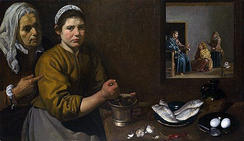

<!-- 表紙スライド -->
<!-- _paginate: false -->
<!-- _footer: "" -->
<!-- _header: "" -->

## 2025年7月20日 改訂共通聖書日課 聖霊降臨後 第11主日 福音朗読

# ルカの福音書 10:38-42

> Cristo en casa de Marta y María by Diego Velázquez, c.1618. Public domain, via Wikimedia Commons.

<!--  voice: Aoede  -->

<!--
皆さん、おはようございます。2025年7月「はつか」、本日わたくしたちに与えられました聖書の箇所は、ルカの福音書 第10章、38節から42節です。さて、ここで聞いていらっしゃる皆さんに考えていただきたいことがあります。**皆さんは、神のために、また誰かのためにと一生懸命に活動するあまり、かえって心が乱れ、喜びを失ってしまった経験はないでしょうか？あるいは、神学的には、私たちの信仰生活の価値は、主のために何を『するか』で決まるのでしょうか？ それとも、主の御前にどうあるか、どう『いるか』は、二の次なのでしょうか？** 『すること』と『あること』あるいは『いること』、この弟子としての大切な関係について、マルタとマリアという二人の姉妹の姿から、今日はともに読んでまいりましょう。
-->
---
# ルカの福音書 10:38-42　中心テーマを特定する
- この物語はマルタの「活動的な生活」とマリアの「観想的な生活」という、単なる二元論として捉えることではない。
- 核心にあるのは **優先順位** の問題
  - **イエスに仕えることと、イエスに耳を傾けることのどちらがより根本的か**、という問いが立てられている。

<!--
さて、このマルタとマリアの物語を読むとき、私たちはつい、「活動的なマルタは叱られ、静かなマリアは褒められた」という単純な結論に飛びついてしまいがちです。まるで、「働くことは二の次で、ただ黙想していることが一番だ」と聖書が教えているかのように。しかし、この物語の核心は、そのような「活動か、観想か」という単純な二元論ではありません。イエスは、マルタの奉仕そのものを否定されたわけではないのです。そうではなく、この物語が私たちに鋭く問いかけているのは、**「優先順位」**の問題です。私たちの信仰生活において、きわめて大切な二つのこと―すなわち、イエスに仕えるという「行い」と、イエスの御言葉に耳を傾けるという「交わり」―この二つのうち、どちらがより根本的で、どちらが全ての土台となるべきなのか。その本質的な問いを、この物語は私たちに投げかけているのです。
-->
---
# ルカの福音書 10:38-42　マルタの問題点の分析
- マルタの 奉仕そのもの が 悪いわけではない 。イエスはもてなしを評価している（7:36-50参照）。
- 問題は、彼女の奉仕が **「多くのこと」に対する「思い煩い」と「心の乱れ」** を引き起こし、彼女を最も重要なことから「 **引き離し、気を散らせた** （distracted）」こと。
- 彼女の奉仕は、 イエスの言葉によって形作られたものではなく 、**ホストとしての不安や自己中心的な視点** （「私（me）」が3回も使われる）に 根差していた。
<!--
それでは、まずマルタの姿をもう少し深く見ていきましょう。先ほども申しました通り、彼女の奉仕、イエスをもてなそうという心意気そのものは、決して悪いものではありません。ルカの福音書の別の箇所（7章）では、イエスは逆にもてなしをしないパリサイ人をたしなめてさえいます。ですから、問題は彼女の「行い」そのものではないのです。問題の核心は、その行いが、どこから生まれていたか、という点にあります。聖書は、マルタが「多くのこと」のために「心が落ち着かず、気を取られていた」と記します。彼女は、完璧なもてなしをしなければというホストとしてのプレッシャー、あるいは「ちゃんとしなければ」という不安によって、心をかき乱されていたのです。そして、その結果、最も大切なことから、つまり、今ここにいてくださるイエスご自身から、心が「引き離されて」しまいました。彼女の訴えの言葉を見てください。「『私』が…」「『私』だけが…」「『私』の手伝いを…」。そこには、イエスがどう思われるかよりも、「私」の正しさ、「私」の苦労を分かってほしいという、自己中心的な視点が色濃く現れているのです。それは、神の言葉に根差した奉仕ではなく、自分の不安から来る働きになってしまっていたのです。 
-->
---
# ルカの福音書 10:38-42　マリアの選択の価値の分析
- マリアは「主の足もとに座り」、教えを聞いた。これは **弟子としての姿勢** 。
  - 当時の文化において、女性がこのような役割を担うことは画期的なことであった。
- 彼女が選んだ「良い分け前（the better part）」とは、イエスの教えそのものであり、神の国の祝福である。
  - これは、食物のように一時的ではなく、 **「決して取り去られることのない」永遠の価値を持つもの**である。
- この「一つのこと」こそが、弟子にとって「 **必要不可欠なこと** 」（needful/essential）。

<!-- 
一方で、妹のマリアはどうだったでしょうか。彼女は「主の足もとに座り」、ただ静かにイエスの言葉に耳を傾けていました。これは、単なる傍聴ではありません。ラビ、すなわち先生の足もとに座るというのは、教えを請う「弟子」の姿勢そのものです。当時のユダヤ社会において、女性が正式にラビの弟子となることは、ほとんど前例のない、きわめて画期的なことでした。マリアは、もしかしたら周囲の目や姉のプレッシャーを感じていたかもしれません。しかし彼女は、社会の常識や期待よりも、イエスの御言葉を聞くことを選び取ったのです。そして、イエスはこのマリアの選択を「良い分け前を選んだ」と称賛されます。この「分け前」という言葉は、旧約聖書では神ご自身や、神から与えられる嗣業、つまり永遠の祝福を指す言葉として使われます。それは、マルタが準備していた食事のように、食べればなくなってしまう一時的なものではなく、「決して取り去られることのない」永遠の価値を持つものです。イエスは言われます。「必要なことは、ただ一つ」。その一つとは、まさにこの、神の国の祝福にあずかること、主の御言葉に聞き入ることなのです。これこそが、私たち弟子にとって、何よりも「必要不可欠なこと」なのだと、主は宣言しておられるのです。 
-->
---
# ルカの福音書 10:38-42　構造的な文脈の理解
- この物語の直前の「善いサマリア人のたとえ話」（隣人愛＝行い）と対比をして読む。
- サマリア人の物語が「行うこと（Doing）」を教えるのに対し、マルタとマリアの物語は、その「行い」の正しい動機と源がどこにあるかを教える。それは、イエスの言葉 **聞くこと**（Hearing）。
- 結論として、「耳の奉仕が手の奉仕に優先し、耳が心と手を導く」。

<!-- 
さらに、この物語がなぜルカの福音書のこの場所に置かれているのかを考えると、そのメッセージは一層深まります。皆さんもよくご存じの通り、このマルタとマリアの物語の直前には、あの「善きサマリア人のたとえ話」が語られています。あの物語の結論は何だったでしょうか。「行って、あなたも同じようにしなさい」。それは、隣人愛を実践するという、力強い「行い」への招きでした。しかし、もし話がそこで終わってしまったら、私たちは「とにかく行動さえすれば良いのだ」と誤解してしまうかもしれません。そこで福音記者ルカは、意図的にこのマルタとマリアの物語を続けて配置したのです。善いサマリア人の「行い」は、もちろん素晴らしい。しかし、その正しい動機、その行動を支える源は、一体どこにあるのか？　その答えこそ、マリアが選んだ「聞くこと」なのです。神の御心を知らずして、私たちは正しく行動することはできません。ですから、結論はこうなります。「耳の奉仕が、手の奉仕に優先する。そして、耳が私たちの心と手を、神の御心に沿うように導いてくれる」。まず聞くこと。そこから、すべての正しい行いが始まるのです。 -->

---
# ルカの福音書 10:38-42　説教主題
## 主題
- イエスに従う弟子にとって、真の奉仕の土台となる、最も優先すべきことは何か？

## 補足
- それは、多くの務めに心を奪われ思い煩うことではなく、主の足もとに座してその御言葉に耳を傾けることである。なぜなら、この主との人格的な交わりこそが、すべての神に喜ばれる働きの源となる、決して奪われることのない最も価値ある部分だからである。

<!-- 
さてこれまで私たちは、物語の背景、マルタとマリアそれぞれの行動の持つ意味、そしてこの物語が福音書の中で置かれている文脈的な重要性について、一つひとつ丁寧に見てまいりました。
ここからは、これらの分析を踏まえて、本日の説教の主題、すなわち「ビッグアイデア」を導き出したいと思います。
まず主題、つまり「この聖書箇所は、何について語っているのか？」という問いに対する、完全で具体的な答えは何でしょうか。
「マルタとマリア」では、単なる登場人物の名前です。「奉仕」や「みことば」では、言葉が漠然としすぎていて、主題としては不完全です。この物語の中心にある問いは、イエスに従う者の生活における優先順位に関するものです。特に、「神への奉仕（働き）」と「神との交わり（聞くこと）」は、どのような関係にあるべきなのでしょうか。
ここから、主題をより具体的な問いの形で表現します。
主題はこうです。「イエスに従う弟子にとって、真の奉仕の土台となる、最も優先すべきことは何か？」
この主題は、これまで見てきた「弟子訓練」や「仕えること」、「優先順位」、そして「土台」といった重要な概念を一つにまとめたものです。
次に、この主題に対する聖書の答え、すなわち補足を考えます。「その主題について、聖書箇所は何を語っているのか？」という問いです。
イエスは、マルタの働きそのものを否定されたわけではありませんでした。しかし、その働きが「思い煩い」と「心の乱れ」から来ていることを指摘されました。
そして、マリアが選んだ「主の足もとでみことばを聞くこと」こそが、「必要なこと」「良いほう」「取り上げられることのない」ものであると断言されました。
これらのことから、補足は次のようになります。
「それは、多くの務めに心を奪われ思い煩うことではなく、主の足もとに座してその御言葉に耳を傾けることである。なぜなら、この主との人格的な交わりこそが、すべての神に喜ばれる働きの源となる、決して奪われることのない最も価値ある部分だからである。」
この答えは、マルタの抱えていた問題点と、マリアの選択の持つ永遠の価値を対比させ、さらに「聞くこと」が「行うこと」の源であるという、この物語の構造的な意味をも反映しています。
-->

---
# ルカの福音書 10:38-42　ビッグアイデア

### ビッグアイデア1：優先順位と土台

> イエスに従う弟子にとって最も優先すべきことは、多くの務めに心を煩わせることではなく、主の足もとで御言葉に耳を傾けることである。この主との交わりこそが、すべての真の奉仕の土台となる、決して奪われることのない最も良い分だからである。

### ビッグアイデア2：「いること（Being）」と「すること（Doing）」の対比

> 弟子の真の価値は、主のために何を「するか」によってではなく、主の御言葉に耳を傾け、主と共に「いる（存在する）」かによって決まる。この神との人格的な交わりこそが、神に喜ばれるすべての奉仕の唯一の源である。

<!-- 
さて、主題と補足が一つになるとき、本日の説教の中心メッセージ、すなわち「ビッグアイデア」が生まれます。今日は二つの表現で、この核心をお伝えしたいと思います。どちらも同じ真理を指し示しています。

まず一つ目です。

**「イエスに従う弟子にとって最も優先すべきことは、多くの務めに心を煩わせることではなく、主の足もとで御言葉に耳を傾けることである。この主との交わりこそが、すべての真の奉仕の土台となる、決して奪われることのない最も良い分だからである。」**

私たちの奉仕が、もし主との交わりという土台の上に建てられていないなら、それはマルタのように、いずれ私たち自身を苦しめる「思い煩い」になってしまいます。しかし、まず主の御言葉を聞くなら、私たちの働きは喜びと平安に満ちたものへと変えられていくのです。

もう一つの表現です。

**「弟子の真の価値は、主のために何を『するか』によってではなく、主の御言葉に耳を傾け、主と共に『いる』かによって決まる。この神との人格的な交わりこそが、神に喜ばれるすべての奉仕の唯一の源である。」**

私たちは、何かを成し遂げることで自分の価値を証明しようとしがちです。しかし、神が私たちにまず求めておられるのは、私たちの業績ではありません。ただ、神の子として、主の御前に「いる」こと。主の愛の中に安らぎ、その御声に耳を傾けること。神は、私たちとの人格的な交わりを、何よりも深く求めておられるのです。

この「決して取り去られることのない良い部分」を、私たち一人ひとりが日々の生活の中で選び取っていくことができますように。 
-->