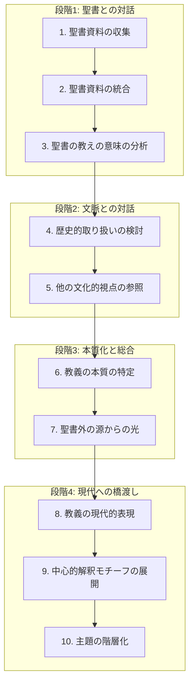

```mermaid
graph TD
    subgraph 段階1: 聖書との対話
        A[1. 聖書資料の収集] --> B[2. 聖書資料の統合] --> C[3. 聖書の教えの意味の分析]
    end
    subgraph 段階2: 文脈との対話
        D[4. 歴史的取り扱いの検討] --> E[5. 他の文化的視点の参照]
    end
    subgraph 段階3: 本質化と総合
        F[6. 教義の本質の特定] --> G[7. 聖書外の源からの光]
    end
    subgraph 段階4: 現代への橋渡し
        H[8. 教義の現代的表現] --> I[9. 中心的解釈モチーフの展開] --> J[10. 主題の階層化]
    end

    C --> D
    E --> F
    G --> H
```
