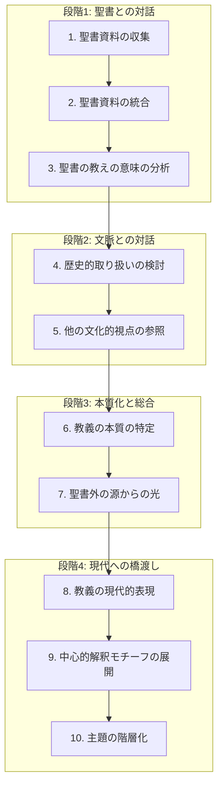

承知いたしました。エリクソン『キリスト教神学入門』第1章の内容について、神学校の大学院ゼミでの発表を想定したmarp形式のスライドとスクリプトのアウトラインをご提案します。

ご指摘の通り、基本構成はテキストに沿った「1. 神学の本質」「2. 神学の方法」が良いでしょう。その上で、大学院のゼミという場を考慮し、単なる要約に留まらず、議論のポイントを提示し、聞き手の思考を促す構成を目指します。

---

### 発表の基本方針

*   **目的:** エリクソンの福音主義的な神学観（定義・必要性・方法論）の骨子を理解し、その現代的意義と課題について議論する。
*   **対象:** 神学の基礎知識を持つ大学院生。
*   **工夫点:**
    *   **「問い」から始める:** 各セクションの冒頭で問いを立て、聞き手の関心を引く。
    *   **論点の可視化:** 複雑な概念（特に「神学の方法」の10ステップ）を図やグループ分けで整理し、視覚的に分かりやすく提示する。
    *   **ディスカッションへの橋渡し:** 発表の最後に明確な討議題目を提示し、ゼミでの議論を活性化させる。

---

### スライドとスクリプトのアウトライン案

以下に、marp形式を意識したスライド構成と、各スライドで話すスクリプトの要点を示します。

```markdown
---
marp: true
theme: default
---

# **エリクソン『キリスト教神学入門』第1章**
## **発表：[発表者名]**

**はじめに：なぜ今、「神学とは何か」を問うのか？**

---

### **本日の発表のアウトライン**

1.  **神学の本質 (The Nature of Theology)**
    *   神学（教義）とは何か？ なぜ必要か？
    *   神学は「科学」と言えるのか？
    *   神学の「出発点」はどこか？

2.  **神学の方法 (The Method of Theology)**
    *   エリクソンの提唱する10のステップ
    *   神学形成のプロセス（図解）

3.  **まとめとディスカッション**
    *   エリクソンの神学観の特長と意義
    *   討議のための論点

---

<!-- page_split -->

## **1. 神学の本質 (The Nature of Theology)**

**<問い>**
「教義は堅苦しくて、分裂を生むだけではないか？」
「ただイエスを愛するだけでは不十分なのか？」

エリクソンは、この問いに明確に「No」と答えます。

---

### **1.1 神学（教義）とは何か？ なぜ必要か？**

*   **エリクソンの定義:**
    *   **教義 (Doctrine):** 人生の根本問題（私は誰か、世界の意味は何か、どこへ行くのか）に対するキリスト者の答え。
    *   **神学 (Theology):** その教義を、聖書に基づき、**体系的**に、**文化的文脈**の中で、**現代的**かつ**実践的**に探求し、表現する営み。 [1]

*   **神学（教義）の必要性：**
    1.  **神との正しい関係のため:** 信ずべき核心がある (ヘブ 11:6, Ⅰヨハネ 4:2)。 [1]
    2.  **真理と経験の結びつき:** 良い「気分」は、客観的な真理（イエスは誰か）に根ざす必要がある。 [1]
    3.  **競合する世界観への応答:** 多くの思想や宗教の中から、何を信じるかを示す基準となる。 [1]

---

### **1.2 神学は「科学」と言えるのか？**

エリクソンは、神学を自然科学とは異なるものの、学問（science）としての基準を満たすと主張します。

*   **科学としての神学の基準：**
    1.  明確な研究対象（神と被造物）
    2.  調査・検証の方法論
    3.  客観性（個人の経験を超え、他者も検証可能）
    4.  内容の一貫性 [1]

**<論点>**
この「科学性」の主張は、神学の学問的地位を確立する上で有効か？ それとも、信仰の神秘を矮小化する危険はないか？

---

### **1.3 神学の「出発点」はどこか？**

神学を構築するための最高権威（ソース）は何か？ エリクソンは4つの選択肢を提示します。

| 出発点 | 内容 |
| :--- | :--- |
| **自然神学** | 被造世界の研究から神を知る |
| **伝統** | 教会の歴史的教えを規範とする |
| **聖書** | キリスト教信仰の「憲法」として、信じ、行うべきことを規定する |
| **経験** | 個人の現代的な宗教体験を権威とする |

**エリクソンの選択は明確に「聖書」です。** [1] 彼は聖書を、変更不可能なキリスト教の「憲法」にたとえます。

---

<!-- page_split -->

## **2. 神学の方法 (The Method of Theology)**

**<問い>**
聖書を「出発点」とするとして、具体的にどのようにして「神学」を構築するのか？

エリクソンは、論理的な発展段階を持つ**10のステップ**を提唱します。 [1]

---

### **2.1 神学形成の10ステップ**

この10ステップは、単なるリストではなく、相互に関連するプロセスです。
分かりやすくするために、4つの段階にグループ分けして見ていきましょう。

**【段階１】 聖書との対話（釈義）**
**【段階２】 文脈との対話（歴史・文化）**
**【段階３】 本質化と総合（体系化）**
**【段階４】 現代への橋渡し（適用）**

---

### **神学形成のプロセス（図解）**


*（注：この図は、10のステップがどのように連動し、発展していくかを示しています）*

---

### **各段階のポイント**

*   **段階1: 聖書との対話 (1-3)**
    *   **何が書かれているか？(What?)**
    *   釈義（Exegesis）が土台。特定の著者（パウロ、ヨハネ等）だけでなく、聖書全体として何を語っているかを統合する。 [1]

*   **段階2: 文脈との対話 (4-5)**
    *   **これまでどう理解されてきたか？(How?)**
    *   教会史（歴史神学）と、異文化（グローバルな視点）から自己の解釈を客観視する。自文化の思い込みに気づくために不可欠。 [1]

*   **段階3: 本質化と総合 (6-7)**
    *   **時代を超えた真理は何か？(Essence)**
    *   文化的・時代的な表現形式から、永続的な「本質」を見出す。聖書以外の学問（自然科学、人文科学など）も補助的に参照する。 [1]

*   **段階4: 現代への橋渡し (8-10)**
    *   **今、どう語るか？(Application)**
    *   現代人が理解できる言葉で「再表現」する（コンテクスチュアリゼーション）。 [1]
    *   教義の重要度に応じて優先順位をつける（階層化）。 [1]

---

<!-- page_split -->

## **3. まとめとディスカッション**

### **エリクソンの神学観の特長**

*   **福音主義的:** 聖書を最高権威とする明確な立場。
*   **体系的:** 包括的で一貫性のある方法論を目指す。
*   **対話的:** 聖書、歴史、文化、諸学問との対話を重視。
*   **宣教的:** 最終的な目的は、現代における適切なメッセージの表現と実践にある。

---

### **ディスカッションのための論点**

1.  **聖書の権威:** エリクソンの「聖書はキリスト教の憲法」という比喩は、現代の神学構築において適切か？ その強みと限界は？
2.  **方法論の妥当性:** 10のステップの中で、現代の日本の教会・社会において、特に重要または困難だと思われるステップはどれか？
3.  **「本質」の特定:** 時代や文化に依存した「表現」から、永続的な「本質」を抽出することは本当に可能か？ その作業に伴う危険性は？
4.  **聖書外の知見:** 聖書外の学問（科学、哲学、心理学など）からの「光」を、聖書の権威を損なわずに取り入れるには、どのような注意が必要か？

---
```

### 発表の進め方に関する補足

*   **時間配分:** ゼミの持ち時間に合わせて、各スライドの時間を調整してください。「神学の方法」は複雑なので、少し時間を多めに取ると良いでしょう。
*   **具体例の活用:** スクリプトを話す際に、テキストにある具体例（パウロの終末論、日本の牧師の指摘など）や、ご自身で考えた例を付け加えると、より分かりやすくなります。
*   **聞き手との対話:** 「<論点>」や「<問い>」の部分では、少し間を取って聞き手に考えさせたり、簡単な質問を投げかけたりすると、一方的な発表にならず、ゼミらしい対話的な雰囲気が生まれます。

このアウトラインが、効果的な発表の準備の一助となれば幸いです。